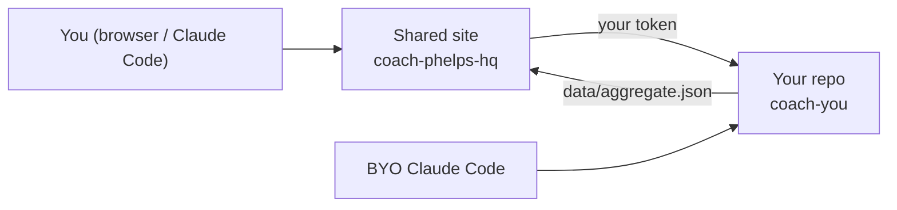

# Coach Phelps — Hosted (3-repo topology)

AI coaching with a **shared dashboard** and **private per-athlete data repos**. You do not
self-host the UI or clone the full monolith anymore.

## Quick start (hosted flow)

1. **Get provisioned** — an operator runs `scripts/provision-user.sh` in
   [`sibling-shipyard/coach-engine`](https://github.com/sibling-shipyard/coach-engine) to
   create your private `coach-<user>` repo (Layer C skeleton + pinned engine).
2. **Install the GitHub App** on that repo when you first sign in to the shared dashboard
   (or follow the operator handoff).
3. **Set Strava secrets** on your instance repo *or* use the iOS app for HealthKit sync.
4. **Open Claude Code** in your instance repo — boot reads generated `SOUL.md`.
5. **First session** — Coach Phelps runs intake when `training/state.md` Athlete Profile is empty.

Full walkthrough: [SETUP.md](SETUP.md).

## Three repos

| Repo | What it is |
|---|---|
| [`coach-phelps-hq`](https://github.com/sibling-shipyard/coach-phelps-hq) | Shared React dashboard + API (Vercel). No athlete data. |
| [`coach-engine`](https://github.com/sibling-shipyard/coach-engine) | Canonical Soul A+B, validators, sync pipeline, provisioning scripts. |
| `coach-<user>` (yours, private) | Your training data, history, sessions, pinned engine, `data/aggregate.json`. |

Decision record: `kdb/decisions/0006-instance-vs-hq-split.md`.

## Legacy self-host

The old “clone the monolith + deploy your own Vercel UI” path is retired for F&F users.
Engineering details remain in git history and `docs/scaling-plan.md`.

## Multi-agent setup

Engineering agents (Tech Lead, UI Expert, Bob, iOS Builder) work in **coach-phelps-hq** and
**coach-engine**. Coach Phelps sessions run in your **instance** repo. See `AGENTS.md`.
