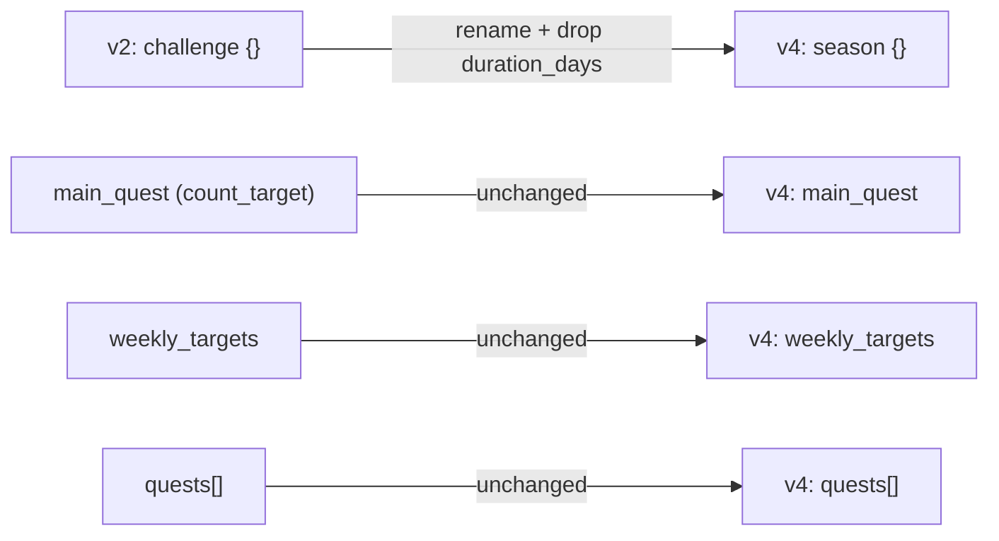

# Migrating coach-skanda's challenge_v2.json to v4

**Context:** ADR [0006](kdb/decisions/0006-unified-challenge-v2-schema.md) locks the platform
on one canonical `challenge_v2.json` shape — version 4. Its own migration map already flags
this: "Skanda migrates → convert at M1d." `coach-akash` is version 3 (near-identical to v4,
trivial bump). `coach-skanda` is version 2 (legacy `challenge` block) and needs a real
conversion. I'm not running this — it's your own repo, you run it yourself.

**Full target spec:** [`docs/eng-docs/challenge-v2-schema.md`](docs/eng-docs/challenge-v2-schema.md)
in this repo.

## What changes



Only the top-level `challenge` block is renamed/reshaped. Everything else in your file
(`main_quest`, `weekly_targets`, `quests[]`) is already valid v4 shape as-is.

## Field-by-field, using your actual file

**Before** (`user_data/ledger/challenge_v2.json`):
```json
{
  "version": 2,
  "challenge": {
    "name": "Full Send Season",
    "start_date": "2026-06-18",
    "duration_days": 75,
    "end_date": "2026-08-31"
  },
  "main_quest": { "...": "unchanged, see below" },
  "weekly_targets": { "...": "unchanged" },
  "quests": [ "...unchanged..." ]
}
```

**After:**
```json
{
  "version": 4,
  "season": {
    "name": "Full Send Season",
    "start_date": "2026-06-18",
    "end_date": "2026-08-31"
  },
  "main_quest": { "...": "unchanged, see below" },
  "weekly_targets": { "...": "unchanged" },
  "quests": [ "...unchanged..." ]
}
```

Concretely:
1. `version: 2` → `version: 4`.
2. Delete `duration_days` (v4 derives it from `start_date`/`end_date`).
3. Rename the `challenge` key to `season` — same `name`/`start_date`/`end_date` values,
   nothing else changes inside it.
4. Leave `main_quest` untouched — it's `type: "count_target"` with `target`,
   `count_from`, `count_pattern`, which is already the exact v4 shape for that quest
   type (see the type table in `docs/eng-docs/challenge-v2-schema.md`).
5. Leave `weekly_targets` and `quests[]` untouched — both are supported v4 blocks as-is.
6. Don't add `phase` or `milestones` — you don't use them; the spec says omit unused
   blocks rather than null-fill them.
7. `coach_since`, `last_updated_by`, `last_updated_at` stay as they are.

## Done when
- File validates as v4 per `docs/eng-docs/challenge-v2-schema.md`.
- Locally sanity-check `engine/scripts/build-aggregate.mjs` and
  `engine/scripts/generate_quest_log.py` still produce correct output against the new
  shape — both already read the `season` key generically (used for v3 today via
  `engine/lib/challenge_schema.py`), so this should just work, but confirm before
  pushing/syncing.
- Push to `coach-skanda`, let sync run, confirm the dashboard/iOS app still show your
  quests, targets, and season dates correctly.

## Out of scope
This covers your repo's data only. The broader HQ-side rollout — updating
`provision-user.sh`, `carve-skeleton.mjs`, and `validate-data.yml` to write/enforce v4
for all future athletes — is tracked separately as a P0 in
[`docs/eng-docs/TODO.md`](docs/eng-docs/TODO.md) ("Unified challenge_v2 v4").
