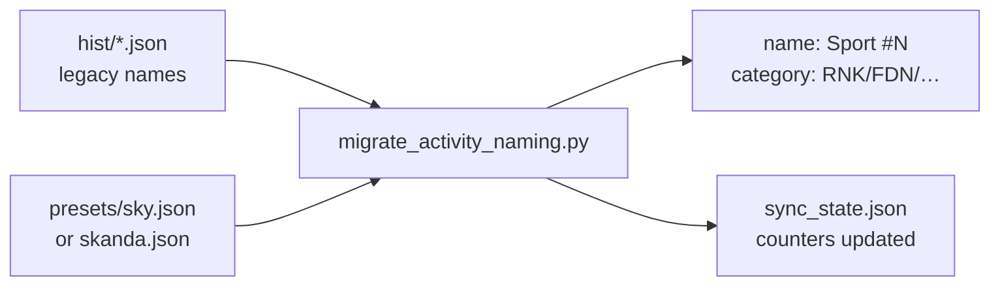

# Activity naming migration (phase 2)

> Status: Current · Owner: Bob the Builder · Verified: 2026-08-02

One-time operator script to retag historical activities when an athlete repo still uses legacy display names (`Hit & Run #12: Ranked`, `Foundation #45`, etc.) before phase 1 generic naming lands in iOS.

## When to run

| Repo | Preset | When |
|------|--------|------|
| `akash-suresh/coach-akash` | `--preset sky` | Once, after phase 1 merge + before next iOS sync |
| `skanda-2003/coach-skanda` | `--preset skanda` | Once, after phase 1 merge + before next iOS sync |

Do **not** re-run after migration unless `--force` is intentional — it renumbers all activities.

**Do not re-run on already-migrated repos.** Legacy display names are replaced with
`Sport #N`; category regex rules only match the old names. A second run mis-tags
categories (e.g. RNK → CAS). To fix a bad migration, reset hist + sync_state to
pre-migration git state, then run once.

## Flow



## Commands

Run from HQ, pointing at the athlete repo:

```bash
# Preview (no writes)
python3 engine/scripts/migrate_activity_naming.py --dry-run --preset sky \
  --repo /path/to/coach-akash

# Apply — Akash
python3 engine/scripts/migrate_activity_naming.py --preset sky \
  --repo /path/to/coach-akash

# Apply — Skanda (club badminton, cricket, Strava defaults)
python3 engine/scripts/migrate_activity_naming.py --preset skanda \
  --repo /path/to/coach-skanda
```

Commit the hist + `user_data/activities/sync_state.json` changes. Regenerate derived data (`regenerate_derived.py`) if the repo uses it.

## Done when

- Every hist file has `name` matching `{sport_type} #{N}` and a `category` code (or empty for unknown runs).
- `sync_state.json` counters match the highest `#N` per sport for the latest calendar year so the next HealthKit sync continues cleanly.

## Deferred

- Ongoing category assignment → phase 1 `categories.json` + iOS sync (not this script).
- Run sub-tags (LNG/SPR/EZR) from duration → `backfill_category.py` after `categories.json` exists.
