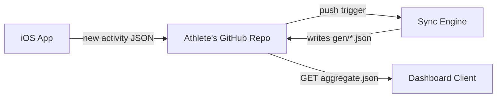
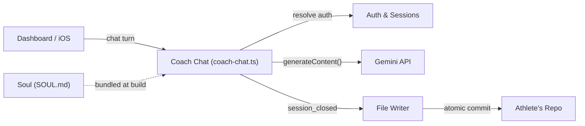

# Architecture Atlas

**Context:** Companion reference to the interactive isometric atlas artifact (Tech Lead builds it
on demand with the `codebase-atlas` skill). This doc is the greppable, agent-readable half — read
this for orientation; open the artifact when a visual helps.

**No database.** Every athlete's own GitHub repo — its files, its git history — IS the data store.
Reads/writes go through GitHub's Git Data API. HQ itself carries no real athlete data (ADR 0011);
its own dashboard build runs on `shared/golden-dataset/`.

## Sync flow (iOS → dashboard)

## Chat flow (message → reply)

## Subsystems

| Code | Name | Where | What |
|---|---|---|---|
| SL | Soul Composition | `platform/soul/*.md` → `platform/SOUL.md` | 3 layers concatenated into the coach's brain |
| UI | Dashboard Client | `ui/client/src/` | React 19 + Vite web app, static on Vercel |
| TOK | Design Tokens | `shared/warm-instrument/tokens.json` | Shared color/spacing system (web + iOS) |
| GD | Golden Dataset | `shared/golden-dataset/` | Synthetic fixture data for HQ's own build |
| BD | Build Scripts | `ui/scripts/*.mjs` | Pre-build pipeline: data, SOUL bundling, widget gen |
| CC | Coach Chat | `ui/api/coach-chat.ts` | The conversation engine — one Vercel function |
| FW | File Writer | `ui/api/_lib/{githubGitData,fileEdits,...}.ts` | Turns closed-session edits into a repo commit |
| AU | Auth & Sessions | `ui/api/auth/[...action].ts` | GitHub OAuth, session cookie, repo resolution |
| WS | Widget Snapshots | `ui/api/widget-snapshots.ts` | Pre-computes iOS home-screen widget data |
| RFW | Repo File & Waitlist | `ui/api/repo-file.ts`, `ui/api/waitlist.ts` | Repo-as-CDN read; HQ waitlist signups |
| EN | Sync Engine | `engine/core/`, `engine/scripts/` | Raw activity JSON → quest log, aggregate, sync status |
| BP | Badminton Plugin | `platform/plugins/badminton/` | Opt-in sport analytics (match history, H2H) |
| CV | Carve & Provision | `platform/scripts/carve-skeleton.mjs` | Stamps a new athlete repo from the skeleton |
| ST | Skeleton Templates | `platform/skeleton-templates/*.json` | Starter workout templates for new athletes |
| IOS | CoachHQ iOS App | `ios/CoachHQ/CoachHQ/` | SwiftUI, HealthKit sync, direct GitHub commits |
| IW | Home Screen Widget | `ios/CoachHQ/CoachHQWidget/` | WidgetKit extension, reads a cached snapshot |
| CI | HQ CI Gates | `.github/workflows/{ios-build,ui-tests,validate-kdb,validate-soul}.yml` | HQ-only checks |
| KD | Decisions (ADRs) | `kdb/decisions/` | Durable architecture calls |
| DC | Eng Docs | `docs/eng-docs/`, `docs/ref-docs/` | Operator/architecture plans, on-demand reading |
| AG | Agent Roles | `.github/agents/*.md`, `AGENTS.md` | Multi-agent routing + per-area conventions |
| DB | Athlete's GitHub Repo | *(external)* | The data store — see "No database" above |

**External:** Gemini API (`generativelanguage.googleapis.com`, one call per chat turn) · Apple HealthKit (on-device, no network).

## Headline stats (as of last generation)

~52K lines of code · Dashboard: 145 files / 19.7K ln · API tier: 7 Vercel functions, repo-as-DB ·
Test files: 23 · Deployed surfaces: 13 (web, iOS, GitHub Actions).

## Regenerating

Run the `codebase-atlas` skill (Tech Lead only). It re-scans the repo, refreshes this doc's table
and stats, and rebuilds the interactive artifact. No automatic trigger — regenerate when a
subsystem is added/removed or the shape of a flow changes; don't bother for routine line-count churn.

**Last generated:** 2026-08-15.

**Deferred:** no machine-readable (JSON) export yet — P3, add only if an agent workflow needs to
parse this programmatically rather than read it.
