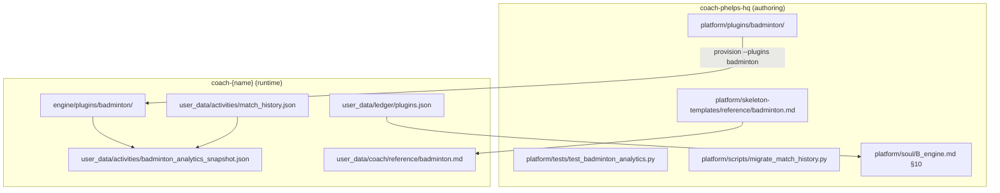

# Badminton plugin rollout (#90)

**Context:** #144 landed match history + parsers; Coach/UI/pipeline still treat badminton as always-on. This plan wires the optional plugin gate across repo, sync, SOUL, and UI.

## Layout (HQ vs athlete repo)

**HQ:** plugin *source* lives together under `platform/plugins/badminton/`. Related code is elsewhere by concern (iOS parser, UI lens, migration, tests) — not scattered duplicates, but not one folder either.

**Athlete repo:** enabled plugin copies to `engine/plugins/badminton/`; data under `user_data/activities/`.

## PR stack (merge order)

| # | Branch | Delivers |
|---|---|---|
| 1 | `core/plugins-json-gate` | `plugins.json` schema + greenfield default `{ "enabled": [] }`; read helper in pipeline/UI |
| 2 | `feat/90-plugin-provision-pack` | `provision-user.sh --plugins badminton`; copy `platform/plugins/` → `engine/plugins/`; seed `reference/badminton.md` |
| 3 | `feat/90-pipeline-step-7` | Restore analytics step in `engine/scripts/run_sync_pipeline.py`; skip when plugin dir absent |
| 4 | `core/soul-badminton-plugin` | Layer B block (done in `B_engine.md` §10); `compose-soul.mjs` |
| 5 | `ui/plugin-nav-gating` | Hide `/analytics/badminton` + header glyph unless plugin on or snapshot present |

## Done when

- Plugin-off repo: no snapshot regen, no match reads in Coach workflow, badminton nav hidden
- Plugin-on + iOS score paste: `match_history.json` updates; sync regens `badminton_analytics_snapshot.json`
- Coach names an opponent → reads snapshot + `opponent_notes.md` on demand (SOUL §10)
- `python3 platform/plugins/badminton/analytics.py` passes tests on golden/migrated data

## Deferred

- **P2:** `coach-chat.ts` inject snapshot summary when plugin on (#144 M2)
- **P2:** First Session UI to toggle plugins (operator sets `plugins.json` for now)
- **P3:** Session category 4-tier → 2-tier (separate issue)
