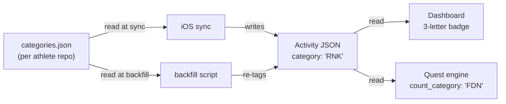
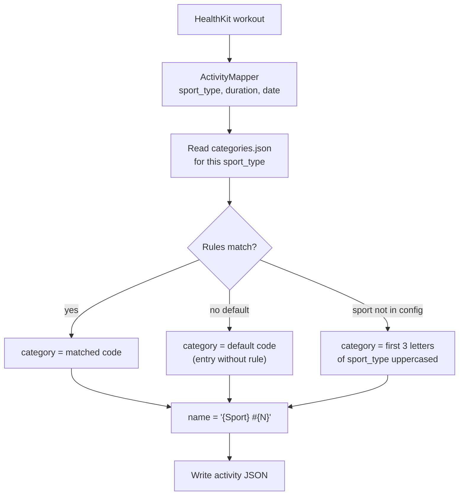

# 3-Letter Category Tags — End State

Activity sub-typing that scales: each athlete defines up to 3 category codes per sport. One code per activity. Auto-assigned at sync, re-derivable via backfill.

## Data model



## Config file — `user_data/categories.json` (Canonical Array Format)

```json
[
  {
    "sport": "Badminton",
    "categories": [
      { "code": "RNK", "label": "Ranked", "rule": { "weekday": "Mon" } },
      { "code": "FRN", "label": "Friendly", "rule": { "weekday": "Thu" } },
      { "code": "CAS", "label": "Casual" }
    ]
  },
  {
    "sport": "WeightTraining",
    "categories": [
      { "code": "FDN", "label": "Foundation", "rule": { "duration_lt": 1500 } },
      { "code": "CAL", "label": "Calisthenics" }
    ]
  },
  {
    "sport": "Run",
    "categories": [
      { "code": "LNG", "label": "Long Run", "rule": { "duration_gte": 2400 } },
      { "code": "SPR", "label": "Sprint", "rule": { "duration_lt": 1200 } },
      { "code": "EZR", "label": "Easy Run" }
    ]
  },
  {
    "sport": "Ride",
    "categories": [
      { "code": "RDE", "label": "Ride" }
    ]
  },
  {
    "sport": "Yoga",
    "categories": [
      { "code": "RLN", "label": "Realign", "rule": { "weekday": "Sun" } },
      { "code": "REC", "label": "Recovery" }
    ]
  }
]
```

**Constraints:** max 3 codes per sport. Each code is exactly 3 uppercase letters. Rules are first-match; last entry without a `rule` is the default.

## Activity JSON (end state)

```json
{
  "name": "Badminton #68",
  "category": "RNK",
  "sport_type": "Badminton",
  "start_date_local": "2026-07-28T19:00:00Z",
  "elapsed_time": 6832
}
```

## Sync flow



## UI rendering

3-letter badge on activity cards + detail page:

```
┌──────────────────────────────────┐
│ Badminton #68         RNK       │
│ Mon 28 Jul · 1h 53m · 148 avg  │
└──────────────────────────────────┘
```

Widget (compact):
```
RNK  FDN  CAL  RNK  EZR  FDN  FDN
```

## History management

```
Edit categories.json → run backfill → all history re-tagged
```

Backfill re-applies rules to every activity based on current config. Category on each activity JSON is a cached result of the rules; the config is the durable source of truth.

## Done when (P0)

1. `categories.json` schema defined; Sky's preset + generic default exist
2. iOS reads config at sync, writes 3-letter `category` code
3. Python backfill reads config, re-tags history
4. UI renders 3-letter badges from config (label lookup)
5. Quest engine matches on 3-letter codes
6. Golden dataset uses codes

## Deferred

- **P1:** Dashboard settings UI for managing categories + rules. Coach writes config at onboarding.
- **P2:** `pinned` flag on manually-tagged activities. Richer rule conditions (description keywords, HR).
