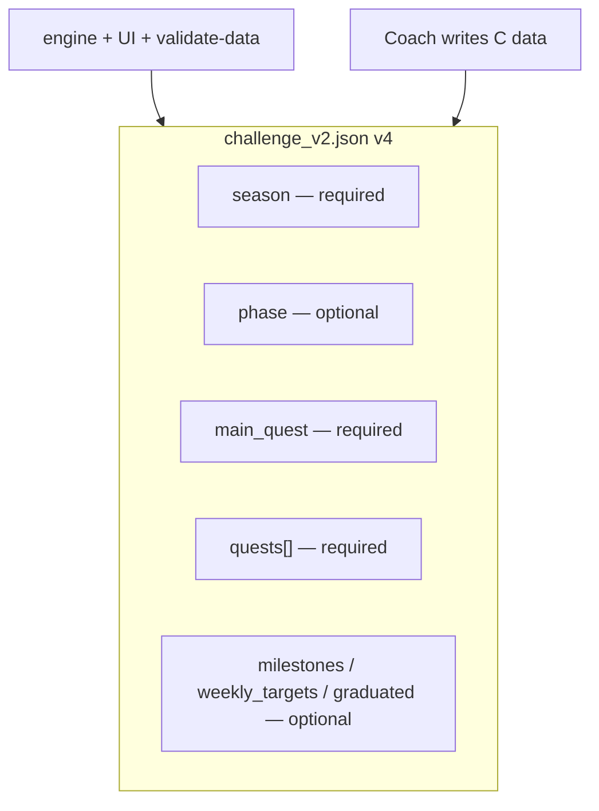
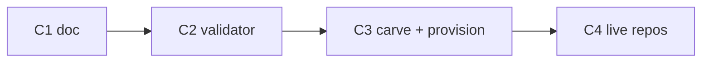

# challenge_v2.json — Canonical Schema (version 4)

> Status: **Locked (2026-07-26)** · ADR: [0006](../../kdb/decisions/0006-unified-challenge-v2-schema.md) · Owner: Tech Lead · Path: `user_data/ledger/challenge_v2.json`

## Context

Quest ledger, dashboard widgets, quest log, and coach boot all read this file. We had **v2** (60-day `challenge` block) and **v3** (`season` / `phase`) in parallel — that stops here. Every athlete repo uses **the same shape**; only the *values* differ (sport mix, main quest type, milestones).

Permanent non-goals: per-user schema versions, top-level `challenge` block, engine logic hardcoded to one athlete's sports.

---

## Goal state



One file, one version number, one validator.

---

## Locked decisions

| Topic | Decision |
|---|---|
| Version | **`4`** only for new writes |
| Time arc | **`season`** required — replaces legacy `challenge` |
| Main quest | **`main_quest.type`** ∈ `count_target` \| `weekly_sessions` |
| Side quests | **`quests[]`** required (may be empty `[]`) |
| Milestones | Optional `milestones[]` — see [`docs/ref-docs/milestone-schema.md`](../ref-docs/milestone-schema.md) |
| Legacy v2/v3 | Read via adapter during migration; **must convert to v4** |

---

## Required shape

```jsonc
{
  "version": 4,
  "last_updated_by": "coach",
  "last_updated_at": "YYYY-MM-DD",

  "season": {
    "name": "string",
    "start_date": "YYYY-MM-DD",
    "end_date": "YYYY-MM-DD"
  },

  "main_quest": {
    "id": "string",
    "name": "string",
    "type": "count_target",           // or "weekly_sessions"
    // count_target:
    "target": 20,
    "count_from": "strava",
    "count_pattern": "^Strength\\s*#", // optional regex pattern
    "count_category": "FDN",           // optional 3-letter category tag filter (ADR-0015)
    // weekly_sessions:
    "weekly_floor": 2.5,
    "loaded_floor": 1.5,
    "skill_weight": 0.5,
    "skill_cap": 1.0,
    "sessions": [{ "date", "label", "kind", "weight" }]
  },

  "quests": []
}
```

### `season`

The primary planning window. A "60-day challenge" is a **season** (~60 days), not a separate `challenge` object. Long arcs (e.g. multi-month transformation) use the same block.

### `main_quest.type`

| Type | When | Key fields |
|---|---|---|
| **`count_target`** | Strava/count goals (e.g. N strength sessions) | `target`, `count_from`, `count_pattern`, `count_category` |
| **`weekly_sessions`** | Structured session floor (calisthenics/skills) | `weekly_floor`, `sessions[]`, optional floors/weights |

Exactly **one** main quest active per file; type discriminates optional fields.

### `quests[]`

Side quests — `daily_streak`, `progress`, etc. Same types as today. SOUL §8 rules unchanged.

---

## Optional blocks

| Block | Purpose |
|---|---|
| **`phase`** | Named phase + `current_block` within season (Build, Peak, …) |
| **`milestones[]`** | Block test targets + optional `progress` scalar |
| **`weekly_targets`** | Sport/category quotas (badminton, run, …) — config-driven, keys vary by athlete |
| **`graduated[]`** | Retired quests kept for history |

Omit blocks entirely when unused — do not null-fill.

---

## Migration map

| Legacy | v4 |
|---|---|
| v2 `challenge.*` | `season.*` (same dates/name; drop `duration_days` — derive from dates) |
| v2 `main_quest` | unchanged shape (already `count_target`) |
| v3 file | bump `version` to `4`; structure already aligned |
| Skeleton seed | v4 template with blank season + First Session placeholders |

**Provision:** `provision-user.sh --migrate` runs v2/v3 → v4 rewrite before push (follow-up PR).

**Live repos:** Akash (`coach-akash`) already v3-shaped → trivial v4 bump. Skanda migrates → convert at M1d.

---

## Consumers (must read v4)

| Consumer | Path |
|---|---|
| Quest log | `engine/scripts/generate_quest_log.py` |
| Quest history | `engine/scripts/generate_quest_history.py` |
| Aggregate | `engine/scripts/build-aggregate.mjs` |
| Dashboard types | `ui/client/src/lib/challenge.ts` |
| Validator | `engine/.github/workflows/validate-data.yml` |
| Skeleton seed | `platform/scripts/carve-skeleton.mjs` |
| Adapter (transitional) | `engine/lib/challenge_schema.py` |

---

## Milestones

| # | Size | Outcome | Done when |
|---|---|---|---|
| **C1** | S | ADR + this doc locked | Merged |
| **C2** | M | `validate-data` enforces v4 | CI fails on v2/v3 or missing `season` |
| **C3** | M | Carve + migrate rewrite | Skeleton + provision emit v4 only |
| **C4** | S | Live repos on v4 | HQ, Akash, Skanda pass validator |



---

## Risks

- Skanda migrate must map `challenge` → `season` without losing weekly_targets / count quest semantics.
- Coach must not re-introduce `challenge` block in sessions — validator catches it after C2.

---

## Appendix

Types mirror `ui/client/src/lib/challenge.ts` — keep TS and this doc in sync when fields change.
