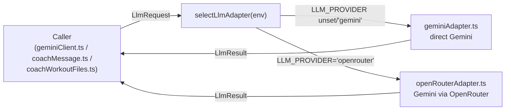

# The LLM provider seam (llmClient.ts)

> Status: Current · Owner: Tech Lead · Verified: 2026-09-10

## Context

`gemini-flow.md` is the one reference for the Gemini call itself - model, prompt shape, caching,
Gemini-specific retries. This doc is the one reference for the seam every caller now goes
through to reach *any* provider: what `llmClient.ts` guarantees, how the two adapters differ, and
what a new caller needs to know before adding a third. Built across #713 M2 (three PRs): chat,
coach-message, and template adjustment each moved off their own direct `fetch` calls onto this one
shared contract, in that order.

## The contract

`ui/api/_lib/llmClient.ts` defines `LlmRequest` (system/cachePrefix/messages/maxOutputTokens/
responseSchema/timeoutMs), `LlmResult` (text/telemetry), and `LlmAdapter` (`name`, `model`,
`generate(request): Promise<LlmResult>`). A caller builds one `LlmRequest`, calls
`selectLlmAdapter(env).generate(request)`, and never touches HTTP, auth, or provider-specific
response shape - the adapter owns all of that.

`resolveProviderName(env)` is the single source of truth for which adapter runs: exactly
`"openrouter"` picks OpenRouter, anything else (unset, `"gemini"`, a typo) picks direct Gemini.
Production stays on direct Gemini unless a deployment sets the env var on purpose. Any caller that
needs to know which provider will run a call must call this function, not re-check
`process.env.LLM_PROVIDER` by hand. The manual test harness's required-API-key check and
`coach-chat.ts`'s own key-configured gate both need this. A second, possibly-drifting copy of the
same check was a real review finding on the harness (2026-09-10).

## The two adapters

| | `geminiAdapter.ts` | `openRouterAdapter.ts` |
|---|---|---|
| Model | `gemini-pro-latest` (`geminiModel.ts`) | `google/gemini-3.8-flash`, pinned to `google-vertex` provider routing |
| Auth | `x-goog-api-key` header | `Authorization: Bearer` header |
| Explicit cache | `geminiSoulCache.ts` (moved here from `coach-chat/_lib/gemini/soulCache.ts` in M2 PR 2) | None - OpenRouter owns its own caching, this adapter does not emulate Gemini cache names |
| Own retry | One retry on a stale-cache `400` (invalidates and retries no-cache) or a `503`/`504` (short fixed backoff) - mutually exclusive branches, capped at one retry total | One retry on a truncated response (`finish_reason: "length"`), capped at one retry total |
| Usage/cost on the span | `promptTokens`/`completionTokens`/`totalTokens`/`cachedPromptTokens`/`thinkingTokens` | Same fields, plus `costUsd` (OpenRouter reports per-call cost; direct Gemini/Vertex does not) |
| Error status | Passes the real upstream status through always (400/403/429/500/503/504/...) - collapsing anything outside {429,503,504} to a generic 502 was a real regression found in review (2026-09-10) and reverted | `429` passes through; anything else non-2xx becomes `502` |

Both adapters call `withGeminiSpan` (`_lib/sentry.ts`) with `{"llm.adapter": "gemini" | "openrouter"}`,
so a Sentry trace always names which one ran. `captureGeminiFailure`'s `model` field is filled from
`adapter.model` at every call site - never a hardcoded model constant, which would silently
mislabel an OpenRouter failure as a direct-Gemini one. A caller like `askGemini` that resolves its
own adapter internally instead tags the model onto the thrown error, and reads it back at the
`captureGeminiFailure` call site.

### Usage accumulation across a retry

`span.setAttributes` (the mechanism `withGeminiSpan`'s `recordUsage` callback writes through)
overwrites per key. It does not sum. A naive "call `recordUsage` once per attempt" implementation
on a retried call reports only the *last* attempt's numbers. It silently loses whatever the first,
retried-away attempt actually burned - a real bug found in review on `openRouterAdapter.ts`'s
truncation retry (2026-09-10), since a truncated call still bills real tokens.

The fix pattern, now established here for any adapter that retries: accumulate a running
`GeminiUsage` object across attempts, summing each numeric field. Preserve `undefined` when
neither attempt ever reported a value - `usageAttributes` treats absent and zero as different
facts, see `cachedPromptTokens`'s own comment in `openRouterAdapter.ts`. Call `recordUsage` with
the running total after every attempt, not once per attempt with just that attempt's own numbers.

## Callers, in migration order

1. **coach-message** (`coach-message.ts` → `coachMessage.ts`'s `generateProactiveBody`) - the
   first caller onto the seam, no chat cache/history/actions, a flat one-property schema. Built
   after the seam existed, so it already reads `adapter.model` correctly for Sentry.
2. **Chat** (`coach-chat/_lib/gemini/geminiClient.ts`'s `askGemini`) - moved onto the seam in M2
   PR 2. Builds the static/dynamic prompt split and the nested response schema
   (`toGeminiResponseSchema` recurses `additionalProperties: false` stripping at every level, not
   just the top - a shallow strip passed coach-message's flat schema but broke on chat's schema
   nesting five levels deep). Owns its own JSON-parse retry on top of the adapter's own retry - see
   `gemini-flow.md` § Retries for the full worst-case timing across every layer.
3. **Template adjustment** (`coachWorkoutFiles.ts`'s `adjustTemplatesWithGemini`) - moved onto the
   seam in M2 PR 3, the last direct-`fetch` caller in the codebase at the time. Deliberately
   non-fatal: a failure here fell back to unadjusted library templates rather than blocking First
   Session completion. **Removed entirely in A3 (#727)** along with the automatic template-dump
   path it personalized - First Session close no longer makes this call at all.

Every caller resolves its own adapter via `selectLlmAdapter({...process.env, GEMINI_API_KEY: apiKey})`
- the API key arrives as a parameter, threaded down from whichever auth context loaded it, never
read from `process.env` directly inside a caller.

## Adding a fourth caller (or a third adapter)

- Build one `LlmRequest`. If the caller has no natural system/user split (coach-message's shape),
  pass `system: ""` and put everything in one user message - both adapters omit `systemInstruction`/
  the system role entirely when `system` is empty, matching each provider's own pre-seam wire shape.
- Never assume a provider's own retry semantics from another adapter. `geminiAdapter.ts`'s
  400/503/504 retry and `openRouterAdapter.ts`'s truncation retry are different mechanisms
  answering different failure shapes on their respective providers - a third adapter needs its own
  reasoning about what's actually retryable there, not a copy-paste of either.
- Tag `.model` onto any thrown error if the caller resolves its own adapter and has its own
  `captureGeminiFailure` call site downstream, the same way `askGemini` does - the two-line
  pattern is worth copying exactly, not reinventing per caller.
- A third adapter's usage tracking must follow the accumulation pattern above the moment it has
  any retry of its own, even if the first version doesn't.

## Done when

- `resolveProviderName` is the only place `LLM_PROVIDER` is read to decide provider identity -
  `grep -rn "process.env.LLM_PROVIDER" ui/` should show only that function and test fixtures.
- Every `captureGeminiFailure` call site's `model` field traces back to a real adapter, not a
  hardcoded model constant - `grep -rn "model: GEMINI_MODEL" ui/api` should show none left outside
  a `?? GEMINI_MODEL` fallback on a tagged error.

## Deferred

- A third provider adapter - not currently planned; this doc's "Adding a fourth caller" section
  doubles as the checklist for "adding a third adapter" since the two are usually done together.
- Narrowing the outbound-HTTP Sentry exclusion now that no adapter leaks a credential in a URL -
  see `sentry-runbook.md` § Not counted.
