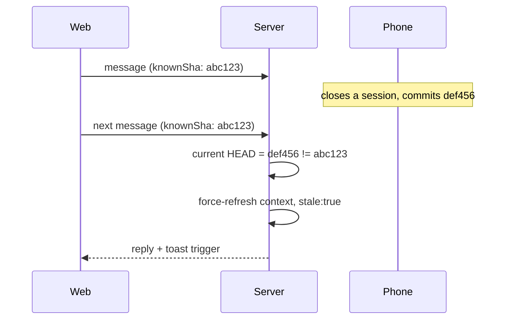

# Coach Chat — day-to-day flow

> Status: Current · Owner: Tech Lead · Verified: 2026-08-23

## Context

Real Coach Phelps sessions from the browser and iOS, backed by Gemini, for an athlete who has
already completed intake. This doc traces what happens between the athlete opening the chat tab
and anything landing on `main`. For the one-time intake conversation, see
[`coach-chat-fsp.md`](coach-chat-fsp.md) — same endpoint, same mechanics, different prompt
context and write timing. For Gemini request/schema/caching mechanics specifically, see
[`gemini-flow.md`](gemini-flow.md). For every file/enum Coach reads or writes, see
[`coach-data-schema.md`](coach-data-schema.md). For the dated history of how this system got
here, see [`coach-chat-design-history.md`](coach-chat-design-history.md). Commit/retention
design: ADR 0012. Vercel function-count constraint that shapes the endpoint layout: ADR 0017.

Both day-to-day chat and First Session Protocol are one endpoint (`ui/api/coach-chat.ts`) and one
companion (`ui/api/coach-chat-context.ts` for pre-warming, `ui/api/coach-chat-profile-status.ts`
for the intake-completion check) — not separate systems.

## Endpoints

| Endpoint | Method | Purpose |
|---|---|---|
| `ui/api/coach-chat.ts` | `GET` | Load committed threads (newest 7, always `status: "active"`) |
| `ui/api/coach-chat.ts` | `POST {action: "greet"}` | Coach speaks first; FSP also records native onboarding fields directly |
| `ui/api/coach-chat.ts` | `POST {action: "activity_sync", activity_ids}` | After a HealthKit sync: persist one Coach turn for that verified batch |
| `ui/api/coach-chat.ts` | `POST {threadId?, messages, message, endConversationRequested?}` | Send a message or explicitly request a close |
| `ui/api/coach-chat-context.ts` | `GET` | Warm SOUL plus the split athlete, quest, and Fitness Snapshot context ahead of chat opening |
| `ui/api/coach-chat-profile-status.ts` | `GET` | `{profileComplete}` — is the First Session Protocol done? |
| `ui/api/coach-message.ts` | `POST {activity_ids}` | Generate and atomically store one idempotent post-sync Coach message |

## Day-to-day flow

```mermaid
flowchart LR
    load["App/site loads"] --> warm["GET coach-chat-context.ts\n(warms 60s server cache)"]
    warm -.-> open["Athlete opens Coach Chat"]
    open --> greet["POST {action: greet}"]
    greet --> askGreeting["Gemini: greeting mode\n1-3 sentence opener\n(every open, no server reuse check)"]
    askGreeting --> local["Client materializes an\nuncommitted local thread\n- NO repo write"]
    local --> shown["Coach's opener shown\nbefore athlete types anything"]
    shown --> typed["Athlete sends a message\nor taps End Conversation"]
    typed --> ordinary["POST {threadId, messages, message,\nendConversationRequested?}"]
    ordinary --> stale{"knownSha !=\ncurrent HEAD?"}
    stale -- yes --> refresh["Force-refresh context\n(bypass 60s cache), stale:true"]
    stale -- no --> cached["Use cached context if warm"]
    refresh --> turn
    cached --> turn["Gemini: ordinary or closing mode"]
    turn --> closeCheck{"Typed/pending close signal\nor explicit button flag\nAND session_closed:true?"}
    closeCheck -- no --> noClose["closed:false response"]
    closeCheck -- yes --> commitClose["commitFilesAtomic:\nvalidated action writes + chat_history.json\n(greeting + full transcript,\nfirst write for this thread)"]
    commitClose --> done["closed:true, profileComplete,\nrepoSha returned"]
```

### 1. Preload (A3)

`ui/api/coach-chat-context.ts` warms `loadCoachContext()`'s 60-second in-memory server cache
(`ui/api/coach-chat/_lib/coachChatFiles.ts`) for profile, memory, injuries, recent coach notes,
the split quest ledger, and the generated athlete fitness snapshot — SOUL is no longer fetched
from the athlete's repo at all (see below). Web fires this once
per app load from `App.tsx`'s `Gate` component (`ui/client/src/lib/prefetchCoachContext.ts`,
fire-and-forget); iOS fires it from `MainTabView.swift`'s `.task` block as soon as the app is
active with a valid session (`CoachChatAPIClient.prefetchContext()`). Neither call runs Gemini —
it only warms the file reads, so the eventual greeting doesn't pay a fresh GitHub round-trip on
top of the Gemini call.

### 2. Coach speaks first (A4)

Landing on the chat tab never shows an empty composer. The client calls
`POST {action: "greet"}`, handled by `handleGreet()`. During First Session it first commits any
native onboarding hints; it never commits the greeting thread itself. Every call generates a fresh opener via Gemini (`"greeting"` mode: 1-3 sentence
contextual opener, no day-count, no stat dump, no write actions in its schema, informed by
current athlete context) and returns `{reply, threadId, threads, repoSha, profileComplete}` — `threadId` is
a fresh, never-persisted id (kept in the response only for shape stability; neither web nor iOS
reads it) and `threads` is the existing committed list, unchanged.

The client materializes the greeting as an **uncommitted local thread** instead — web in
`CoachChat.tsx` (`materializeGreeting()`), iOS in `CoachChatView.swift` (`greetNow()`) — using
the same `local-<timestamp>` id convention both platforms use for a brand-new athlete-initiated
thread. The greeting only actually lands in the repo if the athlete replies and that
conversation later closes: its full message history, including the divider and Coach's opening
line, rides along inside that eventual close-commit, exactly like an ordinary mid-conversation
turn (nothing writes server-side until close).

Before materializing a new greeting, both platforms clear the cache entry for any *previous
unreplied* local greeting they find in current state (`materializeGreeting()`/`greetNow()`) — so
repeatedly hitting "New conversation" without ever replying can't pile up multiple local-only
cache entries for the same day. See `coach-chat-fsp.md`'s Resumability section for the
complementary restore-time fix (dropping a past-day unreplied greeting entirely, rather than just
superseding a same-day one).

**Accepted edge case:** without a server-side reuse check, two tabs/devices opened at almost the
exact same moment on a day with no thread yet each independently materialize their own local
greeting, with no reconciliation. If the athlete replies in one, that becomes the real
conversation; if they reply in both, that's two genuine conversations, no different from
deliberately starting a second one via "New conversation." Worst case costs one redundant Gemini
call for a greeting nobody reads.

### 2a. Proactive post-sync seed

A successful post-sync message is a second entry into the same local-thread lifecycle, not a
second chat system. Home or a local notification carries the exact `conversation_seed_id` and
body from `latest_message.json`; iOS also persists the repo identity so a cold-launch handoff can
only be consumed by the matching authenticated athlete.

`CoachChatView` first restores an exact cached seed when present. Otherwise it materializes one
divider and one Coach message under `local-proactive-<message.id>`, bypassing greet. Reopening the
same seed selects that thread without appending the opener again. A requested older proactive seed
is exempt from the cleanup that removes past-day unreplied greetings; unrelated stale greetings
still drop. Invalid, missing, or account-mismatched routes clear and fall through to normal greet.

The opener rides in `messages` as prior context on the athlete's first reply. From there send and
close are the ordinary path: a genuine close writes that same thread id through
`chat_history.json` and applies ADR 0012's seven-thread cap. An unopened proactive seed remains
local and consumes no retention slot.

### 3. Ordinary turns

`POST {threadId?, messages, message, endConversationRequested?}`. `messages` is the client's own in-memory running history
for the thread — nothing is persisted server-side for an unwrapped conversation, so the server is
stateless per turn until a close. Every response echoes `repoSha` and a fresh `profileComplete`.
Gemini sees the rendered split athlete context, rendered quest context, and optional Fitness
Snapshot. A returning ordinary turn has no write actions in its response schema.

### 3b. Activity-sync turns (persist immediately)

`POST {action: "activity_sync", activity_ids: ["hk:<uuid>", ...]}`. This is the exception to
persist-on-close: after Gemini replies, the server atomically writes only `chat_history.json`
(divider + one Coach message with a `synced_activity_list` attachment). Same `batch_id` returns
the existing thread (`duplicate: true`) with no second Gemini call. Missing hist files → 422, no
write. Card values are reread from the athlete repo; the request carries ids only.

### 3a. Prompt construction (`askGemini()`, `ui/api/coach-chat/_lib/geminiClient.ts`)

The prompt splits into a **static** half (persona, fixed instructions, two few-shot examples —
byte-identical for every athlete, every turn) and a **dynamic** half (rendered split context,
mode-specific instructions, `todayContextLine()`). The static half is uploaded once via Gemini's
explicit-caching API and referenced by name on every call instead of being resent; the dynamic
half ships fresh every request. Each turn also gets the smallest response schema legal for its
mode. Full design, caching mechanics, and response schemas live in `gemini-flow.md` — the
reference for everything Gemini-specific, this doc stays focused on the request lifecycle around
it.

SOUL itself is bundled from `platform/SOUL.chat.md` — the coach-chat build of the two composed
targets (ADR 0022) — at build time (`ui/scripts/build-soul.mjs`,
wired into `predev`/`prebuild`) rather than fetched from the athlete's own repo — it's 100%
generic, no per-athlete substitution happens anywhere in the carve process, so re-fetching it per
athlete per turn was pure waste. See the ADR amending 0011 for the full rationale.

### 4. Cross-device staleness (A5)

No lock. Every response includes `repoSha` — the HEAD sha (or post-commit sha on a close) as of
that response. The client remembers it per thread and sends it back as `knownSha` on the next
message. If it doesn't match the actual current HEAD at request time (most likely: a session was
wrapped on another device since), the server sets `stale: true` and bypasses the 60s context
cache to re-read fresh — so Gemini's next reply reflects whatever changed. Both platforms show a
toast: *"Coach caught up on changes from your other device."*

### 5. Close-session detection

`CLOSE_SESSION_PATTERN` (a fixed regex — `wrap this session`, bare `wrap` with a short affirming
filler, `done for today`, `bye coach`, `see you tomorrow`, `goodnight coach`, etc.) is only a
**trigger to ask** Gemini to consider closing, never the close decision itself. Gemini reports
back `session_closed: true|false` — a match with `session_closed: false` means Gemini asked a
clarifying question instead of closing (still no commit); only `closeIntent && session_closed ===
true` actually closes. `closeIntent` is also true if a close-trigger message appeared in the last
few turns (`wasCloseAttemptPending`) — otherwise, simply *answering* Coach's own clarifying
question (e.g. "8hrs" in response to "how'd you sleep?") would route as an ordinary turn and never
get a chance to actually close, even though the athlete is mid-close-attempt. The web and iOS
End Conversation buttons instead send `endConversationRequested: true`; `shouldRequestClose()`
ORs that flag with the typed and pending checks. It deterministically enters closing mode but
does not force the result: Gemini may still ask a closing follow-up and return
`session_closed: false`.

On a genuine close:
- The server fetches the template manifest and `current_week.json` so the prompt can carry only
  real template and session ids.
- A returning athlete receives operational action fields — see `coach-data-schema.md`'s "What
  Gemini can write" table for the full list.
- Server-side intent appliers (`turnWrites/*.ts`, wrapping the pure appliers in `coachIntents.ts`,
  `coachWorkoutFiles.ts`, `coachWeekFiles.ts`) validate ids, add dates and timestamps, and resolve
  each action against fresh file content. The resulting split JSON files and `chat_history.json`
  land in one atomic commit (`commitFilesAtomic()`, ADR 0012).
- The response includes `profileComplete`, as greet and ordinary responses do — computed from
  the projected profile, memory, and season content for this turn.
- `COACH_CHAT_BRANCH` (env var, defaults to `main`) controls which branch the commit lands on —
  lets a real close be tested end to end on a scratch branch instead of a live athlete's `main`.

**Write strategy.** Gemini never edits files or supplies patches. It returns constrained semantic
actions such as `profile_update`, `injury_event`, `quest_event`, `week_plan`, or `plan_edit`.
Each server-side applier validates the action against real context, preserves server-owned
bookkeeping, and produces the next full JSON content. `coach_note` becomes one append-only row in
`coach_log.json`. Thread titles are derived server-side from the athlete's first message and
sanitized to the display limit; Gemini does not generate them.

### Retention (ADR 0012, amended)

No archive tier. The cap (`MAX_RETAINED_THREADS = 7`) is a flat `threads.slice(0, 7)` on the
newest-first array; creating an 8th thread evicts the oldest. The endpoint implements GET and
POST only.

Since greet never commits the thread itself (see step 2 above), an unengaged conversation never
consumes a retention slot — only threads that actually got a real close-out ever reach this list.

### Rendering

- **End Conversation**: web and iOS place this action immediately to the right of Send at the
  same height. It starts disabled, is initialized by `GET coach-chat-profile-status`, and updates
  from `profileComplete` on every greet, ordinary, and closing response. This lets it enable on
  the exact FSP turn that completes the profile, without a reload. Tapping it sends no fake
  athlete message; it posts `endConversationRequested: true` through the normal send path.

- **Markdown**: coach replies render real bold/lists, on both platforms — the closing-turn
  prompt encourages markdown for structured content (workout plans, multi-step advice). Web uses
  `react-markdown` (`CoachChatWidgets.tsx`); iOS wraps `AttributedString` for inline bold/italic
  (`CoachChatMarkdown.attributed`) plus a `CoachChatMarkdownBlock` that does a minimal
  line-based split for `- `/`* `/`1. ` prefixed lines into indented bullet/numbered rows.

- **Synced activity list**: a Coach message may carry `attachments` with trial kind
  `synced_activity_list`. Web renders those rows *with* the coach bubble (terracotta is load
  only). Tap a row opens an in-chat activity detail sheet — attachment fields always, extra
  dashboard activity fields when the id is in client data. Thinking dots stay the existing
  `ThinkingBubble`, only while a send or `activity_sync` POST is in flight. A failed sync keeps
  the list and shows Retry; it does not roll back the way a failed user send does. Web does not
  start HealthKit sync.

- **Thread age labels**: the history list shows two distinct badges per thread — an *absolute*
  day-count badge (`D-101`) and a *relative* age badge next to it, which shows a real date ("5th
  AUG") rather than a `D-N` count, using `ChatThread.createdAt` (raw epoch ms). The leading
  conversation-pane divider works the same way: "TODAY" for the active same-day thread, otherwise
  the thread's real date, computed fresh from `dayOffset`/`createdAt` at render time rather than a
  stored string — never a time-of-day.

  **The absolute badge is not actually read from `profile.json`'s `coach_since` today, despite
  that being the canonical ADR 0018 value the server stamps.** Web's `CoachChat.tsx` computes it
  via `challengeDayNumber()` (`coachChatModel.ts`) against `data.challenge_v2` from the prebuilt
  dashboard snapshot — a legacy shape, not a live `profile.json` read. For a repo that still has a
  real `challenge_v2.json` on disk, that object's own `coach_since` field (one-time backfilled per
  issue #179) is what's used. For a repo migrated to the split ledger (no `challenge_v2.json`
  anymore), `useRepoData.ts` falls back to `splitLedgerAsChallenge()`
  (`lib/splitLedgerChallenge.ts`) to project a legacy-shaped object from `seasons.json`/
  `quests.json`/`progress.json` — and that projection **does not carry `coach_since` through at
  all**, so `challengeDayNumber()` silently falls back to `season.start_date`, resetting the badge
  on every new season exactly like the bug #179 was originally filed to fix. This is a real,
  previously undocumented regression, tracked in `docs/plans/coach-chat-open-items.md`. iOS has
  the same root cause on its own `challenge_v2.json`-reading path (`GitHubAPIClient.swift`'s
  `readCoachDayAnchorDate()`), already tracked there.

## Auth

`coach-chat.ts` (and its two companion endpoints) use the shared `resolveRepoAuth()` helper
(`ui/api/auth/_lib/resolve-auth.ts`) — session cookie on web, `Authorization: Bearer <token>` +
`X-Coach-Repo: owner/repo` on iOS. Sending a message never retries a raw network failure (a
close-session commit could have already landed before the response was lost — blind retry would
re-run Gemini and the commit a second time); a 5xx/429 *response* still retries, since the server
confirmed nothing committed. A 401 shows a "sign in again" state on both platforms: web's shared
`AccessRevokedCard`; iOS sets `authManager.sessionExpired`, surfaced by `MainTabView`'s app-wide
`SessionExpiredView` overlay.

## When the backend takes over a SOUL job

The backend keeps absorbing jobs SOUL used to do in prose — greeting, close detection, day
number, timezone, the commit ritual — and nobody deletes the instructions it replaced. **Whenever
`ui/api/coach-chat.ts` (or a `_lib` module) takes over a behaviour, delete SOUL's version of it in
the same PR.** Left in, it is dead text the model still reads on every turn, and the two copies
drift until they contradict each other. Edit the layer in `platform/soul/`, re-run
`node platform/scripts/compose-soul.mjs`, ship both in the same diff.

## Endpoint count constraint (ADR 0017)

Vercel's Hobby plan caps a deployment at 12 serverless functions, one per top-level `ui/api/*.ts`
file. This repo sits close to that cap — `ui/api/auth/` is consolidated into one catch-all route
(`ui/api/auth/[...action].ts`) specifically to leave headroom for coach-chat's three endpoints.
Any new coach-chat endpoint should default to folding into `coach-chat.ts` (or a new catch-all)
rather than assuming a fresh top-level file is free.

## Done when

Landing on Coach Chat always shows Coach having already spoken, never an empty composer; a
close-session commit lands as one atomic commit with only the split records that genuinely
changed; two devices on the same thread self-correct via the staleness toast instead of silently
diverging.

## Deferred

- P2: no token-level streaming — replies arrive whole, not word-by-word. Tracked in issue #270
  (the structured-JSON response schema is the real complication, not just wiring SSE).
- P2: inline chips/highlights ("engine load" pills) have no backend data — Gemini's response
  schema has no field for them. Unbuilt, needs product design.
- Issue #179 (the *absolute* day-number badge resetting per-challenge/season) is closed — ADR
  0018 fixed it for repos still on `challenge_v2.json`. It has since regressed for split-ledger
  repos via a different path; see the "Thread age labels" note above rather than this stale
  reference to #179.
- P1, real but not chasing without a reproduction: close-save reliability is a prompt-compliance
  problem, not a code-guaranteed one — the logging lets a real occurrence be diagnosed, but
  there's no guarantee Gemini follows the self-check every time.
- P2: no server-side reuse/dedup when two tabs/devices greet at almost the same instant on an
  empty day (see step 2's "accepted edge case" note) — costs at most one redundant Gemini call,
  not treated as worth a fix.
- Route consolidation (3 coach-chat endpoints → one catch-all) — see
  `docs/plans/coach-chat-open-items.md`.

## Appendix — file/class reference

`coach-chat.ts` is the HTTP handler only; turn-lifecycle stages live in
`ui/api/coach-chat/_lib/coachTurn.ts`, and per-reply-field write construction lives in
`ui/api/coach-chat/_lib/turnWrites/` — see [`ui/api/coach-chat/README.md`](../../ui/api/coach-chat/README.md)
for the full module index and [`turnWrites/README.md`](../../ui/api/coach-chat/_lib/turnWrites/README.md)
for the write-builder table.

| File | Role |
|---|---|
| `ui/api/coach-chat.ts` | authentication, greet/sync handling, and HTTP-stage dispatch |
| `ui/api/coach-chat-context.ts` | A3 preload endpoint |
| `ui/api/coach-chat-profile-status.ts` | B2 First Session Protocol completion check |
| `ui/api/coach-chat/_lib/coachChatFiles.ts` | shared file reads, context cache, `isAthleteProfileComplete` |
| `ui/api/coach-chat/_lib/activitySync.ts` | activity-sync batch id, hist lookup, attachment rows |
| `ui/api/coach-chat/_lib/activitySyncTurn.ts` | persist-on-sync Coach turn |
| `ui/api/coach-chat/_lib/soulCache.ts` | explicit Gemini caching for the static prompt prefix — see `gemini-flow.md` |
| `ui/api/coach-chat/_lib/geminiClient.ts` | Gemini transport — `askGemini()`, retry logic |
| `ui/api/coach-chat/_lib/coachPromptText.ts` | prompt text and dynamic context construction |
| `ui/api/coach-chat/_lib/coachReplySchema.ts` | reply types and mode-specific response schemas |
| `ui/api/coach-chat/_lib/coachContext.ts` | renders athlete/quest context into prompt sections |
| `ui/api/coach-chat/_lib/chatThreads.ts` | thread model, `chat_history.json` persistence, retention |
| `ui/api/coach-chat/_lib/closeSignal.ts` | close-intent detection |
| `ui/api/coach-chat/_lib/coachDay.ts` | timezone/day-number math |
| `ui/api/coach-chat/_lib/coachSinceStamp.ts` | server-owned `coach_since` completion stamp |
| `ui/api/coach-chat/_lib/coachTurn.ts` | message-turn orchestration, write assembly, and commit responses |
| `ui/api/coach-chat/_lib/turnWrites/*.ts` | one file per reply action field's write-builder |
| `ui/api/_lib/fileEdits.ts` | write strategies — `applyStringEdits`, `applyJsonMergePatch` |
| `ui/api/_lib/githubGitData.ts` | atomic multi-file commit helper (Git Data API) |
| `ui/client/src/pages/CoachChat.tsx` | web chat page |
| `ui/client/src/components/coach-chat/CoachChatWidgets.tsx` | web presentational components |
| `ui/client/src/components/coach-chat/coachChatModel.ts` | client fetch helpers, `greet()`, `activitySync()`, SHA tracking, localStorage cache |
| `ui/client/src/lib/prefetchCoachContext.ts` | web A3 trigger (`App.tsx`'s `Gate`) |
| `ios/CoachHQ/CoachHQ/Services/CoachChatAPIClient.swift` | iOS client (Bearer + X-Coach-Repo) |
| `ios/CoachHQ/CoachHQ/Services/CoachMessageAPIClient.swift` | bounded proactive-message client and delivery gate |
| `ios/CoachHQ/CoachHQ/Models/CoachChatModels.swift` | Codable mirrors of the server's JSON |
| `ios/CoachHQ/CoachHQ/Views/CoachChatView.swift` | iOS chat UI, greet/resume logic |
| `ios/CoachHQ/CoachHQ/Views/CoachChatMarkdown.swift` | inline bold/italic + list-aware block rendering |
