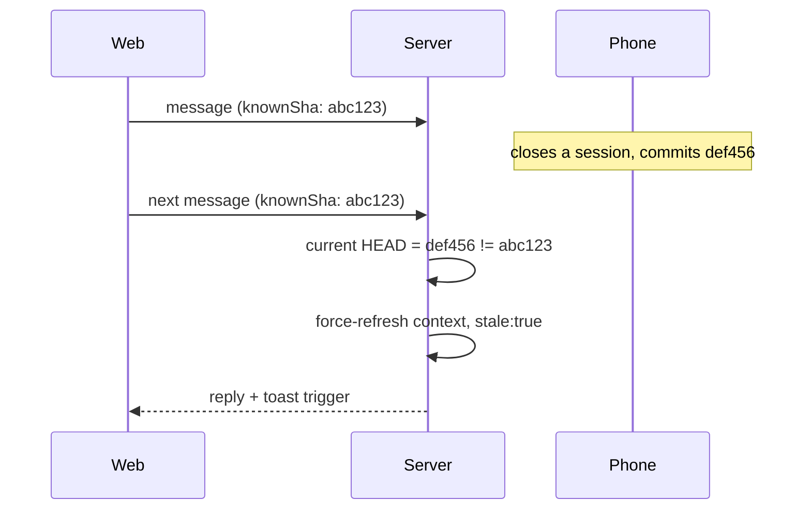

# Coach Chat — day-to-day flow

> Status: Current · Owner: Tech Lead · Verified: 2026-09-02

## Context

Real Coach Phelps sessions from the browser and iOS, backed by Gemini, for an athlete who has
already completed intake. This doc traces what happens between the athlete opening the chat tab
and anything landing on `main`. For the one-time intake conversation, see
[`coach-chat-fsp.md`](coach-chat-fsp.md) — same endpoint, same mechanics, different prompt
context and write timing. For Gemini request/schema/caching mechanics specifically, see
[`gemini-flow.md`](gemini-flow.md). For every file/enum Coach reads or writes, see
[`coach-data-schema.md`](coach-data-schema.md). For the dated history of how this system got
here, see [`coach-chat-design-history.md`](coach-chat-design-history.md). Commit/retention
design: ADR 0012 (commits); ADR 0037 (retention). Vercel function-count constraint that shapes
the endpoint layout: ADR 0017.

Both day-to-day chat and First Session Protocol are one endpoint (`ui/api/coach-chat.ts`) and one
companion (`ui/api/coach-chat-context.ts` for pre-warming, `ui/api/coach-chat-profile-status.ts`
for the intake-completion check) — not separate systems.

## Endpoints

| Endpoint | Method | Purpose |
|---|---|---|
| `ui/api/coach-chat.ts` | `GET` | Load committed threads (newest 7, always `status: "active"`) |
| `ui/api/coach-chat.ts` | `POST {action: "greet"}` | Coach speaks first; FSP also records native onboarding fields directly |
| `ui/api/coach-chat.ts` | `POST {action: "activity_sync", activity_ids}` | After a HealthKit sync: persist one Coach turn for that verified batch |
| `ui/api/coach-chat.ts` | `POST {threadId?, messages, message}` | Send a message; every turn commits (C1) |
| `ui/api/coach-chat-context.ts` | `GET` | Warm SOUL plus the split athlete, quest, and Fitness Snapshot context ahead of chat opening |
| `ui/api/coach-chat-profile-status.ts` | `GET` | `{profileComplete}` — is the First Session Protocol done? |
| `ui/api/coach-message.ts` | `POST {activity_ids}` | Generate and atomically store one idempotent post-sync Coach message |

## Day-to-day flow

```mermaid
flowchart LR
    load["App/site loads"] --> warm["GET coach-chat-context.ts\n(warms 60s server cache)"]
    warm -.-> open["Athlete opens Coach Chat"]
    open --> greet["POST {action: greet}"]
    greet --> askGreeting["Gemini: greeting mode\n1-3 sentence opener\n(every open, no server reuse check)"]
    askGreeting --> local["Client materializes an\nuncommitted local thread\n- NO repo write"]
    local --> shown["Coach's opener shown\nbefore athlete types anything"]
    shown --> typed["Athlete sends a message"]
    typed --> ordinary["POST {threadId, messages, message}"]
    ordinary --> stale{"knownSha !=\ncurrent HEAD?"}
    stale -- yes --> refresh["Force-refresh context\n(bypass 60s cache), stale:true"]
    stale -- no --> cached["Use cached context if warm"]
    refresh --> turn
    cached --> turn["Gemini: ordinary mode\n(every returning-athlete field\navailable on every turn - C1)"]
    turn --> commit["commitFilesAtomic:\nvalidated action writes + chat_history.json\n(greeting + full transcript,\nfirst write for this thread)"]
    commit --> done["reply, threadId, threads,\nprofileComplete, repoSha returned"]
```

### 1. Preload (A3)

`ui/api/coach-chat-context.ts` warms `loadCoachContext()`'s 60-second in-memory server cache
(`ui/api/coach-chat/_lib/coachChatFiles.ts`) for profile, memory, injuries, recent coach notes,
the split quest ledger, and the generated athlete fitness snapshot. SOUL is no longer fetched
from the athlete's repo at all (see below). Web fires this once
per app load from `App.tsx`'s `Gate` component (`ui/client/src/lib/prefetchCoachContext.ts`,
fire-and-forget); iOS fires it from `MainTabView.swift`'s `.task` block as soon as the app is
active with a valid session (`CoachChatAPIClient.prefetchContext()`). Neither call runs Gemini —
it only warms the file reads, so the eventual greeting doesn't pay a fresh GitHub round-trip on
top of the Gemini call.

### 2. Coach speaks first (A4)

Landing on the chat tab never shows an empty composer. The client calls
`POST {action: "greet"}`, handled by `handleGreet()`. During First Session it first commits any
native onboarding hints; it never commits the greeting thread itself. Every call generates a
fresh opener via Gemini (`"greeting"` mode: 1-3 sentence contextual opener, no day-count, no stat
dump, no write actions in its schema, informed by current athlete context). It returns
`{reply, threadId, threads, repoSha, profileComplete}` — `threadId` is
a fresh, never-persisted id (kept in the response only for shape stability; neither web nor iOS
reads it) and `threads` is the existing committed list, unchanged.

The client materializes the greeting as an **uncommitted local thread** instead — web in
`CoachChat.tsx` (`materializeGreeting()`), iOS in `CoachChatView.swift` (`greetNow()`) — using
the same `local-<timestamp>` id convention both platforms use for a brand-new athlete-initiated
thread. The greeting only actually lands in the repo once the athlete's first reply commits —
every turn commits now (C1), so that happens on the very next message, not at some later close.
Its full message history, including the divider and Coach's opening line, rides along inside
that first commit.

Before materializing a new greeting, both platforms clear the cache entry for any *previous
unreplied* local greeting they find in current state (`materializeGreeting()`/`greetNow()`).
This way, repeatedly hitting "New conversation" without ever replying can't pile up multiple
local-only cache entries for the same day. See `coach-chat-fsp.md`'s Resumability section for the
complementary restore-time fix (dropping a past-day unreplied greeting entirely, rather than just
superseding a same-day one).

**Accepted edge case:** without a server-side reuse check, two tabs/devices opened at almost the
exact same moment on a day with no thread yet each independently materialize their own local
greeting, with no reconciliation. If the athlete replies in one, that becomes the real
conversation. If they reply in both, that's two genuine conversations, no different from
deliberately starting a second one via "New conversation." Worst case costs one redundant Gemini
call for a greeting nobody reads.

### 2a. Proactive post-sync seed

A successful post-sync message is a second entry into the same local-thread lifecycle, not a
second chat system. Home or a local notification carries the exact `conversation_seed_id` and
body from `latest_message.json`; iOS also persists the repo identity so a cold-launch handoff can
only be consumed by the matching authenticated athlete.

`CoachChatView` first restores an exact cached seed when present. Otherwise it materializes one
divider and one Coach message under `local-proactive-<message.id>`, bypassing greet. Reopening the
same seed selects that thread without appending the opener again. A requested older proactive seed
is exempt from the cleanup that removes past-day unreplied greetings; unrelated stale greetings
still drop. Invalid, missing, or account-mismatched routes clear and fall through to normal greet.

The opener rides in `messages` as prior context on the athlete's first reply. From there sending
is the ordinary path: that reply's commit writes the same thread id through `chat_history.json`
and applies ADR 0012's seven-thread cap. An unopened proactive seed remains local and consumes no
retention slot.

### 3. Ordinary turns

`POST {threadId?, messages, message}`. `messages` is the client's own in-memory running history
for the thread — the server itself holds nothing between turns, so each request carries the full
context it needs. Every turn commits fully now (C1: no more closing-turn concept) — a returning
athlete's response schema carries every action field, data-fact and session-artifact alike, on
every turn, not just data-fact ones. Every response echoes `repoSha`, `stale`, a fresh
`profileComplete`, and the fresh committed `threads`/`threadId`. Gemini sees the rendered split
athlete context, rendered quest context, and optional Fitness Snapshot.

### 3b. Activity-sync turns (persist immediately)

`POST {action: "activity_sync", activity_ids: ["hk:<uuid>", ...]}`. This is the exception to
persist-on-close: after Gemini replies, the server atomically writes only `chat_history.json`
(divider + one Coach message with a `synced_activity_list` attachment). `batch_id` is the first
16 hex of sha256 of the sorted unique ids — the same set always returns the existing thread
(`duplicate: true`) with no second Gemini call. Missing hist files → 422, no write. Gemini
failure or a failed commit returns an error and writes nothing; the client keeps the list and
offers Retry. Card values are reread from the athlete repo; the request carries ids only. Gemini's
schema is reply-only. The prompt sees the verified batch, fresh insights, live week when present,
injuries, and recent continuity; the reply must stand alone and invent no cause.

### 3a. Prompt construction (`askGemini()`, `ui/api/coach-chat/_lib/geminiClient.ts`)

The prompt splits into a **static** half (persona, fixed instructions, two few-shot examples —
byte-identical for every athlete, every turn) and a **dynamic** half (rendered split context,
mode-specific instructions, `todayContextLine()`). The static half is uploaded once via Gemini's
explicit-caching API and referenced by name on every call instead of being resent; the dynamic
half ships fresh every request. Each turn also gets the smallest response schema legal for its
mode. Full design, caching mechanics, and response schemas live in `gemini-flow.md` — the
reference for everything Gemini-specific, this doc stays focused on the request lifecycle around
it.

SOUL itself is bundled from `platform/SOUL.chat.md` — the coach-chat build of the two composed
targets (ADR 0022) — at build time (`ui/scripts/build-soul.mjs`,
wired into `predev`/`prebuild`), rather than fetched from the athlete's own repo. It's 100%
generic, no per-athlete substitution happens anywhere in the carve process, so re-fetching it per
athlete per turn was pure waste. See the ADR amending 0011 for the full rationale.

### 4. Cross-device staleness (A5)

No lock. Every response includes `repoSha` — the HEAD sha (or post-commit sha on a close) as of
that response. The client remembers it per thread and sends it back as `knownSha` on the next
message. If it doesn't match the actual current HEAD at request time (most likely: a session was
wrapped on another device since), the server sets `stale: true` and bypasses the 60s context
cache to re-read fresh. That way Gemini's next reply reflects whatever changed. Both platforms show a
toast: *"Coach caught up on changes from your other device."*

### 5. Every turn commits (C1)

There is no closing-turn concept any more — a session never "closes," it just keeps having
turns, and every one of them commits whatever it produced. This replaced the old
`CLOSE_SESSION_PATTERN`/`session_closed`/End Conversation button machinery entirely (deleted
`closeSignal.ts`; see `docs/plans/ccr-c1-remove-closing-turn-lld.md`'s history for the removal, or
git blame if that plan doc is gone by the time you read this).

On every returning-athlete turn:
- The response schema carries every action field at once. Data-fact fields (`profile_update`,
  `memory_update`, `injury_flag`/`injury_event`, `quest_event`, `sports_update`, `season_start`,
  `quest_create`) and session-artifact fields (`template_edit`, `session_plan`, `week_plan`,
  `session_reconcile`, `plan_edit`) sit together. See `coach-data-schema.md`'s "What Gemini can
  write" table for the full list.
- The templates manifest and `current_week.json` are **not** fetched up front any more. Gemini's
  prompt carries no pre-fetched template/session id list — that fetch is lazy now, triggered in
  `buildTurnWrites()` (`coachTurn.ts`) only when the reply actually contains `template_edit`,
  `session_plan`, `week_plan`, `session_reconcile`, or `plan_edit`. Most ordinary turns never
  touch those fields and never pay for the extra GitHub reads. A wrong or invented template/session
  id just fails validation and drops that one write; it doesn't corrupt anything.
- If `memory_update.text` or an `injury_flag[].text`/`injury_event[].text` comes back over its
  length cap, `requestCoachReply()` (`coachTurn.ts`) reprompts Gemini once for that field before
  proceeding — one extra `askGemini()` round trip on this turn only. See `gemini-flow.md`'s
  "Text-field length caps" and "Retries" sections for the full three-layer design (schema
  `maxLength`, this reprompt, and the deterministic `capText` truncation backstop in
  `turnWrites/*.ts` if the reprompt still overshoots). `coach_note` is dormant since C1 removed it
  from every mode's schema — C2 redesigns it into a day-keyed row.
- A `week_plan`/`plan_edit` write to `current_week.json` is checked by
  `assertCurrentWeekCommitReady()` (`coachWeekFiles.ts`) — the same pass/fail rule as
  `validate-current-week` — right before the content is handed to `commitFilesAtomic()`. A
  write that fails parsing or comes back with `availability: "invalid"` throws instead of
  committing.
- Server-side intent appliers (`turnWrites/*.ts`, wrapping the pure appliers in `coachIntents.ts`,
  `coachWorkoutFiles.ts`, `coachWeekFiles.ts`) validate ids, add dates and timestamps, and resolve
  each action against fresh file content. The resulting split JSON files and `chat_history.json`
  land in one atomic commit (`commitTurn()`, `coachTurn.ts`; ADR 0012).
- The response includes `profileComplete`, as greet responses do — computed from the projected
  profile, memory, and season content for this turn.
- `COACH_CHAT_BRANCH` (env var, defaults to `main`) controls which branch the commit lands on —
  lets a real turn be tested end to end on a scratch branch instead of a live athlete's `main`.

**Write strategy.** Gemini never edits files or supplies patches. It returns constrained semantic
actions such as `profile_update`, `injury_flag`, `injury_event`, `quest_event`, `week_plan`, or
`plan_edit`.
Each server-side applier validates the action against real context, preserves server-owned
bookkeeping, and produces the next full JSON content. Thread titles are derived server-side from
the athlete's first message and sanitized to the display limit; Gemini does not generate them.

### Retention (ADR 0037)

`chat_history.json` keeps every thread forever — nothing is ever deleted from storage. The
7-thread cap (`MAX_RETAINED_THREADS`) only applies at response time: `pruneForResponse()` slices
the newest 7 off the newest-first array at every place threads go back to a client (GET history,
a turn's own response, an activity-sync response). Web and iOS never see more than 7 either way;
neither has its own cap to keep in sync. The endpoint implements GET and POST only.

Since greet never commits the thread itself (see step 2 above), an unengaged conversation never
adds a thread — a thread lands in the file once the athlete's first reply commits, and every
reply after that commits too (C1).

### Rendering

- **Markdown**: coach replies render real bold/lists, on both platforms — the prompt encourages
  markdown for structured content (workout plans, multi-step advice). Web uses
  `react-markdown` (`CoachChatWidgets.tsx`); iOS wraps `AttributedString` for inline bold/italic
  (`CoachChatMarkdown.attributed`) plus a `CoachChatMarkdownBlock` that does a minimal
  line-based split for `- `/`* `/`1. ` prefixed lines into indented bullet/numbered rows.

- **Synced activity list**: a Coach message may carry `attachments` with trial kind
  `synced_activity_list`. Web renders those rows *with* the coach bubble (terracotta is load
  only). Tap a row opens an in-chat activity detail sheet — attachment fields always, extra
  dashboard activity fields when the id is in client data. Thinking dots stay the existing
  `ThinkingBubble`, only while a send or `activity_sync` POST is in flight. A failed sync keeps
  the list and shows Retry; it does not roll back the way a failed user send does. Web does not
  start HealthKit sync.

- **Thread age labels**: the history list shows two distinct badges per thread — an *absolute*
  day-count badge (`D-101`) and a *relative* age badge next to it. The relative badge shows a
  real date ("5th AUG") rather than a `D-N` count, using `ChatThread.createdAt` (raw epoch ms).
  The leading conversation-pane divider works the same way: "TODAY" for the active same-day
  thread, otherwise the thread's real date, computed fresh from `dayOffset`/`createdAt` at render
  time rather than a stored string — never a time-of-day.

  The absolute badge reads `profile.json`'s `coach_since` directly (ADR 0018), on both
  platforms. Web's `CoachChat.tsx` computes it via `challengeDayNumber()`
  (`coachChatModel.ts`), which reads `profile.coach_since` first and falls back to the current
  season's `start_date` from the split ledger only if `coach_since` isn't stamped yet (a
  pre-First-Session-Protocol athlete). iOS reads the same field via `GitHubAPIClient.swift`'s
  `readCoachDayAnchorDate()`. The legacy `challenge_v2.json`/`splitLedgerAsChallenge()` path this
  used to fall back through is gone — `lib/splitLedgerChallenge.ts` was deleted once the split
  ledger fully replaced `challenge_v2.json` for all repos, closing out issue #179 and the
  regression it had reintroduced.

## Auth

`coach-chat.ts` (and its two companion endpoints) use the shared `resolveRepoAuth()` helper
(`ui/api/auth/_lib/resolve-auth.ts`) — session cookie on web, `Authorization: Bearer <token>` +
`X-Coach-Repo: owner/repo` on iOS. Sending a message never retries a raw network failure — the
turn's commit could have already landed before the response was lost, so blind retry
would re-run Gemini and the commit a second time. A 5xx/429 *response* still retries, since the
server confirmed nothing committed. A 401 shows a "sign in again" state on both platforms: web's shared
`AccessRevokedCard`; iOS sets `authManager.sessionExpired`, surfaced by `MainTabView`'s app-wide
`SessionExpiredView` overlay.

## When the backend takes over a SOUL job

The backend keeps absorbing jobs SOUL used to do in prose — greeting, day
number, timezone, the commit ritual — and nobody deletes the instructions it replaced. **Whenever
`ui/api/coach-chat.ts` (or a `_lib` module) takes over a behaviour, delete SOUL's version of it in
the same PR.** Left in, it is dead text the model still reads on every turn, and the two copies
drift until they contradict each other. Edit the layer in `platform/soul/`, re-run
`node platform/scripts/compose-soul.mjs`, ship both in the same diff.

## Endpoint count constraint (ADR 0017)

Vercel's Hobby plan caps a deployment at 12 serverless functions, one per top-level `ui/api/*.ts`
file. This repo sits close to that cap — `ui/api/auth/` is consolidated into one catch-all route
(`ui/api/auth/[...action].ts`) specifically to leave headroom for coach-chat's three endpoints.
Any new coach-chat endpoint should default to folding into `coach-chat.ts` (or a new catch-all)
rather than assuming a fresh top-level file is free.

## Done when

Landing on Coach Chat always shows Coach having already spoken, never an empty composer. Every
turn lands as one atomic commit with only the split records that genuinely changed. Two devices
on the same thread self-correct via the staleness toast instead of silently diverging.

## Deferred

- P2: no token-level streaming — replies arrive whole, not word-by-word. Tracked in issue #270
  (the structured-JSON response schema is the real complication, not just wiring SSE).
- P2: inline chips/highlights ("engine load" pills) have no backend data — Gemini's response
  schema has no field for them. Unbuilt, needs product design.
- P2: no server-side reuse/dedup when two tabs/devices greet at almost the same instant on an
  empty day (see step 2's "accepted edge case" note) — costs at most one redundant Gemini call,
  not treated as worth a fix.
- Route consolidation (3 coach-chat endpoints → one catch-all) — #566.

## Appendix — file/class reference

`coach-chat.ts` is the HTTP handler only; turn-lifecycle stages live in
`ui/api/coach-chat/_lib/coachTurn.ts`, and per-reply-field write construction lives in
`ui/api/coach-chat/_lib/turnWrites/` — see [`ui/api/coach-chat/README.md`](../../ui/api/coach-chat/README.md)
for the full module index and [`turnWrites/README.md`](../../ui/api/coach-chat/_lib/turnWrites/README.md)
for the write-builder table.

| File | Role |
|---|---|
| `ui/api/coach-chat.ts` | authentication, greet/sync handling, and HTTP-stage dispatch |
| `ui/api/coach-chat-context.ts` | A3 preload endpoint |
| `ui/api/coach-chat-profile-status.ts` | B2 First Session Protocol completion check |
| `ui/api/coach-chat/_lib/coachChatFiles.ts` | shared file reads, context cache, `isAthleteProfileComplete` |
| `ui/api/coach-chat/_lib/activitySync.ts` | activity-sync batch id, hist lookup, attachment rows |
| `ui/api/coach-chat/_lib/activitySyncTurn.ts` | persist-on-sync Coach turn |
| `ui/api/coach-chat/_lib/soulCache.ts` | explicit Gemini caching for the static prompt prefix — see `gemini-flow.md` |
| `ui/api/coach-chat/_lib/geminiClient.ts` | Gemini transport — `askGemini()`, retry logic |
| `ui/api/coach-chat/_lib/coachPromptText.ts` | prompt text and dynamic context construction |
| `ui/api/coach-chat/_lib/coachReplySchema.ts` | reply types and mode-specific response schemas |
| `ui/api/coach-chat/_lib/coachContext.ts` | renders athlete/quest context into prompt sections |
| `ui/api/coach-chat/_lib/chatThreads.ts` | thread model, `chat_history.json` persistence, response-time display cap |
| `ui/api/coach-chat/_lib/coachDay.ts` | timezone/day-number math |
| `ui/api/coach-chat/_lib/coachSinceStamp.ts` | server-owned `coach_since` completion stamp |
| `ui/api/coach-chat/_lib/coachTurn.ts` | message-turn orchestration, write assembly, and commit responses |
| `ui/api/coach-chat/_lib/turnWrites/*.ts` | one file per reply action field's write-builder |
| `ui/api/coach-chat/_lib/text-caps.bundle.js` | esbuild bundle of `engine/lib/text-caps.mts`'s per-field length caps, for the Lambda runtime |
| `ui/api/coach-chat/_lib/current-week.bundle.js` | esbuild bundle of `engine/lib/current-week.mts`'s `current_week.json` parser/validator, for the Lambda runtime |
| `ui/api/_lib/fileEdits.ts` | write strategies — `applyStringEdits`, `applyJsonMergePatch` |
| `ui/api/_lib/githubGitData.ts` | atomic multi-file commit helper (Git Data API) |
| `ui/client/src/pages/CoachChat.tsx` | web chat page |
| `ui/client/src/components/coach-chat/CoachChatWidgets.tsx` | web presentational components |
| `ui/client/src/components/coach-chat/coachChatModel.ts` | client fetch helpers, `greet()`, `activitySync()`, SHA tracking, localStorage cache |
| `ui/client/src/lib/prefetchCoachContext.ts` | web A3 trigger (`App.tsx`'s `Gate`) |
| `ios/CoachHQ/CoachHQ/Services/CoachChatAPIClient.swift` | iOS client (Bearer + X-Coach-Repo) |
| `ios/CoachHQ/CoachHQ/Services/CoachMessageAPIClient.swift` | bounded proactive-message client and delivery gate |
| `ios/CoachHQ/CoachHQ/Models/CoachChatModels.swift` | Codable mirrors of the server's JSON |
| `ios/CoachHQ/CoachHQ/Views/CoachChatView.swift` | iOS chat UI, greet/resume logic |
| `ios/CoachHQ/CoachHQ/Views/CoachChatMarkdown.swift` | inline bold/italic + list-aware block rendering |
