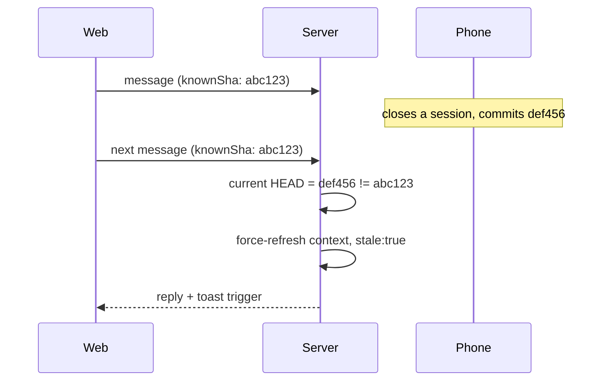

```mermaid
flowchart LR
    load["App/site loads"] --> warm["GET coach-chat-context.ts\n(warms 60s server cache)"]
    warm -.-> open["Athlete opens Coach Chat"]
    open --> greet["POST {action: greet}"]
    greet --> askGreeting["Gemini: greeting mode\n1-3 sentence opener\n(every open, no server reuse check)"]
    askGreeting --> local["Client materializes an\nuncommitted local thread\n- NO repo write"]
    local --> shown["Coach's opener shown\nbefore athlete types anything"]
    shown --> typed["Athlete sends a message"]
    typed --> ordinary["POST {threadId, messages, message}"]
    ordinary --> stale{"knownSha !=\ncurrent HEAD?"}
    stale -- yes --> refresh["Force-refresh context\n(bypass 60s cache), stale:true"]
    stale -- no --> cached["Use cached context if warm"]
    refresh --> turn
    cached --> turn["Gemini: ordinary mode\n(every returning-athlete field\navailable on every turn - C1)"]
    turn --> commit["commitFilesAtomic:\nvalidated action writes + chat_history.json\n(greeting + full transcript,\nfirst write for this thread)"]
    commit --> done["reply, threadId, threads,\nprofileComplete, repoSha returned"]
```

# Coach Chat — day-to-day flow

> Status: Current · Verified: 2026-09-18 against `ui/api/coach-chat.ts`

## Context

One endpoint (`ui/api/coach-chat.ts`) serves every post-intake coach conversation on web and iOS.
Every ordinary turn commits in one atomic commit; there is no closing-turn concept. Two companions:
`ui/api/coach-chat-context.ts` (A3 pre-warm of the 60s server context cache) and
`ui/api/coach-chat-profile-status.ts` (intake-completion check). For intake itself see
`coach-chat-fsp.md`; for model/schema/caching see `gemini-flow.md`; for the file schema see
`coach-data-schema.md`; design history lives in `coach-chat-design-history.md`.

## Decision-goal

Per-turn pipeline, in order: `parseTurnRequest` → `loadTurnState` (HEAD sha vs the client's
`knownSha`; stale → bypass the 60s cache, `stale: true`) → `requestCoachReply` (LLM call plus
reprompt loops for length caps / missing `coach_note` / missed-language detectors) →
`buildTurnWrites` (model returns constrained semantic actions; server-side intent appliers in
`ui/api/coach-chat/_lib/decide/turnWrites/` validate ids, add dates, and build the writes) →
`commitTurn` (one `commitFilesAtomic` commit per turn).

Greet never persists its own thread: `handleGreet()` only commits native onboarding fields (if
any), returns a fresh `t-<now>` thread id, and the client materializes an uncommitted local
thread that lands in `chat_history.json` on the athlete's first reply. Activity sync
(`action: "activity_sync"`) persists one idempotent Coach turn keyed by the sha256 batch id —
same activity set returns `duplicate: true` with no second LLM call. Response-time cap: newest
7 threads (`MAX_RETAINED_THREADS`); storage keeps every thread.

## Done when

Landing on Coach Chat always shows Coach having already spoken, never an empty composer. Every
turn lands as one atomic commit with only the split records that genuinely changed. Two devices
on the same thread self-correct via the staleness toast instead of silently diverging.

## Deferred

- P2: no token-level streaming — replies arrive whole, not word-by-word. #870.
- P2: inline chips/highlights — the response schema has no field for them; needs product design.
- P2: no server-side reuse/dedup when two tabs/devices greet at almost the same instant on an
  empty day — costs at most one redundant LLM call, not treated as worth a fix.
- Route consolidation (3 coach-chat endpoints → one catch-all) — #566.
