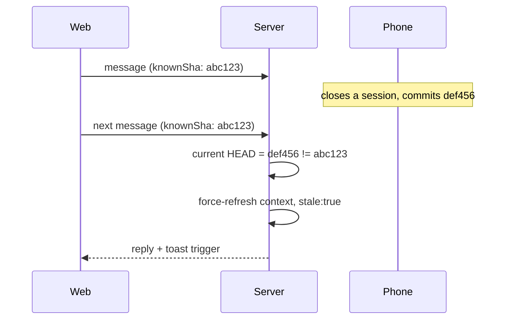
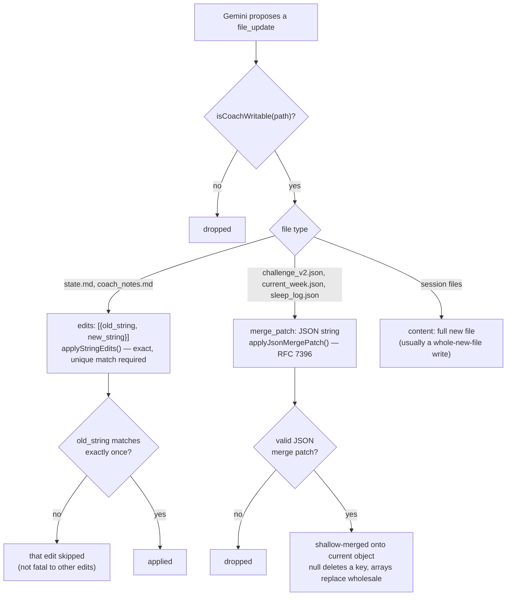
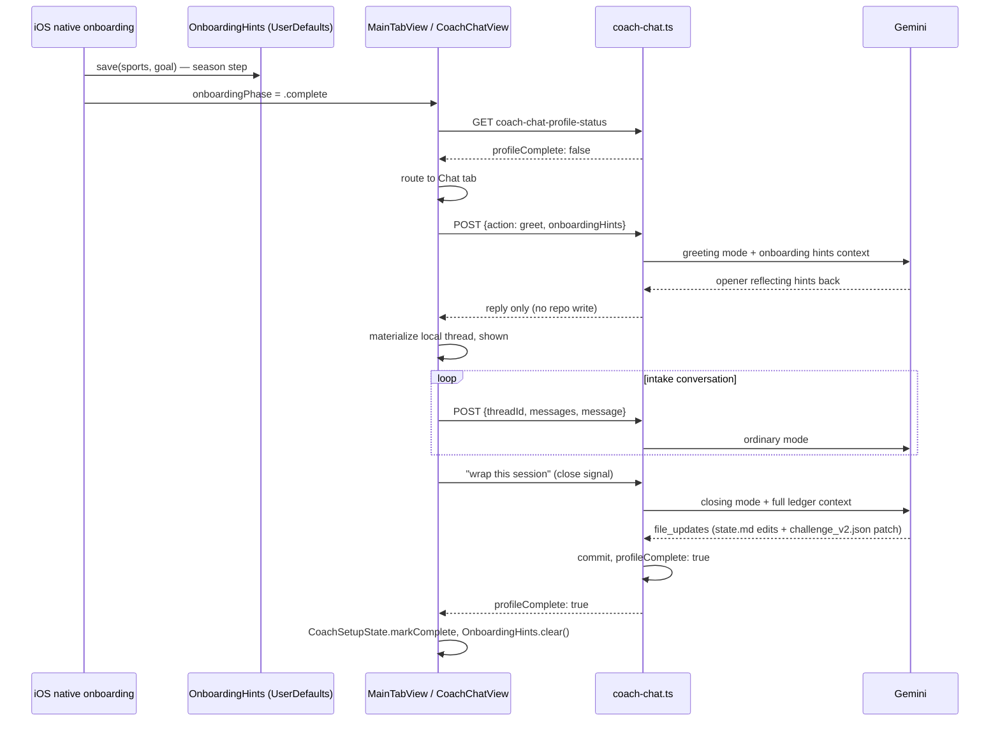

# Coach Chat — how it works

## Context

Real Coach Phelps sessions from the browser and iOS, backed by Gemini. This doc traces what
happens between the athlete opening the chat tab and anything landing on `main`. Ground-up
redesign (Part A + Part B, 2026-08) replaced the old "athlete types first, Gemini regenerates
whole files" design; a follow-on bug-fix pass (2026-08-06, prompted by real usage on both live
athlete repos) changed greet from committing immediately to staying local-only until close, fixed
close-save reliability visibility, and added markdown/date-label rendering on both clients — this
revision documents that current state, not the original redesign's.
Companion to [`ios-sync.md`](ios-sync.md): that doc covers HealthKit ingestion, this one covers
the coaching-conversation path. Commit/retention design: ADR 0012. Vercel function-count
constraint that shapes the endpoint layout: ADR 0017.

## Two conversations this doc covers

1. **Day-to-day chat** — every session after the athlete's profile is set up. Coach speaks first,
   files are edited (not regenerated), retention keeps the newest 7 threads.
2. **First Session Protocol** — the one-time intake conversation that fills in a blank
   `state.md`. Same backend endpoint, same mechanics, different system-prompt instructions and a
   client-side routing layer that makes sure a not-yet-intake'd athlete actually lands there.

Both are one endpoint (`ui/api/coach-chat.ts`) and one companion (`ui/api/coach-chat-context.ts`
for pre-warming, `ui/api/coach-chat-profile-status.ts` for the intake-completion check) — not
separate systems.

## Endpoints

| Endpoint | Method | Purpose |
|---|---|---|
| `ui/api/coach-chat.ts` | `GET` | Load committed threads (newest 7, always `status: "active"`) |
| `ui/api/coach-chat.ts` | `POST {action: "greet"}` | Coach speaks first — reply only, no repo write (client materializes it locally) |
| `ui/api/coach-chat.ts` | `POST {threadId?, messages, message}` | Send a message, get a real reply |
| `ui/api/coach-chat.ts` | `PATCH {threadId, status: "deleted"}` | Delete a thread — immediate, permanent |
| `ui/api/coach-chat-context.ts` | `GET` | Warm SOUL.md/state.md/quest_log.md ahead of chat opening |
| `ui/api/coach-chat-profile-status.ts` | `GET` | `{profileComplete}` — is the First Session Protocol done? |

## Day-to-day flow

```mermaid
flowchart LR
    load["App/site loads"] --> warm["GET coach-chat-context.ts\n(warms 60s server cache)"]
    warm -.-> open["Athlete opens Coach Chat"]
    open --> greet["POST {action: greet}"]
    greet --> askGreeting["Gemini: greeting mode\n1-3 sentence opener\n(every open, no server reuse check)"]
    askGreeting --> local["Client materializes an\nuncommitted local thread\n- NO repo write"]
    local --> shown["Coach's opener shown\nbefore athlete types anything"]
    shown --> typed["Athlete sends a message"]
    typed --> ordinary["POST {threadId, messages, message}"]
    ordinary --> stale{"knownSha !=\ncurrent HEAD?"}
    stale -- yes --> refresh["Force-refresh context\n(bypass 60s cache), stale:true"]
    stale -- no --> cached["Use cached context if warm"]
    refresh --> turn
    cached --> turn["Gemini: ordinary or closing mode"]
    turn --> closeCheck{"Close-signal regex\nmatched AND\nsession_closed:true?"}
    closeCheck -- no --> noWrite["reply only, no repo write"]
    closeCheck -- yes --> commitClose["commitFilesAtomic:\nfile_updates + chat_history.json\n(greeting + full transcript,\nfirst write for this thread)"]
    commitClose --> done["closed:true, profileComplete,\nrepoSha returned"]
```

### 1. Preload (A3)

`ui/api/coach-chat-context.ts` warms `loadCoachContext()`'s 60-second in-memory server cache
(`ui/api/_lib/coachChatFiles.ts`) for state.md and quest_log.md — SOUL.md is no longer fetched
from the athlete's repo at all (see below). Web fires this once
per app load from `App.tsx`'s `Gate` component (`ui/client/src/lib/prefetchCoachContext.ts`,
fire-and-forget); iOS fires it from `MainTabView.swift`'s `.task` block as soon as the app is
active with a valid session (`CoachChatAPIClient.prefetchContext()`). Neither call runs Gemini —
it only warms the file reads, so the eventual greeting doesn't pay a fresh GitHub round-trip on
top of the Gemini call.

### 2. Coach speaks first (A4)

Landing on the chat tab never shows an empty composer. The client calls
`POST {action: "greet"}`, handled by `handleGreet()` — **as of 2026-08-06, this no longer writes
anything to the repo.** Every single call generates a fresh opener via Gemini (`"greeting"` mode:
1-3 sentence contextual opener, no day-count, no stat dump, never proposes `file_updates`,
informed by current `state.md`/`quest_log.md`) and returns just `{reply, threadId, threads}` —
`threadId` is a fresh, never-persisted id (kept in the response only so the shape doesn't have
to change in lockstep with clients; neither web nor iOS reads it) and `threads` is the existing
committed list, unchanged.

The client materializes the greeting as an **uncommitted local thread** instead — web in
`CoachChat.tsx` (`materializeGreeting()`), iOS in `CoachChatView.swift` (`greetNow()`) — using
the same `local-<timestamp>` id convention both platforms already used for a brand-new
athlete-initiated thread. The greeting only actually lands in the repo if the athlete replies
and that conversation later closes: its full message history, including the divider and Coach's
opening line, rides along inside that eventual close-commit, exactly like an ordinary
mid-conversation turn already worked before this change (nothing writes server-side until
close).

**Why this changed:** the old design committed a brand-new thread to the repo the instant Coach
greeted, before the athlete typed anything. A same-day reuse check prevented *repeated* opens
same day from each creating a new empty thread, but a new day (or the unanswered thread aging
past `dayOffset === 0`) still created and committed another one — confirmed against real commit
history on both live athlete repos, where the overwhelming majority of recent commits were
`coach: chat — new conversation` with zero athlete engagement, permanently eating a slot in the
7-thread retention list and cluttering the repo with junk. Removing the commit entirely (rather
than just tightening the reuse check) also fixed threads staying stuck titled "New conversation"
forever — that bug was `existing?.title ?? computedTitle` discarding the real close-time title
because greet had already committed the placeholder one; with nothing pre-committed, the real
title generated at close is used as originally coded, no separate fix needed.

**Known tradeoff, accepted:** without a server-side reuse check, two tabs/devices opened at
almost the exact same moment on a day with no thread yet each independently materialize their
own local greeting, with no reconciliation. In practice this only costs a redundant Gemini call
for a greeting nobody reads — if the athlete replies in one, that becomes the real conversation;
if they reply in both, that's two genuine conversations, no different from deliberately starting
a second one via "New conversation." Not treated as a bug worth a fix.

### 3. Ordinary turns

`POST {threadId?, messages, message}`. `messages` is the client's own in-memory running history
for the thread — nothing is persisted server-side for an unwrapped conversation, so the server is
stateless per turn until a close signal. Every response echoes `repoSha` (see staleness below).
Gemini in `"ordinary"` mode only ever sees `state.md`/`quest_log.md` (not `coach_notes.md`/
`challenge_v2.json`/`current_week.json`/`sleep_log.json` — those are only fetched on a closing
turn, see below), so it's told it may only propose edits to `state.md` mid-conversation; anything
else waits for the close-out.

### 3a. Prompt construction (`askGemini()`, `coach-chat.ts`)

The prompt splits into a **static** half (persona, fixed instructions, few-shot examples — byte-
identical for every athlete, every turn) and a **dynamic** half (current state.md/quest_log.md,
mode-specific instructions, `todayContextLine()`). The static half is uploaded once via Gemini's
explicit-caching API and referenced by name on every call instead of being resent; the dynamic
half ships fresh every request. Full design, the caching mechanics, the response schema, and the
`reasoning` field are covered in `docs/eng-docs/gemini-flow.md` — that's the one reference for
everything Gemini-specific, this doc stays focused on the request lifecycle around it.

SOUL.md itself is bundled from `platform/SOUL.md` at build time (`ui/scripts/build-soul.mjs`,
wired into `predev`/`prebuild`) rather than fetched from the athlete's own repo — it's 100%
generic, no per-athlete substitution happens anywhere in the carve process, so re-fetching it per
athlete per turn was pure waste. See the ADR amending 0011 for the full rationale.

### 4. Cross-device staleness (A5)

No lock. Every response includes `repoSha` — the HEAD sha (or post-commit sha on a close) as of
that response. The client remembers it per thread and sends it back as `knownSha` on the next
message. If it doesn't match the actual current HEAD at request time (most likely: a session was
wrapped on another device since), the server sets `stale: true` and bypasses the 60s context
cache to re-read fresh — so Gemini's next reply reflects whatever changed. Both platforms show a
toast: *"Coach caught up on changes from your other device."*

### 5. Close-session detection

`CLOSE_SESSION_PATTERN` (a fixed regex — `wrap this session`, `done for today`, `bye coach`, `see
you tomorrow`, `goodnight coach`, etc.) is only a **trigger to ask** Gemini to consider closing,
never the close decision itself. Gemini reports back `session_closed: true|false` — a match with
`session_closed: false` means Gemini asked a clarifying question instead of closing (still no
commit); only `closeIntent && session_closed === true` actually closes.

On a genuine close:
- `coach_notes.md`, `challenge_v2.json`, `current_week.json`, `sleep_log.json` are fetched fresh
  (`loadClosingFileContext()`) and injected into the prompt — the only turns Gemini sees their
  current content.
- Today's *other* already-committed threads' previews are summarized into the prompt
  (`todaysOtherThreadsSummary()`, A6) so side quests already covered earlier the same day aren't
  re-asked.
- Gemini returns `file_updates` describing what changed (see write strategy below), plus
  `commit_message`.
- `resolveFileUpdate()` resolves each proposed update against real current content, drops
  anything unwritable/unresolvable/blank, and the survivors plus the updated `chat_history.json`
  land in **one** atomic commit (`commitFilesAtomic()`, ADR 0012 — blob → tree → commit → ref,
  retried on a non-fast-forward conflict).
- The response includes `profileComplete` — computed from whatever `state.md` content this turn
  actually just committed (see First Session Protocol below).

**Close-save reliability (2026-08-06):** nothing in code has ever required `session_closed: true`
to actually carry non-empty `file_updates` — the closing-turn prompt asks Gemini to always
propose edits when anything genuinely changed and to ask for missing info (sleep, side quests)
before closing, but compliance was never enforced or even *visible*. Confirmed via real commit
history on both live athlete repos: closes were landing with only `chat_history.json` touched
far more often than expected, including after long, detailed conversations with real training
content. Two changes, not a hard code-level block (a genuinely content-free close is legitimate
and the prompt already allows it honestly):
- A `console.warn` fires whenever a close lands with `validUpdates.length === 0`, logging the
  athlete's closing message. The model's own `reasoning` for every closing turn (not just empty
  ones — the check happens later than reasoning is available) is separately logged in
  `finishGeminiResponse` before being stripped, correlatable by request time — see
  `gemini-flow.md`'s Reasoning field section.
- The closing-turn prompt now asks for an explicit, mechanical self-check before deciding
  `file_updates`: list every concrete fact the conversation contains that `state.md` doesn't
  already reflect, one per line, and require each line to have either a `file_updates` entry or
  an explicit reason it doesn't need one. Covers session-file (workout plan) proposals too, which
  share the exact same compliance gap.

**Thread title:** generated by Gemini, not derived from the transcript server-side. The same
closing-turn response that carries `session_closed: true` also carries an optional `title` — a
short, specific summary of that conversation (e.g. "Sore shoulder, modified session"), prompted
for once, at close, since that's the only moment a real commit happens (mid-conversation titles
are never visible to begin with — see Resumability below). Capped at
`THREAD_TITLE_MAX_CHARS = 28`, applied three ways: the prompt tells Gemini the budget, the
fallback (below) is truncated to it, and Gemini's own `title` is truncated to it again as a
backstop in case a response ignores the instruction. If `title` is missing (an older/misbehaving
response), falls back to the athlete's first message in the thread, truncated the same way — the
original behavior before title generation existed, kept only as a safety net now. iOS applies its
own `lineLimit`/truncation on every surface that renders a title (header, history list, pick-up
banner), independent of this budget.

### Write strategy (A7)

`file_updates` entries carry exactly one of three shapes, chosen by file type:

Markdown files (`state.md`, `coach_notes.md`) use exact-match string edits — mirrors this
session's own Edit tool discipline. An `old_string` that's absent or appears more than once is
rejected and that specific edit skipped (not fatal to the rest of the turn). If every edit in an
update fails, the whole update is dropped rather than committing a no-op write.

JSON files (`challenge_v2.json`, `current_week.json`, `sleep_log.json`) use RFC 7396 JSON Merge
Patch, sent as a JSON-encoded **string** (not a nested object — Gemini's structured-output schema
doesn't reliably support open-ended objects). Only changed keys need to be included; a `null`
value deletes a key; arrays always replace wholesale, never merge element-by-element.

Session files (`user_data/activities/workout_plans/sessions/*.json`) keep full-content
replacement — these are almost always whole-new-file writes, not edits to an existing one.

`COACH_WRITABLE_FILES` is the defense-in-depth allowlist — derived from the union of the
markdown-edit and JSON-merge-patch sets, so it can't drift from them. Anything Gemini proposes
outside this set (or `SESSIONS_PREFIX`) is dropped regardless of what the prompt already told it.

### Retention (ADR 0012, amended)

No archive tier. A thread is `active` until deleted, which is immediate and permanent — no
restore, no second "delete forever" confirmation. The cap (`MAX_RETAINED_THREADS = 7`) is a flat
`threads.slice(0, 7)` on the newest-first array; creating an 8th thread evicts the oldest.
Deleting a thread below the cap does **not** backfill/evict anything on the next new thread,
since a deleted thread was never counted against the cap.

Since greet no longer commits (see A4 above), an unengaged conversation never consumes a
retention slot at all — only threads that actually got a real close-out ever reach this list.

### Rendering (2026-08-06)

- **Markdown**: coach replies now render real bold/lists instead of literal `**`/`-` characters,
  on both platforms — the closing-turn prompt encourages markdown for structured content
  (workout plans, multi-step advice) now that both clients can actually show it. Web added
  `react-markdown` (`CoachChatWidgets.tsx`); iOS's existing inline-only `AttributedString` wrapper
  (`CoachChatMarkdown.attributed`, bold/italic only) gained a companion
  `CoachChatMarkdownBlock` that does a minimal line-based split for `- `/`* `/`1. ` prefixed
  lines, since `AttributedString` can't lay out block-level lists in SwiftUI `Text` on its own.
- **Thread age labels**: the relative `D-1`/`D-2`/`D-13` badge (`ChatThread.ageLabel`) — distinct
  from the *absolute* day-count badge (`D-101`, from `challenge_v2.json`'s day count, unchanged)
  — is replaced with a real date ("5th AUG") on both platforms, since the relative number reset
  meaning every time it was looked at on a later day. Uses `ChatThread.createdAt` (raw epoch ms,
  always sent by the server, only just started being decoded client-side — iOS's model didn't
  have the field at all before this). Same fix applies to the leading conversation-pane divider
  ("TODAY · 2:00 AM" frozen at creation time, wrong forever on an old thread) — both clients now
  compute that label fresh from the thread's own `dayOffset`/`createdAt` at render time instead
  of trusting the stored string.

## First Session Protocol flow

Trigger: `state.md`'s `## Athlete Profile` section is still the blank template (headings only, no
data) that `platform/scripts/carve-skeleton.mjs` ships every new athlete repo with.

### 1. Native onboarding hands off hints, not a profile

`ios/CoachHQ/CoachHQ/Views/OnboardingRevealFlow.swift`'s season step collects sport(s) + a
one-line goal and caches them locally via `OnboardingHints` (UserDefaults, no TTL) — **not**
committed to the repo. (An earlier design committed a `user_data/profile.md` with this data;
confirmed zero consumers anywhere, removed.) If the athlete never returns, the hints just sit
there indefinitely; if they reinstall or switch to web first, the hints are simply absent and the
protocol asks fresh — graceful degradation either way.

### 2. Routing: live check, not thread existence

`CoachSetupBootstrap.shouldOpenChatFirst()` (`ios/CoachHQ/CoachHQ/Services/CoachSetupState.swift`)
decides Chat vs Home on every launch while the local Keychain flag (`CoachSetupState`) is still
false. It calls `GET coach-chat-profile-status` live — **not** "does any thread exist," which used
to be the signal and was always wrong (a thread existing has never meant the intake actually
finished, and got strictly worse once A4 originally made every chat-tab visit create a thread
immediately — since fixed, see A4 above, but `profileComplete` was already the correct signal
regardless of that).
Wired into `MainTabView.swift`'s `.task` block, right after the native-onboarding-complete guard
— this call site didn't exist before (the function was dead code, never invoked). Network
failure/timeout (5s cap) falls back to Home rather than trapping a returning athlete in Chat.

Once `profileComplete: true` comes back (from either this check or a close-turn response),
`CoachSetupState.markComplete()` flips the Keychain flag (fast path for all future launches — no
more network call) and `OnboardingHints.clear()` removes the now-unneeded cached hints.

### 3. The intake conversation itself

Same `handleGreet()` / ordinary-turn / closing-turn mechanics as day-to-day chat — the First
Session Protocol is entirely a **prompt difference** (`platform/soul/B_engine.md` §10, composed
into `platform/SOUL.md`), not a separate code path. `askGemini()`'s greeting-mode call includes
`onboardingHintsContext()` — sport(s)/goal formatted from `OnboardingHints`, only when present —
so Gemini reflects them back for confirmation instead of asking cold:

> *"I see you picked running and strength during signup, and your goal was 'get back to
> competitive shape' — still accurate, or has that shifted?"*

§10 walks through: warm intro → conversational intake (name, sport/frequency — skipped if hints
present, fitness self-assessment — skipped if activity history exists, goal depth, events,
injuries, coaching style, timezone) → confirm → write `state.md`'s Athlete Profile + Active
Injury Flags + Season/phase → set up quests → write `challenge_v2.json`. The doc text describes
this the same way for a full Claude Code session (shell commands, `git commit`) and for chat —
`askGemini()`'s own system-instruction prelude explicitly tells Gemini it has no shell/tool
access in this context and to translate "commit" into the `file_updates`/close-turn mechanism
described above instead of trying to run anything.

### 4. Resumability

If the athlete answers a few intake questions and kills the app, the thread never closed
(`session_closed` never went `true`) and — since greet no longer commits either (see A4 above) —
the server has **no record of this thread at all**, not even the opener. Ordinary POST turns
never call `commitFilesAtomic` until close, and now neither does greet, so every in-progress
conversation is purely client-side from the moment Coach speaks first until the moment it
closes.

What restores the conversation is a client-side cache, not the server — as of 2026-08-06, on
**both platforms**, not just iOS:
- **iOS**: `CoachChatView` mirrors the thread's message array to `CoachChatLocalCache`
  (`ios/CoachHQ/CoachHQ/Services/CoachChatLocalCache.swift`), keyed by repo + thread id, in
  `UserDefaults`, after every append.
- **Web**: `CoachChat.tsx` does the same into `localStorage` (`coachChatModel.ts`'s
  `saveThreadLocally`/`restoreThreadMessagesLocally`/`clearThreadLocally`), keyed by thread id
  (web has no per-account namespacing the way iOS's key includes `repoFullName` — accepted
  simplification, a browser's `localStorage` is already scoped to one signed-in session at a
  time in practice).

**The restore itself has to look further than before greet also stopped committing.** A thread
that's still fully local (never had *any* server counterpart — every conversation now, until it
closes) can't be found by matching against the server's thread list, since it isn't on it. Both
platforms' restore logic now does two things on load, not one:
1. Overlay the local cache onto any *server-known* thread whose cache has more messages than the
   server copy (the original mechanism, for a thread that at least got an opener committed under
   the old design, or — going forward — a thread whose close-commit landed but a stray local
   cache entry is still lying around).
2. **Scan for orphaned local cache entries** — a thread id cached locally that never made it into
   the server's list at all — and materialize each one as its own thread. This is what actually
   fixes "an in-progress conversation vanishes after force-quit/relaunch (iOS) or refresh (web)":
   it was being cached correctly the whole time, the restore logic just never thought to look for
   it under its local-only id. (`CoachChatLocalCache.restoring()`'s `orphanedThreadIds()` on iOS;
   `findOrphanedLocalThreadIds()` in `coachChatModel.ts` on web.)

`shouldOpenChatFirst()` still sees `profileComplete: false` and routes back to Chat on relaunch;
`todayThread`/`ensureTodayThread` select the restored local thread directly rather than calling
`greetNow()`/`greet()` again. The cache for a thread is dropped once its close-commit actually
lands (server copy becomes truth) or the thread comes back `.deleted`.

This is single-device only, by design — it does not sync the in-progress window across devices;
that stays a known gap (issue #222 §D). A relaunch on a *different* device mid-conversation still
sees nothing for that thread at all now (previously: the opener, since greet used to commit it).

### 5. Completion signal

`isAthleteProfileComplete()` (`ui/api/_lib/coachChatFiles.ts`) parses the `## Athlete Profile`
section generically: every `- **Label:**` line found must have non-blank content after the
colon, and the section must exist with at least one such line. Not hardcoded to the six current
field names, so it stays correct if the template ever changes. Computed from whatever `state.md`
content a close-turn **actually just committed** (not a stale pre-turn snapshot), returned as
`profileComplete` on every close response.

## Auth

`coach-chat.ts` (and its two companion endpoints) use the shared `resolveRepoAuth()` helper
(`ui/api/auth/_lib/resolve-auth.ts`) — session cookie on web, `Authorization: Bearer <token>` +
`X-Coach-Repo: owner/repo` on iOS. Sending a message never retries a raw network failure (a
close-session commit could have already landed before the response was lost — blind retry would
re-run Gemini and the commit a second time); a 5xx/429 *response* still retries, since the server
confirmed nothing committed. A 401 shows a "sign in again" state on both platforms: web's shared
`AccessRevokedCard`; iOS sets `authManager.sessionExpired`, surfaced by `MainTabView`'s app-wide
`SessionExpiredView` overlay.

## Endpoint count constraint (ADR 0017)

Vercel's Hobby plan caps a deployment at 12 serverless functions, one per top-level `ui/api/*.ts`
file. This repo sits close to that cap — `ui/api/auth/` is consolidated into one catch-all route
(`ui/api/auth/[...action].ts`) specifically to leave headroom for coach-chat's three endpoints.
Any new coach-chat endpoint should default to folding into `coach-chat.ts` (or a new catch-all)
rather than assuming a fresh top-level file is free.

## Done when

Landing on Coach Chat always shows Coach having already spoken, never an empty composer; a
close-session commit lands as one atomic commit with only the files that genuinely changed;
editing a 14KB `state.md` mid-conversation touches only the changed lines, not the whole file;
two devices on the same thread self-correct via the staleness toast instead of silently
diverging; a not-yet-intake'd athlete always lands back in the same in-progress First Session
thread on relaunch, never re-asked what they already answered.

## Deferred

- P2: no token-level streaming — replies arrive whole, not word-by-word. Tracked in issue #270
  (the structured-JSON response schema is the real complication, not just wiring SSE).
- P2: inline chips/highlights ("engine load" pills) have no backend data — Gemini's response
  schema has no field for them. Unbuilt, needs product design.
- P2: `EmptyChatPane`/`CHAT_STARTERS` in `CoachChatWidgets.tsx`/`coachChatModel.ts` are dead code
  since A4 retired the canned-greeting landing view — safe to delete, left in place to limit
  diff size while the redesign landed.
- P3: the *absolute* day-number badge (`D-101`, left-side in the history sheet) still resets with
  each new challenge/season instead of counting from when the athlete started using Coach at all
  — tracked in issue #179. (Distinct from the *relative* age badge, which was replaced with a
  real date on 2026-08-06 — see Rendering above.)
- P1, real but not chasing without a reproduction: close-save reliability (see above) is a
  prompt-compliance problem, not a guaranteed fix — the logging added lets a real occurrence be
  diagnosed, but there's no code-level guarantee Gemini follows the strengthened self-check every
  time.
- P2: no server-side reuse/dedup when two tabs/devices greet at almost the same instant on an
  empty day (see A4's "known tradeoff, accepted" note) — costs at most one redundant Gemini call,
  not treated as worth a fix.

## Appendix — file/class reference

| File | Role |
|---|---|
| `ui/api/coach-chat.ts` | request handler, Gemini call, commit orchestration |
| `ui/api/coach-chat-context.ts` | A3 preload endpoint |
| `ui/api/coach-chat-profile-status.ts` | B2 First Session Protocol completion check |
| `ui/api/_lib/coachChatFiles.ts` | shared file reads, context cache, `isAthleteProfileComplete` |
| `ui/api/_lib/soulCache.ts` | explicit Gemini caching for the static prompt prefix — see `gemini-flow.md` |
| `ui/api/_lib/fileEdits.ts` | A7 write strategies — `applyStringEdits`, `applyJsonMergePatch` |
| `ui/api/_lib/githubGitData.ts` | atomic multi-file commit helper (Git Data API) |
| `ui/client/src/pages/CoachChat.tsx` | web chat page |
| `ui/client/src/components/coach-chat/CoachChatWidgets.tsx` | web presentational components |
| `ui/client/src/components/coach-chat/coachChatModel.ts` | client fetch helpers, `greet()`, SHA tracking, localStorage cache (`saveThreadLocally`/`findOrphanedLocalThreadIds`) |
| `ui/client/src/lib/prefetchCoachContext.ts` | web A3 trigger (`App.tsx`'s `Gate`) |
| `ios/CoachHQ/CoachHQ/Services/CoachChatAPIClient.swift` | iOS client (Bearer + X-Coach-Repo) |
| `ios/CoachHQ/CoachHQ/Models/CoachChatModels.swift` | Codable mirrors of the server's JSON, `ChatThread.formattedDate`/`ageDisplay`/`dividerLabel` |
| `ios/CoachHQ/CoachHQ/Services/CoachChatLocalCache.swift` | UserDefaults resumability cache, orphaned-local-thread restore |
| `ios/CoachHQ/CoachHQ/Views/CoachChatView.swift` | iOS chat UI, greet/resume logic |
| `ios/CoachHQ/CoachHQ/Views/CoachChatMarkdown.swift` | inline bold/italic (`AttributedString`) + list-aware block rendering |
| `ios/CoachHQ/CoachHQ/Services/CoachSetupState.swift` | Keychain flag + `shouldOpenChatFirst()` |
| `ios/CoachHQ/CoachHQ/Services/OnboardingHints.swift` | B1 locally-cached sport/goal hints |
| `ios/CoachHQ/CoachHQ/Views/OnboardingRevealFlow.swift` | native onboarding, season step |
| `platform/soul/B_engine.md` §10 | First Session Protocol prompt content |
