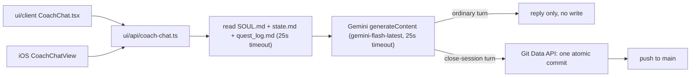
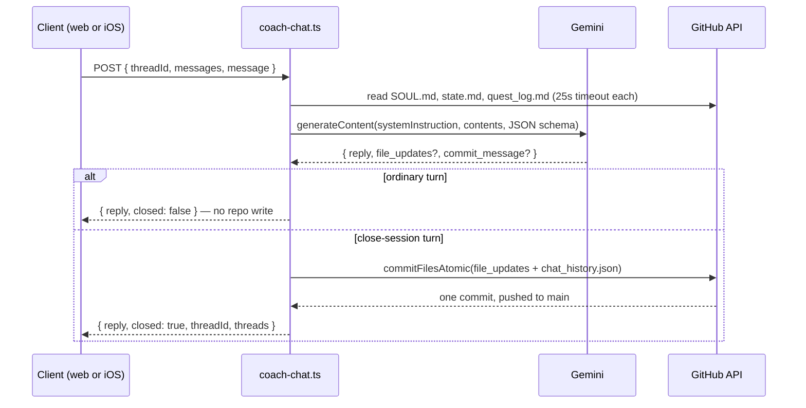

# Coach Chat — how it works

## Context

Real Coach Phelps sessions from the browser and iOS, backed by Gemini. This doc traces what
happens between the athlete hitting send and anything landing on `main` — see ADR 0012 for why
it commits the way it does. Companion to [`ios-sync.md`](ios-sync.md): that doc covers HealthKit
ingestion, this one covers the coaching-conversation path. Recently hardened end-to-end (issues
#172–#181) after a full architecture review found several real bugs; this revision reflects that
current state, not the original one-day build.

## Overview

## Trigger — sending a message

- `CoachChat.tsx` (web) — send button / Enter. The athlete's own message is echoed into the
  thread immediately on send, not held back until the reply arrives — rolled back with the draft
  restored if the request fails.
- iOS `CoachChatView` — same endpoint, same contract, `Bearer <token>` + `X-Coach-Repo` instead
  of a session cookie. Same immediate-echo behavior (`materializeThreadIfNeeded`).

Both call `POST /api/coach-chat` with `{ threadId?, messages, message }`. `messages` is the
client's own in-memory running history for the thread — nothing is persisted server-side for an
unwrapped conversation, so the server stays stateless per turn until a close signal.

## What a turn does, in order

1. **Context read** — `askGemini()` fetches `propagated/SOUL.md`, `user_data/coach/state.md`,
   `gen/quest_log.md` fresh from GitHub every turn (no caching, each wrapped in a 25s timeout so
   a stalled GitHub/Gemini call fails visibly instead of leaving "Coach is thinking" spinning
   forever), and builds a `systemInstruction`: full SOUL.md, a computed "today is..." line from
   state.md's `**Timezone:**` field, a hard role-lock ("Coach Phelps ONLY"), current state.md and
   quest_log.md verbatim, then close-session or ordinary-turn instructions.
2. **Close-signal check** — `isCloseSignal()` matches the athlete's message against a fixed regex
   (`wrap this session`, `done for today`, `goodnight coach`, etc.) — deterministic, not left to
   the model to self-detect.
3. **Gemini call** — one non-streaming `generateContent` request (no token-by-token streaming
   yet — tracked as a future initiative, not a bug), JSON-schema-constrained response (`reply`,
   optional `commit_message`, optional `file_updates`).
4. **Ordinary turn** — no repo write. The client appends both messages to its own in-memory
   thread; refreshing before "wrap" loses the conversation (accepted trade-off).
5. **Close-session turn** — the one moment a real commit happens:
   - Gemini's `file_updates` filtered through `isCoachWritable()` — only
     `COACH_WRITABLE_FILES` survive regardless of what the model proposed (defense in depth).
     Blank-content updates are dropped too.
   - `chat_history.json`'s content is a `resolve()` callback (`githubGitData.ts`'s
     `ResolvedFileWrite`), re-read fresh and re-merged on **every** commit retry attempt, not
     computed once up front — closes a lost-update race between two requests touching the thread
     list at once. A close targeting a thread another request already archived/deleted fails
     loudly (400) instead of silently resurrecting it.
   - `commitFilesAtomic()` — every valid `file_updates` entry plus the resolved
     `chat_history.json`, in **one** commit via the Git Data API. A network-level failure on the
     final ref-move step no longer blindly redoes the whole blob→tree→commit→ref sequence — it
     re-checks whether the ref already points at the commit just attempted before retrying, so a
     lost response after a successful move can't produce a duplicate commit.

## Pick up an open thread

The new-conversation screen offers a shortcut to the most recent **still-open** thread — the
newest thread with `dayOffset > 0`, `status: "active"`, and at least one message — above the
starter prompts. Both platforms now implement this same rule identically (iOS previously checked
literally `dayOffset == 1` only — fixed to match).

## Auth

`coach-chat.ts` uses the shared `resolveRepoAuth()` helper (`ui/api/auth/_lib/resolve-auth.ts`,
ADR 0005's pattern) — session cookie on web, `Authorization: Bearer <token>` +
`X-Coach-Repo: owner/repo` on iOS. Sending a message never retries a raw network failure (a
close-session commit could have already landed before the response was lost — blind retry would
re-run Gemini and the commit a second time); a 5xx/429 *response* still retries, since the server
confirmed nothing committed. A 401 shows a "sign in again" state on both platforms: web's shared
`AccessRevokedCard` (`RepoDataGate.tsx`, used by both the generic repo-data gate and Coach Chat's
own thread-fetch 401s); iOS sets `authManager.sessionExpired`, surfaced by `MainTabView`'s
app-wide `SessionExpiredView` overlay (not a chat-specific screen).

## Retention (ADR 0012)

Newest 7 threads by last activity survive, active + archived combined. Soft-deleted threads
don't count toward the cap and aren't auto-purged — they sit until the athlete taps Restore or
Delete Forever (sending "deleted" a second time, recognized as a real hard delete).

## First-launch routing (iOS only)

`CoachSetupBootstrap.shouldOpenChatFirst()` decides whether the app opens on Chat or Home the
first time it's launched after install — a genuinely new athlete (no thread history) lands on
Chat; a returning athlete (real history exists) lands on Home. The "already set up" flag is
Keychain-backed (survives a same-device reinstall, unlike `UserDefaults`), so this resolves
instantly without a network call for the common case; a genuinely new device still needs one
network check, bounded to 5s before falling back to Home. Ships in #181 (open at time of
writing).

## Done when

Sending a message shows the athlete's own bubble instantly; only the latest coach reply is
signed; a stalled Gemini/GitHub call fails within 25s instead of hanging; a lost network response
during commit can't double-commit; both platforms' pick-up-thread and iOS's chat header/history
day labels use real data, not preview/hardcoded values.

## Deferred

- P2: no token-level streaming — replies arrive whole, not word-by-word. Real project, not a bug.
- P2: inline chips/highlights ("engine load" pills) have no backend data at all — Gemini's
  response schema has no field for them. Unbuilt feature, needs product design, not wiring.
- P3: day-number semantics (`D-N`) currently reset with each new challenge/season instead of
  counting from when the athlete started using Coach at all — tracked in issue #179, needs a new
  durable field + provisioning + backfill, pending a decision between Skanda and Akash.

## Appendix — file/class reference

| File | Role |
|---|---|
| `ui/api/coach-chat.ts` | request handler, Gemini call, commit orchestration |
| `ui/api/_lib/githubGitData.ts` | atomic multi-file commit helper (Git Data API) |
| `ui/client/src/pages/CoachChat.tsx` | web chat page |
| `ui/client/src/components/coach-chat/CoachChatWidgets.tsx` | web presentational components |
| `ui/client/src/components/coach-chat/coachChatModel.ts` | client fetch helpers |
| `ios/CoachHQ/CoachHQ/Services/CoachChatAPIClient.swift` | iOS client (Bearer + X-Coach-Repo) |
| `ios/CoachHQ/CoachHQ/Models/CoachChatModels.swift` | Codable mirrors of the server's JSON |
| `ios/CoachHQ/CoachHQ/Views/CoachChatView.swift` | iOS chat UI, `MainTabView.swift`'s `.chat` tab |
| `ios/CoachHQ/CoachHQ/Services/CoachSetupState.swift` | setup-complete flag + first-launch routing |
