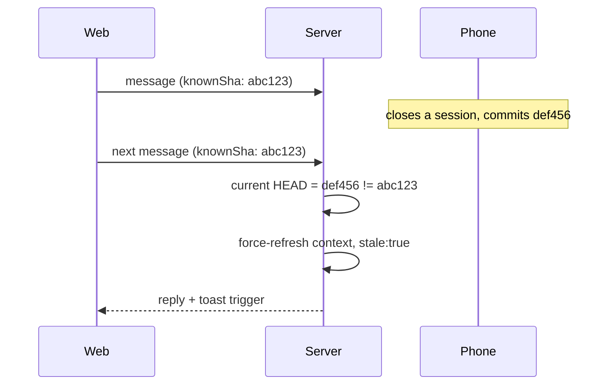
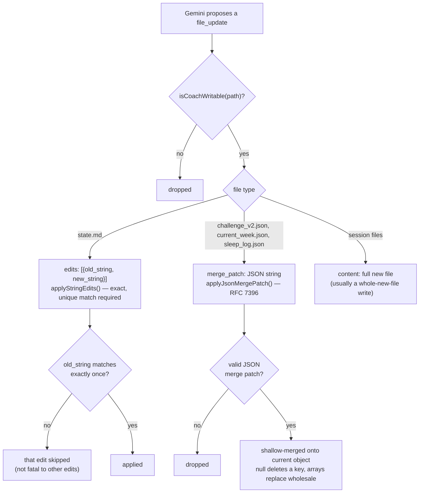
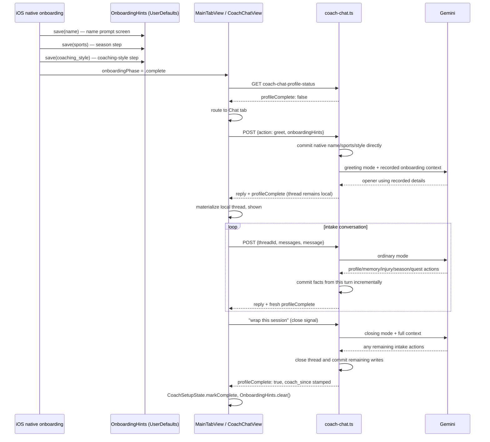

# Coach Chat — how it works

> Status: Current · Owner: UI Expert · Verified: 2026-08-20

## Context

Real Coach Phelps sessions from the browser and iOS, backed by Gemini. This doc traces what
happens between the athlete opening the chat tab and anything landing on `main` — it describes
**how the system works today**, not its history. For what changed, when, and why, see
[`coach-chat-design-history.md`](coach-chat-design-history.md)'s dated record.
Companion to [`ios-sync.md`](ios-sync.md): that doc covers HealthKit ingestion, this one covers
the coaching-conversation path. Commit/retention design: ADR 0012. Vercel function-count
constraint that shapes the endpoint layout: ADR 0017.

## Two conversations this doc covers

1. **Day-to-day chat** — every session after the athlete's profile is set up. Coach speaks first,
   files are edited (not regenerated), retention keeps the newest 7 threads.
2. **First Session Protocol** — the one-time intake conversation that fills in a blank
   `state.md`. Same backend endpoint, same mechanics, different system-prompt instructions and a
   client-side routing layer that makes sure a not-yet-intake'd athlete actually lands there.

Both are one endpoint (`ui/api/coach-chat.ts`) and one companion (`ui/api/coach-chat-context.ts`
for pre-warming, `ui/api/coach-chat-profile-status.ts` for the intake-completion check) — not
separate systems.

## Endpoints

| Endpoint | Method | Purpose |
|---|---|---|
| `ui/api/coach-chat.ts` | `GET` | Load committed threads (newest 7, always `status: "active"`) |
| `ui/api/coach-chat.ts` | `POST {action: "greet"}` | Coach speaks first; FSP also records native onboarding fields directly |
| `ui/api/coach-chat.ts` | `POST {threadId?, messages, message, endConversationRequested?}` | Send a message or explicitly request a close |
| `ui/api/coach-chat-context.ts` | `GET` | Warm SOUL.md/state.md/rendered quest context ahead of chat opening |
| `ui/api/coach-chat-profile-status.ts` | `GET` | `{profileComplete}` — is the First Session Protocol done? |

## Day-to-day flow

```mermaid
flowchart LR
    load["App/site loads"] --> warm["GET coach-chat-context.ts\n(warms 60s server cache)"]
    warm -.-> open["Athlete opens Coach Chat"]
    open --> greet["POST {action: greet}"]
    greet --> askGreeting["Gemini: greeting mode\n1-3 sentence opener\n(every open, no server reuse check)"]
    askGreeting --> local["Client materializes an\nuncommitted local thread\n- NO repo write"]
    local --> shown["Coach's opener shown\nbefore athlete types anything"]
    shown --> typed["Athlete sends a message\nor taps End Conversation"]
    typed --> ordinary["POST {threadId, messages, message,\nendConversationRequested?}"]
    ordinary --> stale{"knownSha !=\ncurrent HEAD?"}
    stale -- yes --> refresh["Force-refresh context\n(bypass 60s cache), stale:true"]
    stale -- no --> cached["Use cached context if warm"]
    refresh --> turn
    cached --> turn["Gemini: ordinary or closing mode"]
    turn --> closeCheck{"Typed/pending close signal\nor explicit button flag\nAND session_closed:true?"}
    closeCheck -- no --> noClose["closed:false response\nFSP facts may commit incrementally"]
    closeCheck -- yes --> commitClose["commitFilesAtomic:\nfile_updates + coach_note + chat_history.json\n(greeting + full transcript,\nfirst write for this thread)"]
    commitClose --> done["closed:true, profileComplete,\nrepoSha returned"]
```

### 1. Preload (A3)

`ui/api/coach-chat-context.ts` warms `loadCoachContext()`'s 60-second in-memory server cache
(`ui/api/coach-chat/_lib/coachChatFiles.ts`) for profile, memory, injuries, recent coach notes,
the split quest ledger, and the generated athlete fitness snapshot — SOUL.md is no longer fetched
from the athlete's repo at all (see below). Web fires this once
per app load from `App.tsx`'s `Gate` component (`ui/client/src/lib/prefetchCoachContext.ts`,
fire-and-forget); iOS fires it from `MainTabView.swift`'s `.task` block as soon as the app is
active with a valid session (`CoachChatAPIClient.prefetchContext()`). Neither call runs Gemini —
it only warms the file reads, so the eventual greeting doesn't pay a fresh GitHub round-trip on
top of the Gemini call.

### 2. Coach speaks first (A4)

Landing on the chat tab never shows an empty composer. The client calls
`POST {action: "greet"}`, handled by `handleGreet()`. During First Session it first commits any
native onboarding hints; it never commits the greeting thread itself. Every call generates a fresh opener via Gemini (`"greeting"` mode: 1-3 sentence
contextual opener, no day-count, no stat dump, never proposes `file_updates`, informed by
current athlete context) and returns `{reply, threadId, threads, repoSha, profileComplete}` — `threadId` is
a fresh, never-persisted id (kept in the response only for shape stability; neither web nor iOS
reads it) and `threads` is the existing committed list, unchanged.

The client materializes the greeting as an **uncommitted local thread** instead — web in
`CoachChat.tsx` (`materializeGreeting()`), iOS in `CoachChatView.swift` (`greetNow()`) — using
the same `local-<timestamp>` id convention both platforms use for a brand-new athlete-initiated
thread. The greeting only actually lands in the repo if the athlete replies and that
conversation later closes: its full message history, including the divider and Coach's opening
line, rides along inside that eventual close-commit, exactly like an ordinary mid-conversation
turn (nothing writes server-side until close).

Before materializing a new greeting, both platforms clear the cache entry for any *previous
unreplied* local greeting they find in current state (`materializeGreeting()`/`greetNow()`) — so
repeatedly hitting "New conversation" without ever replying can't pile up multiple local-only
cache entries for the same day. See Resumability below for the complementary restore-time fix
(dropping a past-day unreplied greeting entirely, rather than just superseding a same-day one).

**Accepted edge case:** without a server-side reuse check, two tabs/devices opened at almost the
exact same moment on a day with no thread yet each independently materialize their own local
greeting, with no reconciliation. If the athlete replies in one, that becomes the real
conversation; if they reply in both, that's two genuine conversations, no different from
deliberately starting a second one via "New conversation." Worst case costs one redundant Gemini
call for a greeting nobody reads.

### 3. Ordinary turns

`POST {threadId?, messages, message, endConversationRequested?}`. `messages` is the client's own in-memory running history
for the thread — nothing is persisted server-side for an unwrapped conversation, so the server is
stateless per turn until a close. Every response echoes `repoSha` and a fresh `profileComplete`
(see staleness and First Session below).
Gemini in `"ordinary"` mode only ever sees `state.md`/`rendered quest context` (not `coach_notes.md`/
`challenge_v2.json`/`current_week.json`/`sleep_log.json` — those are only fetched on a closing
turn, see below), so it's told it may only propose edits to `state.md` mid-conversation; anything
else waits for the close-out.

### 3a. Prompt construction (`askGemini()`, `ui/api/coach-chat/_lib/geminiClient.ts`)

The prompt splits into a **static** half (persona, fixed instructions, few-shot examples — byte-
identical for every athlete, every turn) and a **dynamic** half (current state.md/rendered quest context,
mode-specific instructions, `todayContextLine()`). The static half is uploaded once via Gemini's
explicit-caching API and referenced by name on every call instead of being resent; the dynamic
half ships fresh every request. Full design, the caching mechanics, the response schema, and the
`reasoning` field are covered in `docs/eng-docs/gemini-flow.md` — that's the one reference for
everything Gemini-specific, this doc stays focused on the request lifecycle around it.

SOUL itself is bundled from `platform/SOUL.chat.md` — the coach-chat build of the two composed
targets (ADR 0022) — at build time (`ui/scripts/build-soul.mjs`,
wired into `predev`/`prebuild`) rather than fetched from the athlete's own repo — it's 100%
generic, no per-athlete substitution happens anywhere in the carve process, so re-fetching it per
athlete per turn was pure waste. See the ADR amending 0011 for the full rationale.

### 4. Cross-device staleness (A5)

No lock. Every response includes `repoSha` — the HEAD sha (or post-commit sha on a close) as of
that response. The client remembers it per thread and sends it back as `knownSha` on the next
message. If it doesn't match the actual current HEAD at request time (most likely: a session was
wrapped on another device since), the server sets `stale: true` and bypasses the 60s context
cache to re-read fresh — so Gemini's next reply reflects whatever changed. Both platforms show a
toast: *"Coach caught up on changes from your other device."*

### 5. Close-session detection

`CLOSE_SESSION_PATTERN` (a fixed regex — `wrap this session`, bare `wrap` with a short affirming
filler, `done for today`, `bye coach`, `see you tomorrow`, `goodnight coach`, etc.) is only a
**trigger to ask** Gemini to consider closing, never the close decision itself. Gemini reports
back `session_closed: true|false` — a match with `session_closed: false` means Gemini asked a
clarifying question instead of closing (still no commit); only `closeIntent && session_closed ===
true` actually closes. `closeIntent` is also true if a close-trigger message appeared in the last
few turns (`wasCloseAttemptPending`) — otherwise, simply *answering* Coach's own clarifying
question (e.g. "8hrs" in response to "how'd you sleep?") would route as an ordinary turn and never
get a chance to actually close, even though the athlete is mid-close-attempt. The web and iOS
End Conversation buttons instead send `endConversationRequested: true`; `shouldRequestClose()`
ORs that flag with the typed and pending checks. It deterministically enters closing mode but
does not force the result: Gemini may still ask a closing follow-up and return
`session_closed: false`.

On a genuine close:
- `challenge_v2.json`, `current_week.json`, `sleep_log.json` are fetched fresh
  (`loadClosingFileContext()`) and injected into the prompt — the only turns Gemini sees their
  current content. `coach_notes.md` is **not** fetched here — see `coach_note` below, its
  current-content is only read server-side, at commit time.
- Today's *other* already-committed threads' previews are summarized into the prompt
  (`todaysOtherThreadsSummary()`, A6) so side quests already covered earlier the same day aren't
  re-asked.
- Gemini returns `file_updates` describing what changed (see write strategy below), plus a
  separate `coach_note` fact (see below), plus `commit_message`.
- `resolveFileUpdate()` resolves each proposed `file_updates` entry against real current content,
  drops anything unwritable/unresolvable/blank (every drop now names a reason, not just a bare
  `null`), and the survivors plus the updated `chat_history.json` (plus `coach_notes.md`, when
  `coach_note` was reported) land in **one** atomic commit (`commitFilesAtomic()`, ADR 0012 —
  blob → tree → commit → ref, retried on a non-fast-forward conflict). Every GitHub call in this
  sequence goes through `fetchWithTimeout` (25s default) rather than a bare `fetch()`, so a
  stalled write fails fast into the retry instead of hanging until Vercel's platform ceiling
  kills the function; a timeout on the ref-move step specifically is treated the same as a raw
  network error (re-check whether the ref actually landed before deciding whether to retry — see
  the comment at that call site), since either way the response was lost and blindly retrying
  risks a double-commit.
- The response includes `profileComplete`, as greet and ordinary responses do — computed from
  the projected profile, memory, and season content for this turn (see First Session Protocol).
- `COACH_CHAT_BRANCH` (env var, defaults to `main`) controls which branch the commit lands on —
  lets a real close be tested end to end on a scratch branch instead of a live athlete's `main`.

**`coach_note` — the append-only fact.** `file_updates` requires the model to either produce an
exact-match string edit (state.md) or a valid merge patch (the JSON files) — both can silently
fail to apply. `coach_note` sidesteps that: the model reports a short (2-3 sentence) plain-English
note of what happened, and the server appends it with today's date to `coach_notes.md`
(`appendCoachNote()`) — no exact-match, no patch parse, nothing to reject. `coach_notes.md` was
fully removed from the edits-eligible set for this reason (see Write strategy below).

**Close-save observability:** nothing in code requires `session_closed: true` to actually carry
non-empty `file_updates`/`coach_note` — a genuinely content-free close ("just wanted to say hi,
bye") is legitimate and the prompt allows it honestly, so this isn't a hard block, just visibility
plus a stronger prompt, plus a retry-and-caveat safety net for the specific case where the model's
own reasoning contradicts what it actually returned:
- A structured `close-trace` log line fires on every close (traceId, threadId, what was proposed,
  what committed/dropped and why, timing) — replaces the older scattered `console.warn`s. The
  model's own `reasoning` for every closing turn is separately logged in `finishGeminiResponse`
  before being stripped, correlatable by request time — see `gemini-flow.md`'s Reasoning field
  section.
- The closing-turn prompt asks for an explicit, mechanical self-check before deciding
  `file_updates`/`coach_note`: list every concrete fact the conversation contains that `state.md`
  doesn't already reflect, one per line, and require each line to have either a save (an entry in
  `file_updates`, or duplicated into `coach_note` as a guaranteed fallback if the model isn't
  confident a `file_updates` edit will match exactly) or an explicit reason it doesn't need one.
- If `reasoning` describes real content but both `file_updates` and `coach_note` still come back
  empty (`hasUnsavedContentMismatch()`), `askGemini` fires one automatic follow-up call replaying
  the model's own prior turn with a nudge to actually populate one of them. If the mismatch still
  holds after that retry, the athlete-facing `reply` gets an honest caveat appended
  server-side ("I ran into trouble saving today's notes...") instead of an unqualified "saved"
  claim — this is what prevents a close from confidently lying about what happened.

**Thread title:** generated by Gemini, not derived from the transcript server-side. The same
closing-turn response that carries `session_closed: true` also carries an optional `title` — a
short, specific summary of that conversation (e.g. "Sore shoulder, modified session"), prompted
for once, at close, since that's the only moment a real commit happens (mid-conversation titles
are never visible to begin with — see Resumability below). The prompt now explicitly asks for
plain English only (no mixed scripts/languages) and the few-shot examples model a plain-English
title alongside the rest of the expected JSON shape, after a real production title once came back
with stray CJK characters mixed into otherwise-English text. As a fallback net, `sanitizeTitle()`
strips anything outside printable ASCII from Gemini's `title` before it's used. Capped at
`THREAD_TITLE_MAX_CHARS = 28`, applied three ways: the prompt tells Gemini the budget, the
fallback (below) is truncated to it, and Gemini's own `title` is truncated to it again as a
backstop in case a response ignores the instruction — truncation uses `truncateTitle()`
(codepoint-based, `Array.from`) rather than `.slice()`, so a multi-byte character never gets cut
in half at the truncation point. If `title` is missing (an older/misbehaving response), falls
back to the athlete's first message in the thread, truncated the same way — the original behavior
before title generation existed, kept only as a safety net now. iOS applies its own
`lineLimit`/truncation on every surface that renders a title (header, history list, pick-up
banner), independent of this budget; iOS truncation is already grapheme-safe (Swift's
`String.prefix` operates on `Character`, not UTF-16 code units), so no equivalent fix was needed
there.

Separately, a `checklist_covered: boolean` field on the closing response is logged (not enforced)
alongside `reasoning` in `finishGeminiResponse` — purely diagnostic, so a report of "coach closed
without asking about sleep" can be told apart from the prompt's own intentional "close anyway"
escape hatch on a second close attempt (see below) instead of guessing from the reply text.

### Write strategy (A7)

`file_updates` entries carry exactly one of three shapes, chosen by file type:

`state.md` uses exact-match string edits — mirrors this session's own Edit tool discipline. An
`old_string` that's absent or appears more than once is rejected and that specific edit skipped
(not fatal to the rest of the turn). If every edit in an update fails, the whole update is dropped
rather than committing a no-op write. `coach_notes.md` used to be on this same path; it was moved
off entirely onto the `coach_note` fact (above) since append-only has no exact-match to fail.

JSON files (`challenge_v2.json`, `current_week.json`, `sleep_log.json`) use RFC 7396 JSON Merge
Patch, sent as a JSON-encoded **string** (not a nested object — Gemini's structured-output schema
doesn't reliably support open-ended objects). Only changed keys need to be included; a `null`
value deletes a key; arrays always replace wholesale, never merge element-by-element.

Session files (`user_data/activities/workout_plans/sessions/*.json`) keep full-content
replacement — these are almost always whole-new-file writes, not edits to an existing one.

`COACH_WRITABLE_FILES` is the defense-in-depth allowlist — derived from the union of the
markdown-edit and JSON-merge-patch sets, so it can't drift from them. Anything Gemini proposes
outside this set (or `SESSIONS_PREFIX`) is dropped regardless of what the prompt already told it.

### Retention (ADR 0012, amended)

No archive tier. The cap (`MAX_RETAINED_THREADS = 7`) is a flat `threads.slice(0, 7)` on the
newest-first array; creating an 8th thread evicts the oldest. The endpoint implements GET and
POST only; the old iOS `setThreadStatus`/PATCH path was dead code and has been removed.

Since greet never commits the thread itself (see A4 above), an unengaged conversation never
consumes a retention slot — only threads that actually got a real close-out ever reach this list.

### Rendering

- **End Conversation**: web and iOS place this action immediately to the right of Send at the
  same height. It starts disabled, is initialized by `GET coach-chat-profile-status`, and updates
  from `profileComplete` on every greet, ordinary, and closing response. This lets it enable on
  the exact FSP turn that completes the profile, without a reload. Tapping it sends no fake
  athlete message; it posts `endConversationRequested: true` through the normal send path.

- **Markdown**: coach replies render real bold/lists, on both platforms — the closing-turn
  prompt encourages markdown for structured content (workout plans, multi-step advice). Web uses
  `react-markdown` (`CoachChatWidgets.tsx`); iOS wraps `AttributedString` for inline bold/italic
  (`CoachChatMarkdown.attributed`) plus a `CoachChatMarkdownBlock` that does a minimal
  line-based split for `- `/`* `/`1. ` prefixed lines into indented bullet/numbered rows, since
  `AttributedString` can't lay out block-level lists in SwiftUI `Text` on its own.
- **Thread age labels**: the history list shows two distinct badges per thread — an *absolute*
  day-count badge (`D-101`, from `challenge_v2.json`'s day count) and a *relative* age badge next
  to it, which shows a real date ("5th AUG") rather than a `D-N` count, using `ChatThread.createdAt`
  (raw epoch ms). The leading conversation-pane divider works the same way: "TODAY" for the
  active same-day thread, otherwise the thread's real date, computed fresh from
  `dayOffset`/`createdAt` at render time rather than a stored string — never a time-of-day.

## First Session Protocol flow

Trigger: `isAthleteProfileComplete()` reads false. Completion requires a full profile, sports,
coaching style, and a current season. See "Completion signal" below for the exact check.

### 1. Native onboarding hands off deterministic fields

`ios/CoachHQ/CoachHQ/Views/PersonalizeView.swift`'s name prompt and
`ios/CoachHQ/CoachHQ/Views/OnboardingRevealFlow.swift`'s sports and coaching-style steps cache
what they collect locally via `OnboardingHints` (UserDefaults, no TTL). The first greet sends
those fields to the backend, which writes name to `profile.json` and sports/coaching style to
`memory.json` in a dedicated atomic commit before Gemini runs. Gemini receives the same values as
same-request context so its opener can use the athlete's name without waiting for a second repo
read. The native flow does not collect a goal; Coach always asks that in chat. If hints are absent,
the protocol asks for the missing fields normally.

### 2. Routing: live check, not thread existence

`CoachSetupBootstrap.shouldOpenChatFirst()` (`ios/CoachHQ/CoachHQ/Services/CoachSetupState.swift`)
decides Chat vs Home on every launch while the local Keychain flag (`CoachSetupState`) is still
false. It calls `GET coach-chat-profile-status` live — **not** "does any thread exist," which used
to be the signal and was always wrong (a thread existing has never meant the intake actually
finished, and got strictly worse once A4 originally made every chat-tab visit create a thread
immediately — since fixed, see A4 above, but `profileComplete` was already the correct signal
regardless of that).
Wired into `MainTabView.swift`'s `.task` block, right after the native-onboarding-complete guard
— this call site didn't exist before (the function was dead code, never invoked). Network
failure/timeout (5s cap) falls back to Home rather than trapping a returning athlete in Chat.

Once `profileComplete: true` comes back (from the live check or any greet, ordinary, or closing response),
`CoachSetupState.markComplete()` flips the Keychain flag (fast path for all future launches — no
more network call) and `OnboardingHints.clear()` removes the now-unneeded cached hints.

### 3. The intake conversation itself

First Session uses the same endpoint as day-to-day chat, with two narrow server differences:
`handleGreet()` commits native onboarding fields directly, and ordinary turns may commit FSP facts
before the conversation closes. `askGemini()`'s greeting-mode call includes
`onboardingHintsContext()` so the opener can use the just-recorded name, sports, and coaching style.
The prompt tells Coach not to re-ask or emit action fields for those recorded values.

The chat-only intake text lives in its own composed fragment, `platform/horcruxes/first-session.md`
(sourced from `B_engine.md`'s `s10_first_session_chat_*` keys, kept separate from the
`CLAUDE_ONLY` `s10_first_session_*` keys that still describe the BYO-Claude-Code git-commit
ritual for a terminal session — see `platform/scripts/compose-soul.mjs`'s `HORCRUXES` table).
Chat's version walks through: warm intro → conversational intake, each new answer mapped to a real
action field → confirm → close. A missing name → `profile_update`; missing sports →
`sports_update`; training
frequency/fitness level → `memory_update` (`fitness_baseline`); the 3-6 month goal → `quest_create`'s
`main_quest` (memory.json has no goal field — issue #408 moved that meaning to seasons/quests);
upcoming events and a rough season timeline → `season_start` (no `phase` field, Part 2 dropped
it); injuries → `injury_event`; a missing coaching style → `coaching_style_update`'s three-way
enum; date of birth/height/weight/city → `profile_update`
(`dob`/`height_cm`/`weight_kg`/`timezone`); habit quests → `quest_create`'s `quests[]`. While the
profile is incomplete, each ordinary turn commits any profile, memory, injury, season, or quest
writes it produced in a small atomic commit. Day-to-day chat remains write-on-close. The closing
turn still commits the thread and any remaining writes through the normal close path.
`season_start`/`quest_create` are explicitly scoped in the prompt text to first-session/
new-athlete onboarding only, never for a returning athlete's season or quest changes (those go
through the existing Weekly Kick-off / Sunday Session rituals).

### 4. Resumability

If the athlete answers a few intake questions and kills the app, the thread never closed
(`session_closed` never went `true`), so the server has **no committed copy of the thread** or its
opener. The facts already gathered are safe: greet commits native fields and each ordinary FSP
turn commits its structured intake writes. The conversation transcript itself remains client-side
until close.

What restores the conversation is a client-side cache, not the server, on **both platforms**:
- **iOS**: `CoachChatView` mirrors the thread's message array to `CoachChatLocalCache`
  (`ios/CoachHQ/CoachHQ/Services/CoachChatLocalCache.swift`), keyed by repo + thread id, in
  `UserDefaults`, after every append.
- **Web**: `CoachChat.tsx` does the same into `localStorage` (`coachChatModel.ts`'s
  `saveThreadLocally`/`restoreThreadMessagesLocally`/`clearThreadLocally`), keyed by thread id
  (web has no per-account namespacing the way iOS's key includes `repoFullName` — a browser's
  `localStorage` is already scoped to one signed-in session at a time in practice).

Since a fully local thread (the normal state until close) never has a server counterpart to
match against, restore does three things on load, not just one:
1. Overlay the local cache onto any *server-known* thread whose cache has more messages than the
   server copy (a thread whose close-commit landed but a stray local cache entry is still lying
   around).
2. **Scan for orphaned local cache entries** — a thread id cached locally that never made it into
   the server's list at all — and materialize each one as its own thread.
   (`CoachChatLocalCache.restoring()`'s `orphanedThreadIds()` on iOS;
   `findOrphanedLocalThreadIds()` in `coachChatModel.ts` on web.) An orphaned thread never had a
   server-computed `createdAt`/`dayOffset` (nothing was ever committed for it) — both platforms
   recover a real creation time from the divider message's own id (`d-<epoch-ms>`, already
   embedded by construction) rather than defaulting to "today," and compute a real day offset
   from that.
3. **Drop a stale unreplied greeting** rather than restoring it: if an orphaned thread is still
   just Coach's opener with no athlete reply, and its recovered day offset shows it's from a
   *past* day, there's nothing in it worth keeping — the athlete never engaged, and a fresh
   greeting for today already supersedes it. Its cache entry is cleared and it's simply not
   materialized. A same-day unreplied greeting is untouched by this (still a legitimate "come
   back to what Coach just said an hour ago" case).

`shouldOpenChatFirst()` still sees `profileComplete: false` and routes back to Chat on relaunch;
`todayThread`/`ensureTodayThread` select the restored local thread directly rather than calling
`greetNow()`/`greet()` again. The cache for a thread is dropped once its close-commit actually
lands and the server copy becomes truth.

This is single-device only, by design — it does not sync the in-progress window across devices;
that stays a known gap (issue #222 §D). A relaunch on a *different* device mid-conversation sees
nothing for that thread at all until it closes.

### 5. Completion signal

`isAthleteProfileComplete()` (`ui/api/coach-chat/_lib/coachChatFiles.ts`) requires non-blank
`profile.json` values for name, date of birth, timezone, height, and weight; at least one sport;
one valid coaching style (`accountability`, `encouragement`, or `analysis`); and a
`seasons.json.current_season_id` that names an existing season. Quests are optional.
`coach-chat.ts` computes `profileComplete` by projecting this turn's profile, memory, and season
writes onto the pre-turn objects in memory, rather than relying on a stale snapshot or another
GitHub read. This is what gates `coach_since` stamping
(`injectCoachSinceIfNeeded`) and initial workout template generation
(`generateInitialTemplates`) on the real false→true transition.

## Auth

`coach-chat.ts` (and its two companion endpoints) use the shared `resolveRepoAuth()` helper
(`ui/api/auth/_lib/resolve-auth.ts`) — session cookie on web, `Authorization: Bearer <token>` +
`X-Coach-Repo: owner/repo` on iOS. Sending a message never retries a raw network failure (a
close-session commit could have already landed before the response was lost — blind retry would
re-run Gemini and the commit a second time); a 5xx/429 *response* still retries, since the server
confirmed nothing committed. A 401 shows a "sign in again" state on both platforms: web's shared
`AccessRevokedCard`; iOS sets `authManager.sessionExpired`, surfaced by `MainTabView`'s app-wide
`SessionExpiredView` overlay.

## When the backend takes over a SOUL job

The backend keeps absorbing jobs SOUL used to do in prose — greeting, close detection, day
number, timezone, the commit ritual — and nobody deletes the instructions it replaced. **Whenever
`ui/api/coach-chat.ts` (or a `_lib` module) takes over a behaviour, delete SOUL's version of it in
the same PR.** Left in, it is dead text the model still reads on every turn, and the two copies
drift until they contradict each other. Edit the layer in `platform/soul/`, re-run
`node platform/scripts/compose-soul.mjs`, ship both in the same diff.

## Endpoint count constraint (ADR 0017)

Vercel's Hobby plan caps a deployment at 12 serverless functions, one per top-level `ui/api/*.ts`
file. This repo sits close to that cap — `ui/api/auth/` is consolidated into one catch-all route
(`ui/api/auth/[...action].ts`) specifically to leave headroom for coach-chat's three endpoints.
Any new coach-chat endpoint should default to folding into `coach-chat.ts` (or a new catch-all)
rather than assuming a fresh top-level file is free.

## Done when

Landing on Coach Chat always shows Coach having already spoken, never an empty composer; a
close-session commit lands as one atomic commit with only the files that genuinely changed;
editing a 14KB `state.md` mid-conversation touches only the changed lines, not the whole file;
two devices on the same thread self-correct via the staleness toast instead of silently
diverging; a not-yet-intake'd athlete always lands back in the same in-progress First Session
thread on relaunch, never re-asked what they already answered.

## Deferred

- P2: no token-level streaming — replies arrive whole, not word-by-word. Tracked in issue #270
  (the structured-JSON response schema is the real complication, not just wiring SSE).
- P2: inline chips/highlights ("engine load" pills) have no backend data — Gemini's response
  schema has no field for them. Unbuilt, needs product design.
- P2: `EmptyChatPane`/`CHAT_STARTERS` in `CoachChatWidgets.tsx`/`coachChatModel.ts` are dead code
  since A4 retired the canned-greeting landing view — safe to delete, left in place to limit
  diff size while the redesign landed.
- P3: the *absolute* day-number badge (`D-101`, left-side in the history sheet) still resets with
  each new challenge/season instead of counting from when the athlete started using Coach at all
  — tracked in issue #179. (Distinct from the *relative* age badge, which shows a real date — see
  Rendering above.)
- P1, real but not chasing without a reproduction: close-save reliability (see above) is a
  prompt-compliance problem, not a code-guaranteed one — the logging lets a real occurrence be
  diagnosed, but there's no guarantee Gemini follows the self-check every time.
- P2: no server-side reuse/dedup when two tabs/devices greet at almost the same instant on an
  empty day (see A4's "accepted edge case" note) — costs at most one redundant Gemini call, not
  treated as worth a fix.

## Appendix — file/class reference

Module split (2026-08-15/16): `coach-chat.ts` is the HTTP handler only, everything else lives
under `ui/api/coach-chat/_lib/` — see [`ui/api/coach-chat/README.md`](../../ui/api/coach-chat/README.md)
for the full module index.

| File | Role |
|---|---|
| `ui/api/coach-chat.ts` | request handler, Gemini call, commit orchestration |
| `ui/api/coach-chat-context.ts` | A3 preload endpoint |
| `ui/api/coach-chat-profile-status.ts` | B2 First Session Protocol completion check |
| `ui/api/coach-chat/_lib/coachChatFiles.ts` | shared file reads, context cache, `isAthleteProfileComplete` |
| `ui/api/coach-chat/_lib/soulCache.ts` | explicit Gemini caching for the static prompt prefix — see `gemini-flow.md` |
| `ui/api/coach-chat/_lib/geminiClient.ts` | Gemini transport — `askGemini()`, retry logic |
| `ui/api/coach-chat/_lib/coachPrompt.ts` | prompt text construction, response schema |
| `ui/api/coach-chat/_lib/chatThreads.ts` | thread model, `chat_history.json` persistence, retention |
| `ui/api/coach-chat/_lib/closeSignal.ts` | close-intent detection |
| `ui/api/coach-chat/_lib/coachDay.ts` | timezone/day-number math |
| `ui/api/coach-chat/_lib/coachWrites.ts` | write authority — `appendCoachNote`, `coach_since` stamping |
| `ui/api/_lib/fileEdits.ts` | A7 write strategies — `applyStringEdits`, `applyJsonMergePatch` |
| `ui/api/_lib/githubGitData.ts` | atomic multi-file commit helper (Git Data API) |
| `ui/client/src/pages/CoachChat.tsx` | web chat page |
| `ui/client/src/components/coach-chat/CoachChatWidgets.tsx` | web presentational components |
| `ui/client/src/components/coach-chat/coachChatModel.ts` | client fetch helpers, `greet()`, SHA tracking, localStorage cache (`saveThreadLocally`/`findOrphanedLocalThreadIds`) |
| `ui/client/src/lib/prefetchCoachContext.ts` | web A3 trigger (`App.tsx`'s `Gate`) |
| `ios/CoachHQ/CoachHQ/Services/CoachChatAPIClient.swift` | iOS client (Bearer + X-Coach-Repo) |
| `ios/CoachHQ/CoachHQ/Models/CoachChatModels.swift` | Codable mirrors of the server's JSON, `ChatThread.formattedDate`/`ageDisplay`/`dividerLabel` |
| `ios/CoachHQ/CoachHQ/Services/CoachChatLocalCache.swift` | UserDefaults resumability cache, orphaned-local-thread restore |
| `ios/CoachHQ/CoachHQ/Views/CoachChatView.swift` | iOS chat UI, greet/resume logic |
| `ios/CoachHQ/CoachHQ/Views/CoachChatMarkdown.swift` | inline bold/italic (`AttributedString`) + list-aware block rendering |
| `ios/CoachHQ/CoachHQ/Services/CoachSetupState.swift` | Keychain flag + `shouldOpenChatFirst()` |
| `ios/CoachHQ/CoachHQ/Services/OnboardingHints.swift` | Locally cached native name/sports/coaching style handoff |
| `ios/CoachHQ/CoachHQ/Views/OnboardingRevealFlow.swift` | native onboarding, season step |
| `platform/soul/B_engine.md` §10 | First Session Protocol prompt content |
