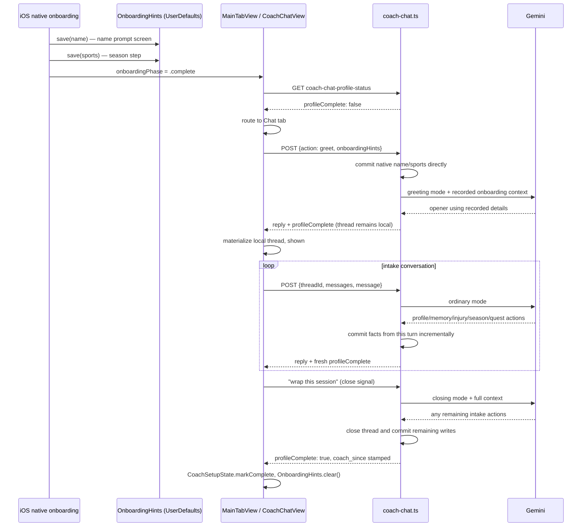

# Coach Chat — First Session Protocol

> Status: Current · Owner: Tech Lead · Verified: 2026-08-31

## Context

The one-time intake conversation that fills the split profile, memory, injury, season, and quest
records for a brand-new athlete. Same backend endpoint and mechanics as day-to-day chat (see
[`coach-chat-daily.md`](coach-chat-daily.md)) — focused prompt instructions and a client-side
routing layer make sure a not-yet-intake'd athlete actually lands here. Reliability redesign
shipped as #431/#432/#434: incremental writes as facts are given (not batched at close), and the
End Conversation button gated on live completion state rather than thread existence.

Trigger: `isAthleteProfileComplete()` reads false. Completion requires a full profile, sports,
and a current season — see "Completion signal" below for the exact check.

### 1. Native onboarding hands off deterministic fields

`ios/CoachHQ/CoachHQ/Views/PersonalizeView.swift`'s name prompt and
`ios/CoachHQ/CoachHQ/Views/OnboardingRevealFlow.swift`'s sports step cache
what they collect locally via `OnboardingHints` (UserDefaults, no TTL). The first greet sends
those fields to the backend, which writes name to `profile.json` and sports to
`memory.json` in a dedicated atomic commit before Gemini runs. Gemini receives the same values as
same-request context so its opener can use the athlete's name without waiting for a second repo
read. The native flow does not collect a goal; Coach always asks that in chat. If hints are
absent, the protocol asks for the missing fields normally.

### 2. Routing: live check, not thread existence

`CoachSetupBootstrap.shouldOpenChatFirst()` (`ios/CoachHQ/CoachHQ/Services/CoachSetupState.swift`)
decides Chat vs Home on every launch while the local Keychain flag (`CoachSetupState`) is still
false. It calls `GET coach-chat-profile-status` live — **not** "does any thread exist," which
would be wrong (a thread existing has never meant the intake actually finished).
Wired into `MainTabView.swift`'s `.task` block, right after the native-onboarding-complete guard.
Network failure/timeout (5s cap) falls back to Home rather than trapping a returning athlete in
Chat.

Once `profileComplete: true` comes back (from the live check or any greet, ordinary, or closing
response), `CoachSetupState.markComplete()` flips the Keychain flag (fast path for all future
launches — no more network call) and `OnboardingHints.clear()` removes the now-unneeded cached
hints.

### 3. The intake conversation itself

First Session uses the same endpoint as day-to-day chat, with two narrow server differences:
`handleGreet()` commits native onboarding fields directly, and ordinary turns may commit FSP facts
before the conversation closes. `askGemini()`'s greeting-mode call includes
`onboardingHintsContext()` so the opener can use the just-recorded name and sports.
The prompt tells Coach not to re-ask or emit action fields for those recorded values.

The shared intake questions live in `B_engine.md`'s `s10_first_session_body` section. BYOB carries
that section inline; hosted chat receives the same section through
`platform/horcruxes/first-session.md`. Only recording differs: BYOB writes confirmed facts to the
split JSON files, while chat emits structured actions as each answer lands. Chat walks through:
warm intro → conversational intake → confirm → quest setup → transition. Each fact maps to a
structured action as it lands:
- Missing name → `profile_update`; missing sports → `sports_update`.
- Training frequency/fitness level → `memory_update` (`fitness_baseline`).
- The 3-6 month goal → `quest_create`'s `main_quest` (`memory.json` has no goal field — issue
  #408 moved that meaning to seasons/quests).
- Upcoming events and a rough season timeline → `season_start` (no `phase` field, Part 2 dropped
  it).
- Injuries → `injury_flag` for a brand-new one (server mints the id), `injury_event` to
  update/resolve one already on file (its real `flag_id`).
- Date of birth/height/weight/city → `profile_update` (`dob`/`height_cm`/`weight_kg`/`timezone`).
- Habit quests → `quest_create`'s `quests[]`.

While the profile is incomplete, each ordinary turn commits any profile, memory, injury, season, or quest
writes it produced in a small atomic commit. Day-to-day chat remains write-on-close. The closing
turn still commits the thread and any remaining writes through the normal close path.
`season_start`/`quest_create` are explicitly scoped in the prompt text to first-session/
new-athlete onboarding only, never for a returning athlete's season or quest changes.

### 4. Resumability

If the athlete answers a few intake questions and kills the app, the thread never closed
(`session_closed` never went `true`), so the server has **no committed copy of the thread** or its
opener. The facts already gathered are safe: greet commits native fields and each ordinary FSP
turn commits its structured intake writes. The conversation transcript itself remains client-side
until close.

What restores the conversation is a client-side cache, not the server, on **both platforms**:
- **iOS**: `CoachChatView` mirrors the thread's message array to `CoachChatLocalCache`
  (`ios/CoachHQ/CoachHQ/Services/CoachChatLocalCache.swift`), keyed by repo + thread id, in
  `UserDefaults`, after every append.
- **Web**: `CoachChat.tsx` does the same into `localStorage` (`coachChatModel.ts`'s
  `saveThreadLocally`/`restoreThreadMessagesLocally`/`clearThreadLocally`), keyed by thread id.

Since a fully local thread (the normal state until close) never has a server counterpart to
match against, restore does three things on load, not just one:
1. Overlay the local cache onto any *server-known* thread whose cache has more messages than the
   server copy (a thread whose close-commit landed but a stray local cache entry is still lying
   around).
2. **Scan for orphaned local cache entries** — a thread id cached locally that never made it into
   the server's list at all — and materialize each one as its own thread. An orphaned thread never
   had a server-computed `createdAt`/`dayOffset` — both platforms recover a real creation time from
   the divider message's own id (`d-<epoch-ms>`, already embedded by construction) rather than
   defaulting to "today."
3. **Drop a stale unreplied greeting** rather than restoring it: if an orphaned thread is still
   just Coach's opener with no athlete reply, and its recovered day offset shows it's from a
   *past* day, there's nothing in it worth keeping. Its cache entry is cleared and it's simply not
   materialized. A same-day unreplied greeting is untouched by this.

`shouldOpenChatFirst()` still sees `profileComplete: false` and routes back to Chat on relaunch;
`todayThread`/`ensureTodayThread` select the restored local thread directly rather than calling
`greetNow()`/`greet()` again. The cache for a thread is dropped once its close-commit actually
lands and the server copy becomes truth.

This is single-device only, by design — it does not sync the in-progress window across devices
(issue #222 §D). A relaunch on a *different* device mid-conversation sees nothing for that thread
at all until it closes.

### 5. Completion signal

`isAthleteProfileComplete()` (`ui/api/coach-chat/_lib/coachChatFiles.ts`) requires non-blank
`profile.json` values for name, date of birth, timezone, height, and weight; at least one sport;
and a `seasons.json.current_season_id` that names an existing season. Quests are optional.
`coachTurn.ts` computes `profileComplete` by projecting this turn's profile, memory, and season
writes onto the pre-turn objects in memory, rather than relying on a stale snapshot or another
GitHub read (`turnWrites/profileWrite.ts`'s `projectProfileCompletion`). This is what gates
`coach_since` stamping (ADR 0018) and initial workout template generation
(`generateInitialTemplates`) on the real false→true transition.

`isFirstSessionRitualDone()` additionally requires `quests.main_quest` to be set — `main_quest` is
meant to be set exactly once per athlete, so this naturally resolves to `false` forever once it's
ever set, matching `isAthleteProfileComplete()`'s own per-field behavior. This is the fix for a
live-tested gap. An athlete stating habit quests on the same turn that completed their profile
used to see `quest_create` never fire, because the old single completion check had already stopped
injecting First Session prompt context by then.

## Done when

Ordinary First Session facts commit through constrained actions as they are confirmed, not
reconstructed at close; a not-yet-intake'd athlete always lands back in the same in-progress First
Session thread on relaunch, never re-asked what they already answered.

## Related files

| File | Role |
|---|---|
| `platform/soul/B_engine.md` §10 | First Session Protocol prompt content (`s10_first_session_body`) |
| `platform/horcruxes/first-session.md` | Same section, hosted-chat build |
| `ui/api/coach-chat/_lib/fspWrites.ts` | Restricts ordinary-turn persistence to incremental FSP writes |
| `ui/api/coach-chat/_lib/onboardingWrites.ts` | Normalizes native onboarding hints, suppresses duplicate greet commits |
| `ui/api/coach-chat/_lib/turnWrites/profileWrite.ts` | `projectProfileCompletion` — the false→true completion projection |
| `ios/CoachHQ/CoachHQ/Services/OnboardingHints.swift` | Locally cached native name/sports handoff |
| `ios/CoachHQ/CoachHQ/Services/CoachSetupState.swift` | Keychain flag + `shouldOpenChatFirst()` |
| `ios/CoachHQ/CoachHQ/Services/CoachChatLocalCache.swift` | UserDefaults resumability cache, orphaned-local-thread restore |
| `ios/CoachHQ/CoachHQ/Views/OnboardingRevealFlow.swift` | native onboarding, season step |

Full turn-lifecycle module index: [`coach-chat-daily.md`](coach-chat-daily.md)'s appendix.
