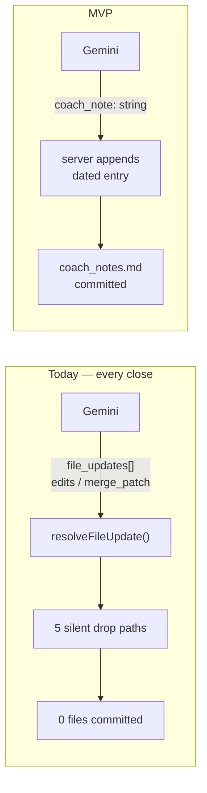

# Coach commit MVP — one file, append-only

**Owner:** Skanda · **Split 1 of 2** (Split 2 = ledger simplification + full intent schema, Akash)

## Context

Closes are not saving. Forensic audit of `coach-skanda-2003`, 30 days: **5 close commits, 0 wrote a
coach file** — only `chat_history.json` landed each time. `coach-akash-suresh` shows the same shape.
Real training conversations, lost. Three candidate causes remain and we can't yet tell them apart:

1. edits rejected — `old_string` didn't match `state.md` exactly (`applyStringEdits`)
2. merge patch rejected — malformed RFC 7396 string for `challenge_v2.json` etc.
3. current content missing — `resolveFileUpdate` drops every markdown/JSON update when
   `currentContent === undefined` (`ui/api/coach-chat.ts:823`), regardless of what Gemini proposed

## Decision

Shrink the write path to **one file, one field, append-only** — a shape immune to all three causes
at once. If a close still fails to save after this, the fault is upstream of `resolveFileUpdate`
entirely, which is a far smaller search space.

Append needs no exact match, no patch parse, and no prior file content — so none of causes 1-3 can
reach it. `file_updates` stays in place and untouched for this PR; it simply keeps behaving as it
does today.

## Prerequisites (do these first — both are small)

1. **Stop the silent drops.** Four branches in `resolveFileUpdate` (`ui/api/coach-chat.ts:819-855`)
   `return null` with no log: the `isCoachWritable` check, `!update.edits`, `!update.merge_patch`,
   and blank session content. Add a `console.warn` naming the reason to each. Without these we stay
   blind, and a drop for an unwritable path is currently indistinguishable from "Gemini proposed
   nothing."
2. **Make the commit branch configurable.** `ui/api/coach-chat.ts:1199` hardcodes `branch: "main"`.
   `commitFilesAtomic` already takes `branch` as a parameter, so this is a one-line change plus an
   env read — `COACH_CHAT_BRANCH`, defaulting to `main`. Testing cannot otherwise avoid writing to a
   live athlete's `main`.

## Build

- Add `coach_note: { type: "string" }` to the `responseSchema` in `askGemini` (`coach-chat.ts:404`).
- Closing-turn prompt: ask for a short plain-English note of what actually happened this session.
  Delete nothing else from the prompt yet.
- Server-side: append `\n\n## <YYYY-MM-DD>\n<coach_note>` to `user_data/coach/coach_notes.md`,
  fetching current content at commit time (not from the model). Include it in the same
  `commitFilesAtomic` batch as `chat_history.json` — one atomic commit, per ADR 0012.
- Response shape to web/iOS is **unchanged**. No client work in this PR.

## Local setup

`npm run dev:api` (`ui/scripts/local-api-server.mjs`, port 3001) runs the real `ui/api/*` handlers
with secrets read from `ui/.env.local` — not `vercel dev` (see #63). Needs `GEMINI_API_KEY` plus the
GitHub App vars in `docs/eng-docs/env-vars.md`. Set `COACH_CHAT_BRANCH` to a scratch branch.

## Done when

- Three consecutive real closes each append a dated entry to `coach_notes.md` on the test branch,
  each in one commit alongside `chat_history.json`. Three, not one — this is a reliability bug.
- Every dropped update in the logs carries a named reason; no silent drops remain.
- `npm run test` and `npm run eval:coach-chat` pass.

## Interface contract with Split 2

`coach_note` is the **first instance of the intent schema**, not a one-off — Split 2 extends this
shape rather than replacing it. Field names locked here so the two splits don't collide:

| Field | Writes | Split |
|---|---|---|
| `coach_note: string` | `coach_notes.md` (append) | 1 — now |
| `session_note: string` | `state.md` Recent Session Notes (rolling) | 2 |
| `quest_events: [{quest_id, date, status}]` | `challenge_v2.json` | 2 |
| `sleep: {date, hours}` | `state.md` Sleep Log **and** `sleep_log.json` | 2 |

## Deferred

- P2 — remaining coach files behind the same intent pattern → Split 2.
- P2 — `platform/soul/B_engine.md` §12 still instructs 8 paths the server allowlist rejects
  (`roadmap.md`, `gen/quest_log.md`, `archive/**`). Rewrite belongs to Split 2, not here.
- P3 — background commit + client polling (`ASYNC-CLOSE-PLAN.md`). UX, not reliability.

## Scope guard

No extra files. No `challenge_v2.json` redesign. No client changes. No SOUL §12 rewrite. Anything
else that surfaces → P2/P3 line item, not code.
