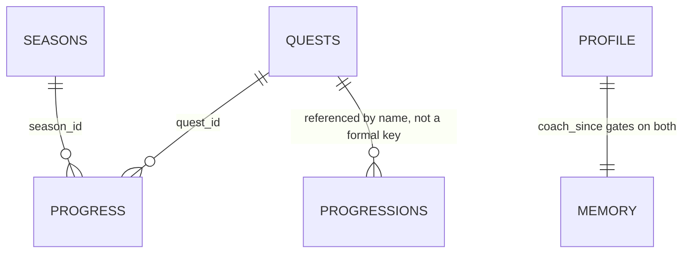

# Coach data schema — every file, every enum

> Status: Current · Owner: Tech Lead · Verified: 2026-09-11

## Context

The coach-chat/SOUL redesign replaced `state.md`/`coach_notes.md`/`challenge_v2.json` with a set
of small typed JSON files. There was never a single reference doc listing every file, every
field, and every enum in one place — just the TypeScript in `ui/api/coach-chat/_lib/`. This doc
is a faithful prose+table rendering of that TypeScript, sourced directly from
`coachMemoryFiles.ts`, `coachQuestFiles.ts`, `coachWeekFiles.ts`, `coachWorkoutFiles.ts`,
`workoutSchema.ts`, and `coachChatFiles.ts`. Those files stay the source of truth; this doc
should be re-verified against them whenever one changes.

## Files Coach owns or reads

### `user_data/coach/profile.json`

Athlete identity fields. Written by `turnWrites/profileWrite.ts` (`buildProfileUpdateWrite`).

| Field | Type | Notes |
|---|---|---|
| `version` | `1` | |
| `coach_since` | `string \| null` | ADR 0018 — write-once day-number anchor, stamped on the First Session Protocol's false→true completion transition |
| `name` | `string` | |
| `dob` | `string \| null` | |
| `timezone` | `string` | IANA timezone string |
| `height_cm` | `number \| null` | |
| `weight_kg` | `number \| null` | |

### `user_data/coach/memory.json`

Sports and Coach's labelled free-text notes. Written by
`turnWrites/memoryWrite.ts` (`buildMemoryFileWrite`).

| Field | Type | Notes |
|---|---|---|
| `version` | `1` | |
| `_meta` | `{updated_at, updated_by, trace_id}` | |
| `sports` | `string[]` | |
| `coaching_style` | `"accountability" \| "encouragement" \| "analysis" \| null` | Set by First Session; changeable via `coaching_style_update` |
| `notes` | `Record<MemoryNoteLabel, MemoryNote>` | |

**`MemoryNoteLabel` enum** (`MEMORY_NOTE_LABELS`, fixed set): `fitness_baseline`,
`coaching_priorities`, `learned_patterns.training`, `learned_patterns.nutrition`,
`learned_patterns.mental`, `equipment`.

**`MemoryNote` shape:** `{ text: string; updated_at: string; trace_id: string }` (text max 1500 chars — `engine/lib/text-caps.mts`).

### `user_data/coach/injuries.json`

Open/resolved injury flags. Written by `turnWrites/injuryWrite.ts` (`buildInjuryEventWrite`).

| Field | Type | Notes |
|---|---|---|
| `flags` | `InjuryFlag[]` | |

**`InjuryFlag` shape:** `{ id, text, status: "active" \| "resolved", opened_at, resolved_at: string \| null }` (text max 500 chars — `engine/lib/text-caps.mts`).

### `user_data/coach/coach_log.json`

Rolling session continuity log — replaced `state.md`'s narrative sections and `coach_notes.md`.
Written by `turnWrites/coachNoteWrite.ts` (`buildCoachNoteWrite`), which calls `coachIntents.ts`'s
`applyCoachNote`.

Day-keyed, not append-only (C2): one row per calendar date. A `coach_note` on a day with an
existing row overwrites that row's `text`/`ts`/`trace_id` in place, reusing its `id`; a `coach_note`
on a new day appends a fresh row. `coach_note` is available on every ordinary turn (see
`gemini-flow.md`'s Action-field table). It is required whenever the same reply also sets
`profile_update`, `memory_update`, `injury_flag`, `injury_event`, `quest_event`, `quest_create`, or
`season_start`. `coachTurn.ts`'s `missingRequiredCoachNote` corrective-retry check enforces this,
the same mechanism `findOversizedTextField` already used for the text-cap reprompt.

| Field | Type | Notes |
|---|---|---|
| `version` | `1` | |
| `rows` | `CoachLogRow[]` | |

**`CoachLogRow` shape:** `{ id, date, ts, type: "chat", text, trace_id }` (text max 2000 chars — `engine/lib/text-caps.mts`) — `type` is currently
always `"chat"`; `"phase_close"`/`"week_close"` row types are a deferred, documented-only item
(needs an archive-folding decision first - tracked in issue #575).

### `user_data/coach/latest_message.json`

The athlete-owned delivery record for the latest proactive Coach message (ADR 0029). It is
separate from the expiring weekly `coach_read` and private continuity in `coach_log.json`.
A fresh carve seeds `{ "schema_version": 1, "message": null }`.

| Field | Type | Notes |
|---|---|---|
| `schema_version` | `1` | |
| `message` | `LatestCoachMessage \| null` | A successful newer sync batch replaces the prior message; failure leaves it untouched |

**`LatestCoachMessage` shape:** `{ id, created_at, activity_ids, body, conversation_seed_id }`.
`activity_ids` is the sorted source-qualified synced batch and defines idempotency. The optional
`home.coachMessage` widget-snapshot projection carries `id`, `created_at`, `body`, and
`conversation_seed_id`; this file remains canonical.

`conversation_seed_id` is `local-proactive-<id>` only when no `chat_history.json` thread exists
yet for this batch (a genuinely backgrounded sync). When one does — the common case, since
activity-sync turns persist immediately (#918) — it is that thread's real id (`t-<epoch ms>`)
instead, so notification/Home/chat all open the exact same conversation. Both shapes are valid;
a reader must accept either, not assume the `local-proactive-` prefix.

### `user_data/coach/chat_history.json`

Threads Coach Chat persists. Activity-sync turns write immediately (not on close). A Coach
message may carry `attachments`. M0 kind:

`synced_activity_list` `{ version: 1, batch_id, activities[] }`

`batch_id` is the first 16 hex of sha256 of the sorted unique activity ids, canonicalized to
`healthkit:<UUID>`/`strava:<id>` first (`/api/coach-chat`'s `hk:<uuid>` request format and
`/api/coach-message`'s `healthkit:<UUID>` format must hash to the same batch id for the same
sync - `canonicalSyncActivityId` in `activitySync.ts`, #918). Rows:
`id, title, sport, start, duration_s, load`. Server rereads `user_data/activities/hist/`;
Gemini cannot set these. Unknown kinds/versions are ignored, never fatal. Tap a row opens
Activity Detail by `id`.

### `user_data/ledger/seasons.json`

Written by `turnWrites/seasonWrite.ts` (`buildSeasonStartWrite`) via the `season_start` action
field — available to every athlete, first session or returning (B3), always bundled with its
`main_quest`. A prior "active" current season resolves to `"retired"` (started early) or
`"completed"` (started after its own `end_date`) in the same call.

| Field | Type | Notes |
|---|---|---|
| `version` | `1` | |
| `_meta` | `{updated_at, updated_by, trace_id}` | |
| `current_season_id` | `string \| null` | |
| `seasons` | `Season[]`, newest-first | |

**`Season` shape:** `{ id, name, start_date, end_date, status: "active" \| "completed" \| "retired" }`.

### `user_data/ledger/quests.json`

Written by `turnWrites/questWrite.ts` (`buildQuestEventWrite`, `buildQuestCreateWrite`) and
`turnWrites/seasonWrite.ts` (`buildSeasonStartWrite`) — `quest_create` (habit quests only) and
`season_start` (goal only, via its `main_quest`) are both available to every athlete now (B3), not
just First Session. `main_quest` only ever changes together with a season change; there is no
standalone way to set it. The outgoing season's own `main_quest` moves into `quests[]` as
`"retired"` in the same commit that starts the new season.

| Field | Type | Notes |
|---|---|---|
| `version` | `1` | |
| `_meta` | `{updated_at, updated_by, trace_id}` | |
| `weekly_targets` | `Record<string, WeeklyTarget>` | |
| `main_quest` | `MainQuest \| null` | set only via `season_start`, never `quest_create` |
| `quests` | `Quest[]` | side quests, plus any retired former `main_quest` entries |

**`QuestType` enum:** `"daily_streak" \| "progress" \| "count_target" \| "weekly_frequency"`.
**`MainQuest` shape:** `{ id, name, type: QuestType, target, count_pattern?, season_id }` —
`season_id` (B3) links it to the season it belongs to.

**`Quest` shape:** `{ id, name, type: QuestType, start_date, end_date: string \| null, status: "active" \| "graduated" \| "retired", polarity?: "default_done" \| "default_not_done" (daily_streak only), target?, unit? (progress only), source: "model" \| "athlete" }`.

**`WeeklyTarget` shape:** `{ target, source?: "quest", quest_id? }`.

### `user_data/ledger/progress.json`

Append-only quest completion rows. Written by `turnWrites/questWrite.ts`.

| Field | Type | Notes |
|---|---|---|
| `version` | `1` | |
| `rows` | `ProgressRow[]` | |

**`ProgressRow` shape:** `{ id, quest_id, season_id, date, status: "completed" \| "missed" \| "excused", value: number \| string \| null, source: "model" \| "pipeline" \| "athlete", ts, trace_id }`.
`source: "pipeline"`/`"athlete"` have no confirmed real writer today — tracked in #565.

### `user_data/ledger/progressions.json`

Tracked progression values (e.g. strength benchmarks). Rendered into the prompt as "Milestones."

| Field | Type | Notes |
|---|---|---|
| `version` | `1` | |
| `_meta` | `{updated_at, updated_by, trace_id}` | |
| `progressions` | `Progression[]` | |

**`Progression` shape:** `{ id, name, current, target, unit: string \| null, history: ProgressionHistoryEntry[] }`.
**`ProgressionHistoryEntry` shape:** `{ date, value, trace_id }`.

### `user_data/ledger/current_week.json`

The dated week plan. ADR 0042 collapsed the write side to one action field, `week_update`, sent
as either a full seven-day kickoff or a sparse per-day/per-session patch — see
`docs/ref-docs/current-week-contract.md` for the full wire contract. Written by
`turnWrites/weekWrite.ts` (`buildCurrentWeekWrite`), which wraps `coachWeekFiles.ts`'s
`applyWeekUpdate`. Two more writers exist outside chat entirely, both in the sync pipeline, not
chat-triggered: `engine/scripts/reconcile-current-week.mjs` (matches synced activities to planned
sessions, no model call) and `engine/scripts/rollover-current-week.mjs` (replaces an aged-out
week with a fresh placeholder frame). Strict schema owned by `engine/lib/current-week.mts`
(`parseCurrentWeek`) — every write here is validated against it before being committed; a
violation throws rather than commits.

Top-level shape: `{ schema_version: 1, data_status: "live", timezone, week: {id, start_date,
end_date, focus, guardrails[]}, coach_read: {headline, body, valid_from, valid_until}, days:
CurrentWeekDay[], updated_at, updated_by, trace_id }`.

`data_status` is `"placeholder"` or `"live"` only — `"draft"` and the root `coach_comments` field
were both dropped (ADR 0042), and each session's `planned_load` was dropped with it. `updated_by`
is `"model"` (hosted chat), `"coach"` (BYOB Claude Code), `"reconciler"`, or `"rollover"`.

**`CurrentWeekSession.discipline` enum (ADR 0042):** `"badminton" \| "calisthenics" \| "cycling" \|
"foundation" \| "recovery" \| "run" \| "strength" \| "weight_training" \| "hike" \| "walk" \|
"cricket" \| "football" \| "workout" \| "swim" \| "other"` — closed, not free text.
**`CurrentWeekSession.priority` enum:** `"anchor" \| "support" \| "optional"`, `null` only for an
`unplanned`-origin session.
**`CurrentWeekSession.status` enum:** `"planned" \| "done" \| "skipped"`.
**`CurrentWeekSession.origin` enum:** `"planned" \| "unplanned"` — `"unplanned"` only ever comes
from a real completed-but-not-planned workout (a `week_update` kickoff always writes `"planned"`;
the reconciler is what writes `"unplanned"`, for a logged activity with no planned match).

### Workout templates and sessions (`user_data/activities/workout_plans/`)

Structural shape validated at runtime by `workoutSchema.ts`'s `validateWorkout()` — see that
file's own header comment for why it exists as a runtime guard, not just a test helper. Written
via `turnWrites/workoutWrite.ts` (`buildTemplateEditWrite`, `buildSessionPlanWrite`) and
`coachWorkoutFiles.ts` (`generateInitialTemplates`, post-First-Session-completion).

**`Workout.workout_type` enum:** `"foundation" \| "strength" \| "recovery" \| "realign" \| "calisthenics"`.
**`Exercise.type` enum:** `"timed" \| "reps"` — a `timed` exercise requires `duration_secs` and
forbids `reps`; a `reps` exercise is the reverse.

Top-level `Workout` fields: `id, title, subtitle, session_date?, based_on_template?,
workout_type, estimated_duration_mins, location, equipment[], coaching_note, phases: Phase[],
shoulder_modification?, progression_notes?, _meta?`.

`Phase` fields: `name, duration, default_rest_secs, transition_rest_secs?, optional?,
coaching_note?, exercises: Exercise[], circuit?, rounds?`.

`Exercise` fields: `num, name, type, duration_secs?, reps?, sets, rest_between_sets_secs?,
rest_after_exercise_secs?, prep_secs?, optional?, both_sides?, form_cue, why`.

Exercise `num` must be strictly ascending and unique across all phases in a workout.

### `gen/athlete_insights.json`

Pipeline-generated, read-only from coach-chat's side. Feeds the "Fitness Snapshot" prompt
section. `fitnessSnapshotSection()` guards on `schema_version === 1` and a parseable
`generated_at` before trusting the file; either one missing/invalid omits the section.
`engine/scripts/generate-athlete-insights.mjs` stamps `schema_version: 1` on every write.

| Field | Type |
|---|---|
| `schema_version` | `1` (literal) |
| `generated_at` | `string` |
| `window_days` | `number` |
| `sports` | `Record<string, AthleteSportInsight>` |

**`AthleteSportInsight` shape:** `{ sessions_365d, sessions_per_week_recent_4w,
sessions_per_week_prior_12w, longest_gap_days_365d, days_since_last_session,
duration_buckets }` — session metrics are numbers. `duration_buckets` is
`{ under_30m, 30_to_60m, 60_to_120m, over_120m }`, counts of sessions in the window by
`elapsed_time` seconds (`<1800`, `1800–3599`, `3600–7199`, `≥7200`). Sessions with missing
or non-numeric `elapsed_time` are omitted from the histogram only — they still count in
`sessions_365d`.

**`sports` keys are normalized `sport_type` values** — lowercased, with camelCase split on `_`
(`WeightTraining` -> `weight_training`). The activity `category` field is a **sub-tag within** a
sport (`RNK`/`FRN`/`CAS` are all Badminton; `CAL`/`FDN` are both WeightTraining). It's
deliberately **not** part of the key — bucketing on it shatters one sport across several buckets
(#459).

## What Gemini gets as input

Every turn, `loadCoachContext()` (`coachChatFiles.ts`) fetches all nine files above (profile,
memory, injuries, coach_log, seasons, quests, progress, progressions, athlete_insights) in
parallel, cached 60s in-memory per repo. `coachContext.ts` then renders two prompt blocks from
that data:

- **`renderCoachContext()`** — Athlete Profile, Equipment, Recent Session Notes (last 5
  `coach_log.json` rows), Fitness Snapshot (from `athlete_insights.json`, omitted entirely if
  absent/malformed), Fitness Baseline, Active Injury Flags, Coaching Priorities, Learned
  Patterns.
- **`renderQuestContext()`** — Current Season, Main Quest, Side Quests (progress computed
  per-quest, scoped to the current season and, for `weekly_frequency` quests, the current ISO
  week), Weekly Targets, Milestones (from `progressions.json`).

The static persona/instruction/few-shot half of the prompt is separate from this per-athlete
dynamic half — see `gemini-flow.md` for the caching split.

## What Gemini can write (`GeminiReply` action fields)

Every field on `GeminiReply` (`coachReplySchema.ts`) is filtered per turn mode by
`responsePropertiesFor()` — the response schema structurally omits any field the current
mode/session-state combination shouldn't expose, rather than just discouraging it in prose.

C1 removed the closing-turn concept entirely — there is no more ordinary/closing split, and
`session_closed` is gone from the schema. Every returning-athlete turn now exposes the same full
field set.

| Mode | Fields exposed |
|---|---|
| Greeting | none (plus always `reply`) |
| Activity sync | none |
| Returning | `coach_note`, `memory_update`, `coaching_style_update`, `sports_update`, `injury_flag`, `injury_event`, `quest_event`, `profile_update`, `season_start`, `quest_create`, `template_edit`, `session_plan`, `week_update`, plus `pending_clarification`/`unrecorded_facts` (see below) |
| First Session | `coach_note`, `memory_update`, `coaching_style_update`, `sports_update`, `injury_flag`, `injury_event`, `profile_update`, `season_start`, `quest_create`, plus `pending_clarification`/`unrecorded_facts` (see below) |

`coach_note` (C2) is a day-keyed row, not the old closing-only append — see the
`coach_log.json` section above.

Each field's write path — which `turnWrites/*.ts` file consumes it, which JSON file it lands in —
is documented in [`turnWrites/README.md`](../../ui/api/coach-chat/_lib/decide/turnWrites/README.md); this
doc doesn't restate that table, it's the source.

`profile_update.field` enum: `"name" \| "dob" \| "timezone" \| "height_cm" \| "weight_kg"`.
`injury_flag` is new-injury-only — an array of `{text}`, no id, the server mints one. `injury_event`
is update/resolve-only — an array of `{status, flag_id, text?}`; `flag_id` is required (a real id
from Active Injury Flags), `status` enum: `"active" \| "resolved"`. `quest_event.status` enum:
`"completed" \| "missed" \| "excused"`. `season_start`/`quest_create` are available to every
athlete, First Session or returning (B3) — a season change and its goal always move together, one
atomic action.

**`season_start` shape:** `{ name, start_date, end_date, main_quest, new_habits }` — all five
fields required, not just `main_quest`. `main_quest`: `{ name, type: QuestType, target,
count_pattern? }`, `name`/`type`/`target` required (the server mints `id` and stamps `season_id`
onto it — see `MainQuest` above). `new_habits`: `HabitQuest[]`, required but may be `[]` when no
habit was mentioned — Gemini must explicitly address it every time `season_start` fires (#808),
the same structural guarantee `main_quest` already had. A goal and a new daily habit stated in
the same message both go here, not through `quest_create` (that field is for a habit stated with
no season change at all).

**`HabitQuest` shape** (used by both `season_start.new_habits` and `quest_create.quests`):
`{ name, type: QuestType, polarity?: "default_done" \| "default_not_done", target?, unit? }` —
`name`/`type` required, the rest optional per `QuestType`.

**`quest_create` shape:** `{ quests: HabitQuest[] }` — habit quests only; the main goal moved to
`season_start.main_quest`, so there is no field here to set it anymore.

**`pending_clarification`** (Bug 3, string, optional) — a same-pass self-report of any open
either/or question the reply itself left unanswered. Persisted via `coach_log.json` the same way
`coach_note` is, and checked next turn (`findUnconfirmedAssumption` in `coachTurn.ts`) before any
action field that touches the same session is allowed to commit — see `chat-llm-seam.md` and
`coachTurn.ts` for the full mechanism. Not a write action; nothing in `turnWrites/` consumes it
directly.

**`unrecorded_facts`** (Finding D mitigation, `string[]`, optional) — a same-pass self-audit
listing any concrete fact from the athlete's message that this reply's own action fields failed to
record. Drives a one-shot corrective reprompt in `requestCoachReply` (`coachTurn.ts`); not a write
action itself. Declared last in the schema, after `reply`, since it audits `reply`'s own text too.

## File relationships

`progress.json` rows are the only place `season_id` and `quest_id` co-occur — a quest reused
across seasons doesn't leak progress between them because every count in `renderQuestContext()`
filters by both ids together, not `quest_id` alone.
