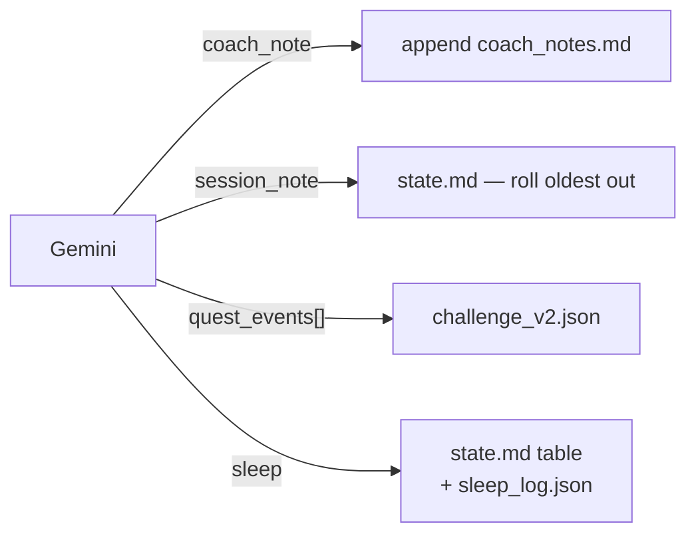

# Coach intent schema — model reports, server writes

**Owner:** Akash · **P1 of 3** (P0 = `coach-commit-mvp.md`, Skanda · P2 = `ledger-split-plan.md`)

## Context

Today the model must produce the write itself: an exact-match `old_string` copied character-for-
character out of a 14KB `state.md`, or an RFC 7396 merge patch encoded as a JSON string. Both fail
silently. Audit of `coach-skanda-2003`: 5 closes, 0 files saved.

P0 proves the fix on one file — the model says what happened, the server writes it. P1 applies the
same move to every remaining coach file.

## Decision

Model emits facts. Server owns all mechanics.

| Field | Shape | Server does |
|---|---|---|
| `coach_note` | string | Append dated entry (shipped in P0) |
| `session_note` | string | Drop oldest of 3, add newest |
| `quest_events` | `[{quest_id, date, status}]` | Apply per quest type, stamp `last_updated_*` |
| `sleep` | `{date, hours}` | Write **both** files — pairing can't be half-done |

No `old_string` anywhere. No merge patch anywhere. No field requires the model to have seen the
file's current content.

## What gets deleted

- `applyStringEdits` / `applyJsonMergePatch` call sites for these four files (`ui/api/_lib/fileEdits.ts`).
- The "How to propose a file change" prompt block, `ui/api/coach-chat.ts:602-624` (~20 lines).
- `platform/soul/B_engine.md` §12's git commands and pre-commit checklist. It names 8 paths the
  server allowlist rejects (`roadmap.md`, `gen/quest_log.md`, `archive/**`) — dead since ADR 0021.
  Rewrite as: reflect, report, confirm. Recompose via `platform/scripts/compose-soul.mjs`.

## Prerequisite

`gen/quest_log.md` renders quest **names**, not ids (`engine/scripts/generate_quest_log.py:542`).
`quest_events` needs ids. Add an id column there first — then the closing turn no longer needs
`challenge_v2.json` in its prompt at all.

Closing fetch drops from 5 files to 2 (`state.md` + `quest_log.md`). That kills the
`currentContent === undefined` drop path (`coach-chat.ts:823`) outright, and cuts the largest
prompt in the system.

## Done when

- One close writes `state.md`, `challenge_v2.json`, `sleep_log.json`, `coach_notes.md` correctly.
- A quest tick lands from `quest_events` alone — no merge patch in the response.
- Sleep reported once updates both files. Verified by grep, not by trusting the model.
- Closing prompt token count drops measurably (`[coach-chat] Gemini usage:` log line).
- `npm run test` and `npm run eval:coach-chat` pass. Golden transcripts updated to the new schema.

## Deferred

- P2 — `current_week.json` stays on `merge_patch`. Genuinely judgment-heavy (session identity,
  provenance, schema v1). Needs its own intent design, not a rushed field.
- P2 — `injury_flags` stays free-form for now. Same reason.
- P3 — Gemini function-calling so the coach reads data on demand instead of pre-loaded files.
  Attacks prompt size, costs round trips. Own ADR.

## Scope guard

Four fields. No ledger restructuring — that's P2, and it must not start until this lands, or every
ledger change becomes a prompt change too.
