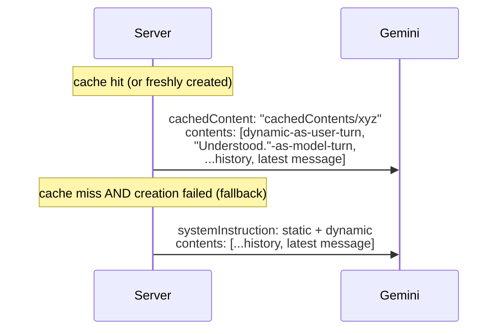

# Gemini integration — how it works

## Context

Everything Gemini-specific was scattered across `coach-chat-flow.md`'s prompt section,
`llm-provider-current.md`'s cost/rate-limit numbers, and code comments. This is the one
reference for the Gemini call itself — model, prompt shape, caching, retries, response schema —
the same way `coach-chat-flow.md` is the one reference for the request lifecycle around it.

## Model and endpoint

`gemini-flash-latest` (Google's maintained alias — dated model ids keep getting sunset early;
see `coach-chat.ts:46-51`), called via raw `fetch` to `generateContent`, no SDK
(`GEMINI_API_KEY` env var). One call per turn, no streaming (issue #270).

## Prompt shape: static prefix + dynamic block

```mermaid
flowchart LR
    subgraph static["Static (cached, one entry for every athlete)"]
        persona["persona\nSOUL.md, ~13K tok"]
        instr["fixed instructions\n+ reasoning-field cue"]
        examples["3 few-shot examples"]
    end
    subgraph dynamic["Dynamic (fresh every call)"]
        state["state.md + quest_log.md\n(+ closing files on close turns)"]
        mode["mode-specific instructions\ngreeting / ordinary / closing"]
        format["file-edit-format\n+ commit-message instructions"]
        ts["todayContextLine()\nchanges every minute"]
    end
    static -->|cachedContent name| call["generateContent"]
    dynamic -->|prepended to contents| call
    history["conversation history\n(last 40 msgs)"] --> call
```

`coach-chat.ts`'s `askGemini()` builds these as two separate strings (`staticSystemText()` and
`dynamicText`), not one array, because of a hard API constraint below.

## Caching: implicit (fallback) vs explicit (primary path)

**Implicit caching** (Gemini's automatic, on-by-default behavior for 2.5+ models) discounts any
byte-identical prefix it happens to have recently served, best-effort. This project relies on it
only as a fallback — see below — but the reason it works at all is prompt *ordering*: everything
stable comes before anything that varies per call, so a byte-identical prefix exists in the
first place. Minimum cacheable size is 2,048 tokens (Gemini 2.5 Flash); SOUL.md alone clears
that ~6x over.

**Explicit caching** (`ui/api/_lib/soulCache.ts`) is the primary path: the static prefix is
uploaded once via `POST /v1beta/cachedContents`, returning a `cachedContents/...` name. Every
subsequent call passes `cachedContent: <name>` instead of resending the text at all — cached
reads are billed at 10% of standard input rate, *guaranteed*, not best-effort. The cache is not
per-athlete: since the static prefix is byte-identical for everyone, one cache entry serves
every athlete's calls.

**Hard constraint that shapes the whole design:** Gemini rejects a `generateContent` request
that sets both `cachedContent` and `systemInstruction` — they're mutually exclusive. Once a
cache is active, the dynamic block has nowhere else to go, so it's prepended into `contents` as
a synthetic exchange instead:



The fallback path (no `systemInstruction`/`cachedContent` split) is exactly the prompt shape
this project shipped before explicit caching existed — a broken or unconfigured cache degrades
to that, it never blocks a reply.

### Cache lifecycle (`soulCache.ts`)

- Cache name + expiry + a content hash of the static text live in **Vercel Edge Config**
  (`EDGE_CONFIG` env var for reads via `@vercel/edge-config`; `EDGE_CONFIG_ID` +
  `VERCEL_API_TOKEN` for writes, since Edge Config has no write API of its own — only the
  Vercel REST API does).
- TTL is 2 hours, long enough to amortize a normal chat session, short enough not to go far
  stale after a SOUL redeploy (the content hash catches a change immediately regardless; TTL
  just bounds how long a stale-but-unhashed edge case could theoretically live).
- Fails open at every step: no `EDGE_CONFIG` configured, a failed create call, a failed write —
  any of these just means this request (and until the next successful create) falls back to the
  no-cache shape above. Coaching never blocks on cache plumbing.
- **Setup required** (operator action, not code): create a Vercel Edge Config store, connect it
  to the project, and set `EDGE_CONFIG_ID`/`VERCEL_API_TOKEN` in Vercel's env vars (prod +
  preview) for writes to persist across cold starts. See `docs/eng-docs/env-vars.md`.

## Reasoning field

`responseSchema` declares `reasoning` before `reply` (Gemini fills fields in declaration order).
OpenAI's structured-outputs guide reports a large accuracy gain on schema-shaped tasks from a
reasoning field ahead of the final answer, even for non-reasoning-first models like Flash. The
model briefly checks itself — is this genuinely a close, is every proposed file edit backed by
real content it was actually shown — before committing to `reply`. `askGemini()` deletes
`reasoning` from the parsed response before returning; it never reaches the athlete.

## Response schema

```json
{
  "reasoning": "string, stripped before return",
  "reply": "string, required",
  "session_closed": "boolean",
  "commit_message": "string",
  "title": "string, only on session_closed:true",
  "file_updates": [
    { "path": "string", "edits": [{ "old_string": "string", "new_string": "string" }], "merge_patch": "string", "content": "string" }
  ]
}
```

`file_updates` picks exactly one of `edits` (markdown, exact-match string replacement) /
`merge_patch` (JSON, RFC 7396) / `content` (session files, whole-new-file) per entry — see
`ui/api/_lib/fileEdits.ts` and `coach-chat-flow.md`'s Write strategy (A7) section.

## Retries, timeouts, rate limits

- `fetchWithTimeout` wraps the Gemini call with a 25s abort (`UPSTREAM_TIMEOUT_MS`,
  `coachChatFiles.ts`), sized to leave headroom under Vercel's function timeout.
- A 429 is surfaced as a typed error the client shows as "rate-limited, try again shortly" — see
  `coachChatModel.ts`'s `CoachChatRateLimitedError` / iOS's `UserFacingError.swift`. No
  server-side retry on the Gemini call itself (a 429 mid-generation isn't safely retryable the
  way a GitHub read is — the athlete just sees the message and tries again).
- Current account tier, verified rate limits, and cost projections live in
  `docs/eng-docs/llm-provider-current.md` — this doc covers mechanics, that one covers the
  numbers for this account specifically.

## Done when

- `npm run eval:coach-chat` passes against a live key after any prompt-construction change.
- A live call's `usageMetadata.cachedContentTokenCount` is nonzero on the second request in a
  session, confirming explicit caching is actually hitting (not just configured).

## Deferred

- P2: token-level streaming — issue #270, blocked on deciding how `reply` streams separately
  from the structured metadata fields.
- P3: cache invalidation is TTL + content-hash only, no active push on SOUL redeploy — acceptable
  given deploy frequency vs. the 2h TTL, revisit if that ratio changes.
