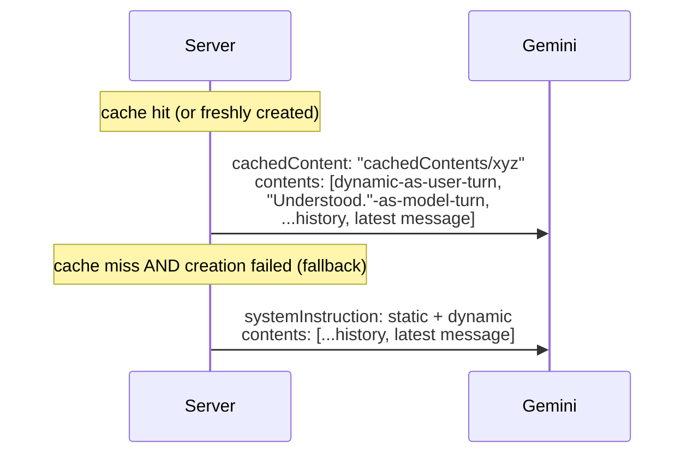

# Gemini integration — how it works

> Status: Current · Owner: Tech Lead · Verified: 2026-09-10

## Context

Everything Gemini-specific was scattered across `coach-chat-flow.md`'s prompt section,
`llm-provider-current.md`'s cost/rate-limit numbers, and code comments. This is the one
reference for the Gemini call itself — model, prompt shape, caching, retries, response schema —
the same way `coach-chat-flow.md` is the one reference for the request lifecycle around it.

## Model and endpoint

Chat runs `gemini-pro-latest`, pinned in `ui/api/_lib/geminiModel.ts:11`. Flash is the intended
model and the pin is temporary — #668 moved off it after capacity failures, not quality ones.
Called via raw `fetch` to `generateContent`, no SDK (`GEMINI_API_KEY` env var). One call per turn,
no streaming (issue #270).

`ui/api/coach-message.ts` no longer shares that model and key. It reaches the model through
`ui/api/_lib/llmClient.ts`, which picks one adapter per request from `LLM_PROVIDER`: the default
`gemini` is the same direct call described above, and `openrouter` sends the request to OpenRouter
instead (#713). Its separate message-only schema gets bounded repo-owned activity context,
including `effort_shape` but never raw HR points; it does not use chat actions, history, or the
explicit chat cache. `activitySyncTurn.ts`'s post-sync thread now generates its opening reply
through this same path (#918) instead of its own `askGemini()` call — activity_sync is no longer
one of the `askGemini()` modes above.

Chat moved onto `llmClient` too (#713 M2 PR 2). `coach-chat/_lib/gemini/geminiClient.ts`'s
`askGemini()` now only builds the prompt/request and parses the reply. The actual
`generateContent` call, the explicit soul cache, and the retry logic described below live instead
in `ui/api/_lib/llmAdapters/geminiAdapter.ts`, reached via `selectLlmAdapter` like every other
caller. `LLM_PROVIDER` stays unset/`gemini` in production throughout M2, so this is a plumbing
move, not a behavior change — chat's wire requests are unchanged. Template adjustment
(`coachWorkoutFiles.ts`'s `adjustTemplatesWithGemini`) moved onto `llmClient` too (#713 M2 PR 3) -
every direct-Gemini caller in the codebase now goes through `selectLlmAdapter`, none open their
own socket.

## Prompt shape: static prefix + dynamic block

```mermaid
flowchart LR
    subgraph static["Static (cached, one entry for every athlete)"]
        persona["persona\nSOUL.chat.md"]
        instr["fixed web-runtime instructions"]
        examples["2 few-shot examples"]
    end
    subgraph dynamic["Dynamic (fresh every call)"]
        state["split athlete + quest context\n+ optional Fitness Snapshot"]
        mode["mode-specific instructions\ngreeting / ordinary\n(no more closing mode - C1)"]
        schema["mode-specific response schema"]
        ts["todayContextLine()\nchanges every minute"]
    end
    static -->|cachedContent name| call["generateContent"]
    dynamic -->|prepended to contents| call
    history["conversation history\n(last 40 msgs)"] --> call
```

`geminiClient.ts`'s `askGemini()` builds these as two separate strings (`coachPromptText.ts`'s
`staticSystemText()` and `buildDynamicText()`). It hands them to the seam as
`LlmRequest.cachePrefix` (static) and `LlmRequest.system` (dynamic) — still two strings, not one
array, because of a hard API constraint below. Since #713 M2 PR 2, `askGemini()` itself no longer
knows whether the cache is actually active; that decision, and the resulting wire-shape split, is
`geminiAdapter.ts`'s.

## Caching: implicit (fallback) vs explicit (primary path)

**Implicit caching** (Gemini's automatic, on-by-default behavior for 2.5+ models) discounts any
byte-identical prefix it happens to have recently served, best-effort. This project relies on it
only as a fallback — see below. The reason it works at all is prompt *ordering*: everything
stable comes before anything that varies per call, so a byte-identical prefix exists in the
first place. Minimum cacheable size is 2,048 tokens (Gemini 2.5 Flash); SOUL.md alone clears
that ~6x over.

**Explicit caching** (`ui/api/_lib/llmAdapters/geminiSoulCache.ts`, called by `geminiAdapter.ts` -
moved behind the seam by #713 M2 PR 2, was `coach-chat/_lib/gemini/soulCache.ts`) is the primary
path: the static prefix is
uploaded once via `POST /v1beta/cachedContents`, returning a `cachedContents/...` name. Every
subsequent call passes `cachedContent: <name>` instead of resending the text at all — cached
reads are billed at 10% of standard input rate, *guaranteed*, not best-effort. The cache is not
per-athlete: since the static prefix is byte-identical for everyone, one cache entry serves
every athlete's calls.

**The rule that follows from that: anything per-athlete goes in the dynamic half, never the
prefix.** Put a conditional block in `staticSystemText()` and the hash changes per athlete, so
the cache forks per athlete and the discount quietly disappears — nothing fails, the bill just
goes up. Conditional SOUL blocks (the First Session Protocol, gated on
`isAthleteProfileComplete()`) are injected through `buildDynamicText()`'s `extraContext` for this
reason. They are not in `SOUL.chat.md` at all; `compose-soul.mjs` emits them as horcruxes under
`platform/horcruxes/`, which `build-soul.mjs` bundles separately. Guarded by
`ui/api/coach-chat/_tests/layer2-fields/first-session-injection.test.ts`.

**Hard constraint that shapes the whole design:** Gemini rejects a `generateContent` request
that sets both `cachedContent` and `systemInstruction` — they're mutually exclusive. Once a
cache is active, the dynamic block has nowhere else to go, so it's prepended into `contents` as
a synthetic exchange instead:



The fallback path (no `systemInstruction`/`cachedContent` split) is exactly the prompt shape
this project shipped before explicit caching existed — a broken or unconfigured cache degrades
to that, it never blocks a reply.

**Request-time staleness, distinct from cache-creation failure:** `getCachedSoulName()` can
return a name that's since gone stale or been evicted server-side between its own read and the
actual `generateContent` call. This is a different failure mode than *creating* a cache failing
(which falls back to `null`/no-cache before the call even happens). If the actual call comes back
`400` with a cache name set, `geminiAdapter.ts` (`coach-chat/_lib/gemini/geminiClient.ts` before
#713 M2 PR 2) invalidates the stored record and retries once as a plain no-cache call. This never
surfaces to the athlete as a failed reply — it costs one extra round-trip, silently. Gated on the
request carrying a cache prefix at all (`LlmRequest.cachePrefix`) — coach-message and template
adjustment never set one, so they never pay for this lookup or retry.

### Cache lifecycle (`geminiSoulCache.ts`)

- Cache name + expiry + a content hash of the static text live in **Vercel Edge Config**
  (rebranded "Global Config" in the dashboard, Aug 2026 — same product). Read via
  `@vercel/edge-config`'s `createClient(process.env.GLOBAL_CONFIG)` — `GLOBAL_CONFIG` because
  that's the default env-var name Vercel's "Connect Project" flow gives the store, not
  `EDGE_CONFIG` (the SDK's own hardcoded default, which would need a manual rename in that flow
  to line up). `EDGE_CONFIG_ID` + `VERCEL_API_TOKEN` are for writes, since Edge Config has no
  write API of its own — only the Vercel REST API does.
- TTL is 24 hours (was 2h until #624). The content hash catches a SOUL redeploy immediately
  regardless of TTL, so TTL only bounds how long a stale-but-unhashed edge case could
  theoretically live. A shorter TTL has a real cost too: every expiry is a Global Config write,
  and the free tier caps at 250/month. 2h implied ~360 writes/month before even counting the
  concurrent-cold-start race below - 24h keeps the baseline near 30/month.
- Fails open at every step: no `GLOBAL_CONFIG` configured, a failed create call, a failed write —
  any of these just means this request (and until the next successful create) falls back to the
  no-cache shape above. Coaching never blocks on cache plumbing.
- **Setup required** (operator action, not code): create a Vercel Edge Config store, connect it
  to the project, and set `EDGE_CONFIG_ID`/`VERCEL_API_TOKEN` in Vercel's env vars (prod +
  preview) for writes to persist across cold starts. See `docs/eng-docs/env-vars.md`.
- Cache validity checks the model alongside the content hash, not folded into it. A
  `GEMINI_MODEL` bump with SOUL text unchanged still invalidates, since a `cachedContents/...`
  name is only valid for the model it was created against. The request-time retry above would
  also catch this, but checking up front avoids paying that round-trip when it's knowable
  earlier.
- Usage, including whether the cache was actually hit, reports through the shared
  `gen_ai.generate_content` Sentry span (`withGeminiSpan`/`recordUsage`, `_lib/sentry.ts`).
  `gen_ai.usage.input_tokens.cached` is the attribute to check — every adapter populates it, not
  just chat's Gemini path. See "Done when" below.
- Known, accepted race (not fixed): `getCachedSoulName`'s read-then-write isn't atomic, so
  concurrent cold starts that all miss the cache at once can each create and write their own
  entry, last write winning. Harmless — every created cache is independently valid, Gemini just
  ends up with a few short-lived orphaned entries that age out via their own TTL.

## Response schema

`generationConfigFor(mode, firstSession)` sends only fields legal for that turn. `reply` is always
required; forbidden actions are absent from the schema rather than discouraged only through
prose. C1 removed the closing-turn concept and `session_closed` along with it - there is no more
ordinary/closing split, only `firstSession` still varies what's available.

| Turn | Additional fields |
|---|---|
| Greeting | None |
| Activity sync | None |
| First Session | Incremental profile, memory, coaching-style, sports, injury, season, and quest setup actions |
| Returning | Memory/profile/injury/quest/season/quest-create actions, plus template/session/week-plan actions - every field, every turn |

The server owns dates, generated ids, timestamps, commit messages, and thread titles. Gemini
reports semantic actions only. `firstSession` is passed explicitly from the profile-completion
check; prompt construction does not infer mode by searching injected text.

**`additionalProperties: false` (#713 M2 PR 2).** Every object in `RESPONSE_PROPERTIES`, at every
nesting level, carries this — required for OpenRouter's strict `json_schema` mode (M2's probe
confirmed this model/provider accepts it as-is; see `openrouter-m2-chat-lld.md`). Enforced by the
type checker, not eyeballed: `RESPONSE_PROPERTIES` is annotated `as const satisfies
Record<string, LlmJsonSchemaNode>` (`_lib/llmClient.ts`), and `LlmJsonSchemaNode` requires the
field on every object node, so a new nested object missing it fails `npm run check`. Gemini's own
`responseSchema` has no such field — `geminiAdapter.ts` strips it before sending, same as it
already did for `coach-message`'s schema.

**Text-field length caps (issue #462).** `memory_update.text`,
`injury_flag[].text`/`injury_event[].text`, and `coach_note` each carry a `maxLength` in
`RESPONSE_PROPERTIES` (`coachReplySchema.ts`), sourced from `engine/lib/text-caps.mts`. The same numbers are
restated as a plain-text instruction per field in the prompt (`coachPromptText.ts`). Schema
`maxLength` is a real constraint Gemini receives, not a guarantee it honors, so the prompt line
is a second, cheap nudge reading the same constant. See "Retries" below for what happens when
both still aren't enough.

## Action-field design rule (any new Gemini-facing field/action)

Hard rule, not a suggestion — every field added to `responseSchema` for Gemini to report a fact
(`coach_note`, `memory_update`, `quest_event`, `profile_update`, and anything future) must pass
all four. Each one traces back to something that actually broke or actually worked in production,
not a guess:

1. **Server computes all bookkeeping — dates, ids, timestamps, trace ids.** Gemini never reports
   them. `coach_note`'s date comes from `todayDateString(stateMd, new Date())`, computed
   server-side and passed in as a parameter — Gemini only ever supplies the semantic fact. A
   Gemini-reported date/id is an extra way to fail (stale, mistaken, hallucinated) that the server
   already has the real answer for.
2. **One new field at a time, shipped and tested in isolation** before the next one is added —
   never two new fact fields in the same PR.
3. **Prefer constrained values over free text.** An enum (`status`) or one of a small fixed set of
   labels beats an open string wherever the shape allows it. Only the field that's genuinely
   prose (`text`, `value`) should be unconstrained, and there should be at most one such field per
   action.
4. **Commitment fields ordered before the narrative `reply`** in each mode-specific schema.

**Why this is a hard rule, not a preference:** three independent free-text fields have each
triggered the same failure mode. A runaway repetition loop burns the output budget on
degenerate rambling, sometimes taking the whole structured reply down with it. The three:
`reasoning` (removed), `title` (removed, same symptom), `session_note` (tried during the 2026-08
coach-memory redesign, pulled after one live reproduction). Every new action added to this schema
is filtered through these four rules for that reason.

## Retries, timeouts, rate limits

- The actual `generateContent` call uses its own longer timeout (`GEMINI_GENERATE_TIMEOUT_MS`,
  60s, `geminiClient.ts`) rather than the shared file-read default (`UPSTREAM_TIMEOUT_MS`, 25s,
  `ui/api/_lib/httpTimeout.ts`). Raised from 45s (2026-09-10) alongside `CHAT_MAX_OUTPUT_TOKENS`
  doubling to 8192 (`coachReplySchema.ts`). The live evidence behind that bump measured ~3930
  thinking tokens alone on the dense-message scenario it targets. The call needs enough time to
  actually finish generating the fuller budget, not trade a MAX_TOKENS truncation for a timeout on
  the same scenario. `ui/vercel.json` sets an explicit `maxDuration: 300` for `api/coach-chat.ts`
  so the platform's own ceiling doesn't silently become the real limit underneath this. Confirmed
  against the live account (Fluid Compute is enabled), which per Vercel's own changelog raises
  the Hobby plan's ceiling to the full 300s rather than the 60s that applies without it.
- A 504 (our own timeout abort) or a genuine Gemini-side 503 ("model currently experiencing high
  demand") triggers exactly one retry with a short fixed backoff inside `geminiAdapter.ts`'s
  `callGemini` — both were previously fatal on the first hit. Confirmed via production Runtime
  Logs as a dominant cause of turns failing outright with nothing committed (the failure happens
  inside `askGemini`, before `commitFilesAtomic` is ever reached, so the athlete's message
  silently does nothing). This is additive to the existing stale-cache retry (a `400` when
  `cachedContent` has expired/was evicted — see Cache lifecycle above), but capped at one retry
  **total**, not one per failure kind. The 400-retry and the 504/503-retry are mutually exclusive
  branches (`if`/`else if`) on the same call, not independent checks that can both fire. Capped
  like this, the worst case for one `adapter.generate()` call is 2 attempts (~120s at the current
  60s timeout).
- `geminiClient.ts`'s `askGemini()` adds one more retry on top of that, at the seam level: a
  malformed/truncated JSON response that OpenRouter's own `finish_reason` check can miss. This
  retry deliberately reuses a *shorter* 20s timeout, not the full 60s again. A fifth call stacking
  on top of four others that already ran was itself a review finding (2026-09-10). Its own worst
  case (2 attempts at 20s, if the retry attempt also hits a transport-level 503/504) adds up to
  ~40s, not another ~120s.
- Separately, `requestCoachReply` (`coachTurn.ts`) does its own single combined reprompt: a
  second, full `askGemini()` invocation. Six checks can each trigger it on one turn:
  - A text field over its `maxLength` cap (issue #462).
  - A missing required `coach_note`.
  - An invalid quest/injury reference.
  - The self-audit (`unrecorded_facts`) flagging a dropped fact.
  - Missed injury/habit language on a first-session turn.
  - An unresolved `pending_clarification` from last turn.

  All of these fold into **one** reprompt naming every violation found, not one reprompt per
  check. No retry fires on a second violation after that. `capText` in `turnWrites/*.ts` truncates
  deterministically if a text field still overshoots. Any other still-unresolved check just gets
  logged and left as-is. For `quest_event`/schedule-changing fields specifically, a deterministic
  layer-3 fallback in `buildTurnWrites` handles it instead of a third model call - see
  `docs/eng-docs/coach-chat-testing.md` and the PR #955 findings log for the specific mechanisms.
- **True worst case for one turn**, every layer stacking: the initial `askGemini()` invocation at
  up to ~160s (120s adapter retry + 40s JSON-parse retry), plus `coachTurn.ts`'s one reprompt at
  up to another ~160s. That's ~320s total - over the 300s `maxDuration` ceiling. Reaching it needs
  several independent transient failures in one turn at once: a 503/504 on both calls of the
  initial invocation, a malformed-JSON retry that itself also hits a 503/504, and a content
  violation serious enough to need the reprompt. This is accepted as a known, unlikely-in-practice
  residual risk rather than re-architected further right now - the same tradeoff the 2026-09-10
  JSON-parse-retry timeout bound already made explicitly for one of these layers.
- A 429 is surfaced as a typed error the client shows as "rate-limited, try again shortly" — see
  `coachChatModel.ts`'s `CoachChatRateLimitedError` / iOS's `UserFacingError.swift`. No
  server-side retry on the Gemini call itself (a 429 mid-generation isn't safely retryable the
  way a GitHub read is — the athlete just sees the message and tries again).
- This is not a billing/quota issue — paid tier raises the requests/tokens-per-minute ceiling, it
  doesn't change per-request generation latency or guarantee capacity during a model-side 503.
- Current account tier, verified rate limits, and cost projections live in
  `docs/eng-docs/llm-provider-current.md` — this doc covers mechanics, that one covers the
  numbers for this account specifically.

## Done when

- `npm run eval:coach-chat` passes against a live key after any prompt-construction change.
- A live call's `usageMetadata.cachedContentTokenCount` is nonzero on the second request in a
  session, confirming explicit caching is actually hitting (not just configured). Check the
  `gen_ai.generate_content` span's `gen_ai.usage.input_tokens.cached` attribute in Sentry, not a
  one-off script. Verified live 2026-08-06: same `cached` value reused across two real messages in
  one session while `prompt` grew with history.

## Deferred

- P2: token-level streaming — issue #270, blocked on deciding how `reply` streams separately
  from the structured metadata fields.
- P3: cache invalidation is TTL + content-hash only, no active push on SOUL redeploy — acceptable
  given deploy frequency vs. the 2h TTL, revisit if that ratio changes.
- P3: `getCachedSoulName`'s read-then-write race under concurrent cold starts, documented above -
  not fixed, harmless in practice.
- P3: per-mode cached prefixes are not justified yet. They would multiply cache keys and lifecycle
  state; mode-specific schemas and compact dynamic prose remove the larger per-turn waste first.
- Paid/live behavior checks remain the named gate for prompt changes; deterministic tests verify
  request shape and forbid illegal fields before that gate.
