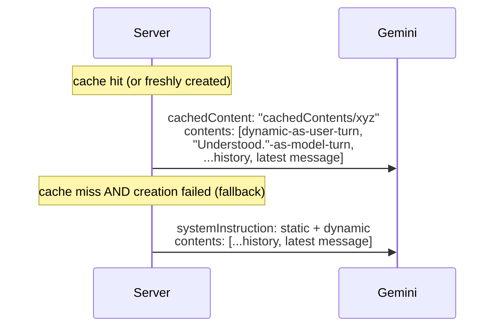

# Gemini integration — how it works

> Status: Current · Owner: Tech Lead · Verified: 2026-09-02

## Context

Everything Gemini-specific was scattered across `coach-chat-flow.md`'s prompt section,
`llm-provider-current.md`'s cost/rate-limit numbers, and code comments. This is the one
reference for the Gemini call itself — model, prompt shape, caching, retries, response schema —
the same way `coach-chat-flow.md` is the one reference for the request lifecycle around it.

## Model and endpoint

`gemini-flash-latest` (Google's maintained alias — dated model ids keep getting sunset early;
see `ui/api/coach-chat/_lib/geminiClient.ts`), called via raw `fetch` to `generateContent`, no SDK
(`GEMINI_API_KEY` env var). One call per turn, no streaming (issue #270).

`ui/api/coach-message.ts` uses the same model and key for one post-sync call. Its separate
message-only schema gets bounded repo-owned activity context, including `effort_shape` but never
raw HR points; it does not use chat actions, history, or the explicit chat cache.

## Prompt shape: static prefix + dynamic block

```mermaid
flowchart LR
    subgraph static["Static (cached, one entry for every athlete)"]
        persona["persona\nSOUL.chat.md"]
        instr["fixed web-runtime instructions"]
        examples["2 few-shot examples"]
    end
    subgraph dynamic["Dynamic (fresh every call)"]
        state["split athlete + quest context\n+ optional Fitness Snapshot"]
        mode["mode-specific instructions\ngreeting / activity_sync / ordinary\n(no more closing mode - C1)"]
        schema["mode-specific response schema"]
        ts["todayContextLine()\nchanges every minute"]
    end
    static -->|cachedContent name| call["generateContent"]
    dynamic -->|prepended to contents| call
    history["conversation history\n(last 40 msgs)"] --> call
```

`geminiClient.ts`'s `askGemini()` builds these as two separate strings (`coachPromptText.ts`'s
`staticSystemText()` and `buildDynamicText()`), not one array, because of a hard API constraint
below.

## Caching: implicit (fallback) vs explicit (primary path)

**Implicit caching** (Gemini's automatic, on-by-default behavior for 2.5+ models) discounts any
byte-identical prefix it happens to have recently served, best-effort. This project relies on it
only as a fallback — see below. The reason it works at all is prompt *ordering*: everything
stable comes before anything that varies per call, so a byte-identical prefix exists in the
first place. Minimum cacheable size is 2,048 tokens (Gemini 2.5 Flash); SOUL.md alone clears
that ~6x over.

**Explicit caching** (`ui/api/coach-chat/_lib/soulCache.ts`) is the primary path: the static prefix is
uploaded once via `POST /v1beta/cachedContents`, returning a `cachedContents/...` name. Every
subsequent call passes `cachedContent: <name>` instead of resending the text at all — cached
reads are billed at 10% of standard input rate, *guaranteed*, not best-effort. The cache is not
per-athlete: since the static prefix is byte-identical for everyone, one cache entry serves
every athlete's calls.

**The rule that follows from that: anything per-athlete goes in the dynamic half, never the
prefix.** Put a conditional block in `staticSystemText()` and the hash changes per athlete, so
the cache forks per athlete and the discount quietly disappears — nothing fails, the bill just
goes up. Conditional SOUL blocks (the First Session Protocol, gated on
`isAthleteProfileComplete()`) are injected through `buildDynamicText()`'s `extraContext` for this
reason. They are not in `SOUL.chat.md` at all; `compose-soul.mjs` emits them as horcruxes under
`platform/horcruxes/`, which `build-soul.mjs` bundles separately. Guarded by
`ui/api/coach-chat/_tests/layer2-fields/first-session-injection.test.ts`.

**Hard constraint that shapes the whole design:** Gemini rejects a `generateContent` request
that sets both `cachedContent` and `systemInstruction` — they're mutually exclusive. Once a
cache is active, the dynamic block has nowhere else to go, so it's prepended into `contents` as
a synthetic exchange instead:



The fallback path (no `systemInstruction`/`cachedContent` split) is exactly the prompt shape
this project shipped before explicit caching existed — a broken or unconfigured cache degrades
to that, it never blocks a reply.

**Request-time staleness, distinct from cache-creation failure:** `getCachedSoulName()` can
return a name that's since gone stale or been evicted server-side between its own read and the
actual `generateContent` call. This is a different failure mode than *creating* a cache failing
(which falls back to `null`/no-cache before the call even happens). If the actual call comes back
`400` with a cache name set, `askGemini()` invalidates the stored record and retries once as a
plain no-cache call. This never surfaces to the athlete as a failed reply — it costs one extra
round-trip, silently.

### Cache lifecycle (`soulCache.ts`)

- Cache name + expiry + a content hash of the static text live in **Vercel Edge Config**
  (rebranded "Global Config" in the dashboard, Aug 2026 — same product). Read via
  `@vercel/edge-config`'s `createClient(process.env.GLOBAL_CONFIG)` — `GLOBAL_CONFIG` because
  that's the default env-var name Vercel's "Connect Project" flow gives the store, not
  `EDGE_CONFIG` (the SDK's own hardcoded default, which would need a manual rename in that flow
  to line up). `EDGE_CONFIG_ID` + `VERCEL_API_TOKEN` are for writes, since Edge Config has no
  write API of its own — only the Vercel REST API does.
- TTL is 24 hours (was 2h until #624). The content hash catches a SOUL redeploy immediately
  regardless of TTL, so TTL only bounds how long a stale-but-unhashed edge case could
  theoretically live. A shorter TTL has a real cost too: every expiry is a Global Config write,
  and the free tier caps at 250/month. 2h implied ~360 writes/month before even counting the
  concurrent-cold-start race below - 24h keeps the baseline near 30/month.
- Fails open at every step: no `GLOBAL_CONFIG` configured, a failed create call, a failed write —
  any of these just means this request (and until the next successful create) falls back to the
  no-cache shape above. Coaching never blocks on cache plumbing.
- **Setup required** (operator action, not code): create a Vercel Edge Config store, connect it
  to the project, and set `EDGE_CONFIG_ID`/`VERCEL_API_TOKEN` in Vercel's env vars (prod +
  preview) for writes to persist across cold starts. See `docs/eng-docs/env-vars.md`.
- Cache validity checks the model alongside the content hash, not folded into it. A
  `GEMINI_MODEL` bump with SOUL text unchanged still invalidates, since a `cachedContents/...`
  name is only valid for the model it was created against. The request-time retry above would
  also catch this, but checking up front avoids paying that round-trip when it's knowable
  earlier.
- Every reply logs `[coach-chat] Gemini usage: prompt=<n> cached=<n>` (`finishGeminiResponse`) —
  the standing way to confirm caching is actually being hit on real traffic, not just configured.
  See "Done when" below.
- Known, accepted race (not fixed): `getCachedSoulName`'s read-then-write isn't atomic, so
  concurrent cold starts that all miss the cache at once can each create and write their own
  entry, last write winning. Harmless — every created cache is independently valid, Gemini just
  ends up with a few short-lived orphaned entries that age out via their own TTL.

## Response schema

`generationConfigFor(mode, firstSession)` sends only fields legal for that turn. `reply` is always
required; forbidden actions are absent from the schema rather than discouraged only through
prose. C1 removed the closing-turn concept and `session_closed` along with it - there is no more
ordinary/closing split, only `firstSession` still varies what's available.

| Turn | Additional fields |
|---|---|
| Greeting | None |
| Activity sync | None |
| First Session | Incremental profile, memory, coaching-style, sports, injury, season, and quest setup actions |
| Returning | Memory/profile/injury/quest/season/quest-create actions, plus template/session/week-plan actions - every field, every turn |

The server owns dates, generated ids, timestamps, commit messages, and thread titles. Gemini
reports semantic actions only. `firstSession` is passed explicitly from the profile-completion
check; prompt construction does not infer mode by searching injected text.

**Text-field length caps (issue #462).** `memory_update.text` and
`injury_flag[].text`/`injury_event[].text` each carry a `maxLength` in `RESPONSE_PROPERTIES`
(`coachReplySchema.ts`), sourced from `engine/lib/text-caps.mts`. The same numbers are
restated as a plain-text instruction per field in the prompt (`coachPromptText.ts`). Schema
`maxLength` is a real constraint Gemini receives, not a guarantee it honors, so the prompt line
is a second, cheap nudge reading the same constant. See "Retries" below for what happens when
both still aren't enough.

## Action-field design rule (any new Gemini-facing field/action)

Hard rule, not a suggestion — every field added to `responseSchema` for Gemini to report a fact
(`coach_note`, `memory_update`, `quest_event`, `profile_update`, and anything future) must pass
all four. Each one traces back to something that actually broke or actually worked in production,
not a guess:

1. **Server computes all bookkeeping — dates, ids, timestamps, trace ids.** Gemini never reports
   them. `coach_note`'s date comes from `todayDateString(stateMd, new Date())`, computed
   server-side and passed in as a parameter — Gemini only ever supplies the semantic fact. A
   Gemini-reported date/id is an extra way to fail (stale, mistaken, hallucinated) that the server
   already has the real answer for.
2. **One new field at a time, shipped and tested in isolation** before the next one is added —
   never two new fact fields in the same PR.
3. **Prefer constrained values over free text.** An enum (`status`) or one of a small fixed set of
   labels beats an open string wherever the shape allows it. Only the field that's genuinely
   prose (`text`, `value`) should be unconstrained, and there should be at most one such field per
   action.
4. **Commitment fields ordered before the narrative `reply`** in each mode-specific schema.

**Why this is a hard rule, not a preference:** three independent free-text fields have each
triggered the same failure mode. A runaway repetition loop burns the output budget on
degenerate rambling, sometimes taking the whole structured reply down with it. The three:
`reasoning` (removed), `title` (removed, same symptom), `session_note` (tried during the 2026-08
coach-memory redesign, pulled after one live reproduction). Every new action added to this schema
is filtered through these four rules for that reason.

## Retries, timeouts, rate limits

- The actual `generateContent` call uses its own longer timeout (`GEMINI_GENERATE_TIMEOUT_MS`,
  45s, `geminiClient.ts`) rather than the shared file-read default (`UPSTREAM_TIMEOUT_MS`, 25s,
  `ui/api/_lib/httpTimeout.ts`). A turn with a long conversation history carries a larger prompt
  than the shared default fits comfortably, so it's the case most likely to legitimately need
  more than 25s. `ui/vercel.json` sets an explicit `maxDuration: 300` for `api/coach-chat.ts` so
  the platform's own ceiling doesn't silently become the real limit underneath this. Confirmed
  against the live account (Fluid Compute is enabled), which per Vercel's own changelog raises
  the Hobby plan's ceiling to the full 300s rather than the 60s that applies without it.
- A 504 (our own timeout abort) or a genuine Gemini-side 503 ("model currently experiencing high
  demand") triggers exactly one retry with a short fixed backoff — both were previously fatal on
  the first hit. Confirmed via production Runtime Logs as a dominant cause of turns failing
  outright with nothing committed (the failure happens inside `askGemini`, before
  `commitFilesAtomic` is ever reached, so the athlete's message silently does nothing). This is
  additive to the existing stale-cache retry (a `400` when `cachedContent` has expired/was
  evicted — see Cache lifecycle above), but capped at one retry **total**, not one per failure
  kind. The 400-retry and the 504/503-retry are mutually exclusive branches (`if`/`else if`) on
  the same call, not independent checks that can both fire. Letting both fire back to back would
  allow a single unlucky request to chain 3 full 45s-budget calls (~135s), blowing through
  `maxDuration` regardless of how generous it's set. Capped like this, the worst case for one
  `askGemini()` invocation is 2 calls (~90s) — still real, but bounded and something
  `maxDuration` can actually be sized against.
- Separately, `requestCoachReply` (`coachTurn.ts`) does its own single reprompt — a second, full
  `askGemini()` invocation — if `memory_update.text`/`injury_flag[].text`/`injury_event[].text`
  comes back over its `maxLength` cap (issue #462). This is content-triggered, not
  transport-triggered, so it's independent of the 400/503/504 retry above and can stack with it.
  The true worst case for a turn that both hits a transport retry _and_ needs the text-cap
  reprompt is two full `askGemini()` invocations, each up to ~90s. That's ~180s total — still
  under the 300s `maxDuration` ceiling, but worth knowing this bullet's "2 calls" is
  per-invocation, not per-turn. No retry on a second text-cap violation — `capText` in
  `turnWrites/*.ts` truncates deterministically if the reprompt still overshoots.
- A 429 is surfaced as a typed error the client shows as "rate-limited, try again shortly" — see
  `coachChatModel.ts`'s `CoachChatRateLimitedError` / iOS's `UserFacingError.swift`. No
  server-side retry on the Gemini call itself (a 429 mid-generation isn't safely retryable the
  way a GitHub read is — the athlete just sees the message and tries again).
- This is not a billing/quota issue — paid tier raises the requests/tokens-per-minute ceiling, it
  doesn't change per-request generation latency or guarantee capacity during a model-side 503.
- Current account tier, verified rate limits, and cost projections live in
  `docs/eng-docs/llm-provider-current.md` — this doc covers mechanics, that one covers the
  numbers for this account specifically.

## Done when

- `npm run eval:coach-chat` passes against a live key after any prompt-construction change.
- A live call's `usageMetadata.cachedContentTokenCount` is nonzero on the second request in a
  session, confirming explicit caching is actually hitting (not just configured). Check the
  standing `[coach-chat] Gemini usage: prompt=... cached=...` log line rather than a one-off
  script; verified live 2026-08-06, same `cached` value reused across two real messages in one
  session while `prompt` grew with history.

## Deferred

- P2: token-level streaming — issue #270, blocked on deciding how `reply` streams separately
  from the structured metadata fields.
- P3: cache invalidation is TTL + content-hash only, no active push on SOUL redeploy — acceptable
  given deploy frequency vs. the 2h TTL, revisit if that ratio changes.
- P3: `getCachedSoulName`'s read-then-write race under concurrent cold starts, documented above -
  not fixed, harmless in practice.
- P3: per-mode cached prefixes are not justified yet. They would multiply cache keys and lifecycle
  state; mode-specific schemas and compact dynamic prose remove the larger per-turn waste first.
- Paid/live behavior checks remain the named gate for prompt changes; deterministic tests verify
  request shape and forbid illegal fields before that gate.
