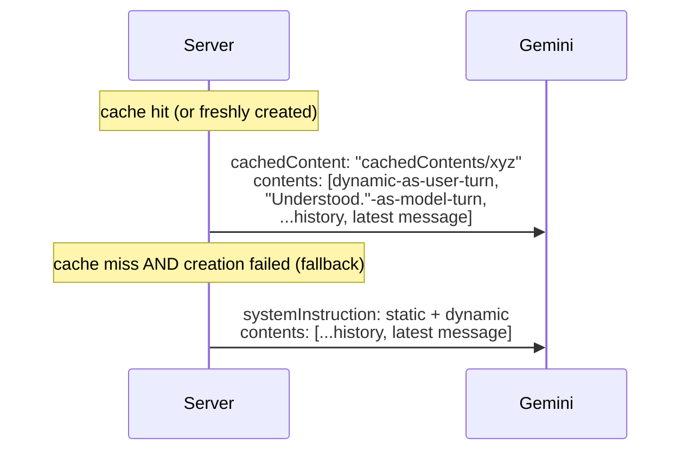

# Gemini integration — how it works

> Status: Current · Owner: Tech Lead · Verified: 2026-09-15

## Context

Everything Gemini-specific was scattered across `coach-chat-flow.md`'s prompt section,
`llm-provider-current.md`'s cost/rate-limit numbers, and code comments. This is the one
reference for the Gemini call itself — model, prompt shape, caching, retries, response schema —
the same way `coach-chat-flow.md` is the one reference for the request lifecycle around it.

## Model and endpoint

Chat runs `gemini-pro-latest`, pinned in `ui/api/_lib/geminiModel.ts:11`. Flash is the intended
model and the pin is temporary — #668 moved off it after capacity failures, not quality ones.
Called via raw `fetch` to `generateContent`, no SDK (`GEMINI_API_KEY` env var). One call per turn,
no streaming (#870: plain reply text must stream separately from validated structured actions and
terminal state behind `LlmAdapter` for Gemini/OpenRouter).

`ui/api/coach-message.ts` no longer shares that model and key. It reaches the model through
`ui/api/_lib/llmClient.ts`, which picks one adapter per request from `LLM_PROVIDER`: the default
`gemini` is the same direct call described above, and `openrouter` sends the request to OpenRouter
instead (#713). Its separate message-only schema gets bounded repo-owned activity context,
including `effort_shape` but never raw HR points; it does not use chat actions, history, or the
explicit chat cache. `activitySyncTurn.ts`'s post-sync thread now generates its opening reply
through this same path (#918) instead of its own `askLlm()` call — activity_sync is no longer
one of the `askLlm()` modes above.

Chat moved onto `llmClient` too (#713 M2 PR 2). `coach-chat/_lib/llm/coachLlmClient.ts`'s
`askLlm()` now only builds the prompt/request and parses the reply. The actual
`generateContent` call, the explicit soul cache, and the retry logic described below live instead
in `ui/api/_lib/llmAdapters/geminiAdapter.ts`, reached via `selectLlmAdapter` like every other
caller. `LLM_PROVIDER` stays unset/`gemini` in production throughout M2, so this is a plumbing
move, not a behavior change — chat's wire requests are unchanged. Template adjustment
(`coachWorkoutFiles.ts`'s `adjustTemplatesWithGemini`) moved onto `llmClient` too (#713 M2 PR 3) -
every direct-Gemini caller in the codebase at the time went through `selectLlmAdapter`, none opened
their own socket. `adjustTemplatesWithGemini` itself no longer exists (A3, #727, deleted the
automatic template-dump path it personalized) - the seam point above still holds for every caller
that remains.

## Prompt shape: static prefix + dynamic block

```mermaid
flowchart LR
    subgraph static["Static (cached, one entry for every athlete)"]
        persona["persona\nSOUL.chat.md"]
        instr["fixed web-runtime instructions"]
        examples["2 few-shot examples"]
    end
    subgraph dynamic["Dynamic (fresh every call)"]
        state["split athlete + quest context\n+ optional Fitness Snapshot"]
        mode["mode-specific instructions\ngreeting / ordinary\n(no more closing mode - C1)"]
        schema["mode-specific response schema"]
        ts["todayContextLine()\nchanges every minute"]
    end
    static -->|cachedContent name| call["generateContent"]
    dynamic -->|prepended to contents| call
    history["conversation history\n(last 40 msgs)"] --> call
```

`coachLlmClient.ts`'s `askLlm()` builds these as two separate strings (`coachPromptText.ts`'s
`staticSystemText()` and `buildDynamicText()`). It hands them to the seam as
`LlmRequest.cachePrefix` (static) and `LlmRequest.system` (dynamic) — still two strings, not one
array, because of a hard API constraint below. Since #713 M2 PR 2, `askLlm()` itself no longer
knows whether the cache is actually active; that decision, and the resulting wire-shape split, is
`geminiAdapter.ts`'s.

## Caching: implicit (fallback) vs explicit (primary path)

**Implicit caching** (Gemini's automatic, on-by-default behavior for 2.5+ models) discounts any
byte-identical prefix it happens to have recently served, best-effort. This project relies on it
only as a fallback — see below. The reason it works at all is prompt *ordering*: everything
stable comes before anything that varies per call, so a byte-identical prefix exists in the
first place. Minimum cacheable size is 2,048 tokens (Gemini 2.5 Flash); SOUL.md alone clears
that ~6x over.

**Explicit caching** (`ui/api/_lib/llmAdapters/geminiSoulCache.ts`, called by `geminiAdapter.ts` -
moved behind the seam by #713 M2 PR 2, was `coach-chat/_lib/llm/soulCache.ts`) is the primary
path: the static prefix is
uploaded once via `POST /v1beta/cachedContents`, returning a `cachedContents/...` name. Every
subsequent call passes `cachedContent: <name>` instead of resending the text at all — cached
reads are billed at 10% of standard input rate, *guaranteed*, not best-effort. The cache is not
per-athlete: since the static prefix is byte-identical for everyone, one cache entry serves
every athlete's calls.

**The rule that follows from that: anything per-athlete goes in the dynamic half, never the
prefix.** Put a conditional block in `staticSystemText()` and the hash changes per athlete, so
the cache forks per athlete and the discount quietly disappears — nothing fails, the bill just
goes up. Conditional SOUL blocks (the First Session Protocol, gated on
`isAthleteProfileComplete()`) are injected through `buildDynamicText()`'s `extraContext` for this
reason. They are not in `SOUL.chat.md` at all; `compose-soul.mjs` emits them as horcruxes under
`platform/horcruxes/`, which `build-soul.mjs` bundles separately. Guarded by
`ui/api/coach-chat/_tests/layer2-fields/first-session-injection.test.ts`.

**Hard constraint that shapes the whole design:** Gemini rejects a `generateContent` request
that sets both `cachedContent` and `systemInstruction` — they're mutually exclusive. Once a
cache is active, the dynamic block has nowhere else to go, so it's prepended into `contents` as
a synthetic exchange instead:



The fallback path (no `systemInstruction`/`cachedContent` split) is exactly the prompt shape
this project shipped before explicit caching existed — a broken or unconfigured cache degrades
to that, it never blocks a reply.

**Request-time staleness, distinct from cache-creation failure:** `getCachedSoulName()` can
return a name that's since gone stale or been evicted server-side between its own read and the
actual `generateContent` call. This is a different failure mode than *creating* a cache failing
(which falls back to `null`/no-cache before the call even happens). If the actual call comes back
`400` with a cache name set, `geminiAdapter.ts` (`coach-chat/_lib/llm/coachLlmClient.ts` before
#713 M2 PR 2) invalidates the stored record and retries once as a plain no-cache call. This never
surfaces to the athlete as a failed reply — it costs one extra round-trip, silently. Gated on the
request carrying a cache prefix at all (`LlmRequest.cachePrefix`) — coach-message and template
adjustment never set one, so they never pay for this lookup or retry.

### Cache lifecycle (`geminiSoulCache.ts`)

- Cache name + expiry + a content hash of the static text live in **Vercel Edge Config**
  (rebranded "Global Config" in the dashboard, Aug 2026 — same product). Read via
  `@vercel/edge-config`'s `createClient(process.env.GLOBAL_CONFIG)` — `GLOBAL_CONFIG` because
  that's the default env-var name Vercel's "Connect Project" flow gives the store, not
  `EDGE_CONFIG` (the SDK's own hardcoded default, which would need a manual rename in that flow
  to line up). `EDGE_CONFIG_ID` + `VERCEL_API_TOKEN` are for writes, since Edge Config has no
  write API of its own — only the Vercel REST API does.
- TTL is 24 hours (was 2h until #624). The content hash catches a SOUL redeploy immediately
  regardless of TTL, so TTL only bounds how long a stale-but-unhashed edge case could
  theoretically live. A shorter TTL has a real cost too: every expiry is a Global Config write,
  and the free tier caps at 250/month. 2h implied ~360 writes/month before even counting the
  concurrent-cold-start race below - 24h keeps the baseline near 30/month.
- Fails open at every step: no `GLOBAL_CONFIG` configured, a failed create call, a failed write —
  any of these just means this request (and until the next successful create) falls back to the
  no-cache shape above. Coaching never blocks on cache plumbing.
- **Setup required** (operator action, not code): create a Vercel Edge Config store, connect it
  to the project, and set `EDGE_CONFIG_ID`/`VERCEL_API_TOKEN` in Vercel's env vars (prod +
  preview) for writes to persist across cold starts. See `docs/eng-docs/env-vars.md`.
- Cache validity checks the model alongside the content hash, not folded into it. A
  `GEMINI_MODEL` bump with SOUL text unchanged still invalidates, since a `cachedContents/...`
  name is only valid for the model it was created against. The request-time retry above would
  also catch this, but checking up front avoids paying that round-trip when it's knowable
  earlier.
- Usage, including whether the cache was actually hit, reports through the shared
  `gen_ai.generate_content` Sentry span (`withLlmSpan`/`recordUsage`, `_lib/sentry.ts`).
  `gen_ai.usage.input_tokens.cached` is the attribute to check — every adapter populates it, not
  just chat's Gemini path. See "Done when" below.
- Known, accepted race (not fixed): `getCachedSoulName`'s read-then-write isn't atomic, so
  concurrent cold starts that all miss the cache at once can each create and write their own
  entry, last write winning. Harmless — every created cache is independently valid, Gemini just
  ends up with a few short-lived orphaned entries that age out via their own TTL.

## Response schema

`generationConfigFor(mode, firstSession)` sends only fields legal for that turn. `reply` is always
required; forbidden actions are absent from the schema rather than discouraged only through
prose. C1 removed the closing-turn concept and `session_closed` along with it - there is no more
ordinary/closing split, only `firstSession` still varies what's available.

| Turn | Additional fields |
|---|---|
| Greeting | None |
| Activity sync | None |
| First Session | Incremental profile, memory, coaching-style, sports, injury, season, and quest setup actions |
| Returning | Memory/profile/injury/quest/season/quest-create actions, plus template/session/week-plan actions - every field, every turn |

The server owns dates, generated ids, timestamps, commit messages, and thread titles. Gemini
reports semantic actions only. `firstSession` is passed explicitly from the profile-completion
check; prompt construction does not infer mode by searching injected text.

**`additionalProperties: false` (#713 M2 PR 2).** Every object in `RESPONSE_PROPERTIES`, at every
nesting level, carries this — required for OpenRouter's strict `json_schema` mode (M2's probe
confirmed this model/provider accepts it as-is; see `openrouter-m2-chat-lld.md`). Enforced by the
type checker, not eyeballed: `RESPONSE_PROPERTIES` is annotated `as const satisfies
Record<string, LlmJsonSchemaNode>` (`_lib/llmClient.ts`), and `LlmJsonSchemaNode` requires the
field on every object node, so a new nested object missing it fails `npm run check`. Gemini's own
`responseSchema` has no such field — `geminiAdapter.ts` strips it before sending, same as it
already did for `coach-message`'s schema.

**Text-field length caps (issue #462).** `memory_update.text`,
`injury_flag[].text`/`injury_event[].text`, and `coach_note` each carry a `maxLength` in
`RESPONSE_PROPERTIES` (`coachReplySchema.ts`), sourced from `engine/lib/text-caps.mts`. The same numbers are
restated as a plain-text instruction per field in the prompt (`coachPromptText.ts`). Schema
`maxLength` is a real constraint Gemini receives, not a guarantee it honors, so the prompt line
is a second, cheap nudge reading the same constant. See "Retries" below for what happens when
both still aren't enough.

## Action-field design rule (any new Gemini-facing field/action)

Hard rule, not a suggestion — every field added to `responseSchema` for Gemini to report a fact
(`coach_note`, `memory_update`, `quest_event`, `profile_update`, and anything future) must pass
all four. Each one traces back to something that actually broke or actually worked in production,
not a guess:

1. **Server computes all bookkeeping — dates, ids, timestamps, trace ids.** Gemini never reports
   them. `coach_note`'s date comes from `todayDateString(stateMd, new Date())`, computed
   server-side and passed in as a parameter — Gemini only ever supplies the semantic fact. A
   Gemini-reported date/id is an extra way to fail (stale, mistaken, hallucinated) that the server
   already has the real answer for.
2. **One new field at a time, shipped and tested in isolation** before the next one is added —
   never two new fact fields in the same PR.
3. **Prefer constrained values over free text.** An enum (`status`) or one of a small fixed set of
   labels beats an open string wherever the shape allows it. Only the field that's genuinely
   prose (`text`, `value`) should be unconstrained, and there should be at most one such field per
   action.
4. **Commitment fields ordered before the narrative `reply`** in each mode-specific schema.

**Why this is a hard rule, not a preference:** three independent free-text fields have each
triggered the same failure mode. A runaway repetition loop burns the output budget on
degenerate rambling, sometimes taking the whole structured reply down with it. The three:
`reasoning` (removed), `title` (removed, same symptom), `session_note` (tried during the 2026-08
coach-memory redesign, pulled after one live reproduction). Every new action added to this schema
is filtered through these four rules for that reason.

## Narration-vs-action reliability guards (#727 hardening round)

**The failure shape this section exists for:** the model describes a fact as saved in `reply` or
`coach_note`, but never sets the matching action field. Live-reproduced twice, both from #727:
`workout_create` (a routine narrated, never saved) and `week_update`/`season_start` (a week or
season narrated as locked in, never committed). Nothing else in the pipeline catches this - the
write path only rejects data it receives, and a skipped field sends nothing to reject.

**The fix pattern, in order of preference:**

1. **Prompt reinforcement first, always.** One sentence next to the field's own instructions:
   "never describe X without also setting the action field." Cheap, no false-positive risk.
   Real but partial effect on its own (`coachPromptText.ts`'s `workout_create`, `season_start`,
   and week-kickoff instructions all carry one).
2. **A deterministic reprompt, only when a safe trigger signal exists.** Reuses the existing
   one-shot reprompt in `requestCoachReply` (`requestCoachReply.ts`) - one corrective retry, same call as
   `findOversizedTextField` already makes for a text cap. The signal has to be safe. One safe
   shape keys on the **athlete's own message** (`findMissedInjuryLanguage`,
   `findMissedHabitLanguage`, `findMissedSeasonLanguage` - first-session only, since a
   first-session turn has zero pre-existing referents to confuse a keyword match with). Another
   keys on a structural pattern in the **reply**, narrow enough that ordinary conversation can't
   produce it by accident. `isProseOnlyWeekPlan` counts distinct weekday names - 5+ named days is
   not something a normal reply writes unless it's actually narrating a week. **Rejected as
   unsafe:** a generic reply-text keyword match for "described a workout" (gap 2a in the #727
   review). Real false-positive risk against ordinary coaching conversation, no narrow enough
   signal available.
3. **A deterministic write-time guard**, for a different failure shape (not narrated-not-saved,
   but saved-wrong): `newSessionMayDuplicatePlan`/`categoryChangeIsConfirmed`
   (`validateActions.ts`) drop a schedule-changing write unless the athlete's message this turn
   carries a real confirmation or "this is a distinct extra" cue.

**Verification for any of these:** unit tests exercising `requestCoachReply` directly with a
mocked `askLlm` are the reliable check. A live rerun can prove a fix doesn't false-positive,
but can't reliably reproduce an intermittent model mistake on demand
(`WORKOUTS_AND_CURRENT_WEEK_LIVE_TEST_RESULTS.md` and `LIVE_VERIFICATION_REVIEW_FIXES_727.md`
document several live attempts that never reproduced an already-fixed, already-unit-tested case).
Live testing still matters - it caught two real bugs this round (a merge patch silently dropping
a field, and an over-length `intent` string) that neither unit test suite covered. But treat "live
reran N times, didn't reproduce it" as inconclusive, not as proof, for anything a dedicated unit
test already covers.

### Coverage by action field, as of this round

| Field | Missed-language / narration guard | Other reprompt or write-time guard |
|---|---|---|
| `workout_create` | prompt reinforcement | `findMalformedWorkoutCreateExercises` (structural, reports every malformed exercise in one reprompt, not just the first - #1037 PR F), `findMissingWorkoutCreateInjuryAck` (structural, active-flag-vs-injury_ack mismatch - #1071), injury/dose invariants at write time |
| `week_update` (kickoff) | prompt reinforcement + `isProseOnlyWeekPlan` | `assertCurrentWeekCommitReady` (structural) |
| `week_update` (patch) | prompt reinforcement | `newSessionMayDuplicatePlan`, `categoryChangeIsConfirmed`, `findUnconfirmedAssumption`. `validateWeekUpdate` (per-item drop) and `applyWeekPatch`'s throw agree in practice - the validator always runs first, so the applier's own all-or-nothing throw is defense-in-depth against a caller that skips validation, not the primary guard (#1037 PR F; documented in `applyWeekPatch`'s own comment). |
| `season_start` | prompt reinforcement + `findMissedSeasonLanguage` (first-session only) | - |
| `injury_flag` | `findMissedInjuryLanguage` (first-session, zero-flags) + `findUncountedInjuryLanguage` (returning-athlete, count-aware, #1037 PR D) | - |
| `quest_event` | `findMissedQuestLanguage` (count-aware, active-quest-name + status language, #1037 PR D) | invalid-`quest_id` reprompt (D1, #736), now names every bad id found across `quest_event`/`injury_event` in one reprompt, not just the first (#1037 PR F) |
| `template_edit`, `session_plan` | prompt reinforcement only (#1072) | `findUnconfirmedAssumption` (schedule-change gate only) |
| `profile_update` | prompt reinforcement + `findMissedProfileLanguage` (first-session only) | - |
| `coaching_style_update` | prompt reinforcement | - |
| `season_start.new_habits` / standalone `quest_create` | prompt reinforcement + `findMissedHabitLanguage` (first-session, zero-quests) + `findMissedNewHabitLanguage` (returning-athlete, explicit new-habit phrasing only, #1037 PR F) | - |
| `memory_update` | prompt reinforcement, incl. a compound-turn call-out (#1085) | - |
| `workout_remove` | prompt reinforcement + `findMissedRemovalLanguage` (returning-athlete only) | - |
| `sports_update` | prompt reinforcement + `findMissedSportsLanguage` (new-activity phrasing only) | `applySportsUpdate` merges the new list against what's on file rather than replacing it (#1037 PR E) |
| `injury_event` | prompt reinforcement + `findMissedInjuryUpdateLanguage` (exactly-one-active-flag, boolean) + `findUncountedInjuryLanguage` (any flag count, count-aware, #1037 PR D) | invalid-`flag_id` reprompt (D1, #736), now names every bad id found across `quest_event`/`injury_event` in one reprompt, not just the first (#1037 PR F) |

**#1009 hardening round, PR A (2026-09-14):** `profile_update` now has the same reprompt-guard
treatment `season_start`/`injury_flag`/`quest_create` got in the #727 round.
`findMissedProfileLanguage` checks the athlete's own message for stated age, height/weight, or
timezone language. It only fires when that's not already on file and not already covered by this
turn's `profile_update` - first-session only, same three-part scoping as its siblings.
`coaching_style_update`, standalone `quest_create`, and `memory_update` get prompt reinforcement
only. None has a phrasing narrow enough for a safe reprompt trigger without real false-positive
risk against ordinary conversation - see the coverage table above for the shipped state of each.
`injury_event`, `sports_update`, and `workout_remove` shipped in the follow-up PRs on this same
stack, described below.

**#1009 hardening round, PR B (2026-09-14):** `workout_remove` and `sports_update` now have the
same reprompt-guard treatment. `findMissedRemovalLanguage` checks the athlete's own message for
removal language ("delete"/"remove"/"get rid of"/"don't want" near "routine"/"workout"/"template"),
gated to returning-athlete turns only - a first-session athlete has no existing routines to remove.
`findMissedSportsLanguage` checks for explicit new-activity phrasing ("started"/"new sport"/"picked
up"/"also play/do/doing"), deliberately the narrowest pattern in this round. A bare sport name
risks colliding with an ordinary session report ("badminton was rough today"). The pattern never
matches on a sport name alone. Both run through the same `captureStillUnresolvedGuard` Sentry path
PR A added. `injury_event` remains the last field, follow-up PR C on the same stack.

**#1009 hardening round, PR C (2026-09-14, last PR in this stack):** `injury_event` now has a
reprompt guard too, but scoped differently from every sibling above. `findMissedInjuryLanguage`
(the existing `injury_flag` guard) is safe only when zero active flags exist - no candidate means
any injury language must be new. `injury_event` is the opposite case: flags already exist, which
is exactly what makes plain injury language ambiguous - updating a known flag, reporting a genuinely
new one, or just ordinary training soreness that isn't flag-worthy at all. `findMissedInjuryUpdateLanguage`
reuses the same `INJURY_LANGUAGE_PATTERN` but only fires when EXACTLY ONE active flag exists -
"which injury" stops being ambiguous once there's only one candidate. Deliberately not scoped to
first-session, unlike its sibling - injury updates are a returning-athlete-dominant flow, and the
single-active-flag condition is what makes this safe. With 2+ active flags the detector stays
silent by design; that boundary is documented in the code comment above the detector and in the
matching unit test, not an oversight. Also runs through the same `captureStillUnresolvedGuard`
Sentry path.

This closes out the #1009 hardening round. All seven fields it set out to cover -
`profile_update`, `workout_remove`, `sports_update`, `injury_event`, `coaching_style_update`,
standalone `quest_create`, and `memory_update` - are now accounted for, either with a real
detector or a documented prompt-only decision. See the table above for the final state.

The "still unresolved after reprompt" block (`requestCoachReply.ts`'s "still" check, after every
detector's one-shot reprompt) now also calls `captureStillUnresolvedGuard`
(`ui/api/_lib/sentry.ts`). It runs alongside the existing `console.warn`, for every detector old
and new - previously this failure mode was invisible outside a local log.

**#1037 hardening round, PR D (2026-09-14): count-aware guards for `quest_event`,
`injury_flag`, `injury_event`.** Every guard above this point, old and new, is boolean - it only
asks "did anything fire at all," so a turn that captures 2 of 3 real facts looks the same as one
that captured none. `findMissedQuestLanguage` closes `quest_event`'s total absence of coverage: it
counts active-quest-name mentions co-occurring with completion/miss/excusal language against
`reply.quest_event.length`, so "2 of 3 landed" still fires. It reuses `questNameReferencedIn`
(now exported from `validateActions.ts`) rather than a second copy of the same word-matching
logic. `findUncountedInjuryLanguage` closes two gaps at once - `injury_flag`'s zero coverage on
returning-athlete turns, and `injury_event`'s zero coverage once 2+ active flags exist. The
exactly-one-flag gate on `findMissedInjuryUpdateLanguage` stays; it's the only safe way to resolve
*which* flag a bare mention means, and this round doesn't touch that. It counts distinct
injury-keyword mentions in the message against `injury_flag.length + injury_event.length`
combined. Raw per-keyword counting over-counts a single injury restated across nearby phrasing
("my knee still hurts... it's sore..."), so hits within a 12-word window of the prior hit collapse
into one mention before counting - verified against both a same-injury-restated case (must not
fire) and a two-injuries-described-far-apart case (must still fire) in
`coachTurn-reprompt.test.ts`. All three detectors are lower bounds, not exact counts, same risk
class as every prompt-derived pattern in the table above - narrow on any real collision, never
drop the check. The `quest_event` synthesis extension the HLD flagged as lower-priority
(`synthesizeQuestEventFromUnrecordedFacts` rescuing 2+ dropped facts, not just one) was
deliberately not built this round - see the PR body for the live-test finding on whether it's
still needed.

**#1037 hardening round, PR E (2026-09-14): `sports_update` merges instead of replacing.**
This one wasn't a missing detector, it was a write-side data-loss bug: `applySportsUpdate`
(`coachProfileIntents.ts`) fully replaced `memory.sports` with whatever the model sent, so a partial
list silently deleted whatever it forgot to restate. The fix unions the new list against what's
already on file, case-insensitive, preferring the new list's casing/order for anything it names.
`findMissedSportsLanguage` (the guard above) still only catches "did sports_update fire at all" -
it can't tell a complete list from a partial one. So the merge is what actually stops the data
loss now; the detector just decides whether to fire at all. Live-tested against
`coach-skanda-2003`: the model sent the full list on its own this run, so the merge was a no-op
in practice. But the before/after diff confirms all three existing sports plus the new one
landed - the partial-list case itself is covered by unit tests in `coachIntents.test.ts`. Explicit
removal ("I stopped doing X") is still out of scope - there's no signal today that distinguishes
an intentional drop from an accidental one, flagged as a follow-up design question in the PR.

**#1037 hardening round, PR F (2026-09-14, last PR in this stack): four remaining P2s.**
Closes out the round with four smaller fixes, each either a coverage gap the same shape as PR D's
or a "report everything, not just the first" completeness fix:

- **`season_start.new_habits` / `quest_create` returning-athlete coverage.** Same gap shape as
  `injury_flag`'s pre-PR-D state - `findMissedHabitLanguage` was first-session only. The broad
  `HABIT_LANGUAGE_PATTERN` isn't safe to extend to returning athletes: an established athlete says
  "routine"/"track" constantly about existing training, exactly the false-positive #1009's own LLD
  warned about. `findMissedNewHabitLanguage` keys on a narrower, explicit new-habit-starting
  phrase set instead ("start(ing) a new habit," "want to start tracking/doing," "going to start a
  new (daily) habit," "new daily habit"). A first draft of the "going to start" branch matched any
  "going to start <word>" phrase. That false-positived on ordinary session talk ("going to start my
  long run tomorrow"), so it was narrowed to require "new"/"habit" in the same phrase before
  shipping, per the standing narrow-on-collision discipline.
- **`workout_create` reports every malformed exercise, not just the first.**
  `findMalformedWorkoutCreateExercises` now collects every exercise-type violation across every
  phase instead of returning on the first one. Same idea as `applyWorkoutCreate`'s existing
  injury-ack all-violations check (`coachWorkoutFiles.ts`) - already the one place in the codebase
  that reported every violation at once.
- **`findInvalidReference` reports every bad id, not just the first.** Renamed
  `findInvalidReferences`, now `.filter`s both `quest_event` and `injury_event` instead of
  `.find`-ing the first bad id across both. Not a correctness fix: `validateActions.ts`'s
  per-entry drop logic already handles multiple bad ids at commit time regardless. It just makes
  the one corrective reprompt name every bad reference, so Gemini's retry has full information
  instead of fixing one and leaving another for layer 3 to silently drop.
- **`week_update` applier/validator seam documented, not changed.** `coachWeekFiles.ts`'s
  `applyWeekPatch` throws all-or-nothing on a bad reference; `validateActions.ts`'s
  `validateWeekUpdate` drops bad references per-item. Since the validator always runs first in the
  real pipeline, the applier's throw was already unreachable - a real inconsistency, but not a live
  bug. Left as a documentation fix: `applyWeekPatch`'s own comment now states plainly that its
  throw is defense-in-depth against a caller that skips validation, not the primary guard. It no
  longer claims parity with `applyQuestEvent`'s id guards, since it doesn't have that parity today.

This closes out the #1037 round. All four HLD findings scoped as P2 (habit/quest_create
returning-athlete coverage, `workout_create` full-violation reporting, `findInvalidReference`
full-id reporting, `week_update` seam alignment) are now shipped or explicitly documented as a
deliberate no-behavior-change decision.

**#1070/#1071/#1072 live-pass findings round (2026-09-15).** Tech Lead's live testing pass
against all 5 real athlete repos (#1067) found three real gaps in this guard system. All three
root back to the same thing: Gemini Flash occasionally does the wrong thing. These are gaps in
the existing mitigation pattern, not new failure modes needing a new approach.

- **#1070: `isProseOnlyWeekPlan`'s still-unresolved case never reached the athlete.** The
  detector and its one-shot reprompt already worked; what was missing was the same-turn
  correction `formatDroppedActionsCorrection` already does for a dropped write action. When
  `stillProseOnlyWeekPlan` stays true after the reprompt, the reply the athlete actually reads
  now gets an honest addendum (`formatProseOnlyWeekPlanCorrection`, `requestCoachReply.ts`) saying the
  week plan above wasn't saved. Before this fix it only reached a `console.warn`/
  `captureStillUnresolvedGuard` call the athlete never sees. `RepliedTurn.stillProseOnlyWeekPlan`
  carries the signal from `requestCoachReply` into `buildTurnWrites`, same shape as
  `stillUnconfirmedAssumption`.
- **#1071: `workout_create` narrates success before its own injury_ack invariant drops the
  write.** Invariant 7 already makes a dropped write recoverable (the existing correction note
  fires), but the model's prose claims the routine is built and locked in first, so the athlete
  reads a self-contradicting reply. `findMissingWorkoutCreateInjuryAck` (`turnReplyValidation.ts`) is a new
  structural reprompt trigger, same family as `findMalformedWorkoutCreateExercises`. When the
  turn has active injury flags, the reply sets `workout_create`, and `injury_ack` doesn't cover
  every active flag, it reprompts once before the applier ever sees the write.
- **#1072: `template_edit`/`session_plan` had zero narration-vs-action guard, and pain-justified
  edit language got misclassified as a new injury.** Live-reproduced: "my lower back doesn't
  handle it well, every time, not just today," said to justify a permanent routine edit, got
  recorded as `injury_flag`/`injury_event` instead of the requested `template_edit`. I looked for
  a safe deterministic reprompt trigger - the same "athlete message names an edit request AND the
  reply set injury fields but not template_edit/session_plan" shape every other detector in this
  table uses. I couldn't find one narrow enough to ship. A returning athlete asking to change a
  session *because* of ongoing pain is common and often legitimate on its own, including turns
  where the coach correctly asks a clarifying question before committing any edit at all. Firing
  on that shape would collide with ordinary conversation the same way the rejected gap-2a generic
  keyword match did. This one shipped as prompt reinforcement only
  (`coachPromptText.ts`, next to the `template_edit`/`session_plan` instructions) - a documented
  partial fix, not an oversight. See the coverage table above for the current state.

**#1085: `memory_update` dropped on a compound turn (2026-09-15).** Live-verified: an athlete
stated a durable training pattern ("I always run better in the evening") together with another
request in the same message ("also be more direct with me"). The other action field
(`coaching_style_update`) fired, but `memory_update` was silently never in the model's JSON - 3 of
4 real attempts on `coach-date2022`. `unrecorded_facts` came back empty too, so the existing
reprompt never fired, and the reply's own prose still claimed the pattern was noted.

I looked for a safe reprompt trigger shaped like `findMissingWorkoutCreateInjuryAck` (a structural
signal on the model's own output: reply implies "noted"/"logged"/"remembered," `memory_update`
absent, another action field present this turn). It doesn't clear the false-positive bar. "Noted"
and "logged" are generic filler this codebase's own reply text uses constantly for unrelated
acknowledgments that have nothing to do with a memory-worthy fact. Several existing fixtures in
`coachTurn-reprompt.test.ts` use a bare `reply: "Noted."` alongside an `injury_event` or
`quest_event` write, with no durable pattern in sight. Gating on "another action field also fired"
doesn't rescue it: a non-filler turn almost always has some other action field set. That would
reprompt on a large share of ordinary compound turns, not just the real drop - the same false-
positive class the gap-2a generic keyword match and #1072's narration guard were already rejected
for.

Shipped as prompt reinforcement only, same as #1072. `coachPromptText.ts` now says explicitly,
in both the first-session and returning-athlete branches, that a durable pattern earns its own
`memory_update` "even when the same message also asks for something else," regardless of whether
another action field is also firing that turn. A documented partial fix, not a full behavioral
guard - see the coverage table above for the current state.

## Retries, timeouts, rate limits

- The actual `generateContent` call uses its own longer timeout (`GEMINI_GENERATE_TIMEOUT_MS`,
  60s, `coachLlmClient.ts`) rather than the shared file-read default (`UPSTREAM_TIMEOUT_MS`, 25s,
  `ui/api/_lib/httpTimeout.ts`). Raised from 45s (2026-09-10) alongside `CHAT_MAX_OUTPUT_TOKENS`
  doubling to 8192 (`coachReplySchema.ts`). The live evidence behind that bump measured ~3930
  thinking tokens alone on the dense-message scenario it targets. The call needs enough time to
  actually finish generating the fuller budget, not trade a MAX_TOKENS truncation for a timeout on
  the same scenario. `ui/vercel.json` sets an explicit `maxDuration: 300` for `api/coach-chat.ts`
  so the platform's own ceiling doesn't silently become the real limit underneath this. Confirmed
  against the live account (Fluid Compute is enabled), which per Vercel's own changelog raises
  the Hobby plan's ceiling to the full 300s rather than the 60s that applies without it.
- A 504 (our own timeout abort) or a genuine Gemini-side 503 ("model currently experiencing high
  demand") triggers exactly one retry with a short fixed backoff inside `geminiAdapter.ts`'s
  `callGemini` — both were previously fatal on the first hit. Confirmed via production Runtime
  Logs as a dominant cause of turns failing outright with nothing committed (the failure happens
  inside `askLlm`, before `commitFilesAtomic` is ever reached, so the athlete's message
  silently does nothing). This is additive to the existing stale-cache retry (a `400` when
  `cachedContent` has expired/was evicted — see Cache lifecycle above), but capped at one retry
  **total**, not one per failure kind. The 400-retry and the 504/503-retry are mutually exclusive
  branches (`if`/`else if`) on the same call, not independent checks that can both fire. Capped
  like this, the worst case for one `adapter.generate()` call is 2 attempts (~120s at the current
  60s timeout).
- `coachLlmClient.ts`'s `askLlm()` adds one more retry on top of that, at the seam level: a
  malformed/truncated JSON response that OpenRouter's own `finish_reason` check can miss. This
  retry deliberately reuses a *shorter* 20s timeout, not the full 60s again. A fifth call stacking
  on top of four others that already ran was itself a review finding (2026-09-10). Its own worst
  case (2 attempts at 20s, if the retry attempt also hits a transport-level 503/504) adds up to
  ~40s, not another ~120s.
- Separately, `requestCoachReply` (`requestCoachReply.ts`) does its own single combined reprompt: a
  second, full `askLlm()` invocation. Six checks can each trigger it on one turn:
  - A text field over its `maxLength` cap (issue #462).
  - A missing required `coach_note`.
  - An invalid quest/injury reference.
  - The self-audit (`unrecorded_facts`) flagging a dropped fact.
  - Missed injury/habit language on a first-session turn.
  - An unresolved `pending_clarification` from last turn.

  All of these fold into **one** reprompt naming every violation found, not one reprompt per
  check. No retry fires on a second violation after that. `capText` in `turnWrites/*.ts` truncates
  deterministically if a text field still overshoots. Any other still-unresolved check just gets
  logged and left as-is. For `quest_event`/schedule-changing fields specifically, a deterministic
  layer-3 fallback in `buildTurnWrites` handles it instead of a third model call - see
  `docs/eng-docs/coach-chat-testing.md` and the PR #955 findings log for the specific mechanisms.
- **True worst case for one turn**, every layer stacking: the initial `askLlm()` invocation at
  up to ~160s (120s adapter retry + 40s JSON-parse retry), plus `requestCoachReply.ts`'s one reprompt at
  up to another ~160s. That's ~320s total - over the 300s `maxDuration` ceiling. Reaching it needs
  several independent transient failures in one turn at once: a 503/504 on both calls of the
  initial invocation, a malformed-JSON retry that itself also hits a 503/504, and a content
  violation serious enough to need the reprompt. This is accepted as a known, unlikely-in-practice
  residual risk rather than re-architected further right now - the same tradeoff the 2026-09-10
  JSON-parse-retry timeout bound already made explicitly for one of these layers.
- A 429 is surfaced as a typed error the client shows as "rate-limited, try again shortly" — see
  `coachChatModel.ts`'s `CoachChatRateLimitedError` / iOS's `UserFacingError.swift`. No
  server-side retry on the Gemini call itself (a 429 mid-generation isn't safely retryable the
  way a GitHub read is — the athlete just sees the message and tries again).
- This is not a billing/quota issue — paid tier raises the requests/tokens-per-minute ceiling, it
  doesn't change per-request generation latency or guarantee capacity during a model-side 503.
- Current account tier, verified rate limits, and cost projections live in
  `docs/eng-docs/llm-provider-current.md` — this doc covers mechanics, that one covers the
  numbers for this account specifically.

## Done when

- `npm run eval:coach-chat` passes against a live key after any prompt-construction change.
- A live call's `usageMetadata.cachedContentTokenCount` is nonzero on the second request in a
  session, confirming explicit caching is actually hitting (not just configured). Check the
  `gen_ai.generate_content` span's `gen_ai.usage.input_tokens.cached` attribute in Sentry, not a
  one-off script. Verified live 2026-08-06: same `cached` value reused across two real messages in
  one session while `prompt` grew with history.

## Deferred

- P2: token-level streaming — #870 must stream plain reply text separately from validated
  structured actions and terminal state behind `LlmAdapter` for Gemini/OpenRouter, with web/iOS
  cancellation, retry, and disconnect/reconciliation proof.
- P3: cache invalidation is TTL + content-hash only, no active push on SOUL redeploy — acceptable
  given deploy frequency vs. the 2h TTL, revisit if that ratio changes.
- P3: `getCachedSoulName`'s read-then-write race under concurrent cold starts, documented above -
  not fixed, harmless in practice.
- P3: per-mode cached prefixes are not justified yet. They would multiply cache keys and lifecycle
  state; mode-specific schemas and compact dynamic prose remove the larger per-turn waste first.
- Paid/live behavior checks remain the named gate for prompt changes; deterministic tests verify
  request shape and forbid illegal fields before that gate.
