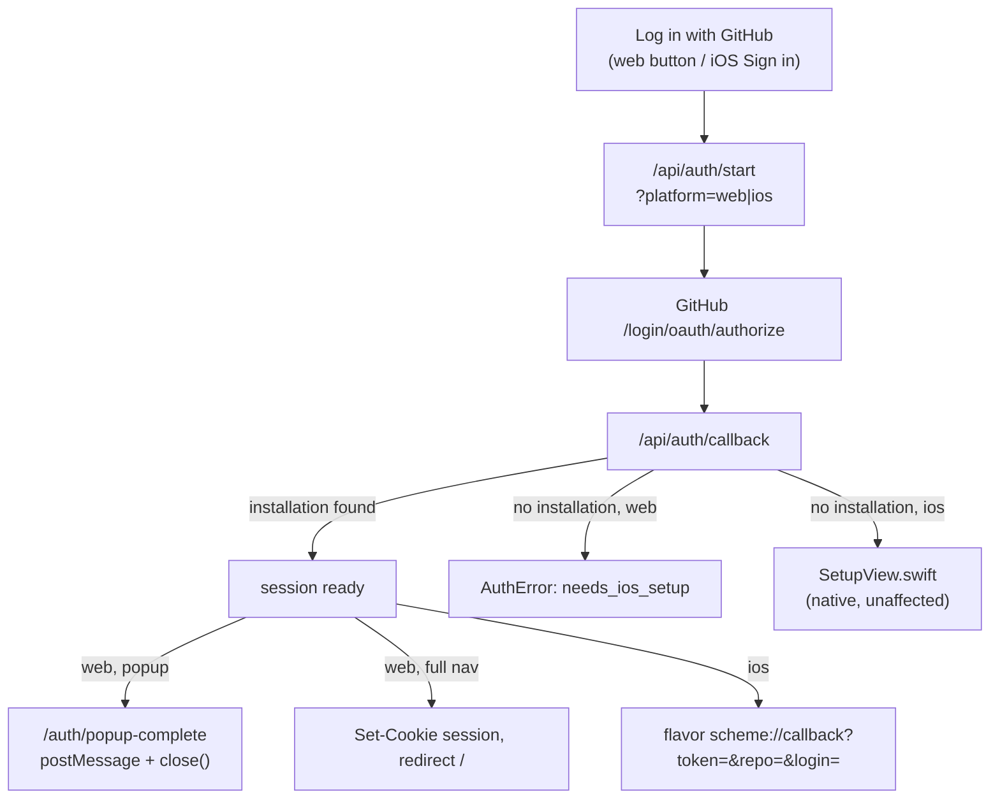

# GitHub Auth — how sign-in works (web + iOS, shared backend)

> Status: Current · Owner: UI Expert · Verified: 2026-08-24

## Context

One shared backend, `ui/api/auth/`, handles GitHub sign-in for both the web dashboard and the
iOS app. Repo creation and first-time setup moved to **iOS-only** (#164) — it needs a year of
Apple Health data only the iOS app can pull, and iOS already had its own native setup wizard
(`SetupView.swift`). Web is now **login-only**: an existing user signs in, done. A GitHub
account with no `coach-phelps` App install yet gets a plain "set up on iOS first" message
instead of a repo-creation UI.

## Flow

- Single entry point (`/api/auth/start`) for both new and returning users — identical whether
  the person is new or returning; the callback handler is what branches.
- The callback handler branches on `platform` (`web`/`ios`), carried in an HMAC-signed `state`
  URL param GitHub echoes back verbatim — not a cookie. A `coach_oauth_state` cookie was tried
  first but WKWebView (iOS's in-app browser) silently drops `Set-Cookie` on redirects, so the
  whole state payload (`codeVerifier`, `platform`, `popup`, `iosScheme`, `iat`) travels signed
  in the URL instead; see `_lib/pkce.ts`'s `signOAuthState`/`verifyOAuthState`. `iosScheme` is
  the iOS flavor's custom URL scheme (`coachhq` / `coachhq-dev` / `coachhq-staging`), passed as
  `?ios_scheme=` on `/api/auth/start` and allowlisted so a callback cannot be steered at an
  arbitrary scheme. `popup` is a third flag web
  sets when `GitHubAuthButton` opened the flow via `window.open()` instead of a full nav — every
  terminal redirect then goes to `/auth/popup-complete` instead of `/` or `/?auth_error=`.
- **iOS** still can't provision a repo via API (GitHub App tokens can't create personal repos —
  confirmed 404/403 on `/repos/{template}/generate` and `/user/repos`), so `SetupView.swift`
  still walks a first-timer through creating the repo from `sibling-shipyard/coach-skeleton`
  then installing the App — unchanged by #164, out of scope for web.

## Shared backend — `ui/api/auth/[...action].ts`

All auth endpoints live in one Vercel catch-all function (ADR 0017 — Hobby plan caps a
deployment at 12 functions), dispatching on the URL's dynamic segment. Each handler below is a
named export in that one file:

| Handler | Route | Role |
|---|---|---|
| `handleStart` | `/api/auth/start` | Entry point. Builds PKCE + signed state, redirects to GitHub's authorize endpoint. |
| `handleCallback` | `/api/auth/callback` | Token exchange, `GET /user`, installation lookup. Web: session or `AuthError`. iOS: `{flavor}://callback` (token, or `needs_setup=1` into `SetupView`). |
| `handleInstallRedirect` | `/api/auth/install-redirect` | iOS-only in practice now — `SetupView`'s "continue to install" step. `?platform=ios`. |
| `handleListMyRepos` | `/api/auth/list-my-repos` | Repo picker, dual auth (session cookie or Bearer). iOS-only in practice now — its fallback for the rare not-exactly-one-candidate case. |
| `handleMe` / `handleLogout` | `/api/auth/me` / `/api/auth/logout` | Web session read / clear. |
| `handleRefresh` | `/api/auth/refresh` | iOS-only — confidential half of the refresh-token exchange (iOS has no `client_secret`). |
| `_lib/session.ts` | — | JWE session cookie helpers, `ensureFreshSession()` (refresh-token rotation, ADR 0009). |
| `_lib/pkce.ts` | — | PKCE verifier/challenge + the signed-state helpers above. |
| `_lib/repo-resolution.ts` | — | Single source of truth for installation + owned-repo lookup, shared by `handleCallback` and `handleListMyRepos`. |

**Gotcha:** `ui/vercel.json`'s SPA fallback rewrite must stay scoped to exclude `/api/`
(`"source": "/((?!api/).*)"`). A plain `"/(.*)"` rewrite competes with this file's own wildcard
route (`/api/auth/*`) since both are dynamic patterns — Vercel reliably prefers a real function
over a rewrite for a *literal* path (`/api/waitlist`), but not reliably between two wildcards.
This took down GitHub sign-in on web and iOS simultaneously for several hours with no server-side
error to find, because the request never reached this file at all.

**iOS gotcha — the two handlers hand back different shapes.** `selectedRepo` is `owner/repo` when
it came from `handleListMyRepos`, but a bare repo name when it came from the OAuth callback. Always
use `GitHubAuthManager.repoFullName` for GitHub API URLs and the `X-Coach-Repo` header; never
concatenate `user.login` + `selectedRepo` blindly.

## Session mechanics (ADR 0009)

GitHub's access token dies at ~8h regardless of cookie settings. "Stay logged in" is
`ensureFreshSession()` (`_lib/session.ts`) silently exchanging the 6-month `refresh_token` for a
new access token 5 minutes before expiry, on every request, re-issuing a sliding 180-day
session cookie. iOS has no server session — it calls `/api/auth/refresh` itself and stores the
rotated pair in Keychain. Full reasoning: `kdb/decisions/0009-refresh-token-sliding-session.md`.

## Done when

Existing user logs in on web → dashboard, no repo-creation UI ever shown. A no-install GitHub
account on web → `AuthError`'s `needs_ios_setup` message, not a dead `/setup` route. iOS setup
flow unaffected.

## Deferred

- P2: `needs_ios_setup` message has a placeholder App Store mention — no app name/link yet
  (developer license in progress). Fill in once available.

## Appendix — file reference

| Path | Role |
|---|---|
| `ui/client/src/components/welcome/WelcomePage.tsx` | Web "Log in with GitHub" entry point |
| `ui/client/src/components/login/GitHubAuthButton.tsx` | Shared popup-based sign-in control |
| `ui/client/src/lib/authPopup.ts` | `window.open()` + `message`-listener helper |
| `ui/client/src/pages/AuthPopupComplete.tsx` | `/auth/popup-complete` — runs inside the popup only |
| `ui/client/src/pages/AuthError.tsx` | Renders `auth_error` types, incl. `needs_ios_setup` |
| `ui/client/src/components/RepoDataGate.tsx` | Loading/error/revoked states for `useRepoData()` pages |
| `ui/client/src/contexts/AuthContext.tsx` | Client-side auth state gate (`loading`/`local`/`unauthenticated`/`authenticated`) |
| `ui/api/auth/[...action].ts` | All auth handlers (`handleStart`, `handleCallback`, `handleInstallRedirect`, `handleRefresh`, `handleMe`, `handleLogout`, `handleListMyRepos`) — one catch-all function, see ADR 0017 |
| `ui/api/auth/_lib/session.ts` | Cookie helpers, JWE encrypt/decrypt, `ensureFreshSession()` |
| `ui/api/auth/_lib/pkce.ts` | PKCE verifier/challenge generation + signed OAuth state (`signOAuthState`/`verifyOAuthState`) |
| `ui/api/auth/_lib/repo-resolution.ts` | Shared installation/repo lookup logic |
| `ui/api/auth/_lib/resolve-auth.ts` | Per-request auth for repo-scoped endpoints (cookie or Bearer+X-Coach-Repo) |
| `ui/vercel.json` | Rewrites/headers — SPA fallback rewrite must exclude `/api/` (see Gotcha above) |
| `ios/CoachHQ/CoachHQ/Services/GitHubAuthManager.swift` | iOS sign-in, Keychain, repo resolution, token refresh |
| `ios/CoachHQ/CoachHQ/Views/SetupView.swift` | iOS native Setup wizard |
| `ios/CoachHQ/CoachHQ/Views/LoginView.swift` | iOS sign-in screen |
| `ios/CoachHQ/CoachHQ/CoachHQApp.swift` | iOS auth-state routing |
| `kdb/decisions/0009-refresh-token-sliding-session.md` | ADR for the refresh-token session design |
