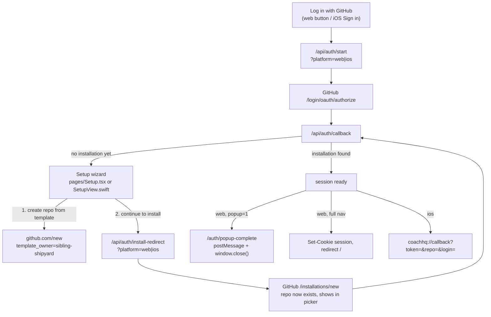
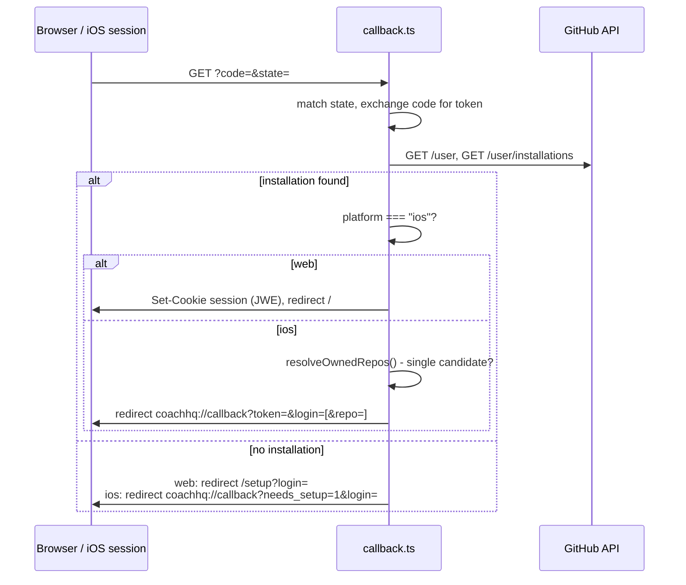

# GitHub Auth — how sign-in works (web + iOS, shared backend)

## Context

One shared backend, `ui/api/auth/`, handles GitHub sign-in for both the web dashboard and the
iOS app. There's a single entry point ("Log in with GitHub" on web, "Sign in with GitHub" on
iOS) - it looks the same whether the person is new or returning. First-time users (no
`coach-phelps` App installation yet) are walked through a two-step Setup wizard instead of
seeing a dead-end error page. Covers the same ground as [[strava-sync]] and [[ios-sync]] do for
their trigger paths - "if I press X, what changes."

This replaces an earlier two-button (Log in / Sign up) web-only flow and a completely separate
classic-OAuth iOS flow (embedded client secret, on-device token exchange - a real App Store
distribution blocker). Both are gone; this is what's there now.

Web also now opens the whole flow (sign-in, and Setup's install step) in a **popup window**
instead of navigating the tab away and back - functional parity with iOS's in-app WKWebView
sheet (never leaves the app, closes itself on completion), not a visual port. Web's own design
system is untouched; only the interaction model changed. See "Web flow" below.

## Why sign-up can't be fully automated

GitHub App user-to-server tokens cannot create repositories under a personal account - confirmed
live: `404 Not Found` on `POST /repos/{template}/generate`, `403 Resource not accessible by
integration` on `POST /user/repos`. This is a hard platform rule, not a config issue: Apps only
ever act on repos they're already installed on. Only a classic OAuth token/PAT with `repo` scope
can create a personal repo via API, and this system deliberately doesn't introduce one (keeps the
single-repo-access-only design the GitHub App was chosen for in the first place).

Every install of `coach-phelps` also grants access to exactly **one** repo, picked from GitHub's
own repo-picker on `/installations/new` - which only lists **existing** repos. So for a brand-new
user, the repo has to exist *before* that picker has anything to show.

Net result: two GitHub-native screens are unavoidable for a first-time user - creating the repo
from the `coach-skeleton` template, then installing the App on it. Everything else is automatic.
(`sibling-shipyard/coach-skeleton` had to be made **public** for this to work at all - a private
template is invisible to a brand-new account regardless of what kind of token it presents. Audited
first for secrets/PII before flipping visibility - clean, single commit, all placeholder data.)

## Overview

- Web always opens `start`/`install-redirect` in a popup now (`?popup=1`), so in practice the
  "web, popup=1" branch is the common path - the plain full-page-redirect branch only fires as
  `GitHubAuthButton`'s fallback when a popup can't be opened.

- The button always hits the plain `/login/oauth/authorize` sign-in endpoint - identical for new
  and returning users. It never routes straight into `/installations/new`; only `callback.ts`
  does that, and only when it discovers there's genuinely no installation yet.
- `callback.ts` branches its final response on a `platform` value (`web` or `ios`) that rides
  through the whole redirect chain inside the existing `coach_oauth_state` cookie payload
  (`{ state, codeVerifier, platform, popup }`) - `popup` is a third orthogonal flag web sets when
  `GitHubAuthButton` opened the flow via `window.open()` instead of a full-page nav (see "Web
  flow"). No new OAuth cookie, no new state machine - same payload, one more field.
- When `popup` is set, every terminal redirect in `callback.ts` (success, `needs_setup`, or an
  error) goes to `/auth/popup-complete` instead of `/`, `/setup`, or `/?auth_error=` - that page's
  only job is `postMessage`-ing the result back to `window.opener` and closing itself. The opener
  tab is what actually shows the dashboard/Setup/error state, exactly as if the full-page redirect
  had happened there directly.

## Shared backend — `ui/api/auth/`

| File | Role |
|---|---|
| `start.ts` | The one entry point. Builds PKCE state, redirects to GitHub's authorize endpoint. Accepts `?platform=ios`. |
| `callback.ts` | Shared landing point. Token exchange, `GET /user`, installation lookup (`app_slug` + `account.login` match, per #30). Branches on platform - see below. |
| `install-redirect.ts` | Internal step, not linked from product UI directly - only the Setup wizard's "Continue to install" calls it. Same PKCE/state mechanics as `start.ts`, targets `/apps/coach-phelps/installations/new`. Accepts `?platform=ios`. |
| `me.ts` | Session read endpoint (web only - iOS has no session cookie to read). |
| `logout.ts` | Clears the session cookie. |
| `list-my-repos.ts` | Repo resolution/picker. Dual auth: session cookie (web) or `Authorization: Bearer <token>` with no cookie (iOS's fallback for the rare 0-or-2+-candidate case). |
| `check-repo-exists.ts` | Web-only. Polled by `Setup.tsx`'s repo-create popup step to auto-detect when `coach-<login>` exists, using the short-lived `coach_setup_token` cookie (see Session mechanics) since no real session exists yet at that point. |
| `_lib/session.ts` | JWE session cookie helpers, plus the short-lived `SETUP_TOKEN_COOKIE` constant. |
| `_lib/pkce.ts` | PKCE verifier/challenge generation (unchanged from before). |
| `_lib/repo-resolution.ts` | **Single source of truth** for installation + owned-repo lookup - used by both `callback.ts` (iOS's inline resolution) and `list-my-repos.ts` (web's picker, iOS's fallback), so the ownership/marker-file rules can't drift between the two callers. |

### `callback.ts`'s platform branch

- **Web** gets what it always got: a `Set-Cookie` session, redirect to `/`.
- **iOS** has no cookie jar shared with the API - it authenticates every subsequent request with
  `Authorization: Bearer <gh_token>` + `X-Coach-Repo: owner/repo` (`_lib/resolve-auth.ts`'s
  contract, also what `widget-snapshots.ts` and `GitHubAPIClient.swift`'s direct GitHub calls
  use). So instead of a cookie, the redirect carries the raw token, plus `repo` when
  `resolveOwnedRepos()` finds exactly one owned+marker-confirmed candidate - true for every
  install going forward, since installs are single-repo by design. If it's not exactly one
  (legacy multi-repo installs), the app falls back to calling `list-my-repos.ts` itself with the
  bearer token once it has one, running the same picker logic web's `Onboarding.tsx` uses.
- Error paths mirror this split too: web redirects to `/?auth_error=<type>` (`AuthError.tsx`
  renders it); iOS gets `coachhq://callback?error=<type>`.

## Web flow

- **`GitHubAuthButton.tsx`** - the one shared sign-in control every screen below uses (swapped
  in for what used to be five separate `<a href="/api/auth/start">` links). Click opens
  `/api/auth/start?popup=1` in a popup (`lib/authPopup.ts`'s `window.open()` + a `message`
  listener), instead of navigating the tab away. Falls back to the old full-page redirect if the
  popup is blocked (`window.open()` returns `null`) or the browser strips `window.opener`
  (`AuthPopupComplete.tsx` self-redirects in that case). If the popup closes without ever posting
  a result (athlete just closed it), the button is a no-op - no error shown, they're free to try
  again. `onSuccess`/`onNeedsSetup` callbacks let a caller override the default
  navigate-to-`/`/`/setup?login=` behavior (`Setup.tsx`'s own install-step button uses this).
- **`AuthPopupComplete.tsx`** (`/auth/popup-complete`) - only ever reached inside the popup
  window itself, never in a normal tab. Reads `ok`/`needs_setup`/`login`/`error` off its query
  string (that's what `callback.ts` redirects it to in popup mode), `postMessage`s
  `{ type: "coach-auth-complete", ... }` back to `window.opener`, then `window.close()`s. On
  screen for a single frame at most - no design work needed here, ever.
- `WelcomePage.tsx` - `GitHubAuthButton` in the nav. (The old separate `/api/auth-install` "Sign
  up" link and `LoginPage.tsx`/`pages/Login.tsx` route are gone - both were fully replaced,
  unrelated to this popup change.)
- `AuthPageHeader.tsx` - shared header (brand + a contextual "Cancel"/"Sign out" link) used by
  every screen below plus `RepoDataGate.tsx` - none of these used to have a way back to the
  product page mid-flow.
- `pages/Setup.tsx` - shown when `callback.ts` redirects to `/setup?login=<login>`. Two steps,
  both now popup-based and auto-detecting instead of "click and hope you remembered to come
  back":
  - **Step 1 (create repo)** - `window.open()`s `github.com/new?template_owner=sibling-shipyard&template_name=coach-skeleton&owner=<login>&name=coach-<login>&visibility=private`
    directly (GitHub's own page, not one of our routes - no `postMessage` possible). Completion
    is detected by polling `check-repo-exists.ts`: on a 3s interval while the popup is open, and
    once more on `visibilitychange` when the athlete tabs back to this window. Auto-advances the
    step-2 button from disabled to enabled the moment the repo exists. A manual "I've done this -
    continue" button covers the case where polling misses or the setup-token cookie expired.
  - **Step 2 (install)** - `GitHubAuthButton` pointed at `/api/auth/install-redirect` - this leg
    *is* our own code end-to-end, so it gets the deterministic popup+postMessage-close treatment
    from section A above, no polling needed.
- `pages/Onboarding.tsx` - calls `list-my-repos.ts`, auto-selects on one candidate, renders a
  picker on 2+. The 0-candidate dead end (no recovery button at all) is fixed - "Try setup
  again" (via `GitHubAuthButton` when no `login` is known yet, otherwise a plain link to
  `/setup?login=`) and "Sign out" both work now.
- `RepoDataGate.tsx` - gates `Home.tsx` (and other `useRepoData()` consumers) on load/error
  states. `error`/`notOnboarded`/`schemaUnsupported` all have working "Switch repo"/"Sign out"
  buttons now (used to be dead ends - this is what "deleted my test repo, dashboard got stuck
  with no way back" looked like before). A `401` from `repo-file.ts` specifically shows "Your
  GitHub access expired - sign in again" with a `GitHubAuthButton`, distinct from the generic
  error state. `CoachChat.tsx`'s own access-revoked screen (a 401 from `coach-chat.ts`) uses the
  same button.

## iOS flow

`Setup.tsx` is reimplemented **natively** as `SetupView.swift` rather than embedding the React
page. OAuth and install run in a **shared in-app WKWebView** (`WebAuthPresenter.shared` +
`InAppAuthWebView`) backed by `WebAuthBrowserStore` — one cookie jar for the whole flow
(Google federated login → GitHub → repo create → app install). `ASWebAuthenticationSession` and
Safari each use separate stores, so federated cookies did not carry across the old split flow.

- `CoachHQApp.swift` — presents `InAppAuthWebView` in a `.sheet` bound to
  `WebAuthPresenter.shared`. OAuth resumes on `coachhq://` callback; browse mode (repo create)
  dismisses manually while cookies persist for step 2.
- `GitHubAuthManager.swift` — `signIn()` and `continueToInstall()` call
  `WebAuthPresenter.start()` against `{dashboardBaseURL}/api/auth/start?platform=ios` and
  `/api/auth/install-redirect?platform=ios` respectively. `continueToInstall()` also passes
  `suggested_target_id` (GitHub user id) so install lands on the right account. Parses the
  `coachhq://callback` redirect (`handleCallback()`): `error=` throws, `needs_setup=1&login=`
  sets `pendingSetupLogin` (routes to `SetupView`), `token=&login=[&repo=]` saves the token to
  Keychain (`com.siblingshipyard.coachhq.github.token`, unchanged key) and sets `selectedRepo`
  when present. `repoFullName` normalizes `selectedRepo` whether it is already `owner/repo` or
  repo-name-only — fixes `X-Coach-Repo` and REST URLs on legacy paths.
- `SetupView.swift` — step 1 calls `WebAuthPresenter.presentBrowse()` with the same
  `github.com/new?template_owner=...` URL (shared cookies, no app switch). Step 2 calls
  `authManager.continueToInstall()`. Cancel signs out — used to be force-quit only.
- `resolveRepoIfNeeded()` — fallback for the rare not-exactly-one-candidate case; calls
  `list-my-repos.ts` with `Authorization: Bearer <token>`, no `X-Coach-Repo` (that's what's being
  resolved). No native picker UI for 2+ results — `selectedRepo` stays nil and
  `bootstrapSession()` routes back into `pendingSetupLogin` instead of a broken `MainTabView`.
- `CoachHQApp.swift` routing: `isAuthenticated && (selectedRepo != nil || !isSessionReady)` →
  `MainTabView` (the `!isSessionReady` half keeps cold-launch resolution from flashing to
  `SetupView`); else `pendingSetupLogin != nil` → `SetupView`; else `LoginView`.
- `CoachSetupState` / `CoachSetupBootstrap` — after setup completes, new athletes land on the
  **Chat** tab until first Coach intake is done (`UserDefaults` per repo). On upgrade,
  `MainTabView` loads chat history first; existing threads auto-mark setup complete so returning
  athletes still open Home.
- `fetchUser()`/`resolveRepoIfNeeded()` failures surface via `lastNetworkError`, shown inline on
  `LoginView`/`SetupView` — used to fail with only a console `print()`, no signal at all.
- `GitHubAuthManager`'s public surface (`isAuthenticated`, `isSessionReady`, `user`,
  `selectedRepo`, `loadToken()`, `signOut()`) is unchanged for callers — `GitHubAPIClient.swift`
  does now call `validToken()` (see Session mechanics) instead of `loadToken()` in a couple of
  places, for the refresh-token rotation below.

## Session mechanics — refresh-token rotation (ADR 0009)

`coach-phelps` has GitHub's "expire user authorization tokens" opted in - the real GitHub
access token embedded in every session dies at **8h** no matter what. That's not a cookie
setting we control; it's GitHub's own token lifetime. So "stay logged in until you log out"
isn't a bigger `Max-Age` - it's silently exchanging the `refresh_token` GitHub already hands
back (6 months, rotated on each use) for a new access token before the old one dies. See
`kdb/decisions/0009-refresh-token-sliding-session.md` for the full decision record.

- **Web**: `coach_session` cookie - JWE (encrypted, not just signed) via `jose`, key =
  `SESSION_SECRET`. Payload: `{ github_user_id, login, gh_token, refresh_token,
  gh_token_expires_at, installation_id, repo_full_name? }` - two clocks, deliberately separate:
  `gh_token_expires_at` (the real ~8h GitHub token lifetime) vs. the cookie's own JWE expiry
  (the sliding 180-day cap below).
  `ensureFreshSession()` (`_lib/session.ts`) is the **one place** every handler reads the
  session now (`repo-file.ts`, `list-my-repos.ts`, `me.ts`, `coach-chat.ts`, `trigger-sync.ts`,
  `resolve-auth.ts`'s cookie branch) - decrypts, and if `gh_token_expires_at` is within 5
  minutes of now, exchanges the refresh token for a new pair
  (`POST https://github.com/login/oauth/access_token`, `grant_type=refresh_token`) and
  re-issues the cookie with a renewed 180-day `Max-Age` (`SESSION_MAX_AGE_SEC`) - a sliding
  window roughly matching the refresh token's own 6-month GitHub-side validity, so anyone
  active within any 6-month stretch never sees a login screen again. If the refresh itself
  fails, `ensureFreshSession()` **falls back to the pre-refresh session** (old access token,
  cookie left as-is) rather than hard-failing - refreshing proactively 5 minutes before actual
  expiry means the old token is almost always still valid at that moment, and a failed refresh
  is just as likely two concurrent requests racing over the same single-use refresh token
  (GitHub rotates it on each use - one request wins, the other's exchange is rejected even
  though the session is fine) as it is a genuine revocation (issue #117). A *real* revocation
  surfaces on its own the next time the old token is actually used against GitHub -
  `repo-file.ts`'s direct 401/403 check (below) is what shows "your GitHub access was revoked
  or expired, sign in again," not the refresh layer guessing at it. iOS's `validToken()` has
  always worked this way (falls back to the old token on refresh failure); this brought web in
  line with it.
  `coach_oauth_state` - short-lived (10 min), carries `{ state, codeVerifier, platform, popup }`
  across the GitHub redirect round trip.
  `coach_setup_token` - new, short-lived (20 min). `callback.ts`'s `setupRedirect()` sets it to
  the just-obtained `gh_token` whenever a first-timer has no installation yet - at that point
  there's no `installation_id` to build a real session around, so this stands in just long
  enough for `Setup.tsx`'s repo-create polling (`check-repo-exists.ts`) to work without a second
  sign-in. Cleared the moment a real session gets created (install completes).
- **iOS**: no server-side session - stateless, same as before. Every API call presents
  `Authorization: Bearer <gh_token>` + `X-Coach-Repo: owner/repo`, verified by
  `_lib/resolve-auth.ts` (which itself calls `ensureFreshSession()` for the web-cookie half of
  its own dual auth). iOS can't do the refresh exchange itself - that needs `client_secret`
  server-side, exactly what the OAuth rewrite removed from the app - so it calls
  **`/api/auth/refresh`**, a new endpoint whose only job is the confidential half of the
  exchange. No cookie/bearer auth on that endpoint itself: possessing a valid, GitHub-issued
  `refresh_token` *is* the auth, same trust model as the initial sign-in exchange in
  `callback.ts`. `GitHubAuthManager.validToken()` calls it proactively (5-minute buffer, same
  as the web side) from `GitHubAPIClient`'s central retry choke point, and stores the rotated
  `refresh_token`/expiry in Keychain alongside the access token.

## Appendix — file reference

| Path | Role |
|---|---|
| `ui/client/src/components/welcome/WelcomePage.tsx` | Web "Log in with GitHub" entry point |
| `ui/client/src/components/login/GitHubAuthButton.tsx` | Shared popup-based sign-in control, used everywhere a "sign in with GitHub" action appears |
| `ui/client/src/lib/authPopup.ts` | `window.open()` + `message`-listener helper `GitHubAuthButton` is built on |
| `ui/client/src/pages/AuthPopupComplete.tsx` | `/auth/popup-complete` - runs only inside the popup, posts the result to `window.opener` and closes itself |
| `ui/client/src/components/login/AuthPageHeader.tsx` | Shared header (brand + Cancel/Sign out) |
| `ui/client/src/pages/Setup.tsx` | Web Setup wizard - both steps popup-based, step 1 auto-detects via polling |
| `ui/client/src/pages/Onboarding.tsx` | Web repo picker (post-auth) |
| `ui/client/src/pages/AuthError.tsx` | Renders `auth_error` types |
| `ui/client/src/components/RepoDataGate.tsx` | Loading/error/not-onboarded/revoked states for `useRepoData()` pages |
| `ui/client/src/contexts/AuthContext.tsx` | Client-side auth state gate |
| `ui/api/auth/start.ts` | Sign-in entry point (both platforms), accepts `?popup=1` on web |
| `ui/api/auth/callback.ts` | Shared OAuth callback, platform + popup branch |
| `ui/api/auth/install-redirect.ts` | Setup wizard step 2, accepts `?popup=1` on web |
| `ui/api/auth/check-repo-exists.ts` | Web-only. Polled by `Setup.tsx` step 1 using the short-lived setup-token cookie |
| `ui/api/auth/refresh.ts` | iOS-only: confidential half of the refresh_token exchange |
| `ui/api/auth/me.ts` | Web session read endpoint |
| `ui/api/auth/logout.ts` | Clears web session cookie |
| `ui/api/auth/list-my-repos.ts` | Repo resolution/picker, dual auth |
| `ui/api/auth/_lib/session.ts` | Cookie helpers, JWE encrypt/decrypt, `ensureFreshSession()`, `SETUP_TOKEN_COOKIE` |
| `ui/api/auth/_lib/pkce.ts` | PKCE verifier/challenge generation |
| `ui/api/auth/_lib/repo-resolution.ts` | Shared installation/repo lookup logic |
| `ui/api/auth/_lib/resolve-auth.ts` | Per-request auth for repo-scoped endpoints (cookie or Bearer+X-Coach-Repo) |
| `ui/api/repo-file.ts` | Reads `gen/aggregate.json`; 401 → revoked-access copy |
| `ui/api/widget-snapshots.ts` | Server-side widget snapshot generation, used by iOS |
| `ios/CoachHQ/CoachHQ/Services/GitHubAuthManager.swift` | iOS sign-in, Keychain, repo resolution, token refresh |
| `ios/CoachHQ/CoachHQ/Views/SetupView.swift` | iOS native Setup wizard |
| `ios/CoachHQ/CoachHQ/Views/LoginView.swift` | iOS sign-in screen |
| `ios/CoachHQ/CoachHQ/CoachHQApp.swift` | iOS auth-state routing |
| `ios/CoachHQ/CoachHQ/Services/GitHubAPIClient.swift` | iOS direct GitHub Contents/Git Data API calls |
| `kdb/decisions/0009-refresh-token-sliding-session.md` | ADR for the refresh-token session design |
