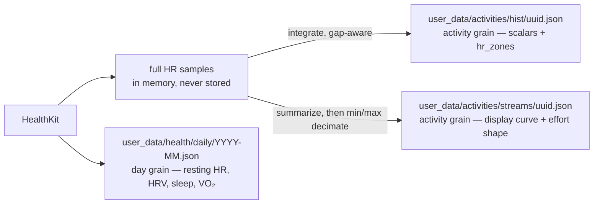

# HealthKit richer signals — day-grain ledger + HR stream sidecar

> Status: Current · Owner: Tech Lead · Verified: 2026-08-23 · ADR: 0027 · Issues: [#156](https://github.com/sibling-shipyard/coach-hq/issues/156), [#501](https://github.com/sibling-shipyard/coach-hq/issues/501)

Architecture, approved. Detail in [`healthkit-richer-signals-lld.md`](healthkit-richer-signals-lld.md).
Extends ADR 0020 (same grain logic, one level down) and ADR 0014 (uuid match key). Supersedes
PR #162 as-shaped.

**Shipped:** the activity-grain half — HR timestamps kept, gap-aware zone integration, and the
`streams/<uuid>.json` sidecar, rendered as the "how it was spent" ribbon (#497, #156).
**Not shipped:** the day-grain ledger. Split out to #501 with its two open questions.
**Dropped:** stream backfill for existing history — see below.

## Context

PR #162 restores HR sample timestamps — zones stop being `duration/count` guesses and become
real midpoint integration — and adds four new signals. But it hangs all four off the activity
record, and resting HR, HRV, sleep and VO₂ Max are **day-grain, not activity-grain**: they
duplicate across two-session days, vanish on rest days (exactly when recovery matters), and
VO₂ is backdated onto the workout as "most recent on or before", so no trend can ever be
reconstructed from it. That already blocks us — `buildVo2Snapshot()` in
`ui/client/src/components/home-warm/warmHomeSnapshots.ts:639` is hard-stubbed `"unavailable"`
pending a real VO₂ series, and the widget wants `trend: TrendPointSnapshot[]`.

PR #162 was the original attempt. Its widget/UI half had already landed on main
independently, and only its ingestion diff was still worth taking; that diff was cherry-picked
and corrected under #497. #162 and #427 are closed.

## Decision

Three write targets, three grains. `Activity` keeps the four new scalars **off** it entirely;
`hr_stream` moves out of the activity record into a sidecar keyed by `activityId` (the
`HKWorkout` uuid, ADR 0014). Daily rows would be written for every day sync touches, workout or
not, one file per month to keep commits small — **deferred to #501**, so the third target does
not exist yet.

| Concern | Lives in | Read by |
|---|---|---|
| Scalars + `hr_zones` | `hist/*.json` | aggregate (via `projectActivity` allowlist), coach, list views |
| Display HR curve | `streams/<uuid>.json` | iOS detail view only, fetched on demand |
| HR effort shape | `streams/<uuid>.json` | Coach prompt renderer; ≤12 full-sample blocks |
| Recovery + fitness | `health/daily/YYYY-MM.json` | new `daily_health` aggregate key → VO₂ trend widget |

**Zones come from the full sample set, never the sidecar.** The ≤200-point curve is display
data. Zone seconds are integrated over every raw sample, gap-aware: a dropout accrues to
`uncovered_seconds`, and no sample is stretched across it. Partial sensor coverage must read as
partial, not as false precision.

`effort_shape` is also derived before display decimation. It targets five-minute elapsed-time
blocks, capped at 12 by widening blocks on long sessions. Every emitted block carries median BPM,
nearest-rank p90 BPM, the coverage-time-weighted dominant zone, and covered seconds. Blocks with
no coverage are absent, while the sidecar's `gaps` and each partial block's `covered_seconds` keep
missing data explicit. Boundaries are the same athlete-owned values used for `hr_zones` (ADR 0028).

**Why the sidecar.** `engine/lib/projectActivity.mjs` already keeps time series out of the
aggregate. Sidecar extends that to the source file, which buys two things: Coach reading a raw
activity (`engine/core/query_history.py --detail`) no longer pulls 200 HR points of noise into
context, and backfill becomes an additive write — no read-modify-write of every hist file, no
decode risk. `commitFiles` in `ios/CoachHQ/CoachHQ/Services/GitHubAPIClient.swift:355` uses the
blob/tree API, so writes to new paths cost the same as overwrites. Price: the detail view pays
one extra fetch, on demand. Idempotency is by `schema_version` + `generator` inside the file,
not by file existence, so a future format change can re-run cleanly.

**Backfill was dropped** — reasoning below. Had it been built it would have needed its own
entry point: normal sync derives its window from `syncState.hkLastSynced`
(`HealthKitSyncManager.swift:201`), so a backfill riding that path finds nothing.

**What shipped.** ADR 0027, then ingestion (gap-aware zones + the stream sidecar, with the
repo's first XCTest target) under #497, then the ribbon coloured from real heart rate under #156.
The plan doc that sequenced it was deleted on completion — git history is the archive. The
day-grain half is #501; stream backfill was dropped for the reasons above.

**Carried into #501.** Two defects in PR #162's day-grain fetches were never fixed because that
code was not taken: `fetchSleepHours` used `.strictStartDate` on a fixed 9pm–8am window, so a
sleep block starting 8:45pm was dropped rather than clipped — it needs interval overlap. And HRV
and resting HR used `.discreteAverage` across the whole day, folding in post-workout readings;
the morning-window rule in the LLD replaces it. Both are **P1** for whoever picks up #501.

## What backfill would have bought, and why it was dropped

The plan carried a fourth phase: walk history and write sidecars for already-synced workouts.
Measured against the real repo, it does not earn its build.

| | Count | Source |
|---|---|---|
| Older activities | 876 | Garmin Forerunner 935 → Strava |
| HealthKit activities | 36 | Apple Watch, all after 2026-07-31 |

Two findings kill it:

1. **HealthKit does not hold the Garmin data.** Those 876 came in through Strava, whose
	ingestion was removed under ADR 0010. No amount of code recovers a real curve for 96% of the
	history. Their `hr_zones` are also *correct* — computed by the Strava pipeline over the full
	Garmin stream, never by the `duration / count` estimate this work replaced. The overcount was
	only ever on the HealthKit path.
2. **The value decays to nothing.** `ActivityListView.recentEntries` shows a 7-day window. Every
	new workout gets a real ribbon at sync, so within a week of install that list is entirely
	real without any backfill. The feature is a one-week head start on 16 activities.

**Residual, accepted:** those 36 HealthKit activities keep slightly inflated zone totals — one
measured 685s of Zone 1 reported as 896s. They are recent, and Coach weights recent sessions, so
it is a real if small distortion. It self-corrects as new sessions accumulate. Revisit only if
something downstream is shown to care.

## Done when

Shipped and verified:

1. `Σ zone_seconds + uncovered_seconds == elapsed_time` (±1s) — asserted in
	`ios/CoachHQ/CoachHQTests/HRAnalysisTests.swift` against a synthetic mid-session dropout, not
	just full coverage.
2. Global max and min HR survive decimation to 200 points — an interval session keeps its peaks.
3. Uncovered time is excluded from zone totals rather than smeared into a zone. Confirmed on real
	data: an 896s session with 211s uncovered reported 685s of Zone 1, where the old estimate
	claimed 896s.
4. Decoding a pre-change activity JSON does not crash — no migration required.
5. `gen/aggregate.json` stays under 1MB with sidecars present (ADR 0020's bound holds).
6. `effort_shape` stays at ≤12 time-ordered blocks and is computed from full samples with gaps
   and partial coverage preserved; sidecars without the optional field still decode.

Note on rendering: a gap does **not** draw as a hole. The "how it was spent" ribbon carries the
neighbouring zone across it, because a blank cell in a 29-cell ribbon reads as a rendering fault
rather than as missing data. The honest accounting is in the legend beneath, which never counts
uncovered time.

Belonging to #501, not this doc:

7. A rest day with no workout still produces a `health/daily/` row.
8. A second sync on a day whose row already has `sleep_hours` but not `vo2_max` leaves
	`sleep_hours` intact.
9. `buildVo2Snapshot()` returns `status: "available"` with ≥2 trend points from real HK data.

## Deferred

- P2 — zone seconds span `elapsed`, not `moving`. Stated here rather than changed silently.
- P2 — zone *boundaries* are hardcoded in three places and only the iOS copy is athlete-editable
	(#495). Exact integration against wrong thresholds is still wrong; it waits on #501 for real
	`resting_hr`.
- P2 — the 876 Garmin-sourced activities can never show a measured ribbon. Whether to mark them
	visually as estimated is undecided.
- P3 — derive cross-signal claims such as cardiac drift or decoupling only when pace or power
  supports them; `effort_shape` alone does not establish cause.
