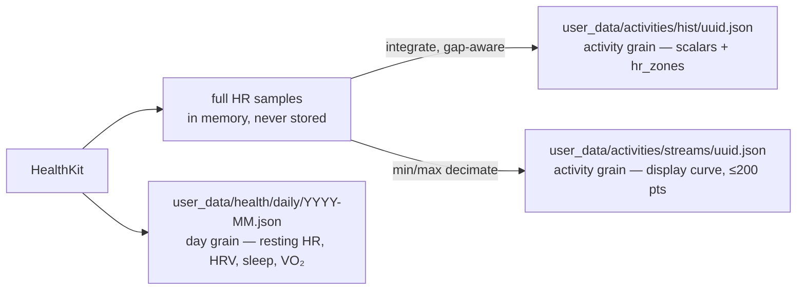

# HealthKit richer signals — day-grain ledger + HR stream sidecar

> Status: **Architecture approved** (grain split). Detail locked in
> [`healthkit-richer-signals-lld.md`](healthkit-richer-signals-lld.md). Extends ADR 0020 (same
> grain logic, one level down) and ADR 0014 (uuid match key). Supersedes PR #162 as-shaped.
> Owner: Tech Lead.

## Context

PR #162 restores HR sample timestamps — zones stop being `duration/count` guesses and become
real midpoint integration — and adds four new signals. But it hangs all four off the activity
record, and resting HR, HRV, sleep and VO₂ Max are **day-grain, not activity-grain**: they
duplicate across two-session days, vanish on rest days (exactly when recovery matters), and
VO₂ is backdated onto the workout as "most recent on or before", so no trend can ever be
reconstructed from it. That already blocks us — `buildVo2Snapshot()` in
`ui/client/src/components/home-warm/warmHomeSnapshots.ts:638` is hard-stubbed `"unavailable"`
pending a real VO₂ series, and the widget wants `trend: TrendPointSnapshot[]`.

Separately, PR #162 is 137 commits behind main and its widget/UI half has already landed
there independently. Only the ingestion diff is still live.

## Decision

Three write targets, three grains. `Activity` keeps the four new scalars **off** it entirely;
`hr_stream` moves out of the activity record into a sidecar keyed by `activityId` (the
`HKWorkout` uuid, ADR 0014). Daily rows are written for every day sync touches, workout or not,
one file per month to keep commits small.

| Concern | Lives in | Read by |
|---|---|---|
| Scalars + `hr_zones` | `hist/*.json` | aggregate (via `projectActivity` allowlist), coach, list views |
| Display HR curve | `streams/<uuid>.json` | iOS detail view only, fetched on demand |
| Recovery + fitness | `health/daily/YYYY-MM.json` | new `daily_health` aggregate key → VO₂ trend widget |

**Zones come from the full sample set, never the sidecar.** The ≤200-point curve is display
data. Zone seconds are integrated over every raw sample, gap-aware: a dropout accrues to
`uncovered_seconds`, and no sample is stretched across it. Partial sensor coverage must read as
partial, not as false precision.

**Why the sidecar.** `engine/lib/projectActivity.mjs` already keeps time series out of the
aggregate. Sidecar extends that to the source file, which buys two things: Coach reading a raw
activity (`engine/core/query_history.py --detail`) no longer pulls 200 HR points of noise into
context, and backfill becomes an additive write — no read-modify-write of every hist file, no
decode risk. `commitFiles` in `ios/CoachHQ/CoachHQ/Services/GitHubAPIClient.swift:355` uses the
blob/tree API, so writes to new paths cost the same as overwrites. Price: the detail view pays
one extra fetch, on demand. Idempotency is by `schema_version` + `generator` inside the file,
not by file existence, so a future format change can re-run cleanly.

**Backfill is a separate discovery path.** Normal sync derives its window from
`syncState.hkLastSynced` (`HealthKitSyncManager.swift:180`), so a backfill riding that path
would find nothing. It gets its own entry point querying an explicit range, writes `streams/`
only, and never advances the watermark.

**Ship order.** Fresh branch off main, cherry-pick #162's ingestion diff (`Activity.swift`,
`ActivityMapper.swift`, `HealthKitSyncManager.swift`), close #162. Then: (1) ADR covering both
grain decisions, (2) ingestion PR — gap-aware zones + stream sidecar, (3) daily ledger PR —
writer + aggregate key + unstub `buildVo2Snapshot`, (4) backfill PR. Steps 2–4 ship independently.

**Fix before ingestion lands.** `fetchSleepHours` uses `.strictStartDate` on a fixed 9pm–8am
window, so a sleep block starting 8:45pm is dropped rather than clipped — needs interval overlap
(**P1**). HRV and resting HR use `.discreteAverage` across the whole day, folding in post-workout
readings; the morning-window rule in the LLD replaces it (**P1**).

## Done when

1. `Σ zone_seconds + uncovered_seconds == elapsed_time` (±1s) — verified on a workout with a
   deliberate mid-session sensor dropout, not just on full coverage.
2. A sidecar with a >60s dropout renders as a visible gap, not an interpolated line.
3. A rest day with no workout still produces a `health/daily/` row.
4. A second sync on a day whose row already has `sleep_hours` but not `vo2_max` leaves
   `sleep_hours` intact.
5. `buildVo2Snapshot()` returns `status: "available"` with ≥2 trend points from real HK data.
6. Decoding a pre-change activity JSON does not crash — no migration required.
7. Backfill run twice at the same generator version produces zero commits on the second pass.
8. `gen/aggregate.json` stays under 1MB with streams present (ADR 0020's bound holds).

## Deferred

- P2 — zone seconds now span `elapsed`, not `moving`; state the choice, don't silently change it.
- P2 — sleep window is fixed 9pm–8am; naps and late sleepers under-count.
- P3 — backfill day-grain signals as well as HR streams (needs a per-day HK sweep, not a workout walk).
- P3 — expose the HR curve to Coach as a summarized shape (drift, decoupling) rather than raw points.
