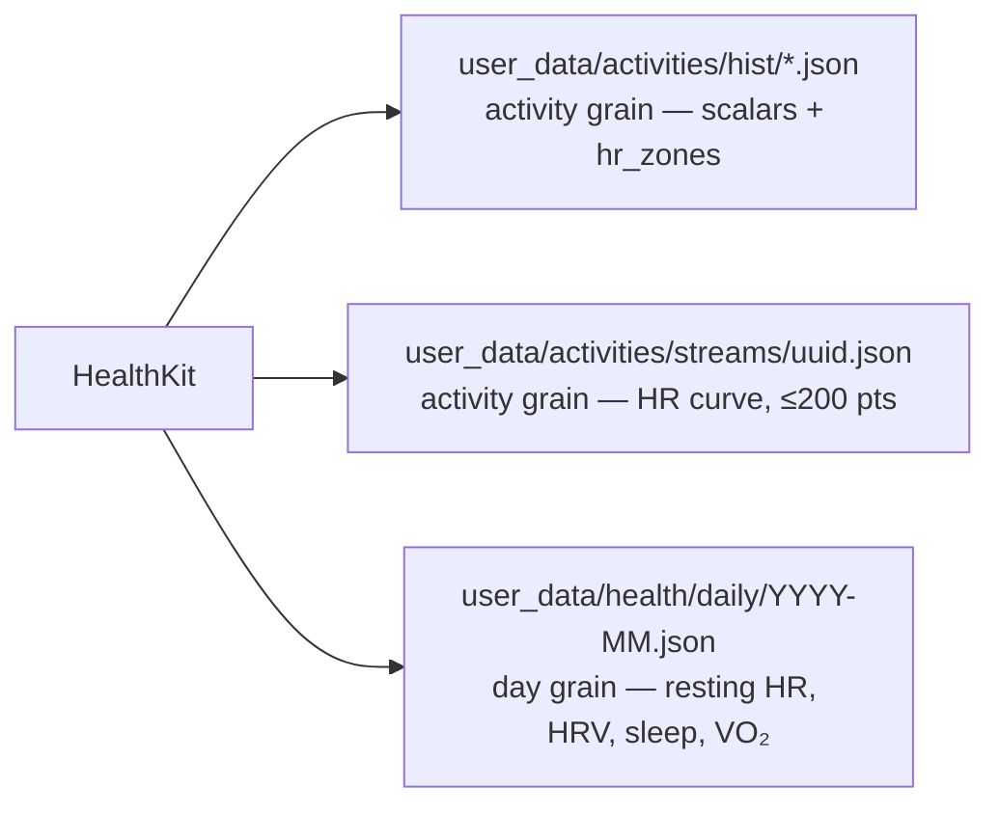

# HealthKit richer signals — day-grain ledger + HR stream sidecar

> Status: **Proposal — not yet approved.** Extends ADR 0020 (same grain logic, one level
> down) and ADR 0014 (uuid match key). Supersedes PR #162 as-shaped. Owner: Tech Lead.

## Context

PR #162 restores HR sample timestamps — zones stop being `duration/count` guesses and become
real midpoint integration — and adds four new signals. But it hangs all four off the activity
record, and resting HR, HRV, sleep and VO₂ Max are **day-grain, not activity-grain**: they
duplicate across two-session days, vanish on rest days (exactly when recovery matters), and
VO₂ is backdated onto the workout as "most recent on or before", so no trend can ever be
reconstructed from it. That already blocks us — `buildVo2Snapshot()` in
`ui/client/src/components/home-warm/warmHomeSnapshots.ts:638` is hard-stubbed `"unavailable"`
pending a real VO₂ series, and the widget wants `trend: TrendPointSnapshot[]`.

Separately, PR #162 is 137 commits behind main and its widget/UI half has already landed
there independently. Only the ingestion diff is still live.

## Decision (proposed)

Three write targets, three grains. `Activity` keeps the four new scalars **off** it entirely;
`hr_stream` moves out of the activity record into a sidecar keyed by `activityId` (the
`HKWorkout` uuid, ADR 0014). Daily rows are written for every day sync touches, workout or not,
one file per month to keep commits small.

| Concern | Lives in | Read by |
|---|---|---|
| Scalars + `hr_zones` | `hist/*.json` | aggregate (via `projectActivity` allowlist), coach, list views |
| HR curve | `streams/<uuid>.json` | iOS detail view only, fetched on demand |
| Recovery + fitness | `health/daily/YYYY-MM.json` | new `daily_health` aggregate key → VO₂ trend widget |

**Why the sidecar.** `engine/lib/projectActivity.mjs` already keeps time series out of the
aggregate. Sidecar extends that to the source file, which buys two things: Coach reading a raw
activity (`engine/core/query_history.py --detail`) no longer pulls 200 HR points of noise into
context, and backfill becomes pure additive writes — no read-modify-write of every hist file,
no decode risk, idempotent by file existence. `commitFiles` in
`ios/CoachHQ/CoachHQ/Services/GitHubAPIClient.swift:355` uses the blob/tree API, so writes to
new paths cost the same as overwrites. Price: the detail view pays one extra fetch, on demand.

**Backfill is in scope.** HealthKit retains workout HR samples on-device indefinitely, so every
workout inside the year we already scan is re-queryable. Match hist file → `HKWorkout` by uuid;
pre-0014 and Strava-sourced files fall back to start-time + duration, or are skipped.

**Ship order.** Fresh branch off main, cherry-pick #162's ingestion diff (`Activity.swift`,
`ActivityMapper.swift`, `HealthKitSyncManager.swift`), close #162. Then: (1) ADR covering both
grain decisions, (2) ingestion PR — timestamped zones + stream sidecar, (3) daily ledger PR —
writer + aggregate key + unstub `buildVo2Snapshot`, (4) backfill PR. Steps 2–4 ship independently.

**Fix before ingestion lands.** `fetchSleepHours` uses `.strictStartDate` on a fixed 9pm–8am
window, so a sleep block starting 8:45pm is dropped rather than clipped — needs interval overlap
(**P1**). HRV and resting HR use `.discreteAverage` across the whole day, folding in post-workout
readings; a recovery signal wants the morning value (**P1**).

## Done when

1. Zone seconds sum to within 1% of `elapsed_time` on a workout with full HR coverage.
2. A rest day with no workout still produces a `health/daily/` row.
3. `buildVo2Snapshot()` returns `status: "available"` with ≥2 trend points from real HK data.
4. Decoding a pre-change activity JSON does not crash — no migration required.
5. Backfill run twice in a row produces zero new commits on the second pass.
6. `gen/aggregate.json` stays under 1MB with streams present (ADR 0020's bound holds).

## Deferred

- P2 — zone seconds now span `elapsed`, not `moving`; state the choice, don't silently change it.
- P2 — sleep window is fixed 9pm–8am; naps and late sleepers under-count.
- P3 — backfill day-grain signals as well as HR streams (needs a per-day HK sweep, not a workout walk).
- P3 — expose `hr_stream` to Coach as a summarized shape (drift, decoupling) rather than raw points.
