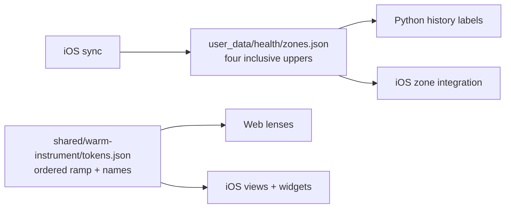

# Heart-rate zones

> Status: Current · Owner: Tech Lead · Verified: 2026-08-23 · ADR: 0028

## Context

Zone boundaries are athlete physiology; zone colours and names are shared product design. They must not drift across Coach, iOS, web and widgets.

## Decision

`zones.json` is absent until iOS seeds or overrides it. Every reader falls back to `[131,145,158,172]` when it is missing, malformed or non-increasing. Historical activities keep their stored edges and seconds.

## Done when

- Python, Node and iOS accept the same four-boundary contract and preserve the old default.
- Warm Instrument generation feeds one five-zone ramp to web, iOS and WidgetKit.
- No carve template, golden fixture or web boundary label owns another copy.

## Deferred

- Derived Karvonen defaults wait for the automated resting-heart-rate source in #501.
- Historical zone recomputation and per-sport zone sets are out of scope.
