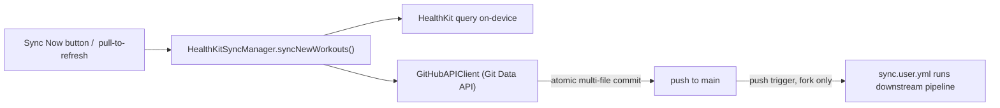

# iOS (HealthKit) Sync — how it works

> Status: Current · Owner: iOS Builder · Verified: 2026-08-31

## Context

Akash's data comes from Apple Health via the native iOS app under `ios/` — this is the only
ingestion path this repo supports (Strava ingestion was removed, issue #113). This doc traces
exactly what happens when he presses Sync in the app: it talks straight to GitHub's API from
the phone, no GitHub Actions involved in the sync action itself.

## Overview



## Trigger — pressing Sync

Entry points, all calling the same manager:

- `SettingsView.swift` — the "Sync Now" button.
- Pull-to-refresh on the same screen.
- `ActivityListView.swift` — sync from the activity list.
- Background HealthKit delivery — iOS can wake the app on new workouts.

All of them call `HealthKitSyncManager.syncNewWorkouts()` directly, on-device. **No workflow is
dispatched** — this is the structural difference from Strava sync, which always goes through
GitHub Actions.

Before reading workouts, `HRZoneStore` reads `user_data/health/zones.json` and mirrors valid
boundaries into `UserDefaults` for synchronous, offline-safe integration. A missing file is seeded
from the device's current settings through the same atomic commit. Malformed content or a failed
settings read preserves the device mirror and never blocks workout sync.

## What `syncNewWorkouts()` does, in order

```mermaid
sequenceDiagram
    participant U as User
    participant M as HealthKitSyncManager
    participant HK as HealthKit
    participant GH as GitHub API
    participant C as Coach message API
    U->>M: tap Sync Now
    M->>GH: read user_data/health/zones.json
    M->>M: mirror boundaries, or seed when absent
    M->>GH: read user_data/activities/sync_state.json
    M->>HK: query workouts since min(hk_last_synced, now - 14d)
    M->>GH: list + read hk_ hist files in the window (session match)
    M->>M: WorkoutDeduplicator clusters live + committed sessions
    loop each cluster
        M->>M: insert (new #N + Coach) or upsert (aliases / HR, silent)
    end
    M->>GH: commitFiles() - atomic multi-file commit
    GH-->>M: push to main
    M->>M: wait for fresh pipeline snapshot
    M->>C: POST sorted source-qualified activity ids
    C-->>M: exact durable message + should_notify
    M->>M: refresh Home; notify only when requested
```

1. **Read sync state** — `apiClient.readSyncState()` fetches
   `user_data/activities/sync_state.json` from GitHub to get `hk_last_synced`. Missing (first
   sync) means a full year of history.
2. **Query HealthKit** — pulls `HKWorkout` samples since **`min(hk_last_synced, now − 14 days)`**
   — see "Late arrivals" below for why the watermark alone is not enough. Local device data, not
   a repo file. If nothing new, stops here.
3. **List existing history** — fetches `user_data/activities/hist/` and reads `hk_*` files in
   the window. Filenames give uuids; contents give start/end/sport/`aliases` for session match
   (ADR 0035).
4. **Cluster** — `WorkoutDeduplicator` groups live HealthKit recordings with those committed
   rows (see "Late arrivals").
5. **Per cluster:**
   - **Already in hist** — upsert that file. Append new uuids to `aliases`. Re-fetch HR only when
     coverage is incomplete or a new uuid appeared. No `#N`. No Coach.
   - **New session** — `ActivityMapper.map()`, HR fetch, `ActivityNamer` assigns `{SportType} #{N}`
     and `hk_YYYY-MM-DD_<uuid>.json`. Coach POSTs those ids only.
   - Strava-era `YYYY-MM-DD_HHMMSS_<id>.json` names still block an insert on the same timestamp.
   - `category` is **not** auto-assigned at sync (left nil).

6. **Commit** — `GitHubAPIClient.commitFiles()` batches the new activity file(s), any HR stream
   sidecars, plus the updated `sync_state.json` into **one atomic commit**. It uses GitHub's Git
   Data API: create blobs, read HEAD, build a tree, create a commit, then move the branch ref. A
   non-fast-forward conflict retries against a fresh HEAD. Pushed straight to `main`.
7. **Wait for derived data** — updates the on-device activity cache immediately, then
   `refreshAfterSync` polls until `home.sync.timestamp` proves the user-repo pipeline has rebuilt
   fresh derived context.
8. **Ask Coach once** — sends the round's sorted `healthkit:<UUID>` ids to
   `/api/coach-message`. A valid response triggers one more widget-snapshot refresh so Home reads
   the durable `latest_message.json` projection. Generation, write, decode, or refresh failure
   never changes sync success.
9. **Notify only after delivery** — the generic “Coach is reviewing” notification does not
   exist. A local notification is scheduled only when the endpoint returns `should_notify: true`;
   its body is the exact Coach body and its account-scoped route carries the same body and seed.

### What a round writes

Two paths per workout, not one (ADR 0027):

| Path | Grain | Holds |
|---|---|---|
| `user_data/activities/hist/<name>.json` | activity | scalars + `hr_zones` |
| `user_data/activities/streams/<uuid>.json` | activity | HR display curve, ≤200 points; optional full-sample `effort_shape`, ≤12 blocks |

The round can also write `user_data/health/zones.json` when the file is absent or the athlete saves
a custom override. It uses `syncNewWorkouts(extraFiles:)`, so there is no second commit path. If a
save arrives during an active round, the manager keeps the latest encoded file and starts a
follow-up round when the current one releases the sync lock.

The sidecar is written only for workouts that have a HealthKit uuid and at least one HR sample —
the pre-ADR-0014 slug fallback has no stable key to file one under. Both land in the same
`commitFiles` tree, so a round stays atomic.

**Zones are integrated, not estimated.** `HRAnalysis.integrateZones` walks the full sample set
gap-aware: each sample owns the midpoint interval to its neighbours, clamped to 30s either side,
and elapsed time no sample owns accrues to `uncovered_seconds` rather than entering a zone. The
invariant `Σ zone_seconds + uncovered_seconds == elapsed_time` is asserted in
`ios/CoachHQ/CoachHQTests/HRAnalysisTests.swift`. Curve decimation is min/max per bucket so an
interval session keeps its peaks.

**Coach receives a summary, not the curve.** `effort_shape` targets five-minute elapsed-time
buckets and caps the result at 12, so blocks widen on sessions longer than one hour. Each covered
block stores its relative start/end seconds, raw-sample median and nearest-rank p90 BPM,
coverage-time-weighted dominant zone, and covered seconds. Fully uncovered buckets are omitted;
partial buckets report only sample-owned coverage. The same repo-backed `HRZoneConfig.current`
used for `hr_zones` supplies the boundaries. The field is optional, so sidecars without it decode.

### Canonical id — HKWorkout uuid

Each HealthKit activity carries a **stable canonical id** = its `HKWorkout.uuid`, written in two
places:

- **In the JSON** — `id` and `id_str` fields (`ActivityMapper` sets both from `workout.uuid`).
  `Activity` decodes `id` flexibly (String *or* Int) so legacy Strava history files, which store
  `id` as a JSON number, still decode when the app reads them (cache warming).
- **In the filename** — `hk_<date>_<uuid>.json`. The uuid is the file key. Garmin Connect
  deletes a workout and writes it again, so the same gym can arrive with a new uuid. Dedup
  therefore reads committed `hk_*` files in the sync window and matches by uuid, alias, or
  time overlap (ADR 0035). Filename-only checks still skip a cheap re-scan when nothing
  changed; they are not enough on their own.

**Accepted gap — no migration.** Pre-existing slug-named files (`hk_<date>_<category>_<n>.json`)
are **not** migrated: they keep their slug filenames and have no `id`/`id_str`. Nothing looks
activities up by uuid, and every slug-named file predates uuid naming by far more than the
14-day sync window, so the window never re-examines them.

## Late arrivals and multi-source copies

Two ways one real session can go wrong, both handled in the same place.

**A workout can reach the phone long after it started.** An Apple Watch session only lands in
the iPhone's HealthKit when the watch next syncs — hours, sometimes days. The HealthKit query
filters on *start* time, so a `hk_last_synced` watermark set to "when we last ran" steps straight
past a workout that started before the run but arrived after it, and never looks back. That
workout is lost permanently.

So the query floor is **`min(hk_last_synced, now − HealthKitSyncManager.lookbackWindowDays)`**,
14 days today. Every round re-scans that window and lets dedup drop what is already committed.
The cost is one local HealthKit query plus reads of `hk_*` hist files in that window. The
`HKObserverQuery` fires when the watch transfers data, so in practice a late arrival now
self-heals on the next background sync.

**Garmin Connect rewrites a workout.** It deletes the HealthKit sample and inserts a new one,
so Apple assigns a new uuid. `WorkoutDeduplicator.cluster` takes live recordings *and*
committed hist rows from the window. Match order: exact uuid, then `aliases`, then same
activity group + ≥50% of the shorter window, then start within 2 minutes + ≥50% of shorter
even if sport differs. The committed file wins. Sync upserts that file (HR if coverage
improved, new uuid appended to `aliases`) and does not bump `#N` or POST coach-message.

**Garmin and Strava also mirror the same session into HealthKit** while both samples still
exist. One ride can appear two or three times with different uuids. Clustering is the same
primitive. Winner order:

1. **already committed wins** — whichever copy is in `hist/` stays, whatever its source.
2. then **source priority** — apple > garmin > strava > unknown.
3. then input order.

Rule 1 exists because the copies can arrive on different days. If Strava's copy syncs Monday and
Garmin's copy only reaches the phone Wednesday, ranking by source alone would commit a *second*
file for a session already in `hist/`. Keeping the committed copy is stable and never needs a
delete. The live recording stays in the cluster so the round can fill HR into that file.

Sync only inserts when a cluster has no committed file. `selectWinners` is a thin wrapper over
`cluster` for callers that still want one uuid per session. The Health Settings list needs the
losers too — it shows one row per session and names every app that recorded it — which is why
grouping is the primitive and winner-picking the wrapper. Import uses the same overlap match,
so a Garmin rewrite of a synced session does not offer Import.

**Grouping is greedy, not transitive.** A recording joins the first winner it overlaps. It starts
its own cluster if it overlaps none. A chain — A overlaps B, B overlaps C, A and C do not —
splits into two clusters instead of one. Deliberate: transitive grouping lets near-misses swallow
separate back-to-back sessions, and hiding a real workout is the worse failure.

The rules live in `WorkoutDeduplicator.swift`, deliberately free of HealthKit types — `HKWorkout`
cannot be constructed outside a device store, so anything touching it is untestable. Verify with:

```bash
swiftc ios/CoachHQ/CoachHQ/Services/WorkoutDeduplicator.swift \
       ios/scripts/verify_workout_dedup.swift -o /tmp/verify_dedup && /tmp/verify_dedup
```

**Known gap:** a workout arriving more than 14 days after it started is still missed by the
automatic window. Manual import (below) is the escape hatch; widen the window or move to
`HKAnchoredObjectQuery` (whose anchor tracks insertion, not start time) if it ever bites.

## Manual import — Health Settings

`HealthSettingsView`, reached from Settings → Sync → Health Settings, lists the last 90 days of
HealthKit workouts with a per-row sync state, and imports anything the automatic window missed.
It is read-only until the athlete taps Import.

`HealthKitSyncManager.loadHealthImportRows(daysBack:)` builds the list from one local HealthKit
query plus hist filenames and `hk_*` file contents in the window — overlap against a committed
session marks the row synced, not only a matching filename uuid.

**One row per session, not per HealthKit record.** Rows are clusters, so a ride recorded by the
watch and mirrored by Garmin is one row naming both (`Apple Watch + Garmin`), not two rows with
one of them labelled a duplicate. The row shows the winner's start, duration and stats, because
the winner is the copy we commit. Three states:

| State | Means |
|---|---|
| **synced** | A committed hist file is this session — by uuid, alias, or time overlap. Asked of the whole cluster, not just the winner. |
| **can't check** | The day holds committed files with no uuid in the name (pre-ADR-0014 slug names, Strava-era history), so we cannot match them to a HealthKit workout. Import is blocked rather than risk a duplicate. |
| **not synced** | Nothing committed for it — the only state with an Import button. |

Import reuses the whole sync round rather than a second commit path:
`syncNewWorkouts(importing:)` takes an `ImportRequest` (the uuids, and a query floor reaching
back to the oldest of them) and restricts the batch to those workouts. Dedup, heart-rate
sampling, naming, the atomic commit, and the cache upsert are all the ordinary path.

**Known gap:** an imported workout takes the next name counter for its sport, so importing an old
workout numbers it after newer ones. `engine/scripts/migrate_activity_naming.py` is the fix if
that ever needs tidying — it is true of any late arrival, not just manual imports.

## What does NOT happen in this action

No quest log, no challenge ledger update, no UI/widget snapshot regeneration happens as part of
an iOS sync. The code says so directly (comment in `HealthKitSyncManager.swift`): the widget
snapshot pipeline "runs on the next sync/build" — this action just picks up whatever's already
there.

Those downstream artifacts only get regenerated when the sync workflow runs. On a user fork,
`engine/.github/workflows/sync.user.yml` has a `push` trigger on `user_data/activities/hist/**`,
which every workout sync writes. So an iOS sync **does indirectly trigger a second, automatic
GitHub Actions run**. The workflow records only added or modified history paths, adds a stored
`vs_usual` baseline to eligible files that do not already contain one, and rebuilds
`gen/dashboard_snapshot.json`, `gen/athlete_insights.json`, `gen/quest_history.json`, and
`gen/sync_status.json`. Deleted or older activity files are not enriched.

**So the app must wait for that second run, not for its own commit.** That regeneration takes
~30s. A single immediate `WidgetSnapshotStore.refresh()` races the pipeline and then caches stale
Home data for 5 minutes. `refreshAfterSync(since:)` polls until `home.sync.timestamp` passes the
lower bound captured immediately before the commit request. Once fresh, `HealthKitSyncManager`
refetches only the activity files written in that sync round, replaces their `SyncCache` entries
with the enriched GitHub copies, and tells a mounted Activity list to reload those value-type
entries. Each file read gets three short-delay attempts: the first body containing `vs_usual`
wins, while a legitimate activity with no qualifying baseline uses the last successfully decoded
body after those attempts. The poll and refetch run after ordinary sync completion; timeout,
total read failure, or an unavailable optional widget store leaves the original device-cache
entries in place without turning sync into a failure.

Only after that freshness proof does iOS call `/api/coach-message` with 1–20 canonical HealthKit
ids from the committed round. The client sends no metrics and accepts at most a 16KB response. A
successful response always triggers a second snapshot fetch; `should_notify` alone controls the
notification. Idempotent replay refreshes Home but does not notify. The route stored for a cold
notification tap includes the athlete repo and is consumed only when the signed-in repo matches.

After that same commit, Chat can show the exact batch immediately (local titles, then
server-reread fields once the attachment arrives). Thinking dots stay off while
`refreshAfterSync` polls (`ActivitySyncTurn.isThinking` is true only in
`requestingCoach`). When snapshots are fresh, the app POSTs
`{ action: "activity_sync", activity_ids: ["hk:<uuid>", ...] }` and shows the existing
thinking bubble only during that Gemini request. A failed Coach turn cannot fail the
HealthKit sync: the list stays, Retry re-runs the wait or the POST, and no Coach
notification is sent. Onboarding never starts this turn (`syncNotificationsEnabled`).
A `duplicate: true` response renders the stored thread and does not replace Home copy
or send another notification. When the reply lands and Chat is not visible, the Home
toast and the sync notification body become the reply's first sentence. A persisted
row tap opens `ActivityDetailView` by the attachment `id`.

iOS Home also depends on HQ's `/api/widget-snapshots` being deployed and healthy. A 401 from it
without auth headers is expected; a **500 is a server-side bug** — historically Vercel not
resolving TS `@/` path aliases, fixed by the pre-build bundle in
`ui/scripts/bundle-widget-snapshots-api.mjs`.

## HealthKit permissions

`HKHealthStore.authorizationStatus(for:)` is **unreliable for read-only types by design** — Apple
deliberately reports `.notDetermined` even after a real grant, so an app cannot infer sensitive
health status from it. Never gate UI on it for read access. Calling `requestAuthorization` again is
the safe idempotent check: a no-op if the user already decided.

## Client caches — what `SyncCache` is not for

`SyncCache` backfills 7 days and evicts anything past 30, so **"All activity" must never read it**.
`AllActivitiesListView` lists the full `user_data/activities/hist` directory once via
`GitHubAPIClient.listFiles` (filenames encode the date, so a lexical sort is enough for
newest-first) and paginates activity-body fetches in memory. Nothing touches `SyncCache`, so
nothing gets evicted out from under the list.

Before rebuilding those files, `regenerate_derived.py` adds `vs_usual` to each activity changed
by the triggering push. The block is the median of up to 20 prior same-sport activities and is
omitted until two prior sessions exist and at least one metric has two valid observations. Missing
metrics are omitted from their individual median; they are never treated as zero. The workflow
commits the enriched activity JSON with the other generated outputs. Existing history is not
backfilled. The block stores only qualifying medians; it does not persist a sample count. Activity
Detail treats a stored block that renders at least one row as one coherent baseline: it never fills
a missing stored metric from `SyncCache`. JSON without the block, or with a block that cannot render
any current comparison, uses the original ten-session device-cache calculation.

## Auth

OAuth 2.0 Authorization Code flow via `ASWebAuthenticationSession`
(`GitHubAuthManager.swift`) on first login: opens `github.com/login/oauth/authorize` with
`scope=repo`, exchanges the code for a token, stores it in the iOS **Keychain** (not a baked-in
PAT — per-user OAuth). `discoverRepo()` auto-detects the user's repo by naming convention. Every
API call attaches `Authorization: Bearer <token>`. No server, no shared secret — GitHub is the
only backend.

## A correction worth noting

`apply-coach-patch.yml` lives only in athlete repos — carved from
`engine/.github/workflows/apply-coach-patch.yml` into each fork's `.github/workflows/`. It is
unrelated to HealthKit sync: a generic `workflow_dispatch` that commits a pasted Coach chat patch.
Not referenced in the iOS codebase. `AGENTS.md` no longer documents it as a phone fallback.

## Files changed — summary

| File | Written by | Notes |
|---|---|---|
| `user_data/activities/hist/hk_<date>_<uuid>.json` | `HealthKitSyncManager` | one per real session; filename + JSON `id` stay the first uuid; rewrites upsert `aliases` + HR |
| `user_data/activities/sync_state.json` | `HealthKitSyncManager` | `hk_last_synced` + naming counters |
| `user_data/health/zones.json` | `HRZoneStore` through `HealthKitSyncManager` | seeded when absent; rewritten for a saved override |

That's the entire write set for the sync action itself — much shorter than Strava's, because
everything else (quest log, ledger, snapshots) is deferred to the downstream pipeline run
described above.

**Read-only** in this flow: `gen/widget_snapshots.json` (refreshes local cache from it, doesn't
write it), `user_data/ebadders_history.json` (badminton match history), individual activity
files.

## Appendix — file/class reference

| File | Role |
|---|---|
| `ios/CoachHQ/CoachHQ/Views/SettingsView.swift` | Sync Now button, pull-to-refresh |
| `ios/CoachHQ/CoachHQ/Views/ActivityListView.swift` | secondary sync trigger |
| `ios/CoachHQ/CoachHQ/Services/HealthKitSyncManager.swift` | orchestrates the whole flow |
| `ios/CoachHQ/CoachHQ/Services/HRZoneStore.swift` | reads, mirrors, seeds and encodes repo-backed zone boundaries |
| `ios/CoachHQ/CoachHQ/Services/ActivityMapper.swift` | HKWorkout → Activity schema, HR zones |
| `ios/CoachHQ/CoachHQ/Services/ActivityNamer.swift` | sequential naming, filenames |
| `ios/CoachHQ/CoachHQ/Services/GitHubAPIClient.swift` | Git Data API commits, reads |
| `ios/CoachHQ/CoachHQ/Services/GitHubAuthManager.swift` | OAuth + Keychain token storage |
| `ios/CoachHQ/CoachHQ/Services/CoachMessageAPIClient.swift` | bounded post-sync Coach generation client |
