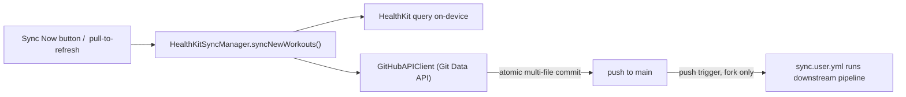
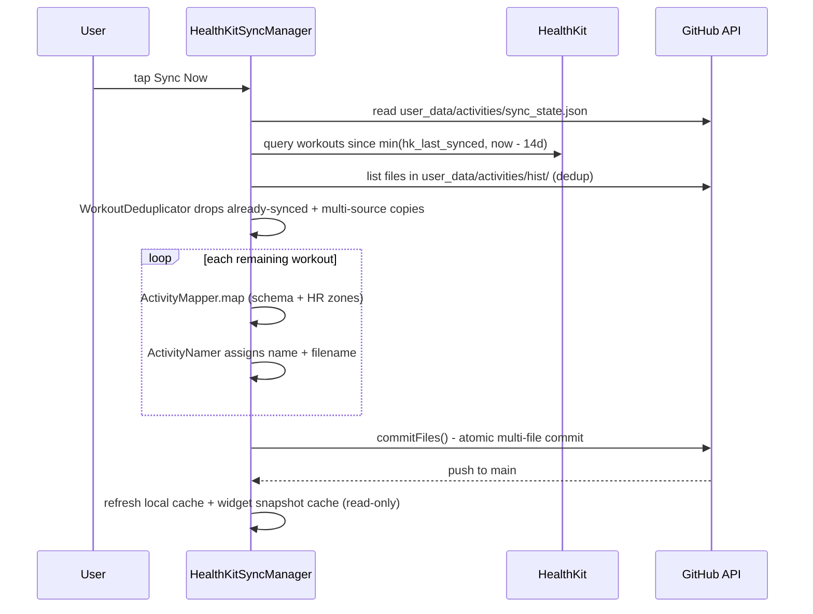

# iOS (HealthKit) Sync — how it works

> Status: Current · Owner: iOS Builder · Verified: 2026-08-23

## Context

Akash's data comes from Apple Health via the native iOS app under `ios/` — this is the only
ingestion path this repo supports (Strava ingestion was removed, issue #113). This doc traces
exactly what happens when he presses Sync in the app: it talks straight to GitHub's API from
the phone, no GitHub Actions involved in the sync action itself.

## Overview



## Trigger — pressing Sync

Entry points, all calling the same manager:

- `SettingsView.swift` — the "Sync Now" button.
- Pull-to-refresh on the same screen.
- `ActivityListView.swift` — sync from the activity list.
- Background HealthKit delivery — iOS can wake the app on new workouts.

All of them call `HealthKitSyncManager.syncNewWorkouts()` directly, on-device. **No workflow is
dispatched** — this is the structural difference from Strava sync, which always goes through
GitHub Actions.

## What `syncNewWorkouts()` does, in order



1. **Read sync state** — `apiClient.readSyncState()` fetches
   `user_data/activities/sync_state.json` from GitHub to get `hk_last_synced`. Missing (first
   sync) means a full year of history.
2. **Query HealthKit** — pulls `HKWorkout` samples since **`min(hk_last_synced, now − 14 days)`**
   — see "Late arrivals" below for why the watermark alone is not enough. Local device data, not
   a repo file. If nothing new, stops here.
3. **List existing history** — fetches the file list in `user_data/activities/hist/` from GitHub.
   This is the dedup index: both the filenames and the uuids parsed out of them.
4. **Deduplicate the batch** — `WorkoutDeduplicator` collapses one real session recorded by
   several apps down to one activity (see "Late arrivals").
5. **Per remaining workout:**
   - `ActivityMapper.map()` converts the `HKWorkout` to the shared Activity schema (sport type,
     times, calories, distance, device).
   - Dedup-checks the filename — the deterministic `hk_<date>_<uuid>.json` name against the
     committed file list, plus Strava-style naming for legacy history. **This runs before the
     heart-rate fetch and before naming**, so a re-scanned day costs no HealthKit queries and
     never advances a name counter for a workout that is not committed.
   - Fetches heart-rate samples for the workout window, computes avg/max HR and zone 1-5 time
     distribution.
   - `ActivityNamer` assigns a generic sequential name (`{SportType} #{N}`, e.g. "WeightTraining #30") and the filename —
     `hk_YYYY-MM-DD_<uuid>.json`, where `<uuid>` is the `HKWorkout.uuid`. The `hk_` prefix
     distinguishes it from Strava-sourced files; the `YYYY-MM-DD` prefix is kept for browsability
     and the pipeline's date-prefilter. Counters are keyed by sport type in `sync_state.json`.
   - The optional `category` field is **not** auto-assigned at sync (left nil). Manual tagging only until Phase 3 config-driven rules land.

6. **Commit** — `GitHubAPIClient.commitFiles()` batches the new activity file(s), any HR stream
   sidecars, plus the updated `sync_state.json` into **one atomic commit** using GitHub's Git Data API (create blobs → read
   HEAD → build tree → create commit → move the branch ref), retried against a fresh HEAD on a
   non-fast-forward conflict. Pushed straight to `main`.
7. **Locally only** — updates an on-device cache for instant list rendering, and refreshes the
   local widget snapshot cache from whatever `gen/widget_snapshots.json` **already** contains on
   GitHub. It does not regenerate that file — it just re-reads it.

### What a round writes

Two paths per workout, not one (ADR 0027):

| Path | Grain | Holds |
|---|---|---|
| `user_data/activities/hist/<name>.json` | activity | scalars + `hr_zones` |
| `user_data/activities/streams/<uuid>.json` | activity | HR display curve, ≤200 points |

The sidecar is written only for workouts that have a HealthKit uuid and at least one HR sample —
the pre-ADR-0014 slug fallback has no stable key to file one under. Both land in the same
`commitFiles` tree, so a round stays atomic.

**Zones are integrated, not estimated.** `HRAnalysis.integrateZones` walks the full sample set
gap-aware: each sample owns the midpoint interval to its neighbours, clamped to 30s either side,
and elapsed time no sample owns accrues to `uncovered_seconds` rather than entering a zone. The
invariant `Σ zone_seconds + uncovered_seconds == elapsed_time` is asserted in
`ios/CoachHQ/CoachHQTests/HRAnalysisTests.swift`. Curve decimation is min/max per bucket so an
interval session keeps its peaks.

### Canonical id — HKWorkout uuid

Each HealthKit activity carries a **stable canonical id** = its `HKWorkout.uuid`, written in two
places:

- **In the JSON** — `id` and `id_str` fields (`ActivityMapper` sets both from `workout.uuid`).
  `Activity` decodes `id` flexibly (String *or* Int) so legacy Strava history files, which store
  `id` as a JSON number, still decode when the app reads them (cache warming).
- **In the filename** — `hk_<date>_<uuid>.json`. Because the uuid is deterministic, re-syncing the
  same workout produces the exact same filename, so dedup is a pure filename check (two guards:
  exact-name match, plus a `_<uuid>.json` substring guard, both run before the heart-rate fetch).
  No file contents are read for dedup, keeping sync cheap.

**Accepted gap — no migration.** Pre-existing slug-named files (`hk_<date>_<category>_<n>.json`)
are **not** migrated: they keep their slug filenames and have no `id`/`id_str`. Nothing looks
activities up by uuid, and every slug-named file predates uuid naming by far more than the
14-day sync window, so the window never re-examines them.

## Late arrivals and multi-source copies

Two ways one real session can go wrong, both handled in the same place.

**A workout can reach the phone long after it started.** An Apple Watch session only lands in
the iPhone's HealthKit when the watch next syncs — hours, sometimes days. The HealthKit query
filters on *start* time, so a `hk_last_synced` watermark set to "when we last ran" steps straight
past a workout that started before the run but arrived after it, and never looks back. That
workout is lost permanently.

So the query floor is **`min(hk_last_synced, now − HealthKitSyncManager.lookbackWindowDays)`**,
14 days today. Every round re-scans that window and lets dedup drop what is already committed.
The cost is one local HealthKit query and a set of filename comparisons — no extra network. The
`HKObserverQuery` fires when the watch transfers data, so in practice a late arrival now
self-heals on the next background sync.

**Garmin and Strava mirror the same session into HealthKit.** One ride can appear two or three
times with different uuids. `WorkoutDeduplicator.cluster` groups the recordings of one session —
same loose activity group, time windows overlapping by ≥50% of the shorter one — and ranks them:

1. **already committed wins** — whichever copy is in `hist/` stays, whatever its source.
2. then **source priority** — apple > garmin > strava > unknown.
3. then input order.

Rule 1 exists because the copies can arrive on different days. If Strava's copy syncs Monday and
Garmin's copy only reaches the phone Wednesday, ranking by source alone would commit a *second*
file for a session already in `hist/`. Keeping the committed copy is stable across rounds and
never needs a delete.

Sync only needs the winners, so `selectWinners` is a thin wrapper over `cluster`. The Health
Settings list needs the losers too — it shows one row per session and names every app that
recorded it — which is why grouping is the primitive and winner-picking the wrapper.

**Grouping is greedy, not transitive.** A recording joins the first winner it overlaps and starts
its own cluster if it overlaps none, so a chain — A overlaps B, B overlaps C, A and C do not —
splits into two clusters instead of merging into one. Deliberate: transitive grouping lets a run
of near-misses swallow genuinely separate back-to-back sessions, and hiding a real workout is the
worse failure.

The rules live in `WorkoutDeduplicator.swift`, deliberately free of HealthKit types — `HKWorkout`
cannot be constructed outside a device store, so anything touching it is untestable. Verify with:

```bash
swiftc ios/CoachHQ/CoachHQ/Services/WorkoutDeduplicator.swift \
       ios/scripts/verify_workout_dedup.swift -o /tmp/verify_dedup && /tmp/verify_dedup
```

**Known gap:** a workout arriving more than 14 days after it started is still missed by the
automatic window. Manual import (below) is the escape hatch; widen the window or move to
`HKAnchoredObjectQuery` (whose anchor tracks insertion, not start time) if it ever bites.

## Manual import — Health Settings

`HealthSettingsView`, reached from Settings → Sync → Health Settings, lists the last 90 days of
HealthKit workouts with a per-row sync state, and imports anything the automatic window missed.
It is read-only until the athlete taps Import.

`HealthKitSyncManager.loadHealthImportRows(daysBack:)` builds the list from one local HealthKit
query plus the `hist/` file listing — no file contents, same as dedup.

**One row per session, not per HealthKit record.** Rows are clusters, so a ride recorded by the
watch and mirrored by Garmin is one row naming both (`Apple Watch + Garmin`), not two rows with
one of them labelled a duplicate. The row shows the winner's start, duration and stats, because
the winner is the copy we commit. Three states:

| State | Means |
|---|---|
| **synced** | A file for one of the session's uuids is committed in `hist/`. Asked of the whole cluster, not just the winner. |
| **can't check** | The day holds committed files with no uuid in the name (pre-ADR-0014 slug names, Strava-era history), so we cannot match them to a HealthKit workout. Import is blocked rather than risk a duplicate. |
| **not synced** | Nothing committed for it — the only state with an Import button. |

Import reuses the whole sync round rather than a second commit path:
`syncNewWorkouts(importing:)` takes an `ImportRequest` (the uuids, and a query floor reaching
back to the oldest of them) and restricts the batch to those workouts. Dedup, heart-rate
sampling, naming, the atomic commit, and the cache upsert are all the ordinary path.

**Known gap:** an imported workout takes the next name counter for its sport, so importing an old
workout numbers it after newer ones. `engine/scripts/migrate_activity_naming.py` is the fix if
that ever needs tidying — it is true of any late arrival, not just manual imports.

## What does NOT happen in this action

No quest log, no challenge ledger update, no UI/widget snapshot regeneration happens as part of
an iOS sync. The code says so directly (comment in `HealthKitSyncManager.swift`): the widget
snapshot pipeline "runs on the next sync/build" — this action just picks up whatever's already
there.

Those downstream artifacts only get regenerated when the sync workflow runs. On a user fork,
`engine/.github/workflows/sync.user.yml` has a `push` trigger on `user_data/activities/hist/**`
and `user_data/activities/sync_state.json` — exactly the files this iOS commit touches. So an
iOS sync **does indirectly trigger a second, automatic GitHub Actions run**, which calls
`engine/scripts/regenerate_derived.py` and `engine/scripts/build-dashboard-snapshot.mjs` to rebuild
`gen/dashboard_snapshot.json`, `gen/athlete_insights.json`, and the other derived JSON files.

**So the app must wait for that second run, not for its own commit.** That regeneration takes
~30s. A single immediate `WidgetSnapshotStore.refresh()` races the pipeline and then caches stale
Home data for 5 minutes. Use `refreshAfterSync(since:)`, which polls until `home.sync.timestamp`
passes the commit time.

iOS Home also depends on HQ's `/api/widget-snapshots` being deployed and healthy. A 401 from it
without auth headers is expected; a **500 is a server-side bug** — historically Vercel not
resolving TS `@/` path aliases, fixed by the pre-build bundle in
`ui/scripts/bundle-widget-snapshots-api.mjs`.

## HealthKit permissions

`HKHealthStore.authorizationStatus(for:)` is **unreliable for read-only types by design** — Apple
deliberately reports `.notDetermined` even after a real grant, so an app cannot infer sensitive
health status from it. Never gate UI on it for read access. Calling `requestAuthorization` again is
the safe idempotent check: a no-op if the user already decided.

## Client caches — what `SyncCache` is not for

`SyncCache` backfills 7 days and evicts anything past 30, so **"All activity" must never read it**.
`AllActivitiesListView` lists the full `user_data/activities/hist` directory once via
`GitHubAPIClient.listFiles` (filenames encode the date, so a lexical sort is enough for
newest-first) and paginates activity-body fetches in memory. Nothing touches `SyncCache`, so
nothing gets evicted out from under the list.

## Auth

OAuth 2.0 Authorization Code flow via `ASWebAuthenticationSession`
(`GitHubAuthManager.swift`) on first login: opens `github.com/login/oauth/authorize` with
`scope=repo`, exchanges the code for a token, stores it in the iOS **Keychain** (not a baked-in
PAT — per-user OAuth). `discoverRepo()` auto-detects the user's repo by naming convention. Every
API call attaches `Authorization: Bearer <token>`. No server, no shared secret — GitHub is the
only backend.

## A correction worth noting

`apply-coach-patch.yml` lives only in athlete repos — carved from
`engine/.github/workflows/apply-coach-patch.yml` into each fork's `.github/workflows/`. It is
unrelated to HealthKit sync: a generic `workflow_dispatch` that commits a pasted Coach chat patch.
Not referenced in the iOS codebase. `AGENTS.md` no longer documents it as a phone fallback.

## Files changed — summary

| File | Written by | Notes |
|---|---|---|
| `user_data/activities/hist/hk_<date>_<uuid>.json` | `HealthKitSyncManager` | one per new HealthKit workout; filename + JSON `id`/`id_str` = HKWorkout uuid |
| `user_data/activities/sync_state.json` | `HealthKitSyncManager` | `hk_last_synced` + naming counters |

That's the entire write set for the sync action itself — much shorter than Strava's, because
everything else (quest log, ledger, snapshots) is deferred to the downstream pipeline run
described above.

**Read-only** in this flow: `gen/widget_snapshots.json` (refreshes local cache from it, doesn't
write it), `user_data/ebadders_history.json` (badminton match history), individual activity
files.

## Appendix — file/class reference

| File | Role |
|---|---|
| `ios/CoachHQ/CoachHQ/Views/SettingsView.swift` | Sync Now button, pull-to-refresh |
| `ios/CoachHQ/CoachHQ/Views/ActivityListView.swift` | secondary sync trigger |
| `ios/CoachHQ/CoachHQ/Services/HealthKitSyncManager.swift` | orchestrates the whole flow |
| `ios/CoachHQ/CoachHQ/Services/ActivityMapper.swift` | HKWorkout → Activity schema, HR zones |
| `ios/CoachHQ/CoachHQ/Services/ActivityNamer.swift` | sequential naming, filenames |
| `ios/CoachHQ/CoachHQ/Services/GitHubAPIClient.swift` | Git Data API commits, reads |
| `ios/CoachHQ/CoachHQ/Services/GitHubAuthManager.swift` | OAuth + Keychain token storage |
