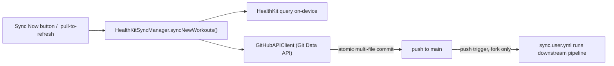
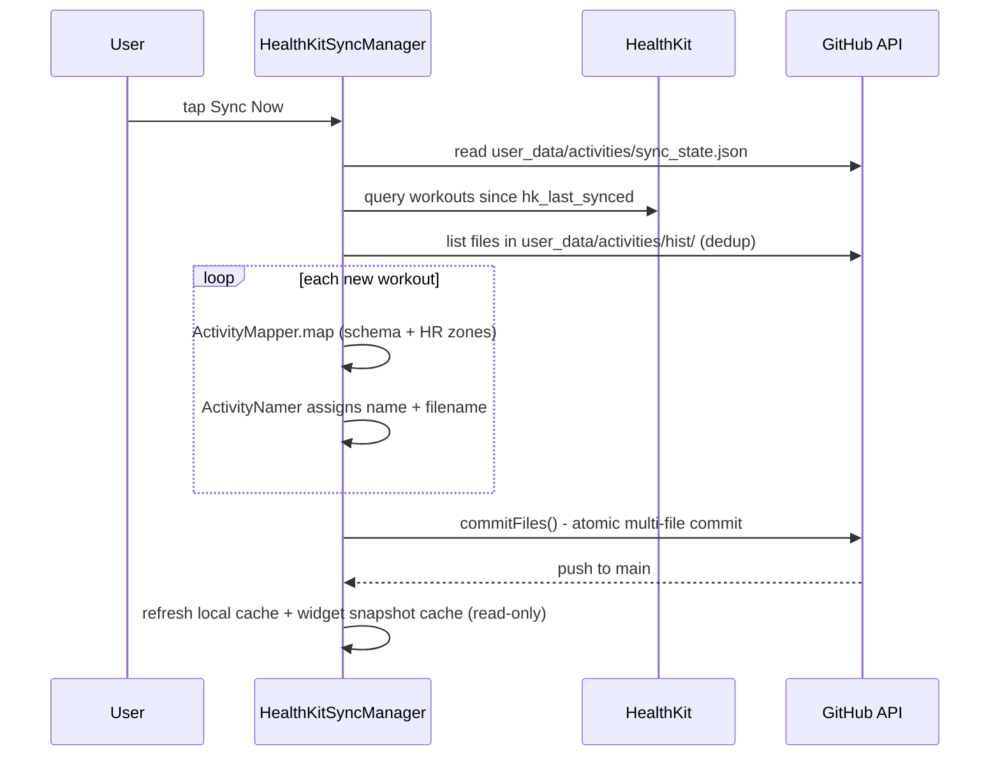

# iOS (HealthKit) Sync — how it works

> Status: Current · Owner: iOS Builder · Verified: 2026-08-18

## Context

Akash's data comes from Apple Health via the native iOS app under `ios/` — this is the only
ingestion path this repo supports (Strava ingestion was removed, issue #113). This doc traces
exactly what happens when he presses Sync in the app: it talks straight to GitHub's API from
the phone, no GitHub Actions involved in the sync action itself.

## Overview

## Trigger — pressing Sync

Entry points, all calling the same manager:

- `SettingsView.swift` — the "Sync Now" button.
- Pull-to-refresh on the same screen.
- `ActivityListView.swift` — sync from the activity list.
- Background HealthKit delivery — iOS can wake the app on new workouts.

All of them call `HealthKitSyncManager.syncNewWorkouts()` directly, on-device. **No workflow is
dispatched** — this is the structural difference from Strava sync, which always goes through
GitHub Actions.

## What `syncNewWorkouts()` does, in order

1. **Read sync state** — `apiClient.readSyncState()` fetches
   `user_data/activities/sync_state.json` from GitHub to get `hk_last_synced` (defaults to 7 days
   back if missing).
2. **Query HealthKit** — pulls `HKWorkout` samples since that date. Local device data, not a repo
   file. If nothing new, stops here.
3. **List existing history** — fetches the file list in `user_data/activities/hist/` from GitHub,
   for dedup.
4. **Per new workout:**
   - `ActivityMapper.map()` converts the `HKWorkout` to the shared Activity schema (sport type,
     times, calories, distance, device).
   - Dedup-checks the filename against Strava-style naming, so a workout that also later syncs
     from Strava (e.g. via an Apple Watch → Strava → this repo's Strava sync) doesn't get counted
     twice.
   - Fetches heart-rate samples for the workout window, computes avg/max HR and zone 1-5 time
     distribution.
   - `ActivityNamer` assigns a generic sequential name (`{SportType} #{N}`, e.g. "WeightTraining #30") and the filename —
     `hk_YYYY-MM-DD_<uuid>.json`, where `<uuid>` is the `HKWorkout.uuid`. The `hk_` prefix
     distinguishes it from Strava-sourced files; the `YYYY-MM-DD` prefix is kept for browsability
     and the pipeline's date-prefilter. Counters are keyed by sport type in `sync_state.json`.
   - The optional `category` field is **not** auto-assigned at sync (left nil). Manual tagging only until Phase 3 config-driven rules land.

### Canonical id — HKWorkout uuid

Each HealthKit activity carries a **stable canonical id** = its `HKWorkout.uuid`, written in two
places:

- **In the JSON** — `id` and `id_str` fields (`ActivityMapper` sets both from `workout.uuid`).
  `Activity` decodes `id` flexibly (String *or* Int) so legacy Strava history files, which store
  `id` as a JSON number, still decode when the app reads them (cache warming).
- **In the filename** — `hk_<date>_<uuid>.json`. Because the uuid is deterministic, re-syncing the
  same workout produces the exact same filename, so dedup is a pure filename check (two guards:
  exact-name match, plus a `_<uuid>.json` substring guard right before commit). No file contents
  are read for dedup, keeping sync cheap.

**Accepted gap — no migration.** Pre-existing slug-named files (`hk_<date>_<category>_<n>.json`)
are **not** migrated: they keep their slug filenames and have no `id`/`id_str`. This is fine
because sync only moves forward from the `hk_last_synced` watermark and nothing looks activities up
by uuid — the old files are never re-examined.
5. **Commit** — `GitHubAPIClient.commitFiles()` batches the new activity file(s) plus the updated
   `sync_state.json` into **one atomic commit** using GitHub's Git Data API (create blobs → read
   HEAD → build tree → create commit → move the branch ref), retried against a fresh HEAD on a
   non-fast-forward conflict. Pushed straight to `main`.
6. **Locally only** — updates an on-device cache for instant list rendering, and refreshes the
   local widget snapshot cache from whatever `gen/widget_snapshots.json` **already** contains on
   GitHub. It does not regenerate that file — it just re-reads it.

## What does NOT happen in this action

No quest log, no challenge ledger update, no UI/widget snapshot regeneration happens as part of
an iOS sync. The code says so directly (comment in `HealthKitSyncManager.swift`): the widget
snapshot pipeline "runs on the next sync/build" — this action just picks up whatever's already
there.

Those downstream artifacts only get regenerated when the sync workflow runs. On a user fork,
`engine/.github/workflows/sync.user.yml` has a `push` trigger on `user_data/activities/hist/**`,
which every iOS workout sync writes. So an iOS sync **does indirectly trigger a second,
automatic GitHub Actions run**, which calls
`engine/scripts/regenerate_derived.py` and `engine/scripts/build-aggregate.mjs` to rebuild
`gen/aggregate.json`, `gen/quest_log.md`, etc.

**So the app must wait for that second run, not for its own commit.** That regeneration takes
~30s. A single immediate `WidgetSnapshotStore.refresh()` races the pipeline and then caches stale
Home data for 5 minutes. Use `refreshAfterSync(since:)`, which polls until `home.sync.timestamp`
passes the commit time.

iOS Home also depends on HQ's `/api/widget-snapshots` being deployed and healthy. A 401 from it
without auth headers is expected; a **500 is a server-side bug** — historically Vercel not
resolving TS `@/` path aliases, fixed by the pre-build bundle in
`ui/scripts/bundle-widget-snapshots-api.mjs`.

## HealthKit permissions

`HKHealthStore.authorizationStatus(for:)` is **unreliable for read-only types by design** — Apple
deliberately reports `.notDetermined` even after a real grant, so an app cannot infer sensitive
health status from it. Never gate UI on it for read access. Calling `requestAuthorization` again is
the safe idempotent check: a no-op if the user already decided.

## Client caches — what `SyncCache` is not for

`SyncCache` backfills 7 days and evicts anything past 30, so **"All activity" must never read it**.
`AllActivitiesListView` lists the full `user_data/activities/hist` directory once via
`GitHubAPIClient.listFiles` (filenames encode the date, so a lexical sort is enough for
newest-first) and paginates activity-body fetches in memory. Nothing touches `SyncCache`, so
nothing gets evicted out from under the list.

Before rebuilding those files, `regenerate_derived.py` adds `vs_usual` to each activity changed
by the triggering push. The block is the median of up to 20 prior same-sport activities and is
omitted until two prior sessions exist. Missing HR metrics are omitted from their individual
median; they are never treated as zero. The workflow commits the enriched activity JSON with the
other generated outputs. Existing history is not backfilled.

## Auth

OAuth 2.0 Authorization Code flow via `ASWebAuthenticationSession`
(`GitHubAuthManager.swift`) on first login: opens `github.com/login/oauth/authorize` with
`scope=repo`, exchanges the code for a token, stores it in the iOS **Keychain** (not a baked-in
PAT — per-user OAuth). `discoverRepo()` auto-detects the user's repo by naming convention. Every
API call attaches `Authorization: Bearer <token>`. No server, no shared secret — GitHub is the
only backend.

## A correction worth noting

`apply-coach-patch.yml` lives only in athlete repos — carved from
`engine/.github/workflows/apply-coach-patch.yml` into each fork's `.github/workflows/`. It is
unrelated to HealthKit sync: a generic `workflow_dispatch` that commits a pasted Coach chat patch.
Not referenced in the iOS codebase. `AGENTS.md` no longer documents it as a phone fallback.

## Files changed — summary

| File | Written by | Notes |
|---|---|---|
| `user_data/activities/hist/hk_<date>_<uuid>.json` | `HealthKitSyncManager` | one per new HealthKit workout; filename + JSON `id`/`id_str` = HKWorkout uuid |
| `user_data/activities/sync_state.json` | `HealthKitSyncManager` | `hk_last_synced` + naming counters |

That's the entire write set for the sync action itself — much shorter than Strava's, because
everything else (quest log, ledger, snapshots) is deferred to the downstream pipeline run
described above.

**Read-only** in this flow: `gen/widget_snapshots.json` (refreshes local cache from it, doesn't
write it), `user_data/ebadders_history.json` (badminton match history), individual activity
files.

## Appendix — file/class reference

| File | Role |
|---|---|
| `ios/CoachHQ/CoachHQ/Views/SettingsView.swift` | Sync Now button, pull-to-refresh |
| `ios/CoachHQ/CoachHQ/Views/ActivityListView.swift` | secondary sync trigger |
| `ios/CoachHQ/CoachHQ/Services/HealthKitSyncManager.swift` | orchestrates the whole flow |
| `ios/CoachHQ/CoachHQ/Services/ActivityMapper.swift` | HKWorkout → Activity schema, HR zones |
| `ios/CoachHQ/CoachHQ/Services/ActivityNamer.swift` | sequential naming, filenames |
| `ios/CoachHQ/CoachHQ/Services/GitHubAPIClient.swift` | Git Data API commits, reads |
| `ios/CoachHQ/CoachHQ/Services/GitHubAuthManager.swift` | OAuth + Keychain token storage |
