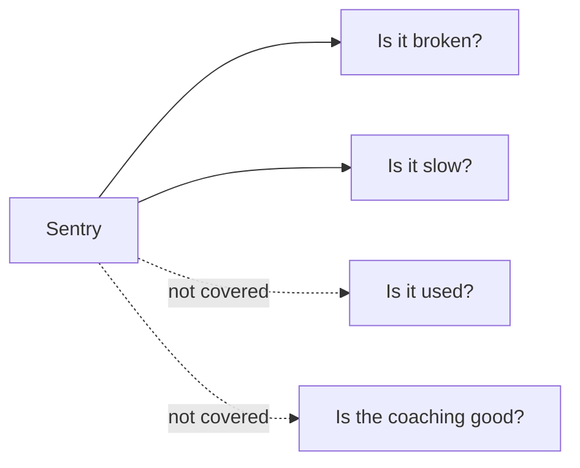

# Monitoring dashboard — the questions it answers

> Status: Current · Owner: Tech Lead · Verified: 2026-08-30 · ADR: [0032](../../kdb/decisions/0032-sentry-data-rules.md)

## Context

"Coach HQ health" (Sentry dashboard `5873386`) grew three widgets one at a time, each verified
against live rows. Nobody wrote down what the page is *for*, so it drifted into a list of counts.
This doc fixes the questions it must answer, and names the ones it never will.

## What Sentry can be the source of truth for

Sentry answers the left pair. Usage and coaching quality are product analytics — a different tool
and a different question (`sentry-runbook.md` § Coverage boundary, `docs/plans/sentry-lld.md` §4).
Calling this page the whole source of truth means adding a second data source beside it. That is
neither built nor planned. Until it is, "source of truth" means broken and slow, nothing wider.

## The seven questions

| # | Question | Widget | Query |
|---|---|---|---|
| 1 | What is breaking? | Errors grouped by `title`, over time | `errors`, `event.type:error environment:production` |
| 2 | Is the coach answering? | Coach-chat turn health — count, `outcome`, p95 | spans, `transaction:"POST /api/coach-chat"` |
| 3 | Is the app fast enough? | Pageload p75 per route | spans, `span.op:pageload` |
| 4 | Are we crashing? | Crash-free session rate, web and iOS only | release health (sessions) |
| 5 | What do tokens cost? | `sum(gen_ai.usage.total_tokens)` over time, by model | spans, `span.op:gen_ai.generate_content` |
| 6 | Is phone data arriving? | HealthKit sync — `outcome`, count, item count | spans, `transaction:healthkit.sync` |
| 7 | Is an athlete angry? | Rage Report count, newest first | `errors`, `operation:rage_report` |

**Built today: 1, 5 and half of 2** — as the Gemini, Web/API and Production errors widgets.
Questions 3, 4, 6 and 7 have live data in Sentry and no widget; item 21 of
`docs/plans/monitoring-order.md` builds them. Status lives there, not here.

Question 4 names web and iOS on purpose. The API project also reports sessions — 12,169 in 14 days
— but that is Node counting one session per request on a serverless function. It is a traffic
number wearing a health number's name. Do not put it on the page.

Question 1 is why the widget groups on `title`. Grouping on release and `athlete_id` instead tells
you that seventeen things happened, never what they were.

**Every span widget carries `environment:production`.** Without it, preview traffic from PR
verification lands in the same table. That has already cost us once: nine deliberate bad-key test
spans were read as a Gemini outage (`docs/plans/monitoring-order.md` item 2). The errors widget was
built with the filter; the two span widgets were not.

## Reading it at four athletes

Volume is roughly thirty events a day. A `p95` over seven spans is the second-slowest one, not a
percentile. Prefer counts, lists, and crash-free rate. Revisit percentiles when volume earns them.

## Done when

All seven questions have a widget, every span widget filters to production, and each widget has
returned at least one real production row.

## Known gap

There is no Gemini success-rate widget, and there must not be one until item 23 of
`docs/plans/monitoring-order.md` is settled. Error events and `outcome:error` spans disagree 3 to 1
over the same window. The span side is the low one, so a rate built on it reads healthier than the
service is.

## Deferred

- GitHub API call health. Outbound spans stay off until [#638](https://github.com/sibling-shipyard/coach-hq/issues/638) moves the Gemini key out of the query string.
- Readable stack traces. Nothing uploads source maps or dSYMs yet (`sentry-lld.md` Phase 6).
