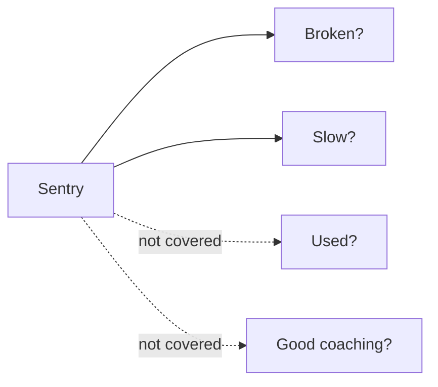

# Monitoring dashboard — the questions it answers

> Status: Current · Owner: Tech Lead · Verified: 2026-08-30 · ADR: [0032](../../kdb/decisions/0032-sentry-data-rules.md)

## Context

The Sentry dashboard **Coach HQ health** (`5873386`) answers whether the product is broken or
slow. Athlete product usage and coaching quality are product analytics, not monitoring.

## Seven questions

| # | Question | Widget | Query |
|---|---|---|---|
| 1 | What is breaking? | Errors grouped by `title`, over time | `errors`, `event.type:error environment:production` |
| 2 | Is the coach answering? | Coach-chat turn count, `outcome`, and p95 | spans, `transaction:"POST /api/coach-chat"` |
| 3 | Is the app fast enough? | Pageload p75 by route | spans, `span.op:pageload` |
| 4 | Are we crashing? | Crash-free session rate for web and iOS | release health sessions |
| 5 | What do tokens cost? | Total tokens over time by model | spans, `sum(gen_ai.usage.total_tokens)`, `span.op:gen_ai.generate_content` |
| 6 | Is phone data arriving? | HealthKit sync outcome, count, and item count | spans, `transaction:healthkit.sync` |
| 7 | Is an athlete angry? | Rage Reports, newest first | `errors`, `operation:rage_report` |

Questions 1 and 5 are built; question 2 is partial. Questions 3, 4, 6, and 7 still need widgets.
Every span widget must filter `environment:production`; Preview verification traffic shares the
same store.

Only web and iOS belong in crash-free session rate. The serverless API counts a session per
request, so its session rate is traffic disguised as health. At current volume, prefer counts,
lists, and crash-free rate over percentiles.

## Done when

All seven questions have a widget, each span widget filters to production, and every widget has
returned a real production row.

## Known gap

Do not add a Gemini success-rate widget until [PR #689](https://github.com/sibling-shipyard/coach-hq/pull/689)
is repaired and merged. Error events have outnumbered error spans, so a span-based rate can read
healthier than the service. Verify the repaired flush on a post-deploy failure before adding it.

## Deferred

- GitHub API call health waits for [#638](https://github.com/sibling-shipyard/coach-hq/issues/638).
- Source maps and dSYMs wait for the TestFlight release workflow.
