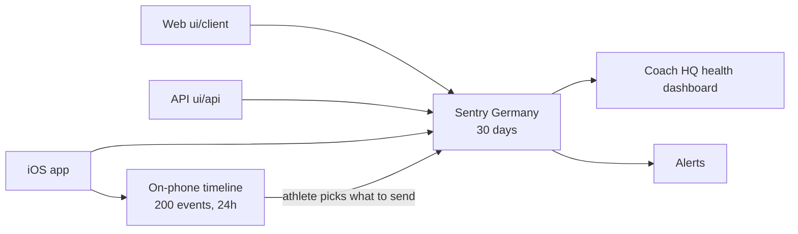

# Observability

> Status: Current · Owner: Tech Lead · Verified: 2026-09-06 · ADR: [0032](../../kdb/decisions/0032-sentry-data-rules.md)

## Context

Four beta athletes use the product, and a broken experience used to leave us asking them what
happened from memory. Sentry is the one searchable trail from an athlete's phone to the operator;
Vercel and Apple logs stay as fallback. Day-to-day procedure lives in `sentry-runbook.md` — this
doc is the shape of the system, not how to work it.

## How it fits together

Nothing leaves the phone until the athlete taps Submit on a Rage Report. The web has the same
control in the header menu, and needs no on-device timeline: the browser SDK already keeps click,
navigation and fetch breadcrumbs and copies them onto the report. Automatic screenshots and
session replay stay off.

## What joins one interaction

`ui/api/_lib/sentry.ts` is the source of truth for every field; these five are the ones that make
an event findable at all.

| Tag | Meaning |
|---|---|
| `release` | Commit SHA on web/API (`VERCEL_GIT_COMMIT_SHA`), bundle version + build on iOS |
| `environment` | `production`, `preview` or `development` — Preview traffic shares the same store, so every query and widget must filter it |
| `athlete_id` | Repo owner, derived identically on web, API and iOS, and also the Sentry user. One athlete, one id, three projects |
| `trace_id` | Sentry's own id, propagated browser → API on `sentry-trace`. Joins both halves of one interaction |
| `outcome` | `ok` / `error` on our manual spans. What the dashboard groups by |

Credentials never reach Sentry: `ui/observability/sentryScrubber.ts` strips auth headers, cookies,
GitHub tokens, Gemini keys and JWTs before send. Because `beforeSend` fires for *error events only*,
`beforeSendTransaction` and `beforeSendSpan` are wired too — miss those and the scrubber covers
about a third of what we send.

## What the dashboard answers

**Coach HQ health**, id `5873386`. Six widgets, one per live question — question 4 (crash-free
sessions) is dropped, see below. The dashboard's saved default window is 7D, matching the digest.

| # | Question | Reads |
|---|---|---|
| 1 | What is breaking? | errors, grouped by title — not release, which fragmented one bug into one row per deploy until the M3 cleanup below |
| 2 | Is the coach answering? | `POST /api/coach-chat` spans, `outcome`, p95 |
| 3 | Is the app fast enough? | `span.op:pageload`, p75 by route |
| 4 | What do tokens cost? | `gen_ai.usage.total_tokens` by model; `gen_ai.usage.cost.usd` on the OpenRouter path only (#889) |
| 5 | Is phone data arriving? | `transaction:healthkit.sync`, outcome and item count |
| 6 | Is an athlete angry? | `operation:rage_report`, newest first; web and iOS are separate projects |

**Crash-free session rate (web + iOS) was dropped** (#904, M3): at single-digit real sessions the
rate whipsaws between 0% and 100% on one crash next to one clean session, which is noise, not
signal. The serverless API was already excluded — it counts a session per request, so its rate is
traffic disguised as health (7091 API "sessions" over 30 days against 71 web and 28 iOS). No
minimum-session-count gate exists in this query language, so "drop" was the lower-risk of the
plan's two accepted options; reinstate as a raw session count (not a rate) if volume ever
justifies it.

## What this does not cover

Read these before drawing a conclusion from a green dashboard.

- **Outbound HTTP from the API is deliberately untraced.** Both Node instrumentations copy the full
  request URL onto the span and `geminiClient.ts` passes the key in the query string, so an
  `http.client` span would be a credential in Sentry. `ignoreOutgoingRequests` drops the span and
  the breadcrumb before either is built. The cost is that GitHub call durations never reach a trace.
  [#638](https://github.com/sibling-shipyard/coach-hq/issues/638) fixes the cause.
- **Every production stack trace is unreadable**, web and iOS alike. Nothing uploads source maps or
  dSYMs yet.
- **Rage Reports are not errors.** Web's `submitRageReport()` and iOS's `RageReportSubmission.swift`
  both capture a message, so they arrive as `event.type:default`. A widget or alert written with
  `event.type:error` matches nothing, and the "Production errors" widget cannot show them by design.
- **Chat text reaches Sentry only when a Gemini call fails**, where nothing else records it — a
  successful turn lives in `chat_history.json`. This is the load-bearing part of ADR 0032.
- **This is error monitoring, not product analytics.** It says what broke, never what athletes do.

## Done when

1. A deliberate failure carries both its error event and its ended `http.server` span, under one trace id and one release.
2. Every dashboard widget filters to production and returns a real row.
3. A new or repeated production error reaches the operator within 15 minutes.
4. A scheduled digest answers "was yesterday fine?" without anyone opening Sentry.

Items 1 and 2 are proven. The rules behind 3 are built and active on all three projects. None has
yet been seen firing on a real production error — the next one is the proof, and it arrives by email.

## The digest

`sentry-digest.mjs` builds one health report; `.github/workflows/sentry-digest.yml` runs it daily
at 08:00 IST and weekly on Mondays, and keeps it in one standing issue labelled `ops:digest`.

The design rule is that **a quiet day is silent**. Daily runs rewrite the issue body and comment
only when something is new or an athlete filed a rage report; the weekly run always comments. A
report that notifies every morning is skipped by week two, so the notification has to mean something.

Two consequences worth knowing:

- Counts are **windowed**, not lifetime. A fixed bug falls to zero in the digest while its Sentry
  issue still shows every event it ever caused.
- The body carries an `athlete_id` breakdown, because one athlete's bad afternoon and a fleet-wide
  fault produce the same event count and need different fixes.

Every run also queries the Discover/events API (`/organizations/{org}/events/`, `dataset=spans`,
project scoped to `coach-hq-api`) for a "Calls by operation" table: total calls and `ok`/`error`
success rate per `operation` tag, grouped straight from `span.op:http.server` rows. This is the
same query surface as the `Coach HQ health` dashboard's widgets (id 5873386), done
programmatically instead of by hand. The project scope matters: querying unscoped pulls in
`http.server` spans from the web and iOS projects too, which carry an unrelated `outcome` value
and no `operation` tag at all.

Every run also queries `span.op:gen_ai.generate_content` for a "Tokens & cost by model" table:
input/output/total tokens per `gen_ai.request.model`, grouped the same way as the operation
query. `gen_ai.usage.cost.usd` is real, billed cost, but OpenRouter-only (#889). Sentry's spans
dataset also types that attribute as a string, so `sum()` on it 400s. It is fetched as raw
per-span rows instead (filtered to spans that carry it) and summed in the script.

A model with real cost data uses it directly. A model with tokens but no cost field (the
direct-Gemini path) is priced instead from `PRICING_USD_PER_MTOK` in `sentry-digest.mjs`. Those
$/token figures must trace to a real measurement in `docs/eng-docs/chat-provider-bench.md`, never
an invented number, and are marked with a `~` in the body and `costEstimated: true` in
`meta.json`. A model with neither reports "no pricing data" rather than a guess. That table is
empty today: `chat-provider-bench.md` never billed production's actual model, `gemini-pro-latest`
— no working paid key existed when it was measured — so every model in production today reports
"no pricing data" until a real measurement exists.

The operation table also carries a trend line: total calls and overall success rate, first half of
the window against second half. `halfWindowRanges` in `sentry-digest.mjs` builds the two ranges
using the events endpoint's `start`/`end` params rather than `statsPeriod`, since those give an
explicit, non-overlapping range. The events endpoint has no `interval`/day-bucket grouping of its own — that lives on the
separate `events-stats` time-series endpoint — so two flat-table queries reusing `operationStats`
was simpler than a second query shape. A swing under 1 call/day or 3 points of success rate reads
as "flat" rather than flipping on noise from single-digit counts.

The `## By athlete` table also carries tokens and cost per athlete, joined from a `gen_ai.
generate_content` span query grouped by `user.id` — not the `athlete_id` tag the rest of the
digest uses. `athlete_id` is a custom tag set on the per-request isolation scope
(`setAthleteScope`), and Sentry's spans dataset does not copy scope tags onto descendant spans, so
it reads `null` on every `gen_ai.generate_content` span (confirmed live, 2026-09-06). `user.id`
comes from the same call's `scope.setUser(...)` instead, which Sentry treats as a promoted field
that *does* propagate to child spans — populated on every sampled span. The two halves of the
table (issue events keyed on `athlete_id`, tokens keyed on `user.id`) are joined on that shared id
string; an athlete present on only one side shows `—` on the other, not a dropped row.

Every run also auto-resolves any open issue with zero events in the window (`PUT
.../issues/{id}/` with `status: resolved`), in series, and reports the count and titles in the
body's "Auto-resolved" section. This replaced the manual cleanup #902 needed (~15 API calls by
hand). Sentry reopens an issue the moment it fires again, so there is no separate undo path —
`--dry-run` computes and reports the list without calling Sentry, for testing against live data.

The standing issue is exempt from the issue contract (`check_pr_issue_link.py`, `EXEMPT_LABELS`).
It has no milestone and no epic by design, and the daily rewrite would otherwise re-label it
`needs-triage` every morning.

The digest does not replace the alert rules in `sentry-runbook.md`. Those carry the 15-minute path
for a new error; the digest is the daily read.

## Deferred

- Source maps and dSYMs — blocked until a TestFlight release workflow exists.
- Broad iOS auto-transaction naming, so network activity groups by product operation rather than
  UIKit gesture. Separate from Rage Report fingerprinting, which shipped.
- Web `resource.*` span pruning.
- Athlete consent controls and opt-out ([#590](https://github.com/sibling-shipyard/coach-hq/issues/590)); session replay; log warehousing beyond 30 days.
- Cyclops v2 (auto-triage via webhook).
- Agent-to-agent incident coordination.
