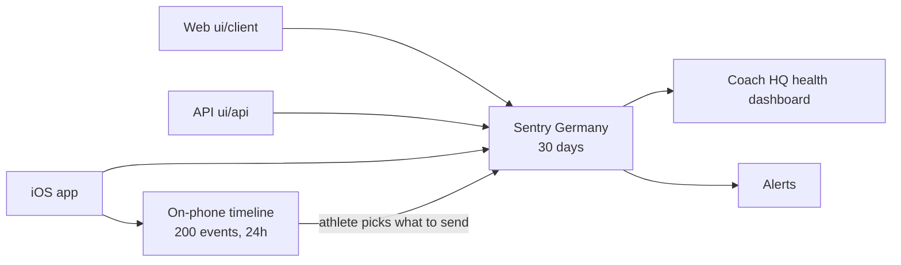

# Observability

> Status: Current · Owner: Tech Lead · Verified: 2026-08-30 · ADR: [0032](../../kdb/decisions/0032-sentry-data-rules.md), [0035](../../kdb/decisions/0035-cross-surface-error-taxonomy.md)

## Context

Four beta athletes use the product, and a broken experience used to leave us asking them what
happened from memory. Sentry is the one searchable trail from an athlete's phone to the operator;
Vercel and Apple logs stay as fallback. Day-to-day procedure lives in `sentry-runbook.md` — this
doc is the shape of the system, not how to work it.

## How it fits together

Nothing leaves the phone until the athlete taps Submit on a Rage Report. Automatic screenshots and
session replay stay off.

## What joins one interaction

`ui/api/_lib/sentry.ts` is the source of truth for every field; these six are the ones that make
an event findable at all.

| Tag | Meaning |
|---|---|
| `release` | Commit SHA on web/API (`VERCEL_GIT_COMMIT_SHA`), bundle version + build on iOS |
| `environment` | `production`, `preview` or `development` — Preview traffic shares the same store, so every query and widget must filter it |
| `athlete_id` | Repo owner, derived identically on web, API and iOS, and also the Sentry user. One athlete, one id, three projects |
| `trace_id` | Sentry's own id, propagated browser → API on `sentry-trace`. Joins both halves of one interaction |
| `outcome` | `ok` / `error` on our manual spans. What the dashboard groups by |
| `operation` | What the code was doing (ADR 0035). `web` on the browser, API route with slashes as dots, native name on iOS |

Credentials never reach Sentry: `ui/observability/sentryScrubber.ts` strips auth headers, cookies,
GitHub tokens, Gemini keys and JWTs before send. Because `beforeSend` fires for *error events only*,
`beforeSendTransaction` and `beforeSendSpan` are wired too — miss those and the scrubber covers
about a third of what we send.

## What the dashboard answers

**Coach HQ health**, id `5873386`. All seven questions have a widget and every widget has returned
a real production row.

| # | Question | Reads |
|---|---|---|
| 1 | What is breaking? | errors, grouped by title |
| 2 | Is the coach answering? | `POST /api/coach-chat` spans, `outcome`, p95 |
| 3 | Is the app fast enough? | `span.op:pageload`, p75 by route |
| 4 | Are we crashing? | crash-free sessions, web and iOS only |
| 5 | What do tokens cost? | `gen_ai.usage.total_tokens` by model |
| 6 | Is phone data arriving? | `transaction:healthkit.sync`, outcome and item count |
| 7 | Is an athlete angry? | `operation:rage_report`, newest first |

Only web and iOS belong in question 4. The serverless API counts a session per request, so its
session rate is traffic disguised as health. Over 30 days that is 7091 API "sessions" against 71
web and 28 iOS.

## What this does not cover

Read these before drawing a conclusion from a green dashboard.

- **Outbound HTTP from the API is deliberately untraced.** Both Node instrumentations copy the full
  request URL onto the span and `geminiClient.ts` passes the key in the query string, so an
  `http.client` span would be a credential in Sentry. `ignoreOutgoingRequests` drops the span and
  the breadcrumb before either is built. The cost is that GitHub call durations never reach a trace.
  [#638](https://github.com/sibling-shipyard/coach-hq/issues/638) fixes the cause.
- **Every production stack trace is unreadable**, web and iOS alike. Nothing uploads source maps or
  dSYMs yet.
- **Rage Reports are not errors.** `RageReportSubmission.swift` uses `capture(message:)`, so they
  arrive as `event.type:default`. A widget or alert written with `event.type:error` matches nothing,
  and the "Production errors" widget cannot show them by design.
- **Chat text reaches Sentry only when a Gemini call fails**, where nothing else records it — a
  successful turn lives in `chat_history.json`. This is the load-bearing part of ADR 0032.
- **This is error monitoring, not product analytics.** It says what broke, never what athletes do.

## Done when

1. A deliberate failure carries both its error event and its ended `http.server` span, under one trace id and one release.
2. Every dashboard widget filters to production and returns a real row.
3. A new or repeated production error reaches the operator within 15 minutes.

Items 1 and 2 are proven. The rules behind 3 are built and active on all three projects. None has
yet been seen firing on a real production error — the next one is the proof, and it arrives by email.

## Deferred

- Source maps and dSYMs — blocked until a TestFlight release workflow exists.
- Broad iOS auto-transaction naming, so network activity groups by product operation rather than
  UIKit gesture. Separate from Rage Report fingerprinting, which shipped.
- Web `resource.*` span pruning.
- Athlete consent controls and opt-out ([#590](https://github.com/sibling-shipyard/coach-hq/issues/590)); session replay; log warehousing beyond 30 days.
- Cyclops v2 (auto-triage via webhook).
- Proactive Cyclops digest (weekly automated health summary).
- Agent-to-agent incident coordination.
