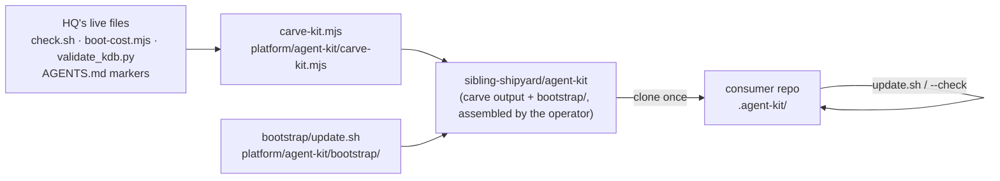

# Agent kit — portable agent operating layer

> Status: Current · Owner: Tech Lead · Verified: 2026-09-02 · ADR: 0036

## Context

HQ's agent setup (routing gate, role docs, ADR discipline, `.githooks` + CI enforcement) works
across Claude Code, Codex, and Cursor, but only lived in this repo. `platform/agent-kit/` extracts
it into a tree installable in any repo, mechanism only — no roster, no routing table content.

## How it works



Three tiers (`platform/agent-kit/README.md`):
1. **Invariant** — `.githooks/`, `kdb/scripts/*.py` (minus the HQ-only soul-history guard, stripped
   by `AGENT-KIT:STRIP-START/END` sentinels). Copied once, referenced, never re-synced by marker.
2. **Managed text** — `AGENTS.md` §"How all agents work", `kdb/doc-style.md`, generic
   `.github/CONVENTIONS.md` rules — wrapped in `<!-- AGENT-KIT:START id="..." -->` markers.
   `bootstrap/update.sh` rewrites the marked block from `blocks/<id>.md`, local cache first, else
   `raw.githubusercontent.com/sibling-shipyard/agent-kit/refs/tags/v<VERSION>/blocks/<id>.md`.
3. **Local** — routing table, role docs, ADRs. Owned by the consumer repo, `carve-kit.mjs` never
   touches this tier.

`carve-kit.mjs` writes `../agent-kit` (sibling directory) with `blocks/`, `tools/kdb/`,
`tools/githooks/`, `templates/`. It does **not** copy `platform/agent-kit/bootstrap/` — that ships
straight from HQ's tree. Standing up the real `sibling-shipyard/agent-kit` repo means committing
both: carve output plus `platform/agent-kit/{bootstrap,VERSION,README.md}` verbatim.

## Done when

1. `carve-kit.mjs` produces a tree; `grep -riE 'claude|cursor|codex|antigravity'` over it is empty —
   **verified 2026-09-02**.
2. `bootstrap/update.sh --check` reports drift on a stale marked file, `update.sh` fixes it from the
   local `blocks/` cache, a second `--check` is clean (idempotent) — **verified 2026-09-02**, dogfooded
   into a scratch clone of `coach-skeleton` (a real second repo, local only, nothing pushed).
3. `carve-kit.mjs --init <target>` stamps a bare git repo with a working KB scaffold —
   **verified 2026-09-02** (see below).
4. HQ's own `check.sh` and `validate_kdb.py` stayed green at every phase (P1–P6) — no parallel
   enforcement copy existed at any point (ADR 0036).

## `--init` — bare-repo scaffold

```bash
node platform/agent-kit/carve-kit.mjs              # carve to ../agent-kit (existing)
node platform/agent-kit/carve-kit.mjs --init /path/to/repo [--force]
```

Stamps Tier-1 invariants (`kdb/scripts/`, `.githooks/`, `platform/scripts/check.sh`) and Tier-3
local stubs (`AGENTS.md` routing table placeholder, `kdb/decisions/README.md` with index markers,
role doc skeleton, issue templates). Tier-2 managed blocks start empty inside markers.

After `--init`: link the carved kit as `.agent-kit/` (copy `bootstrap/` + `VERSION`), **`git add`
and commit the scaffold**, then run `.agent-kit/bootstrap/update.sh`. `update.sh` uses
`git ls-files` — on a fresh `git init` with no commits it is a no-op.

Add `.agent-kit/` to the consumer's `.gitignore` — the kit is a local install/cache, not
repo-owned prose.

**Does not stamp:** GitHub workflows, a multi-agent roster, soul layers, or `docs/eng-docs/`.
Consumers add agents to the routing table and role docs themselves.

## Known gap

None for the core carve + bootstrap + init loop.

## Deferred

- Actually creating `sibling-shipyard/agent-kit` and pushing carve output — deliberate operator
  action, athlete's call on timing.
- Claude Code plugin + marketplace wrap for `bootstrap/update.sh`.
- Boundary-drift CI check (PR's changed files vs `CODEOWNERS`) — prove `CODEOWNERS` (#780) at HQ
  first.
