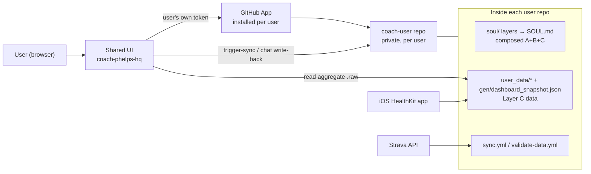
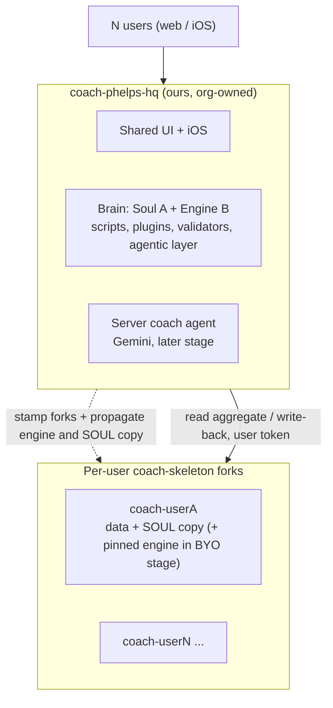
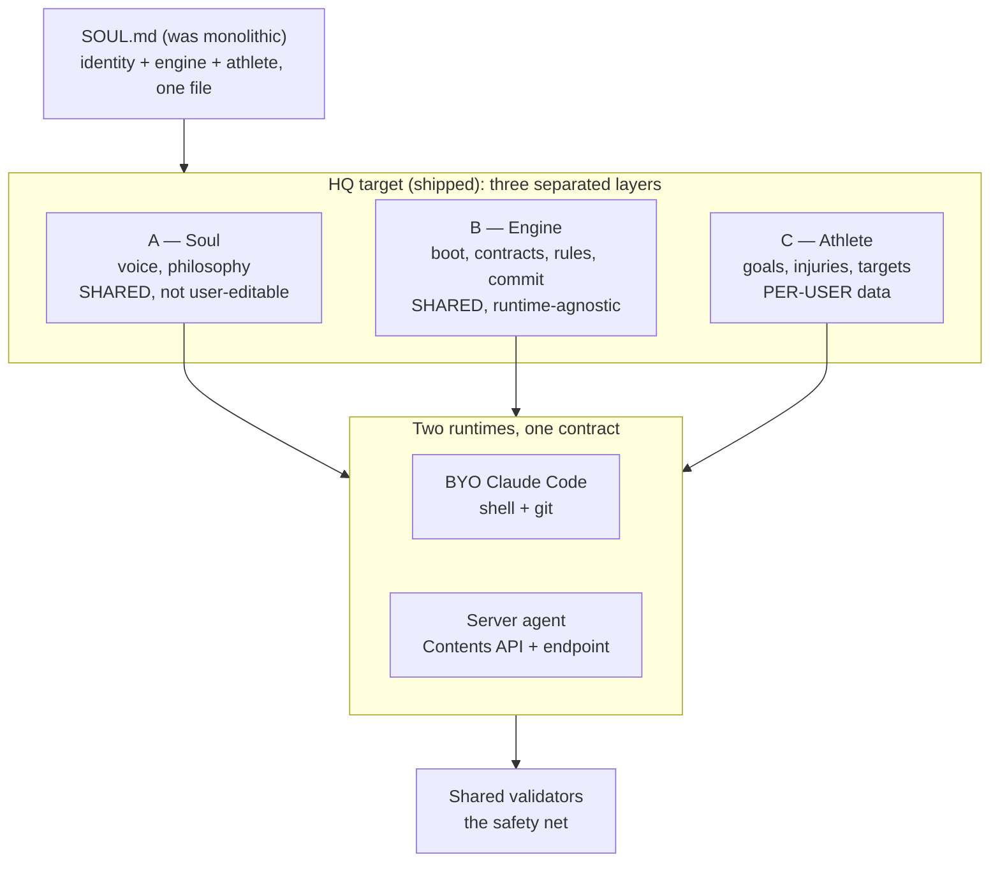
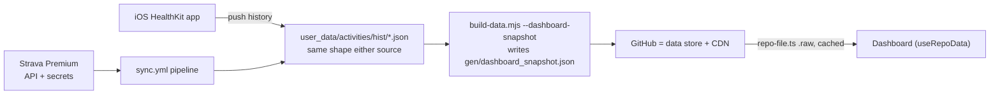
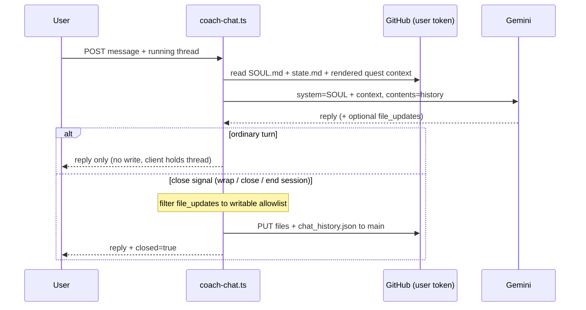
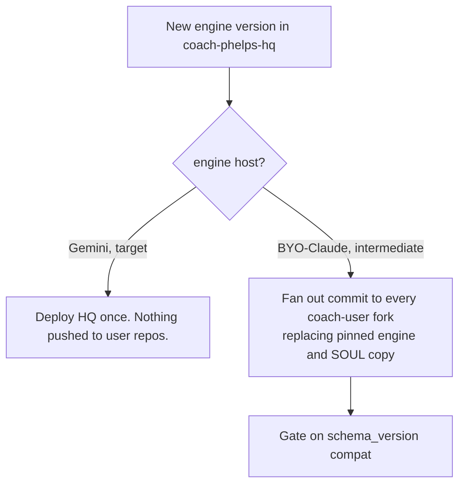
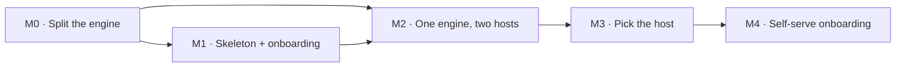

# Scaling Plan — Coach Phelps → Multi-Tenant

> Status: Current · Owner: Tech Lead · Verified: 2026-08-20

Moving Coach Phelps from single-tenant (one hand-built repo per person) to ~10 users on a shared hosted
UI. Supersedes the old root scaling plan for architecture (deleted — see git history; its Friend-#3
parking-lot items, issue links, 8h re-prompt UX and org-rename follow-ups went with it).

---

## 1. Context

Coach Phelps today is one person's repo: a layered soul (`soul/` → composed `SOUL.md`), Strava/HealthKit data, a sync pipeline, and
a dashboard, all driven by a Claude Code session. We want ~10 F&F users on **one shared site**, each with
private data, without building a social product.

The hard parts are identity (whose data?), access (read/write the right repo, only theirs), and the coach
itself (one shared Phelps, per-user data, runnable as a local Claude session *and* a server agent). The
identity/access layer is built; the coach-as-a-service layer is half-built and is where the work remains.

**Target shape: two repos.** `coach-phelps-hq` holds everything that's *ours* — the shared UI, iOS, the
brain (Soul + engine), scripts, plugins, and the agentic layer (roles/skills/hooks/docs/kdb).
`coach-skeleton` is what each user forks: their data plus a copy of the SOUL. We get there in two stages —
a **BYO-Claude intermediate first, the Gemini server-coach after** — so the skeleton starts fatter (carries
the engine so a local Claude session can boot from the fork alone) and thins to data-only once the engine
runs server-side. The clean-structure port onto hq is **done** (see [`hq-port-plan.md`](hq-port-plan.md)); this plan
picks up from there.

**Permanent non-goal:** any cross-user / social feature. The per-repo install model enforces it — leave
no seam.

---

## 2. Current State

### 2.1 Built

| Capability | State | Where |
|---|---|---|
| GitHub App auth (user-to-server OAuth + PKCE) | Done, hardened | `ui/api/auth-*.ts` |
| User → repo resolution (ownership-filtered) | Done | `ui/api/auth/[...action].ts` (`list-my-repos` action) |
| Runtime data load ("repo-as-CDN") | Done | `ui/api/repo-file.ts`, `hooks/useRepoData.ts` |
| Sync trigger from UI | **Gone** — no UI sync endpoint remains; sync is iOS-driven (ADR 0010 dropped Strava) | — |
| **Server coach (Gemini) + write-back at close** | **Built** | `ui/api/coach-chat.ts` |
| Dual-path ingestion (Strava / iOS) | Working | `<athlete>/.github/workflows/sync.yml` (carved from `engine/.github/workflows/sync.user.yml`) |
| Direct-to-main data validation | JSON-parse only | `<athlete>/.github/workflows/validate-data.yml` (carved from `engine/.github/workflows/`) |

Three load-bearing facts: every GitHub call uses the **signed-in user's own token**, App-scoped to their
one repo (Contents R/W + Actions R/W) — no shared PAT. **Sessions are stateless** (encrypted 8h cookie, no
DB). **Layer C is already data** (`state.md`, `challenge_v2.json`, `coach_notes.md`, `sleep_log.json`) —
a head start on the split.

### 2.2 Gaps

- **No skeleton onboarding.** Login assumes the user already owns a repo with the marker file (#32).
- **Per-user forks may still carry a monolithic `SOUL.md` copy** — HQ has split `soul/` layers with composed `SOUL.md`; propagation to forks is not yet automated.
- **The server coach is a *second* engine.** `coach-chat.ts` re-encodes Layer B in TS + a prompt that
  dumps `SOUL.md` at Gemini. BYO-Claude and Gemini now run *different copies* of the rules — the central
  risk (§7/§8).
- **Engine isn't runtime-agnostic** (boot assumes shell/git/python); validators only check JSON parses.
- **Stale docs** (root README/SETUP describe the old self-host flow) and a **naming/legal** issue (§8).

---

## 3. Goal State

One shared UI, N private instance repos, one central coach whose engine executes identically on either
runtime, with validators as the shared safety net.

Users never edit A or B. Each user's data is isolated (no query spans users). Moving the coach from
BYO-Claude to fully server-side is a *hosting* change, not a rewrite — the visible move is just the
skeleton thinning from "data + engine" to "data + SOUL copy" as the engine goes server-side.

---

## 4. Assumptions & Locked Decisions

Settled — build on these: **two repos** — `coach-phelps-hq` (ours: UI + iOS + brain + scripts + plugins +
agentic layer) and `coach-skeleton` (each user forks it) — plus N per-user skeleton forks; GitHub App
installed per user; one shared Phelps, versioned centrally in HQ, not user-editable; fresh skeleton
(original archived); SOUL = three separated layers with B runtime-agnostic; athlete is *data*, not
identity; dual-path ingestion (Strava **or** iOS), same downstream shape; no social features, ever.

**Locked this session:**

- **HQ trunk = the org repo.** The clean structure from `akash-suresh/coach-phelps` is already ported onto
  `coach-phelps-hq` (see [`hq-port-plan.md`](hq-port-plan.md)). The earlier three-repo sketch's separate `coach-engine`
  is **dropped** — its canonical role folds into HQ.
- **SOUL delivery = committed copy.** Each skeleton carries a copy of SOUL. Drop the copy and inject
  server-side only if the Gemini path proves out.
- **Staging = BYO-Claude first, Gemini after.** The intermediate skeleton is fatter — it carries a pinned
  engine so a local Claude session boots from the fork alone. The target skeleton thins to data + SOUL copy
  once the engine runs server-side.

**Deferred (flagged, not decided here):**

- **Whether the engine ever leaves the skeleton** — i.e. the move to Gemini server-side. That's the only
  variant giving a real IP boundary; decide it from BYO-Claude feedback (M3), don't pre-build it.
- **Auto-provisioning.** MVP onboarding is **operator-run** (we hold the skeleton, clone + set up by
  hand). Self-serve needs Administration + Secrets App permissions — later.

---

## 5. High-Level Design

### 5.1 Topology

| Repo | Contains | Written by |
|---|---|---|
| `coach-phelps-hq` | Shared UI + `ui/api/*` + iOS + the canonical brain (Soul A + Engine B) + scripts + plugins + workflows + validators + agentic layer (roles/skills/hooks/docs/kdb). No per-user data. | Engineering (PR) |
| `coach-skeleton` → `coach-<user>` fork | The per-user fork. **Intermediate (BYO-Claude):** data + SOUL copy + pinned engine so a local session boots. **Target (Gemini):** thins to data + SOUL copy only. One per user. | Coach + sync pipeline |

The earlier three-repo sketch's `coach-engine` is gone — HQ *is* the canonical engine now.

### 5.2 The 3-way SOUL split

Mapping: A = SOUL §3–5; B = §1, §10–13; C = §7 → already `state.md`. The redesign strips athlete specifics
out of A/B, turns first-session into generic intake that *populates* C, and rewrites B as capability
contracts so either runtime executes it — validators enforcing the guarantees regardless of who ran it.

**Layer C sorts into three lifecycle bands** (from the skeleton design) — the band decides each file's git
+ rebuild policy:

- **init** — seeded once at fork (coach-notes seed, imported activity history). Re-creatable from HQ.
- **post-init** — accumulates in use (ledger, workout activities). The only precious band — protect and back up.
- **gen** — machine-generated (web-build, iOS widget payload, housekeeping). Rebuildable; keep out of git
  where possible, commit only the small typed snapshot contract (ADR 0005). Do **not** commit build output
  to a user repo — the trap the restructure already hit with `dashboard_snapshot.json`.

### 5.3 Data flow

The aggregate is the pipeline↔UI contract: one file, one fetch, `schema_version`-gated. Both sources are
interchangeable. Holds fine at ~10 users; it's the piece §9 eventually outgrows.

---

## 6. Low-Level Design

### 6.1 Auth (built — don't regress)

Two hardening details are load-bearing: installation resolution matches on **`app_slug` AND
`account.login`** (app-only matching once leaked a collaborator to the owner's install, #30), and repo
candidates are filtered to **`owner.login === session.login`** (ownership, not access). Deferred perms to
bundle into one re-consent: **Administration** (API-create repo) + **Secrets** (write Strava secrets).

### 6.2 Server coach write-back (`coach-chat.ts`) — built

No DB (repo is the only store); commit once at a keyword close-trigger; writable-file allowlist as
defense-in-depth; single shared `GEMINI_API_KEY` (free tier, 429-handled). **The problem:** this endpoint
is a second copy of B — rules living only in its prompt (verbatim reproduction, close trigger, allowlist)
are enforced differently by BYO-Claude. Collapsing the two into one shared B + one validator is the core
milestone (§7). Until then, Gemini reproducing a 14KB `state.md` is one truncation from data loss, with
only a JSON-parse check guarding it.

### 6.3 Skeleton, onboarding, propagation

Onboarding is operator-run — a `provision-user.sh` that creates a `coach-<user>` fork from
`coach-skeleton`, sets the sync source, seeds empty Layer C; the user then installs the App and runs
intake. Propagation depends on the stage:

### 6.4 Validators

Extend `validate-data.yml` from JSON-parse-only to the **full file contracts** (required `state.md`
sections, `challenge_v2.json` schema, sleep-log pairing, session shape). This is what makes "either
runtime, executed identically" real — server-written and human-written commits pass the same gate. Highest
priority, because write-back is already live.

---

## 7. Milestones

Each milestone is a shippable outcome with a clear exit test, not a work log.

| # | Size | Milestone | Done when (exit test) |
|---|---|---|---|
| **M0** | **L** | Split the engine | `SOUL.md` is separated into A / B / C; B is capability-contract form (no shell/git assumptions); `validate-data.yml` enforces the full file contracts; aggregate `schema_version` is frozen and documented. |
| **M1** | **M** | Carve `coach-skeleton` + onboarding | `sibling-shipyard/coach-skeleton` full BYO tree carved from HQ `engine/` (skeleton layout: `gen/` + `user_data/` + SOUL copy — see [`skeleton-layout.md`](skeleton-layout.md), [`m1-plan.md`](m1-plan.md)); **two** clones via `provision-user.sh` — **`akash-suresh/coach-akash`** and **`skanda-2003/coach-skanda`** (private on athlete accounts, full migration from legacy); each passes BYO boot, dashboard load, sync trigger; coach-chat P1; legacy repos kept as backup; README/SETUP describe hosted flow. |
| **M2** | **L** | One engine, two hosts | `coach-chat.ts` and a BYO-Claude session execute the *same* shared B and pass the *same* validator — no coaching rule lives only in the endpoint prompt. |
| **M3** | **S** | Pick the host | The A+B location decision is made from M2 feedback (server-only / BYO / hybrid), and §4/§6 are updated to match. |
| **M4** | **M** | Self-serve onboarding | A user self-provisions on first login: repo created + secrets written automatically (Administration + Secrets perms granted); the operator step is gone. **Hard gate before user 3+** — see [`user-3-onboarding-gate.md`](user-3-onboarding-gate.md). |

Sizing is rough (S = a sitting, M = a few sessions, L = a real chunk of focused work). M0 and M2 are the
heavy lifts and the critical path; M3 is mostly a decision.

Prereq (done): the clean-structure port onto HQ — [`hq-port-plan.md`](hq-port-plan.md), P1–P3 shipped.

Ordering: M0 unlocks everything (a runtime-agnostic engine + real validators is what makes both hosts
safe). M1 gets real users on the stop-gap and generates the feedback M2/M3 need. **M4 is no longer
"polish last" for friends — see [`user-3-onboarding-gate.md`](user-3-onboarding-gate.md): user 3+ must
self-serve via website sign-up with zero PAT/operator steps before inviting anyone beyond Akash/Skanda.**
M2's write-back safety (extending the validator) is the single highest-priority engineering item after
that gate, since the server coach already writes to repos today.

---

## 8. Risks & Open Questions

- **Naming/legal — blocks public launch.** "Coach Phelps" references a real, litigious public figure
  (right of publicity; Lanham Act). Zero exposure while private; real the moment it's shareable. Rename
  the persona (not the concept) with runway.
- **Server vs. human execution must match — and write-back is live.** `coach-chat.ts` already writes via a
  re-encoded B; the validator (§6.4) must become the shared gate. Highest-priority hardening.
- **IP boundary unresolved by design.** Local BYO-Claude and "hide the engine" are mutually exclusive;
  resolved only by going server-side (M2/M3).
- **Shared Gemini key = shared cost + rate limit.** One free-tier key for all users; a ceiling as users
  grow; feeds the funding question.
- **Propagation half-apply.** A `schema_version` bump without matching UI support strands users; gate it
  (§6.3), prefer additive changes.
- **Data-store ceiling.** Repo-as-CDN is fine at 10; unbounded history + API limits force §9 later.
- **Later calls:** collaborator dashboard sharing (recommend explicit owner opt-in only); per-user page
  config (#13); Android sync; funding path for centralized model cost.

---

## 9. Long-Term Vision (rough)

Not committed; recorded so the design doesn't box us in.

- **Scale to ~10k users:** a real backend (Postgres + object store) behind the *same* aggregate contract,
  with GitHub demoted to an optional sync target.
- **Web + iOS:** narrative dashboards and configurable widgets (per-user config lives in Layer C).
- **iOS app:** Apple Watch companion + auto-sync, becoming the primary ingestion path.
- **Ultimate — coach watches sync:** it pre-reads each new activity and drops a `coach_comment` for the
  UI — a server agent executing B on a sync webhook, which is exactly why B must be runtime-agnostic.
  Everything in M0–M3 is on that path.

---

## Appendix — file / endpoint references

Auth: `ui/api/auth/[...action].ts`, `_lib/session.ts`, `_lib/pkce.ts` · Repo resolution: `list-my-repos` action ·
Runtime data: `repo-file.ts`, `hooks/useRepoData.ts` · Server coach:
`coach-chat.ts` · Build: `build-data.mjs --dashboard-snapshot` · Athlete workflows (carved from `engine/.github/workflows/`):
`sync.yml`, `validate-data.yml`, `apply-coach-patch.yml` · HQ workflows: `validate-soul.yml`, `validate-kdb.yml` ·
Engine: `soul/` layers + composed `SOUL.md` · Prior: `docs/eng-docs/website-unification-history.md`.
