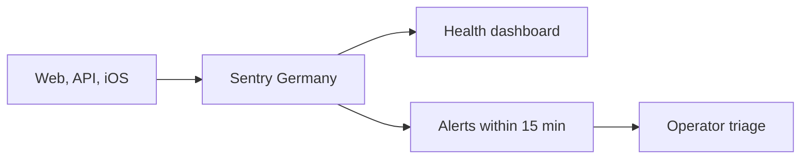

# Sentry operator runbook

> Status: Current · Owner: Tech Lead · Verified: 2026-08-30 · ADR: [0032](../../kdb/decisions/0032-sentry-data-rules.md)

Sentry is the shared debug view for the four opted-in beta athletes. Data stays in the Germany
region for 30 days on the Developer plan — fixed by the plan, not a dial we hold; Vercel and
Apple logs are fallback sources.

## Route

## Set up once

1. Create one organization **in the EU region** — the region is fixed at creation and cannot be
   moved later. Require 2FA. Keep default PII, replay, and screenshots off. Retention is 30 days
   on the Developer plan — fixed by the plan, with no per-project dial; 90 days needs Team. The
   Developer plan seats **one user**, so there is no `operators` team to invite anyone to yet —
   a second operator means upgrading. Confirm the region and the retention on the real account
   (ADR 0032).
2. Create `coach-hq-web` (React), `coach-hq-api` (Node), and `coach-hq-ios` (Cocoa) projects — the
   single Developer-plan user owns all three. Put `VITE_SENTRY_DSN` and `SENTRY_DSN` in Vercel Production and
   Preview. Put the public iOS DSN in the uncommitted `Secrets.swift` used by the app build.
3. **Nothing uploads source maps or dSYMs yet — there is no setup step here to do.**
   `ui/vite.config.ts` loads no Sentry plugin and `@sentry/vite-plugin` is not a dependency, so
   web stack frames arrive minified. iOS is the same story for a different reason: the repo builds
   and tests `ios/` in CI but has no archive/release workflow to hang a dSYM upload off. Treat
   every production stack trace, web and iOS alike, as unreadable. Phase 6 of
   `docs/plans/sentry-lld.md` is the work; when it ships, the token it needs must never be named
   `VITE_*`, because Vite bakes those into the client bundle.
4. Set `SENTRY_TRACES_SAMPLE_RATE` and `VITE_SENTRY_TRACES_SAMPLE_RATE` explicitly. They default
   to `1`, which is right for four athletes and wrong the first day it isn't.
5. Build one dashboard and three alerts from the tables below. Route alerts to team email plus the
   Sentry mobile app; use a five-minute notification interval. The dashboard is built:
   **"Coach HQ health"**, id `5873386`. All four filters have returned production rows; a short
   time window can still be empty with four athletes. The alerts are not built yet.

| dashboard widget | filter | group / value |
|---|---|---|
| Production errors and reports | `environment:production` | project, `operation`, release, count |
| Core web/API health | `span.op:http.server` | span name, `outcome`, count, p95 duration |
| Gemini health | `span.op:gen_ai.generate_content` | `gen_ai.request.model`, `outcome`, count, p95 duration, `gen_ai.usage.*` token totals |
| iOS sync health | `transaction:healthkit.sync` | `outcome`, count, duration, synced item count |

Every error has an `operation` tag: `web` for browser errors, the API route without `/api/` with
slashes changed to dots (for example `auth.callback`), or the native operation name on iOS. Use it
to group failures by entry point; `trace_id` is still the key that joins one interaction.

| alert | condition | route |
|---|---|---|
| New or regressed production error | first seen or regression | immediate |
| Repeated core failure | `outcome:error`, at least 3 events in 15 minutes | immediate |
| Athlete Rage Report | `operation:rage_report` | immediate |

## Triage

1. Record the issue URL, timestamp, project, `operation`, `trace_id`, `athlete_id`, and release.
   `athlete_id` is the repo owner (`skanda-athlete`) and is also the event's Sentry user, so the
   issue page's user filter and an `athlete_id:` search find the same events. Web, API, and iOS
   derive it the same way — one athlete, one id across all three projects. An event with no
   `athlete_id` happened before auth resolved: an unauthenticated request, a failed sign-in, or a
   render crash on the login screen.
2. Search the same `trace_id` across projects, or open the trace view — the browser SDK propagates
   Sentry's own trace id to `/api/...` on `sentry-trace` and `baggage`, so both halves of one
   interaction sit on one trace. Read only the evidence attached to a Rage Report; use the timeline to
   locate the failing web/API/Gemini/iOS span. **A failed Gemini call carries the athlete's message**
   (ADR 0032). `captureGeminiFailure()` in `ui/api/_lib/sentry.ts` attaches it as event context, plus
   `model`, `upstream_status` and `turn_mode`. It also attaches `vercel_trace_id` — coach-chat's own
   id, for grepping the Vercel logs of the same turn. The scrubber (`ui/observability/sentryScrubber.ts`) still runs
   first, so any credential in that text still shows as `[Filtered]`.
3. Confirm credentials show as `[Filtered]`. Delete the event and rotate the credential immediately
   if an auth header, cookie, API key, GitHub token, or session token escaped.
4. File the defect with the Sentry link, trace id, release, user impact, and failing stage. Resolve
   the Sentry issue only after the fix release has a successful matching operation.

## Prove before merge

1. Confirm a successful homepage load, chat turn, Gemini call, and HealthKit sync appear on the
   dashboard with the expected release and success outcome.
2. In Preview, temporarily use an invalid Gemini key for one chat turn, then restore it. Confirm the
   client and API failure share one trace id and the repeated-failure alert arrives within 15 minutes.
3. Launch iOS with `--send-sentry-test-event`, then submit one Rage Report with one selected timeline
   event. Confirm the alert, release tags, attachment, and Cancel-sends-nothing behavior.
4. Open one production web exception and one iOS test event. Confirm each has `release`,
   `environment`, and `operation`. Minified web frames and unsymbolicated iOS frames are expected
   until the parked source-map and dSYM work ships.

## Traps

Three that have already cost us a build. Read these before editing `ui/api/_lib/sentry.ts`.

1. **`beforeSend` is error events only.** Transactions and spans are separate payloads with their
   own hooks. Wire `beforeSendTransaction` and `beforeSendSpan` too, or the credential scrubber
   covers about a third of what we send.
2. **Do not use `spans: false` to remove the duplicate incoming span.** It also disables outbound
   spans. Use `disableIncomingRequestSpans: true` for the SDK duplicate and
   `ignoreOutgoingRequests` for outbound traffic.
3. **A second `captureException` of the same error object is dropped.** That is what holds a
   rethrown Gemini failure to one event: the detailed capture goes first and wins. Rethrow a
   *fresh* error with the same message and you get two.
   Proved in `ui/api/_lib/_tests/sentry-spans.test.ts`.

## Coverage boundary

Today we count core homepage, chat, Gemini, HealthKit sync, Rage Report, and React render-crash
paths — the browser's own pageload and navigation spans, one manual incoming `http.server` span on
each wrapped API route, and the Gemini spans we open ourselves. **Outbound HTTP
from the API is deliberately not traced.** Both Node instrumentations copy the full request URL onto
the span, and `geminiClient.ts` passes the API key in the query string, so an `http.client` span is
a credential in Sentry. `beforeSend` never sees it, because that hook fires for error events only.
`ui/api/_lib/sentry.ts` hands `httpIntegration` and `nativeNodeFetchIntegration` an
`ignoreOutgoingRequests` that returns true for everything, dropping the span and the breadcrumb
before either is built. The cost is that GitHub call durations never reach the trace. Gemini is the
one outbound call we time, and we do it by opening a span by hand. GitHub success totals and iOS
dSYM upload are not covered; do not infer whole-product uptime or traffic from this dashboard yet.
Chat text reaches Sentry only when
a Gemini call fails; a successful turn's text stays in `chat_history.json`, never Sentry. And this is
error monitoring, not product analytics: it will not tell you what athletes
do, only what broke. That is a different tool and a different question — see `docs/plans/sentry-lld.md`
§4.
