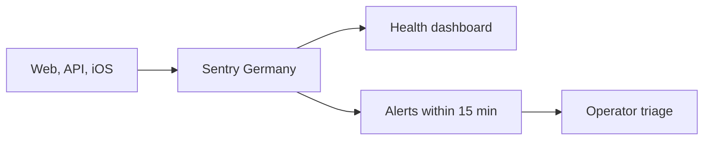

# Sentry operator runbook

> Status: Current · Owner: Tech Lead · Verified: 2026-08-29 · ADR: [0032](../../kdb/decisions/0032-sentry-data-rules.md)

Sentry is the shared debug view for the four opted-in beta athletes. Data stays in the Germany
region for 90 days — fixed by the plan, not a dial we hold; Vercel and Apple logs are fallback
sources.

## Route

## Set up once

1. Create one organization **in the EU region** — the region is fixed at creation and cannot be
   moved later — plus an `operators` team. Invite every operator; require 2FA. Keep default PII,
   replay, and screenshots off. Retention is 90 days, fixed by the Developer plan — there is no
   per-project dial. Confirm the region and the retention number on the real account (ADR 0032).
2. Create `coach-hq-web` (React), `coach-hq-api` (Node), and `coach-hq-ios` (Cocoa) projects. Give
   `operators` access to all three. Put `VITE_SENTRY_DSN` and `SENTRY_DSN` in Vercel Production and
   Preview. Put the public iOS DSN in the uncommitted `Secrets.swift` used by the app build.
3. **Web source maps upload themselves.** The Vite build does it when `SENTRY_AUTH_TOKEN`,
   `SENTRY_ORG`, and `SENTRY_PROJECT` are all set — add them to Vercel Production and Preview
   with a token scoped to project release write. Never name one `VITE_*`; Vite bakes those into
   the client bundle. **iOS dSYMs are still manual:** this repo builds and tests iOS in CI but has
   no archive/release workflow, so upload dSYMs from the Xcode archive (or add
   `sentry-cli upload-dif`) when you cut a build. Until that happens, treat iOS stack traces as
   unsymbolicated.
4. Set `SENTRY_TRACES_SAMPLE_RATE` and `VITE_SENTRY_TRACES_SAMPLE_RATE` explicitly. They default
   to `1`, which is right for four athletes and wrong the first day it isn't.
5. Build one dashboard and three alerts from the tables below. Route alerts to team email plus the
   Sentry mobile app; use a five-minute notification interval.

| dashboard widget | filter | group / value |
|---|---|---|
| Production errors and reports | `environment:production` | project, `operation`, release, count |
| Core web/API health | `span.op:http.server` | span name, `outcome`, count, p95 duration |
| Gemini health | `span.op:ai.run` | `ai.model`, `outcome`, count, p95 duration, token totals |
| iOS sync health | transaction `healthkit.sync` | `outcome`, count, duration, synced item count |

| alert | condition | route |
|---|---|---|
| New or regressed production error | first seen or regression | immediate |
| Repeated core failure | `outcome:error`, at least 3 events in 15 minutes | immediate |
| Athlete Rage Report | `operation:rage_report` | immediate |

## Triage

1. Record the issue URL, timestamp, project, `trace_id`, `athlete_id`, and release.
2. Search the same `trace_id` across projects, or open the trace view — the browser SDK propagates
   Sentry's own trace id to `/api/...` on `sentry-trace` and `baggage`, so both halves of one
   interaction sit on one trace. Read only the evidence attached to a Rage Report; use the timeline to
   locate the failing web/API/Gemini/iOS span. **A failed Gemini call carries the athlete's message**
   (ADR 0032) — `captureGeminiFailure()` in `ui/api/_lib/sentry.ts` attaches it as event context, plus
   `model`, `upstream_status`, `turn_mode`, and `vercel_trace_id` — coach-chat's own id, for grepping
   the Vercel logs of the same turn. The scrubber (`ui/observability/sentryScrubber.ts`) still runs
   first, so any credential in that text still shows as `[Filtered]`.
3. Confirm credentials show as `[Filtered]`. Delete the event and rotate the credential immediately
   if an auth header, cookie, API key, GitHub token, or session token escaped.
4. File the defect with the Sentry link, trace id, release, user impact, and failing stage. Resolve
   the Sentry issue only after the fix release has a successful matching operation.

## Prove before merge

1. Confirm a successful homepage load, chat turn, Gemini call, and HealthKit sync appear on the
   dashboard with the expected release and success outcome.
2. In Preview, temporarily use an invalid Gemini key for one chat turn, then restore it. Confirm the
   client and API failure share one trace id and the repeated-failure alert arrives within 15 minutes.
3. Launch iOS with `--send-sentry-test-event`, then submit one Rage Report with one selected timeline
   event. Confirm the alert, release tags, attachment, and Cancel-sends-nothing behavior.
4. Check one web exception is deminified and one iOS crash is symbolicated. Save the three Sentry URLs
   in PR #604; only then replace `Refs: #585` with `Fixes: #585` and delete the plan.

## Coverage boundary

Today we count core homepage, chat, Gemini, HealthKit sync, and Rage Report paths — the browser's
own pageload and navigation spans, the API's incoming `http.server` span, and the Gemini spans we
open ourselves. **Outbound HTTP from the API is deliberately not traced.** Both Node
instrumentations copy the full request URL onto the span, and `geminiClient.ts` passes the API key
in the query string, so an `http.client` span is a credential in Sentry — one that `beforeSend`
never sees, because it fires for error events only. `ui/api/_lib/sentry.ts` hands
`httpIntegration` and `nativeNodeFetchIntegration` an `ignoreOutgoingRequests` that returns true
for everything, which drops the span and the breadcrumb before either is built. The cost is that
Gemini and GitHub call durations are not on the trace unless we open a span for them by hand; that
is the trade we want. Auth-server
traffic, every secondary API route, GitHub success totals, and iOS dSYM upload are not covered; do
not infer whole-product uptime or traffic from this dashboard yet. Chat text reaches Sentry only when
a Gemini call fails; a successful turn's text stays in `chat_history.json`, never Sentry. And this is
error monitoring, not product analytics: it will not tell you what athletes
do, only what broke. That is a different tool and a different question — see `docs/plans/sentry-lld.md`
§4.
