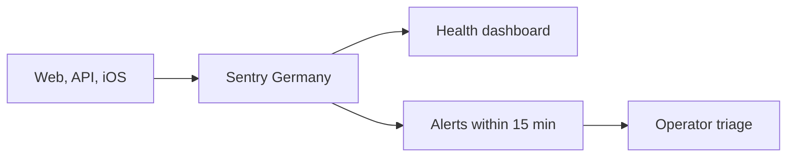

# Sentry operator runbook

> Status: Current · Owner: Tech Lead · Verified: 2026-09-05 · ADR: [0032](../../kdb/decisions/0032-sentry-data-rules.md)

Sentry is the shared debug view for the four opted-in beta athletes. Data stays in the Germany
region for 30 days on the Developer plan — fixed by the plan, not a dial we hold; Vercel and
Apple logs are fallback sources.

## Route



## Set up once

1. Create one organization **in the EU region** — the region is fixed at creation and cannot be
   moved later. Require 2FA. Keep default PII, replay, and screenshots off. Retention is 30 days
   on the Developer plan — fixed by the plan, with no per-project dial; 90 days needs Team. The
   Developer plan seats **one user**, so there is no `operators` team to invite anyone to yet —
   a second operator means upgrading. Confirm the region and the retention on the real account
   (ADR 0032).
2. Create `coach-hq-web` (React), `coach-hq-api` (Node), and `coach-hq-ios` (Cocoa) projects — the
   single Developer-plan user owns all three. Put `VITE_SENTRY_DSN` and `SENTRY_DSN` in Vercel Production and
   Preview. Put the public iOS DSN in the uncommitted `Secrets.swift` used by the app build.
3. **Nothing uploads source maps or dSYMs yet — there is no setup step here to do.**
   `ui/vite.config.ts` loads no Sentry plugin and `@sentry/vite-plugin` is not a dependency, so
   web stack frames arrive minified. iOS is the same story for a different reason: the repo builds
   and tests `ios/` in CI but has no archive/release workflow to hang a dSYM upload off. Treat
   every production stack trace, web and iOS alike, as unreadable. It is the first item under
   `ops-observability.md` § Deferred; when it ships, the token it needs must never be named
   `VITE_*`, because Vite bakes those into the client bundle.
4. Set `SENTRY_TRACES_SAMPLE_RATE` and `VITE_SENTRY_TRACES_SAMPLE_RATE` explicitly. They default
   to `1`, which is right for four athletes and wrong the first day it isn't.
5. **Dashboard.** Built and complete: **"Coach HQ health"**, id `5873386`, all seven widgets
   returning production rows. The questions they answer live in `ops-observability.md`, which owns
   that list.
6. **Alerts.** All three in the table below are built. The first two run on every project; the Rage
   Report rule covers `coach-hq-web` and `coach-hq-ios`, the two projects reports originate in.
7. **Alert routing.** Team email plus the Sentry mobile app, five-minute notification interval. A
   shorter window can still be empty with four athletes. `coach-hq-web` and `coach-hq-ios` also keep
   Sentry's default high-priority-issue rule — a heuristic on top of, not a substitute for, the
   explicit rules.

Every error has an `operation` tag: `web` for browser errors, the API route without `/api/` with
slashes changed to dots (for example `auth.callback`), or the native operation name on iOS. Use it
to group failures by entry point; `trace_id` is still the key that joins one interaction.

Every rule filters `environment:production`, so none of them fires on Preview or local traffic.

| alert | condition | scope |
|---|---|---|
| New or regressed production error | first seen, or resolved → unresolved | all three projects |
| Repeated core failure | issue seen more than 3 times in 15 minutes | all three projects |
| Athlete Rage Report | every event, filtered to tag `operation` = `rage_report` | `coach-hq-web`, `coach-hq-ios` |

**The Rage Report rule fires on every event, not on a new issue, and carries no `event.type`
filter.** Both halves matter. `RageReportSubmission.swift` and web's `submitRageReport()`
(`ui/client/src/lib/observability.ts`) both submit through capture-message, so reports arrive as
`event.type:default` at `level:info` — an `event.type:error` filter matches nothing and the rule
looks built while never firing. And reports group stably by fingerprint (#699), so a first-seen
condition would fire once and stay silent forever after.

Both surfaces set the same `rage_report` fingerprint, so each project's reports group into one
issue. They do not share an issue: web is `coach-hq-web`, iOS is `coach-hq-ios`.

**Absence has its own check, and it is CI, not Sentry.** The `Span health` workflow
(`.github/workflows/span-health.yml`) runs `ui/scripts/check-span-health.mjs` daily at 09:00 UTC
and fails when production served traffic in the last 24 hours and sent no `http.server` span. It
needs a `SENTRY_AUTH_TOKEN` repository secret; without one it warns and passes. A Sentry alert
cannot express this, because it sees only one dataset at a time and cannot say "traffic happened
but spans did not" — a quiet day would fire it every time.

## Query from a terminal

The token never lives in the repo. Take it from the environment, falling back to a local file, so
the same command works on a fresh machine and in CI:

```bash
TOKEN=${SENTRY_AUTH_TOKEN:-$(cat ~/.config/sentry-token)}
```

`SENTRY_AUTH_TOKEN` is Sentry's own conventional name — `sentry-cli` and `@sentry/vite-plugin` read
it with no configuration, so the parked source-map and dSYM upload needs no second variable. In CI
it is meant to be a GitHub Actions secret of that name, exposed as an env var — **no such secret
exists yet**, so `Span health` warns and passes until someone runs
`gh secret set SENTRY_AUTH_TOKEN < ~/.config/sentry-token`. Never prefix it `VITE_`, because Vite
bakes those into the client bundle.

On a shared or long-lived machine prefer the file, `chmod 600`. An environment variable is
inherited by every child process and shows up in a plain `env` dump; the file does not.

**Setting up on a new machine:** create the token under Sentry → Settings → Auth Tokens, then
either export it or write it to `~/.config/sentry-token`. Nothing in the repo reads it, so there is
no config to change. Scopes, from what each endpoint here actually needs: reading events, spans and
dashboards; writing dashboards; and `alerts:write` to create alert rules. Read it inline; never
echo or paste it.

**Which endpoints answer depends on the token, and one failure mode lies.** The token that can
create alert rules cannot list them: every alert-rule read returns
`{"message": "This API no longer exists."}`, which reads like a dead endpoint rather than a token
problem. The token it replaced was the reverse — it listed rules fine and refused `POST` with a
plain permission error. Both read events, spans and dashboards. If a rule you just created cannot
be read back, suspect the token before you doubt the rule.

```bash
curl -s -G "https://sentry.io/api/0/organizations/sibling-shipyard/events/" \
  -H "Authorization: Bearer $TOKEN" \
  --data-urlencode "dataset=spans" \
  --data-urlencode "project=-1" \
  --data-urlencode "statsPeriod=14d" \
  --data-urlencode "query=environment:production span.op:http.server" \
  --data-urlencode "field=timestamp" --data-urlencode "field=release" \
  --data-urlencode "sort=-timestamp"
```

Use `dataset=spans` for spans and `dataset=errors` for errors. They are separate stores, so a
span filter against the errors dataset returns nothing. `project=-1` searches all three projects;
select `project.name` when the result must identify one.

Every sort field must also appear as a selected `field`. Sorting by an unselected column returns
an error, not an empty result.

A span *data* attribute whose name collides with an aggregate has to be read through `tags[...]`.
The HealthKit item count is stored as `count` (`DiagnosticsManager.swift`), so `count` and
`span.data.count` both return null on every row; only `tags[count,number]` reads it.

Always filter `environment:production` before drawing a conclusion. Preview verification traffic
shares the store, and deliberate test failures can otherwise look like a production outage.

A release tag is not proof of a deploy. Confirm that production traffic carries the expected
release before calling a fix verified; green CI proves only that the code merged.

**An absent span is not evidence the endpoint was never called.** Before you read Sentry's silence
as a finding, confirm a recent span exists on the release production is serving. In #878 the span
pipeline was dead while errors kept arriving, and the missing `/api/coach-message` spans were read
as a broken iOS sync (#874) rather than broken reporting. `Span health` (the daily workflow)
catches this within a day; between runs, check by hand. `stats_v2` tells you *why* a payload never
landed and the events API cannot: query it with `groupBy=outcome&groupBy=reason` and a
`client_discard` row names the SDK-side reason — `sample_rate`, `event_processor`, `before_send`.

## Triage

1. Record the issue URL, timestamp, project, `operation`, `trace_id`, `athlete_id`, and release.
   `athlete_id` is the repo owner (`skanda-athlete`) and is also the event's Sentry user, so the
   issue page's user filter and an `athlete_id:` search find the same events. Web, API, and iOS
   derive it the same way — one athlete, one id across all three projects. An event with no
   `athlete_id` happened before auth resolved: an unauthenticated request, a failed sign-in, or a
   render crash on the login screen.
2. Search the same `trace_id` across projects, or open the trace view — the browser SDK propagates
   Sentry's own trace id to `/api/...` on `sentry-trace` and `baggage`, so both halves of one
   interaction sit on one trace. Read only the evidence attached to a Rage Report; use the timeline to
   locate the failing web/API/Gemini/iOS span. **A failed Gemini call carries the athlete's message**
   (ADR 0032). `captureGeminiFailure()` in `ui/api/_lib/sentry.ts` attaches it as event context, plus
   `model`, `upstream_status` and `turn_mode`. It also attaches `vercel_trace_id` — coach-chat's own
   id, for grepping the Vercel logs of the same turn. The scrubber (`ui/observability/sentryScrubber.ts`) still runs
   first, so any credential in that text still shows as `[Filtered]`.
3. Confirm credentials show as `[Filtered]`. Delete the event and rotate the credential immediately
   if an auth header, cookie, API key, GitHub token, or session token escaped.
4. File the defect with the Sentry link, trace id, release, user impact, and failing stage. Resolve
   the Sentry issue only after the fix release has a successful matching operation.

## Prove before merge

1. Confirm a successful homepage load, chat turn, Gemini call, and HealthKit sync appear on the
   dashboard with the expected release and success outcome.
2. In Preview, temporarily use an invalid Gemini key for one chat turn, then restore it. Confirm the
   client and API failure share one trace id. **No alert fires here** — every rule filters
   `environment:production`, and Preview is not it. Do not read the silence as a broken alert.
3. Launch iOS with `--send-sentry-test-event`, then submit one Rage Report with one selected timeline
   event. Confirm release tags, attachment, and Cancel-sends-nothing behavior. On web, submit one
   report from the header menu and confirm it carries `surface:web`, `extra.trail`, and no
   `console` breadcrumb. The alert follows the same production-only rule as above.
   To prove delivery itself, open a rule in Sentry and use **Send Test Notification** — that is the
   only check that exercises the mailbox rather than the condition.
4. Open one production web exception and one iOS test event. Confirm each has `release`,
   `environment`, and `operation`. Minified web frames and unsymbolicated iOS frames are expected
   until the parked source-map and dSYM work ships.

## Traps

Six constraints to check before editing Sentry setup.

1. **`beforeSend` is error events only.** Transactions and spans are separate payloads with their
   own hooks. Wire `beforeSendTransaction` and `beforeSendSpan` too, or the credential scrubber
   covers about a third of what we send.
2. **Do not use `spans: false` to remove the duplicate incoming span.** It also disables outbound
   spans. Use `disableIncomingRequestSpans: true` for the SDK duplicate and
   `ignoreOutgoingRequests` for outbound traffic.
3. **A thrown request gets one awaited flush.** Queue its error without flushing, end the root
   span, then await one flush for both. `waitUntil` is only safe when returning a response; two
   awaited two-second flushes can delay a thrown request by four seconds.
4. **A second `captureException` of the same error object is dropped.** That is what holds a
   rethrown Gemini failure to one event: the detailed capture goes first and wins. Rethrow a
   *fresh* error with the same message and you get two.
   Proved in `ui/api/_lib/_tests/sentry-spans.test.ts`.
5. **The Node SDK drops 3xx and 4xx transactions unless you tell it not to.**
   `httpIntegration`'s `dropSpansForIncomingRequestStatusCodes` defaults to `[[401, 404],
   [301, 303], [305, 399]]`, and the event processor that applies it runs on **every**
   transaction — ours included. `disableIncomingRequestSpans: true` does not switch it off; it
   gates span creation only. `sentry.ts` passes an empty list, because a 401 here is an expired
   session and a 404 is a snapshot the athlete's repo never got (#878).
6. **Keep iOS file-I/O tracing off.**
   `ios/CoachHQ/CoachHQ/Services/DiagnosticsManager.swift` sets
   `options.enableFileIOTracing = false`. Enabling it captures keyboard and system file reads
   that bury useful spans and spend quota.

## Coverage boundary

**Counted:** homepage, chat, Gemini, HealthKit sync, Rage Reports from web and iOS, React
render-crash paths, and the two client fetches the dashboard cannot start without —
`/api/auth/me` and `/api/repo-file` (`captureFetchFailure` in
`ui/client/src/lib/observability.ts`). That means the browser's own pageload and navigation
spans, one manual `http.server` span on each wrapped API route, and the Gemini spans we open by
hand. A web report
carries the SDK's own click, navigation and fetch breadcrumbs as its timeline, copied onto
`extra.trail` when the dialog opens. `beforeBreadcrumb` drops the `console` ones, because those
would carry arbitrary logged text on a path ADR 0032 scoped to failed Gemini calls.

**A failure a route returns instead of throwing is only counted if that route captures it by
hand** — `withSentryRoute` sees throws, and a fault built into a `Response` never reaches it. Two
lines separate a fault from an answer, and both show up in triage. GitHub answering `/user` or the
token endpoint with a rejection body is an answer: a bad code, a refresh token that aged out after
six months idle. A non-2xx from GitHub, or a 200 whose body carries neither a token nor an error,
is a fault. And a session cookie that will not decrypt is a fault — a rotated `SESSION_SECRET`
looks exactly like signing out — except when jose codes it `ERR_JWT_EXPIRED`, which really is a
cookie that aged out. A 404 before first sync and a revoked install stay uncaptured everywhere.

**A client fetch failure says which half of the trace to look at.** `fetch_failure:network` means
the request never got a response: there is no API event to join it to, and `online:false` says the
athlete's connection was the reason. `fetch_failure:server` means the API answered, so its own
event sits on the same `trace_id` and `status_code` says what it decided. Drops are
`level:warning`, refusals `level:error`. Both group on endpoint, kind and status rather than on the
minified stack, so one revoked token stays one issue to resolve and a real outage is a count that
climbs.

**Not counted. Do not infer whole-product uptime or traffic from this dashboard.**

- **Outbound HTTP from the API, deliberately.** Both Node instrumentations copy the full request URL
  onto the span, and `geminiClient.ts` passes the key in the query string. An `http.client` span
  would therefore be a credential in Sentry, and `beforeSend` never catches it — that hook fires for
  error events only. `ui/api/_lib/sentry.ts` gives `httpIntegration` and `nativeNodeFetchIntegration` an
  `ignoreOutgoingRequests` returning true for everything, dropping span and breadcrumb before either
  is built. The cost: GitHub call durations never reach a trace. Gemini is the one outbound call we
  time, by opening a span ourselves.
- **GitHub success totals**, for the same reason.
- **iOS dSYM upload**, still parked.
- **Chat text on a successful turn.** It reaches Sentry only when a Gemini call fails; a turn that
  works stays in `chat_history.json`.

And this is error monitoring, not product analytics. It says what broke, never what athletes do —
a different tool and a different question. See `ops-observability.md` § What this does not cover.
