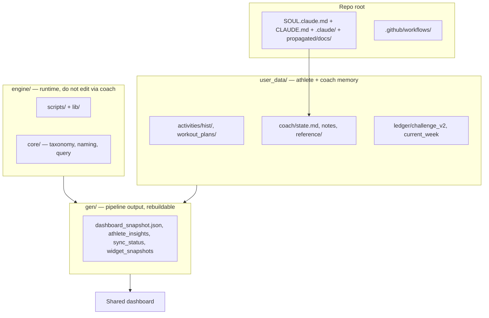
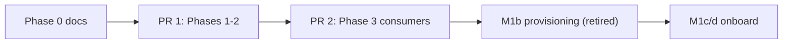

# Skeleton Layout — Full BYO Tree

> Status: Current · Owner: Tech Lead · Verified: 2026-09-05 · Locked: 2026-07-26 · Authority: [`scaling-plan.md`](scaling-plan.md) §7 M1 · Carve: [`platform/scripts/carve-skeleton.mjs`](../../platform/scripts/carve-skeleton.mjs)
>
> **Superseded in part:** Strava ingestion was removed entirely and this doc updated to match —
> see [ADR 0010](../../kdb/decisions/0010-remove-strava-relocate-activity-tools.md). The engine's
> `strava/` directory no longer exists; `query_history.py`/`rename_core.py` moved to `engine/core/`. `.env.example`
> was also dropped from the skeleton. Untouched: this doc still describes the manual clone+PAT
> setup flow, which self-serve GitHub auth (see [`github-auth.md`](github-auth.md)) has since replaced
> for new sign-ups — that's a separate, not-yet-done doc pass.

## Context

First ~10 athletes use **BYO Claude** — clone one repo, follow `SETUP.md`, open Claude Code, talk to Coach. The org template (`sibling-shipyard/coach-skeleton`) must ship the **complete coaching workspace** on first clone. Coach sessions fill `user_data/` — not repo structure.

**Permanent non-goals:** agents in skeleton, `platform/soul/` source layers, compose script, `ui/`, `ios/`, `kdb/`, plugins (add-on later).

---

## Goal State

Every athlete repo — greenfield or migrated — uses **identical layout**. iOS/HealthKit is the
only ingestion path (Strava removed, ADR 0010).



---

## Canonical tree

```
coach-skeleton/  (= coach-user after fork)
├── propagated/
│   ├── SOUL.md
│   └── docs/                        # timer-state-machine, current-week-contract, etc.
├── CLAUDE.md
├── README.md
├── SETUP.md
├── .coach-engine-version         # repo marker for GitHub App auth
├── .gitignore
│
├── .github/workflows/
│   ├── sync.yml
│   ├── validate-data.yml
│   └── apply-coach-patch.yml
│
├── engine/
│   ├── scripts/          # regenerate, aggregate, quest gen
│   ├── lib/
│   └── core/             # taxonomy, activity naming, local query_history.py
│
├── gen/
│   ├── dashboard_snapshot.json
│   ├── widget_snapshots.json
│   ├── athlete_insights.json
│   ├── quest_history.json
│   ├── sync_status.json
│   └── sync_failure.json         # only present while the last Sync run failed
│
└── user_data/
    ├── activities/
    │   ├── hist/                    # synced activity JSON (iOS/HealthKit)
    │   ├── sync_state.json          # ingestion counters
    │   └── workout_plans/
    │       ├── templates/
    │       │   ├── foundation.json  # sample — shipped in carve
    │       │   └── strength_a.json
    │       └── sessions/            # YYYY-MM-DD_<id>.json coach overrides
    ├── coach/
    │   ├── state.md                 # boot anchor — First Session fills blanks
    │   ├── coach_notes.md
    │   ├── sleep_log.json
    │   ├── chat_history.json
    │   ├── latest_message.json       # schema v1; null until Coach speaks after sync
    │   └── reference/
    └── ledger/
        ├── seasons.json             # split ledger — challenge_v2.json is not carved (#430)
        ├── quests.json
        ├── progress.json
        ├── progressions.json
        ├── plugins.json             # optional sport plugins gate
        └── current_week.json
```

**Not in skeleton:** `.github/agents/`, `platform/soul/`, compose script, plugins, HQ-only docs/skills.

---

## Lifecycle bands

### Dashboard snapshot ledger contract

`gen/dashboard_snapshot.json` exposes one ledger mode at a time. A complete
`seasons.json`/`quests.json`/`progress.json`/`progressions.json` set produces
`ledger_schema: "split_v1"`, the four files under `ledger`, and `challenge_v2: null`.
An unmigrated repo produces `ledger_schema: "challenge_v2_v4"`, `ledger: null`, and the whole
legacy file under `challenge_v2`. A partial split never mixes with legacy fields: it falls back
to the whole legacy file when present, or reports `ledger_schema: "unavailable"`.

`gen/athlete_insights.json` is also rebuilt after activity sync. It holds only trailing-window
session frequency and gap summaries by sport; raw activity history remains canonical.

| Band | Paths | Lifecycle |
|---|---|---|
| **init** | `user_data/coach/*` (including null `latest_message.json`), `user_data/activities/hist/` | Seeded at fork or migration |
| **post-init** | `user_data/ledger/*`, `user_data/.../sessions/` | Precious — grows in use |
| **gen** | `gen/*` | Rebuildable — pipeline-owned |
| **engine** | `engine/*` | Carved from HQ — coach must not edit |

---

## BYO boundary (clone / setup / coach)

| Phase | Who | What |
|---|---|---|
| **Clone** | Athlete | Full repo on disk — SOUL, engine, gen, user_data |
| **Setup** | Athlete + operator (App/secrets in M1) | `SETUP.md`: secrets, GitHub App |
| **Coach** | Athlete + Claude | Fills `user_data/` per SOUL boot + First Session Protocol |

We cannot hide files from a local clone. Control is **SOUL boot sequence**, **write allowlist** (§2/§12), and **CI validators** — not filesystem ACL.

**Boot trigger:** empty Athlete Profile in `user_data/coach/state.md` → First Session Protocol.

**Coach writable:** `user_data/coach/*`, `user_data/ledger/*`, `user_data/.../sessions/*`, not `engine/`, `gen/`, or `SOUL.md`.

---

## Ingestion

iOS/HealthKit is the only path (Strava removed, ADR 0010). The iOS app commits `hk_*.json`
directly to `user_data/activities/hist/`; the workflow's only pipeline entry is
`regenerate_derived.py`.

---

## Path migration map (legacy → new)

For the M1 migrate path (`provision-user.sh`, since deleted) and HQ consumer updates (PR 2).

| Old | New |
|---|---|
| `training/coach/*` | `user_data/coach/*` |
| `training/ledger/*` | `user_data/ledger/*` |
| `training/activities/history/` | `user_data/activities/hist/` |
| `training/activities/sleep_log.json` | `user_data/coach/sleep_log.json` |
| `training/sync_state.json` | `user_data/activities/sync_state.json` |
| `training/sync_status.json` | `gen/sync_status.json` |
| `training/widget_snapshots.json` | `gen/widget_snapshots.json` |
| `training/activities/quest_history.json` | `gen/quest_history.json` |
| `training/chat_history.json` | `user_data/coach/chat_history.json` |
| `training/reference/` | `user_data/coach/reference/` |
| `data/dashboard_snapshot.json` | `gen/dashboard_snapshot.json` |
| `sessions/` | `user_data/activities/workout_plans/sessions/` |
| `templates/` | `user_data/activities/workout_plans/templates/` |
| `scripts/`, `lib/` | `engine/scripts/`, `engine/lib/` |
| `strava/`, `core/` | `engine/core/` (Strava ingestion removed, ADR 0010 — only naming/query logic carries over) |

---

## Greenfield vs migrate

| | Greenfield (user_3) | Migrate (Akash, Skanda) |
|---|---|---|
| Source | Fork org skeleton as-is | Legacy `coach-phelps` + path rewrite |
| Templates | `foundation` + `strength_a` from carve | Athlete's real templates (rewritten paths) |
| `hist/` | Empty until sync | Full history import |
| Secrets | Operator sets PAT | Copy from legacy repo |

Same tree in both cases.

---

## Delivery plan (two PRs)



| PR | Scope | Done when |
|---|---|---|
| **PR 1** | `carve-skeleton.mjs`, engine path migration, SOUL file map, skeleton push | Live skeleton matches this doc, engine scripts use new paths |
| **PR 2** | `ui/api/*`, iOS path updates | Dashboard + iOS read new paths |
| **After merge** | M1b provision, M1c/d validation | Done; the M1 plan and its runbook are deleted — see git history |

**Cutover:** B-style — you/Skanda tolerate brief breakage until PR 2 lands.

---

## Deferred

- **Plugins** — badminton, visualization/audio; optional add-on pack, not in base carve
- **SOUL propagation** — manual carve refresh until M2/M3 server-side engine

---

## Appendix

| Concern | Path |
|---|---|
| Carve operator tool | `platform/scripts/carve-skeleton.mjs` |
| HQ engine source | `engine/` |
| Live skeleton | https://github.com/sibling-shipyard/coach-skeleton |
| M1 milestones | [`scaling-plan.md`](scaling-plan.md) §7 |

---

## Carve copy map

Moved here from ADR 0011, which owned it while the bands were being settled. The ADR decides the
band layout; this table is reference data that changes whenever the carve script does, so it
belongs beside the script's authority line rather than inside a decision record.

**Authority:** [`platform/scripts/carve-skeleton.mjs`](../../platform/scripts/carve-skeleton.mjs).
Read the script when they disagree — it is what runs.

| Source (HQ) | Skeleton destination | Band |
|---|---|---|
| `engine/scripts/` (5 runtime + validate wrapper) | `engine/scripts/` | `engine/` |
| `engine/lib/`, `engine/core/` | `engine/` | `engine/` |
| `engine/.github/workflows/` (3 user workflows) | `.github/workflows/` | `engine/` |
| `platform/skeleton-templates/` (2 samples) | `user_data/.../templates/` | `platform/` |
| `platform/SOUL.claude.md` | `SOUL.claude.md` at repo root | `platform/` |
| `engine/claude/athlete/` | `.claude/`, root `CLAUDE.md` | `engine/` |
| `docs/ref-docs/` | `propagated/docs/` | `platform/` |
| `platform/scripts/carve-skeleton.mjs`, `platform/plugins/` | not copied | `platform/` |
| Generated init templates | `user_data/*`, `gen/*` placeholders | skeleton stamps only |
| `user_data/`, `gen/` at HQ | **never copied** | — |
| `ui/`, `ios/`, `kdb/`, `.github/agents/` | not copied | HQ-only |

`platform/SOUL.chat.md` never leaves HQ — the hosted app bundles it at build time (ADR 0022).
The bare `propagated/SOUL.md` name is retired; neither runtime owns it.
