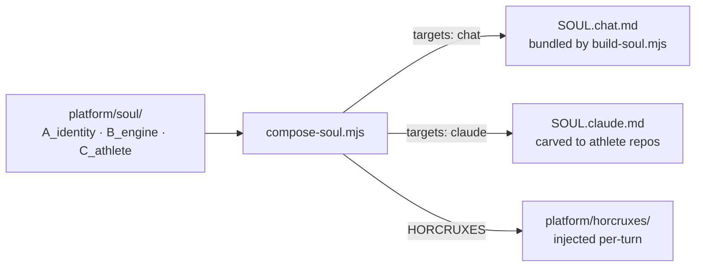

# SOUL: one source, two builds

> Status: Current · Owner: Tech Lead · Verified: 2026-08-18 · ADR: 0022, 0025

## Context

Two runtimes read Coach's brain and they can do different things. BYO Claude Code has a shell,
git, and file reads. coach-chat (Gemini) has none of them, and its own system prompt tells the
model to ignore any instruction it can't execute. Shipping one file to both meant the app paid
for ~250 lines a turn that it was explicitly told to skip.

## How it composes

Never hand-edit a composed build or a horcrux. Edit a layer, run
`node platform/scripts/compose-soul.mjs`, commit layers and outputs together. CI checks for drift.

That includes **rebase conflicts**: a composed build that conflicts is resolved by re-running
`compose-soul.mjs` on the merged layers, never by hand-picking hunks. Hand-merged artifacts stop
matching their source layers while still looking plausible in review.

**To make a block target-specific:** add `targets: ["claude"]` to its `ASSEMBLY` step, or
`keyTargets: { <key>: ["claude"] }` for one key inside a step. Absent means every target.

**Splitting a section at a target seam is free of blank lines and numbering holes** — `joinBlocks()`
closes a seam between two list items to a single newline, and `renumberOrderedLists()` renumbers
each build's ordered lists. Both exist because PR 3 shipped without them and left the chat build
counting "1, 4, 6, 7". A model reading step 4 with no step 2 above it is being told instructions
are missing.

## The cache rule — the one that costs money if you get it wrong

`staticSystemText()` is hashed and uploaded once as Gemini's cached prefix (`soulCache.ts`); **one
entry serves every athlete.** Anything per-athlete in there forks the cache per athlete and the
discount silently disappears. Nothing fails — the bill just goes up.

So conditional blocks ride in the **dynamic** half, `buildDynamicText()`'s `extraContext` in
`ui/api/coach-chat/_lib/gemini/coachPromptText.ts`. They are not in `SOUL.chat.md` at all: they compose into
`platform/horcruxes/` (ADR 0025 — a piece of soul, severed, summoned by a backend predicate) and
`build-soul.mjs` bundles them separately. First Session is the first one, gated on
`isAthleteProfileComplete()`.

## Done when

The builds are no longer expected to `diff` clean against each other — that check retired in PR 3.
What replaced it, all in `validate-soul` or CI:

1. The "never modify templates, pipeline scripts, or workflows" guardrail is present in **both**
   builds. It has come within one line of deletion twice.
2. `parseClaudeWritableSet()` still resolves — it parses §2's *"Your files, your push"* bullet,
   which is claude-only.
3. No dangling `§n` cross-references in the shorter chat build.
4. No blank line inside an ordered list, and no numbering jump, in either build or any horcrux.
5. `staticSystemText()` is byte-identical whether or not a horcrux is injected
   (`first-session-injection.test.ts`).

## Deferred

- `validate-soul` does not scan horcruxes, so injected text gets no path or writable checking (P3).
- **`SOUL.claude.md` is a legacy target with an end date** (ADR 0022). The app becomes the only
  path in v6/v7; retiring BYOB is then one line removed from `ASSEMBLY`, not a fresh audit of 500
  lines to find what was BYOB-only. That is what the split bought.
