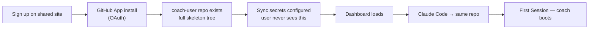
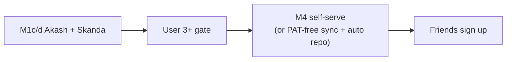

# User 3+ Onboarding Gate — Must-Do Before Friends Sign Up

> Status: **Locked requirement (2026-07-26)** · Owner: Tech Lead · Blocks: any athlete beyond Akash + Skanda · Authority: [`scaling-plan.md`](scaling-plan.md)

## Context

M1 onboarding is **operator-run** — we provision repos, copy secrets, validate migrations. That is acceptable for Akash and Skanda.

**User 3+ will not have an operator.** Friends will:

1. Hit **Sign up** on the shared website
2. Install the GitHub App on their repo
3. Connect **Claude Code** to the same repo
4. Start coaching — **no GitHub admin, no PAT, no SETUP.md archaeology**

If any of that requires manual steps we perform today (copy `PAT_TOKEN`, run `provision-user.sh`, fix failed Sync), **they are blocked — not optional polish.**

Permanent non-goals for this gate: asking friends to create fine-grained PATs, fork skeleton manually, or debug Actions secrets.

---

## Expected friend journey



**Done when:** a net-new GitHub account can complete the flow above with zero operator involvement and Sync + dashboard work on first day.

---

## What breaks today (M1 gap)

| Step | Akash / Skanda (M1) | User 3+ expectation | Gap |
|---|---|---|---|
| Repo exists | Operator / migrate | Auto on sign-up | No auto-create yet |
| `PAT_TOKEN` | Operator copies from legacy | Never mentioned | **Workflow fails without it** |
| GitHub App | Athlete installs (guided) | Sign-up flow | Built — keep |
| Sync on push | Needs `PAT_TOKEN` | Just works | Blocked |
| Dashboard Sync button | Dispatches workflow; still needs `PAT_TOKEN` inside workflow | Just works | Blocked |
| Strava | Optional; operator sets secrets | Only if Strava athlete | OK to defer per-user |
| Claude BYO | Athlete clones/connects repo | Same repo App installed on | OK once repo exists |

Root issue: **Actions cannot push `gen/` back without a write token.** Today that token is a manual repo secret (`PAT_TOKEN`). Friends will not set this up.

---

## Must-do work (ordered)

### 1. Eliminate athlete-facing PAT (minimum bar)

**Option A — quick win (recommended first):** change skeleton `sync.yml` to use `GITHUB_TOKEN` with explicit permissions instead of `secrets.PAT_TOKEN`.

```yaml
permissions:
  contents: write
  actions: write
# checkout: default token, no PAT_TOKEN secret
```

Removes the worst UX (user-created PAT). Still requires repo to exist and App to dispatch Sync.

**Option B — full M4:** GitHub App gains **Administration** + **Secrets** permissions; sign-up flow auto-creates repo from `coach-skeleton` and writes any secrets the platform holds (Strava tokens after OAuth, etc.).

### 2. Auto-provision repo on sign-up

Sign-up (`auth-install.ts` / onboarding UI) must ensure a **`coach-<user>` private repo** exists with the full skeleton tree before the athlete reaches the dashboard.

| Approach | Notes |
|---|---|
| App **Administration** permission | Create repo via API on first login |
| Or: fork `coach-skeleton` in sign-up handler | Same outcome; user never forks manually |

Tracked: [issue #32](https://github.com/sibling-shipyard/coach-phelps-hq/issues/32), [`scaling-plan.md`](scaling-plan.md) M4.

### 3. Wire sign-up → working Sync

Exit test for each new friend repo:

- [ ] `validate-data.yml` green
- [ ] Push to `user_data/activities/hist/` (or manual Sync) → workflow **success** (not missing token)
- [ ] Dashboard login → repo resolves
- [ ] Dashboard Sync button → workflow success
- [ ] `gen/aggregate.json` loads
- [ ] BYO Claude boot reads `user_data/coach/state.md`

### 4. Athlete-facing docs

`SETUP.md` in skeleton must describe **shared-site sign-up**, not manual PAT creation. PAT steps move to operator runbook only (migrate path).

---

## Milestone mapping

| Milestone | Role for user 3+ |
|---|---|
| **M1c/d** | Prove migrate path (Akash, Skanda) — operator OK |
| **M1e** | Hosted docs describe shared-site flow |
| **M4** (pulled forward) | **Hard gate before user 3+** — was "polish last"; now **must-do** |



**Do not invite friends until the gate exit test passes.**

---

## Out of scope for this gate

- Strava OAuth self-serve (iOS-only friends skip entirely)
- Plugin packs (badminton, etc.)
- coach-chat unification (P1)
- Persona rename / public launch legal

---

## Appendix

| Concern | Path |
|---|---|
| Scaling authority | [`scaling-plan.md`](scaling-plan.md) §6.1, §7 M4 |
| Operator migrate (Akash/Skanda only) | [`provision-runbook.md`](provision-runbook.md) |
| Sign-up entry | `ui/api/auth-install.ts` |
| Sync dispatch | `ui/api/trigger-sync.ts` |
| Skeleton sync workflow | `engine/.github/workflows/sync.user.yml` |
| Parking-lot context | `scaling_plan.md` |
