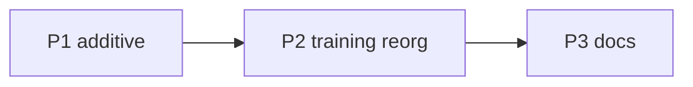

# HQ Port Plan — Adopt the Clean Structure

> Status: **P3 in review** · P1 ✅ · P2 ✅ · Owner: Tech Lead · Scope: structure only. Skeleton carve and the
> two-repo split are out of scope here — see [`scaling-plan.md`](scaling-plan.md), done after this.

## Goal

Bring the clean structure from `akash-suresh/coach-phelps` (`core/`, `plugins/`, regrouped
`training/`, kebab docs) onto `coach-phelps-hq`, without losing
hq's ahead-of-clean work.

## Guardrails

- **Do not touch hq's `ui/`, `ui/api/`, `kdb/`, `shared/`.** hq is ahead there (auth, widgets,
  server coach). Keep them.
- Work on branch `core/hq-port`. One milestone = one PR = one exit test. `validate-data` stays green throughout.

## Milestones

| # | Size | Milestone | Done when |
|---|---|---|---|
| **P1** | S | Additive port | `core/`, `plugins/` (badminton + taxonomy), `platform/tests/`, `docs/engineering/SOUL_HISTORY.md`, kebab doc renames landed. **Structure only** — no user data (empty match data, template roster/protein docs). hq builds, site deploys unchanged.
| **P2** | L, **critical** | `training/` reorg | Regroup into `coach/ledger/activities/reference`; in the **same PR** repoint every hq consumer — `ui/api/repo-file.ts`, `ui/api/coach-chat.ts`, `ui/scripts/{build-data.mjs, generate-widget-snapshots.ts, validate-current-week.mts}`, workflows, iOS read+write, Coach's hardcoded refs. Reconcile `last_week/` (hq reads it; clean dropped it) and `seasons/`. `validate-data` green, dashboard renders, coach-chat reads+writes, one real sync smoke-test passes. |
| **P3** | S | Docs + index | `docs/CURRENT.md` added; keep `AGENTS.md` / `docs/HOW_IT_WORKS.md`; reconcile root `scaling_plan.md` vs `docs/engineering/scaling-plan.md`. No broken inbound refs. |

Critical path: **P1 → P2**. P2 is the risk — same move that broke the original restructure, now
with more consumers (auth, widgets, coach-chat). Grep every consumer before merge; iOS has no
CI, so require the sync smoke-test.

## Not in scope

Carving `coach-skeleton`, the SOUL copy, and BYO-Claude/Gemini staging — all in the scaling
plan, tackled after hq is clean.
