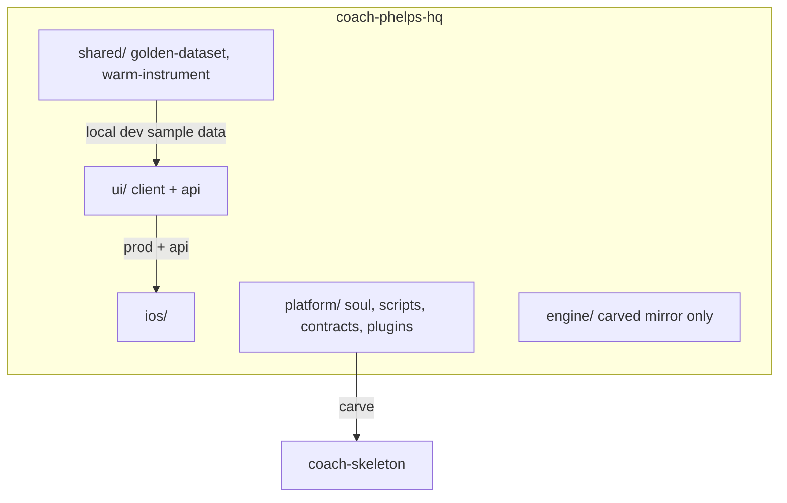
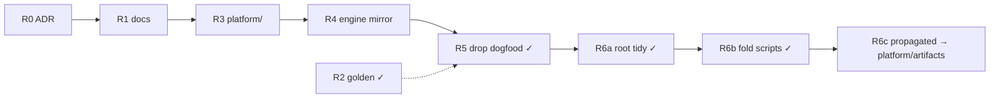

# HQ Restructure Plan

> **Active** · M1 + R5 cleared · R6a/R6b done (uncommitted) · Authority: [`scaling-plan.md`](scaling-plan.md) (two-repo topology unchanged)

## Context

HQ root holds product (`ui/`, `ios/`), platform backend (`ui/api/`), engine IP, and ops scripts — **no athlete instance band** at root. R5 removed legacy dogfood paths (`user_data/`, `gen/`, `data/`); local dev uses `shared/golden-dataset/` only ([ADR 0007](../kdb/decisions/0007-golden-dataset-for-sample-data.md)).

**Locked:** HQ holds contracts + empty stamps + sample fixtures only — never populated user data. `ui/` and `ui/api/` stay at root (Vercel). No new GitHub repos. [#86](https://github.com/sibling-shipyard/coach-phelps-hq/issues/86) v4 migration runs in parallel, not a gate.

**Non-goals:** rename `ui/` → `frontend/`, move `ui/api/` out of `ui/`, cross-user features.

## Goal — five bands at root

| Band | Holds |
|---|---|
| `shared/` | Cross-platform sample data + design tokens ([ADR 0007](../kdb/decisions/0007-golden-dataset-for-sample-data.md)) |
| `ui/` | Web app + platform backend (`ui/api/auth/`, coach-chat, repo-file) |
| `ios/` | Native app |
| `platform/` | Soul layers + operator scripts (R3 ✓); plugins, docs, skeleton-templates (R4 ✓) |
| `engine/` | Exactly what athlete repos get post-carve |

**Carve rule:** `platform/` → `propagated/` + stamps; `engine/` copies verbatim. CI fails if platform paths leak into carve output.

## Milestones

One PR each · grep every consumer · one exit test ([`hq-port-plan.md`](hq-port-plan.md) discipline).

| # | Size | Done when |
|---|---|---|
| **R0** | S | ADR records four-band layout + carve copy map | **Done** — [ADR 0011](../kdb/decisions/0011-hq-four-band-layout.md) |
| **R1** | S | Eng plans under `docs/engineering/` | **Done** |
| **R2** | M | `shared/golden-dataset/` powers local dev; `ui/client/src/data/` decoupled from HQ instance paths | **Done** |
| **R3** | M | `platform/` band — soul + operator scripts | **Done** |
| **R4** | L | HQ-only code out of `engine/`; skeleton re-carved | **Done** |
| **R5** | S | Delete root `user_data/`, `gen/`, `data/`; local dev uses golden dataset only | **Done** |
| **R6a** | S | Delete `sessions/`; move root markdown → `docs/`; `tests/` → `platform/tests/` | **Done** |
| **R6b** | S | Fold root `scripts/` → `kdb/scripts/`, `platform/plugins/badminton/` | **Done** |
| **R6c** | M | HQ-only: `propagated/` → `platform/artifacts/` (athlete carve output unchanged) | Pending |

## Risks (one-liners)

- Grep `vercel.json` + CI before any `ui/` path change.
- One milestone per PR — big-bang `git mv` broke dashboard once.
- `validate-soul` compose path moves with `platform/soul/`.

## Deferred → ADR before R0

- `propagated/SOUL.md` under `platform/artifacts/` vs carve-only output.
- Plugin pack layout (#90) vs full `platform/plugins/` carve.

## P2 follow-ups

- Server-side Coach never mounts athlete data locally (`ui/api/coach-chat.ts` is the start).
- Optional `--live` local dev against remote athlete repo.
