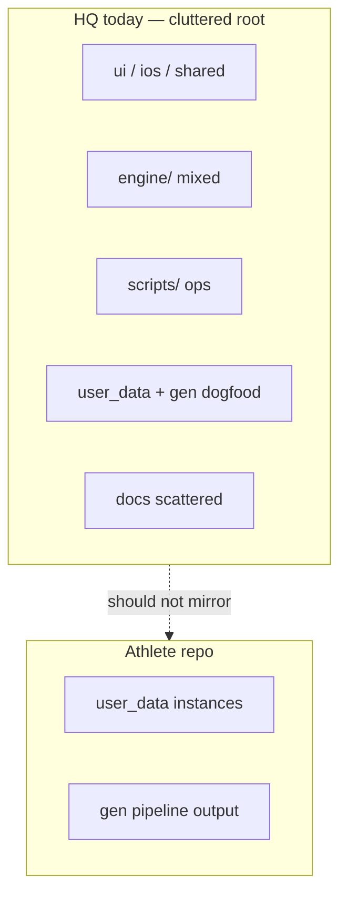
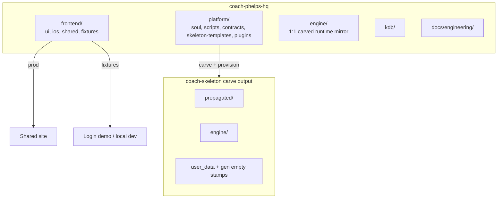
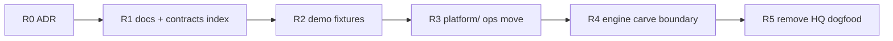

# HQ Restructure Plan — In-Repo Hygiene

> Status: **Draft / parked** · Owner: Tech Lead · Pick up after M1 gate (Skanda live, #90 plugins)
> Authority: [`scaling-plan.md`](scaling-plan.md) (two-repo topology unchanged)

## Context

`coach-phelps-hq` root mixes product surfaces, engine IP, operator tooling, dogfood athlete data, and docs. M1 carved a clean **athlete repo** shape; HQ never got the same discipline.

**Permanent non-goals:** splitting into more GitHub repos, moving athlete **instances** into HQ, cross-user features.

**Locked principle:** HQ holds **contracts + empty stamps + demo fixtures** — not populated user data. Real `user_data/` and `gen/` live only in athlete repos (`coach-akash`, `coach-skanda`, …).

---

## Current State

| Band | Today (HQ root) | Problem |
|---|---|---|
| Product | `ui/`, `ios/`, `shared/` | Fine, but not grouped |
| Brain | `engine/` mixed: carved runtime **and** HQ-only `soul/`, `plugins/` | Carve boundary unclear |
| Ops | `scripts/` (carve, provision, compose) | Athlete repos also had stray `scripts/` (fixed #91) |
| Dogfood | `user_data/`, `gen/`, `data/` | Looks like an athlete repo inside HQ |
| UI data | `ui/client/src/data/` synced from HQ dogfood | Blurs demo vs real |
| Docs | `docs/` + `engine/docs/` + `propagated/docs/` | Engineering vs coach-ref split unclear |
| Contracts | Scattered (ADRs, `engine/lib/*`, soul C layer) | No single “shape of data” home |



---

## Goal State

HQ = **frontend + platform + engine mirror + kdb + docs**. Athlete repos = **propagated + engine + user_data + gen** (from skeleton/provision only).



### Three data categories (not two)

| Category | HQ | Athlete repo |
|---|---|---|
| **Contracts** | Schema specs, validators, Soul C | Enforced on commit, not stored as separate tree |
| **Empty stamps** | Template JSON/md shells | Seeded at fork/migrate |
| **Instances** | **Never** | All populated user data + pipeline `gen/` |
| **Demo fixtures** | Fictional rich bundle for UI | **Never** |

---

## Target Layout

```
coach-phelps-hq/
├── AGENTS.md, CLAUDE.md, TODO.md          # entry — stay at root
├── frontend/
│   ├── ui/
│   ├── ios/
│   ├── shared/
│   └── fixtures/
│       └── demo-athlete/                  # schema-valid fake aggregate + widget_snapshots
├── platform/
│   ├── soul/                              # A/B/C layers (HQ IP)
│   ├── scripts/                           # compose-soul, carve-skeleton, provision-user
│   ├── contracts/                         # challenge_v2, current_week, aggregate shapes
│   ├── skeleton-templates/                # empty stamps carve copies into skeleton
│   └── plugins/                           # badminton, viz — until provision packs (#90)
├── engine/                                # exactly what athlete engine/ contains post-carve
│   ├── scripts/, lib/, strava/, core/, claude/
├── docs/
│   └── engineering/                       # m1-plan, scaling, runbooks (this doc)
└── kdb/
```

**Carve rule:** copy `engine/` → athlete `engine/`; compose `propagated/` from platform; stamp init from `platform/skeleton-templates/`. CI can fail if `platform/` paths leak into carve output.

**Demo fixtures:** `frontend/fixtures/demo-athlete/` — passes same validators as real data; powers Login hero, optional `/demo`, and default `npm run dev`. Not synced from Strava or athlete repos.

| Mode | Data source |
|---|---|
| Local dev (default) | `fixtures/demo-athlete/` |
| Local dev `--live` (optional) | Remote athlete repo via GitHub App |
| Production signed-in | User's `gen/aggregate.json` via `/api/repo-file` |

Existing pieces to reuse: `Login.tsx` (pre-auth fixtures), `/gallery` + `galleryFixtures.ts` (widget QA — keep separate from product demo narrative).

---

## Assumptions & Locked Decisions

**Locked**

- Two-repo topology unchanged (HQ + per-user skeleton forks) — [`scaling-plan.md`](scaling-plan.md).
- Athlete `engine/` path convention unchanged (`engine/scripts/…`, not root `scripts/`).
- Demo data is explicitly fictional and contract-valid — never athlete PII.

**Deferred (decide in ADR before M0)**

- Lowercase `frontend/` vs keep `ui/` at root with index README (Vercel root dir).
- Whether `propagated/SOUL.md` lives under `platform/artifacts/` or is carve-only generated output.
- Plugin pack layout (#90) vs full `platform/plugins/` carve.

---

## Milestones

One PR each, grep every consumer, one exit test — same discipline as [`hq-port-plan.md`](hq-port-plan.md).



| # | Size | Milestone | Done when |
|---|---|---|---|
| **R0** | S | ADR + carve manifest | [`kdb/decisions/`](../kdb/decisions/) records layout; carve script documents copy map |
| **R1** | S | Docs consolidation | `docs/engineering/` holds eng plans; coach-ref authoring rules documented (platform vs propagated) |
| **R2** | M | Demo fixture pack | `fixtures/demo-athlete/` validates; Login + local dev use fixtures; decouple `ui/client/src/data/` from HQ `user_data/` |
| **R3** | M | `platform/` band | `compose-soul`, `carve-skeleton`, `provision-user` under `platform/scripts/`; soul layers under `platform/soul/` |
| **R4** | L | `engine/` = carved mirror | HQ-only code moved out of `engine/`; carve copies `engine/` tree verbatim; skeleton re-carved |
| **R5** | S | Remove HQ dogfood | Delete root `user_data/`, `gen/`, `data/`; optional `--live` dev path to `coach-akash` documented |

**Gate:** start R0 after M1 complete (Skanda #87, #90 plugins, #86 v4 if still scheduled).

---

## Risks & Open Questions

- **Vercel / Xcode paths** — moving `ui/` or `ios/` breaks deploy configs; grep CI and `vercel.json` first.
- **P2 déjà vu** — big-bang `git mv` without consumer updates broke dashboard once; strict one-milestone-per-PR.
- **validate-soul CI** — compose output path may move with platform/.
- **iOS `GitHubAPIClient` paths** — athlete repo paths only; HQ reorg should not touch iOS read paths unless dogfood strategy changes.

---

## Long-Term Vision (rough / not committed)

- Server-side Coach (Gemini/Claude) reads user repos via API — HQ never mounts athlete data locally.
- Skeleton thins toward data-only as engine goes server-side (M2/M3 scaling plan).
- Sign-up “Try dashboard” uses same fixture pack as marketing demo — one curated fictional athlete.

---

## Appendix

| Concern | Path today | Target |
|---|---|---|
| Carve operator tool | `scripts/carve-skeleton.mjs` | `platform/scripts/carve-skeleton.mjs` |
| Compose SOUL | `engine/scripts/compose-soul.mjs` | `platform/scripts/compose-soul.mjs` |
| Provision | `scripts/provision-user.sh` | `platform/scripts/provision-user.sh` |
| Athlete runtime | `engine/scripts/`, `lib/`, `strava/` | unchanged path in athlete repos |
| Login demo data | `ui/client/src/data/*.json` | `frontend/fixtures/demo-athlete/` |
| Widget QA | `ui/…/galleryFixtures.ts`, `/gallery` | stays in frontend |
| Scaling authority | [`scaling-plan.md`](scaling-plan.md) | unchanged |
| M1 status | [`m1-plan.md`](m1-plan.md) | finish before R0 |
