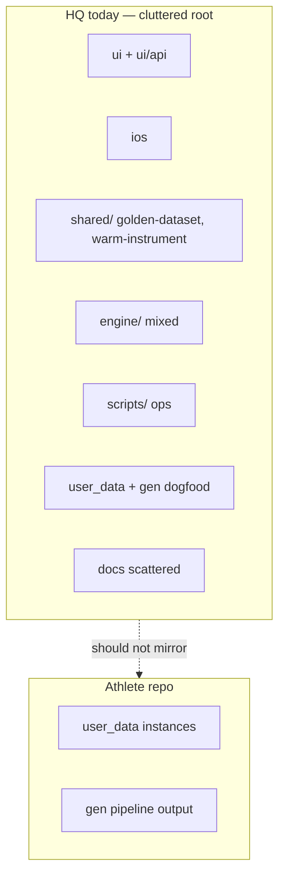
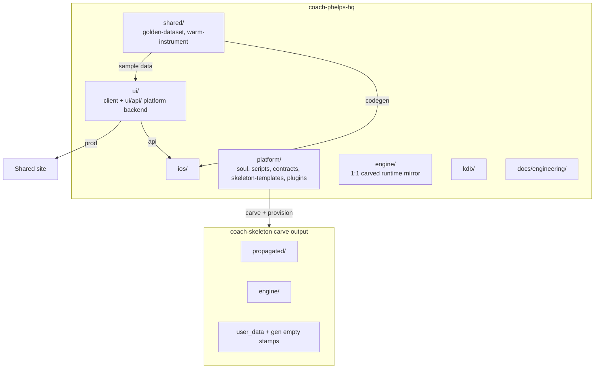
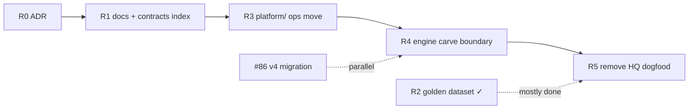

# HQ Restructure Plan — In-Repo Hygiene

> Status: **Draft / active** · Owner: Tech Lead · M1 gate cleared (Jul 2026)
> Authority: [`scaling-plan.md`](scaling-plan.md) (two-repo topology unchanged)

## Context

`coach-phelps-hq` root mixes product surfaces, platform backend, engine IP, operator tooling, dogfood athlete data, and docs. M1 carved a clean **athlete repo** shape; HQ never got the same discipline.

Since the Jul 27 draft: Skanda provision shipped, user 3+ signup auto-clones skeleton, [`ADR 0007`](../kdb/decisions/0007-golden-dataset-for-sample-data.md) landed `shared/golden-dataset/`, unified GitHub auth lives in `ui/api/auth/`, Gemini coach-chat in `ui/api/coach-chat.ts`, and `shared/warm-instrument/` holds cross-platform design tokens. **R2 is mostly done** — remaining work is removing HQ dogfood dependency for local dev.

**Permanent non-goals:** splitting into more GitHub repos, moving athlete **instances** into HQ, cross-user features, renaming `ui/` to `frontend/` (Vercel root dir), moving `ui/api/` out of `ui/` (Vercel serverless constraint).

**Locked principle:** HQ holds **contracts + empty stamps + sample fixtures** — not populated user data. Real `user_data/` and `gen/` live only in athlete repos (`coach-akash`, `coach-skanda`, …).

**Parallel, not blocking:** [#86](https://github.com/sibling-shipyard/coach-phelps-hq/issues/86) v4 migration can run alongside restructure milestones — it is not a gate.

---

## Current State

| Band | Today (HQ root) | Problem |
|---|---|---|
| Product | `ui/`, `ios/`, `shared/` | Grouped by surface, but `ui/api/` role undocumented |
| Platform backend | `ui/api/` (auth, coach-chat, repo-file, widget-snapshots) | Serves web **and** iOS; must stay under `ui/` for Vercel |
| Sample data | `shared/golden-dataset/` (ADR 0007) | Shipped; `ui/client/src/data/` still synced from HQ dogfood |
| Brain | `engine/` mixed: carved runtime **and** HQ-only `soul/`, `plugins/` | Carve boundary unclear |
| Ops | `scripts/` (carve, provision, compose) | Athlete repos also had stray `scripts/` (fixed #91) |
| Dogfood | `user_data/`, `gen/`, `data/` | Looks like an athlete repo inside HQ |
| Docs | `docs/` + `engine/docs/` + `propagated/docs/` | Engineering vs coach-ref split unclear |
| Contracts | Scattered (ADRs, `engine/lib/*`, soul C layer) | No single “shape of data” home |



---

## Goal State

HQ = **shared + ui + ios + platform + engine mirror + kdb + docs**. Athlete repos = **propagated + engine + user_data + gen** (from skeleton/provision only).



### Four bands (+ shared at root)

| Band | Contents | Notes |
|---|---|---|
| **`shared/`** | `golden-dataset/`, `warm-instrument/` | Cross-platform contracts + sample data; stays at root |
| **`ui/`** | `client/` + `api/` | Web app **and** platform backend (auth, coach-chat, repo-file) — Vercel deploy root |
| **`ios/`** | Coach HQ app | Consumes `ui/api/` + `shared/`; syncs golden dataset via `ios/scripts/sync-golden-dataset.mjs` |
| **`platform/`** | soul, carve/provision scripts, contracts, plugins | HQ IP only — carved into skeleton, never in athlete runtime |
| **`engine/`** | scripts, lib, strava, core, claude | Exactly what athlete `engine/` contains post-carve |

### Data categories

| Category | HQ | Athlete repo |
|---|---|---|
| **Contracts** | Schema specs, validators, Soul C | Enforced on commit, not stored as separate tree |
| **Empty stamps** | Template JSON/md shells | Seeded at fork/migrate |
| **Instances** | **Never** | All populated user data + pipeline `gen/` |
| **Sample fixtures** | `shared/golden-dataset/` (fictional, schema-valid) | **Never** |

---

## Target Layout

```
coach-phelps-hq/
├── AGENTS.md, CLAUDE.md, TODO.md          # entry — stay at root
├── shared/
│   ├── golden-dataset/                    # ADR 0007 — static + generated sample data
│   └── warm-instrument/                   # cross-platform design tokens
├── ui/                                    # Vercel root — do NOT rename
│   ├── client/
│   └── api/                               # platform backend: auth, coach-chat, repo-file, …
├── ios/
├── platform/
│   ├── soul/                              # A/B/C layers (HQ IP)
│   ├── scripts/                           # compose-soul, carve-skeleton, provision-user
│   ├── contracts/                         # challenge_v2, current_week, aggregate shapes
│   ├── skeleton-templates/                # empty stamps carve copies into skeleton
│   └── plugins/                           # badminton, viz — until provision packs (#90)
├── engine/                                # exactly what athlete engine/ contains post-carve
│   ├── scripts/, lib/, strava/, core/, claude/
├── docs/
│   └── engineering/                       # m1-plan, scaling, runbooks (this doc)
└── kdb/
```

**Carve rule:** copy `engine/` → athlete `engine/`; compose `propagated/` from platform; stamp init from `platform/skeleton-templates/`. CI can fail if `platform/` paths leak into carve output.

**Platform backend (`ui/api/`):** Vercel serverless endpoints shared by web and iOS — auth ([`ADR 0009`](../kdb/decisions/0009-refresh-token-sliding-session.md)), `repo-file`, `widget-snapshots`, `coach-chat` (Gemini), `trigger-sync`. Stays inside `ui/` because Vercel binds serverless functions to the deploy root.

**Sample data:** `shared/golden-dataset/` — passes same validators as real data; powers `/welcome`, `/gallery`, local dev via `useRepoData.ts`, and iOS SwiftUI previews. Not synced from Strava or athlete repos.

| Mode | Data source |
|---|---|
| Local dev (default) | `shared/golden-dataset/repo-data/` (generated on `npm run dev`) |
| Local dev `--live` (optional) | Remote athlete repo via GitHub App |
| Production signed-in | User's repo via `/api/repo-file` and related `ui/api/` endpoints |

Existing pieces: `Login.tsx` (pre-auth), `/gallery` + `galleryFixtures.ts` (widget QA — separate from product demo narrative), `ui/client/src/lib/goldenDataset.ts` (static layer consumer).

---

## Assumptions & Locked Decisions

**Locked**

- Two-repo topology unchanged (HQ + per-user skeleton forks) — [`scaling-plan.md`](scaling-plan.md).
- **Four-band model** — `shared/`, `ui/`, `ios/`, `platform/`, `engine/` at root; no `frontend/` rename.
- **`ui/api/` stays in `ui/`** — platform backend surface for web + iOS; Vercel serverless constraint.
- **`shared/golden-dataset/`** at root — not `frontend/fixtures/demo-athlete/` ([`ADR 0007`](../kdb/decisions/0007-golden-dataset-for-sample-data.md)).
- Athlete `engine/` path convention unchanged (`engine/scripts/…`, not root `scripts/`).
- Sample data is explicitly fictional and contract-valid — never athlete PII.
- M1 gate cleared — Skanda provision done, user 3+ signup auto-clones skeleton.

**Deferred (decide in ADR before R0)**

- Whether `propagated/SOUL.md` lives under `platform/artifacts/` or is carve-only generated output.
- Plugin pack layout (#90) vs full `platform/plugins/` carve.

---

## Milestones

One PR each, grep every consumer, one exit test — same discipline as [`hq-port-plan.md`](hq-port-plan.md).



| # | Size | Milestone | Status | Done when |
|---|---|---|---|---|
| **R0** | S | ADR + carve manifest | Pending | [`kdb/decisions/`](../kdb/decisions/) records four-band layout; carve script documents copy map |
| **R1** | S | Docs consolidation | Pending | `docs/engineering/` holds eng plans; coach-ref authoring rules documented (platform vs propagated) |
| **R2** | M | Golden dataset for local dev | **Mostly done** | ADR 0007 shipped; `shared/golden-dataset/` validates; Login + `/welcome` + dev use it; iOS codegen via `sync-golden-dataset.mjs`. **Remaining:** fully decouple `ui/client/src/data/` from HQ `user_data/` (folds into R5) |
| **R3** | M | `platform/` band | Pending | `compose-soul`, `carve-skeleton`, `provision-user` under `platform/scripts/`; soul layers under `platform/soul/` |
| **R4** | L | `engine/` = carved mirror | Pending | HQ-only code moved out of `engine/`; carve copies `engine/` tree verbatim; skeleton re-carved |
| **R5** | S | Remove HQ dogfood | Pending | Delete root `user_data/`, `gen/`, `data/`; optional `--live` dev path to `coach-akash` documented |

**Gate:** M1 complete — **cleared**. Start R0 now. #86 v4 migration runs in parallel, not as a prerequisite.

---

## Risks & Open Questions

- **Vercel deploy root** — `ui/` must stay at root; `ui/api/` must stay inside `ui/`. Grep `vercel.json` and CI before any path move.
- **P2 déjà vu** — big-bang `git mv` without consumer updates broke dashboard once; strict one-milestone-per-PR.
- **validate-soul CI** — compose output path may move with `platform/soul/`.
- **iOS API coupling** — iOS reads athlete repo paths via `ui/api/`; HQ reorg must not break shared auth ([`engine/docs/github-auth.md`](../engine/docs/github-auth.md)) or widget-snapshot endpoints.
- **Golden dataset drift** — static layer (`widget_snapshots.json`) must stay manually synced to iOS until codegen is fully automated in CI.

---

## Long-Term Vision (rough / not committed)

- Server-side Coach (Gemini/Claude) reads user repos via API — HQ never mounts athlete data locally (`ui/api/coach-chat.ts` is the start).
- Skeleton thins toward data-only as engine goes server-side (M2/M3 scaling plan).
- Sign-up “Try dashboard” uses same golden dataset as marketing demo — one curated fictional athlete (partially shipped via `/welcome`).

---

## Appendix

| Concern | Path today | Target |
|---|---|---|
| Carve operator tool | `scripts/carve-skeleton.mjs` | `platform/scripts/carve-skeleton.mjs` |
| Compose SOUL | `engine/scripts/compose-soul.mjs` | `platform/scripts/compose-soul.mjs` |
| Provision | `scripts/provision-user.sh` | `platform/scripts/provision-user.sh` |
| Athlete runtime | `engine/scripts/`, `lib/`, `strava/` | unchanged path in athlete repos |
| Sample data (static) | `shared/golden-dataset/widget_snapshots.json`, `current_week.json` | stays at `shared/golden-dataset/` |
| Sample data (generated) | `shared/golden-dataset/repo-data/*.json` | stays; gitignored, regen on dev/build |
| iOS golden sync | `ios/scripts/sync-golden-dataset.mjs` | stays; may move to CI-only later |
| Design tokens | `shared/warm-instrument/tokens.json` | stays at `shared/warm-instrument/` |
| Platform backend | `ui/api/auth/`, `ui/api/coach-chat.ts`, `ui/api/repo-file.ts`, `ui/api/widget-snapshots.ts` | stays inside `ui/api/` |
| Auth docs | [`engine/docs/github-auth.md`](../engine/docs/github-auth.md) | update paths when platform/ moves |
| Widget QA | `ui/…/galleryFixtures.ts`, `/gallery` | stays in `ui/client/` |
| Scaling authority | [`scaling-plan.md`](scaling-plan.md) | unchanged |
| M1 status | [`m1-plan.md`](m1-plan.md) | **cleared** |
| Golden dataset ADR | [`kdb/decisions/0007-golden-dataset-for-sample-data.md`](../kdb/decisions/0007-golden-dataset-for-sample-data.md) | accepted |
| Session ADR | [`kdb/decisions/0009-refresh-token-sliding-session.md`](../kdb/decisions/0009-refresh-token-sliding-session.md) | accepted |
