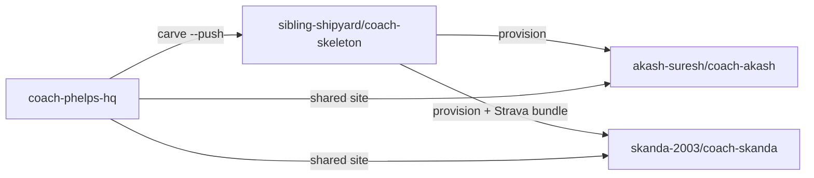
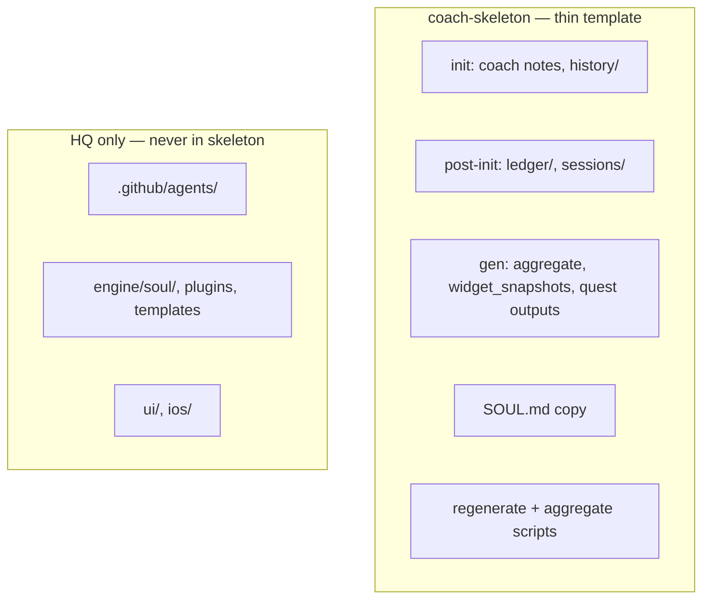
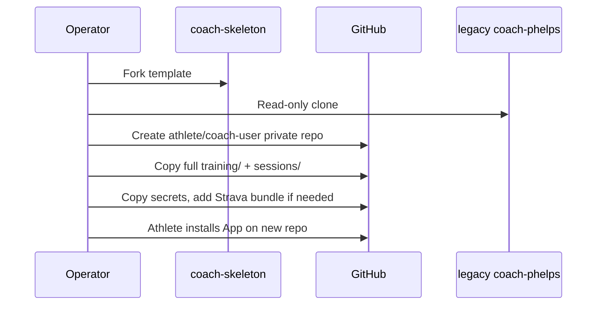
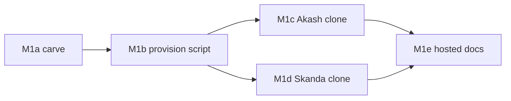

# M1 Plan — Skeleton Carve + Operator Onboarding

> Status: **M1a in PR [#83](https://github.com/sibling-shipyard/coach-phelps-hq/pull/83)** · Skeleton pushed: [coach-skeleton](https://github.com/sibling-shipyard/coach-skeleton) · Owner: Tech Lead · Authority: [`scaling-plan.md`](scaling-plan.md) §7 M1

## Context

Multi-tenant scaling needs a **thin fork template** (`coach-skeleton`) and **operator provisioning** so athletes get private repos the shared HQ site reads. M0/S0–S3 (layered soul) is done on HQ.

**Permanent non-goals for M1:** agents in skeleton, full engine copy, self-serve onboarding (M4), archiving legacy repos, coach-chat engine unification (M2).

**IP principle:** skeleton = **data lifecycle bands + SOUL copy + minimal gen scripts**. Brain stays in HQ `engine/`.

---

## Current State

| Item | State |
|---|---|
| HQ `engine/` | Scripts, soul layers, strava, plugins, templates — see [`engine/README.md`](../engine/README.md) |
| `.github/agents/` | HQ-only (not carved) |
| `scripts/carve-skeleton.mjs` | Thin carve on branch #83 |
| `sibling-shipyard/coach-skeleton` | Refreshed from #83 branch (24 files) |
| `provision-user.sh` | Not built (M1b) |
| User clones | Not provisioned (M1c/M1d) |

---

## Goal State

Two production clones onboarded: **`akash-suresh/coach-akash`** (iOS) and **`skanda-2003/coach-skanda`** (Strava). Legacy personal repos kept as backup.

---

## Assumptions & Locked Decisions

**Locked (2026-07-26):**

| Topic | Decision |
|---|---|
| Skeleton org | `sibling-shipyard/coach-skeleton` only |
| User repos | **Private on athlete account** — `akash-suresh/coach-akash`, `skanda-2003/coach-skanda` |
| Migration | **Full** Layer C + history from legacy repos |
| SOUL in skeleton | **Composed copy only** — no `soul/` layers, no compose script |
| Athlete data | **Not in SOUL** — profile in `training/coach/state.md`, archive in `coach_notes.md` |
| Agents | **HQ only** |
| Strava IP | **Provision-time bundle** — not in base skeleton |
| Sync mode | No `SYNC_SOURCE` flag — Strava runs when `STRAVA_*` secrets exist |
| coach-chat | **P1** if broken post-migration — not M1 gate |
| Legacy repos | Kept as backup — not archived in M1 |

**Deferred:**

- Skeleton directory restructure (Sky reviewing layout vs diagram)
- Widget snapshot regen in user repos
- In-repo `templates/` (iOS bundles templates in HQ app today)

---

## High-Level Design

### Three-repo topology

| Repo | Role |
|---|---|
| `coach-phelps-hq` | UI, iOS, `engine/`, agents, KDB, carve tooling |
| `coach-skeleton` | Thin template in org |
| `coach-<user>` | Athlete data + SOUL copy + minimal scripts (+ Strava bundle if provisioned) |

### Data lifecycle bands (skeleton)

| Band | Paths | Lifecycle |
|---|---|---|
| **init** | `training/coach/*`, `training/activities/history/` | Seeded at fork / migration |
| **post-init** | `training/ledger/*`, `sessions/*.json` | Precious — grows in use |
| **gen** | `data/aggregate.json`, `training/activities/quest_*`, `training/widget_snapshots.json`, `training/sync_status.json` | Pipeline output — rebuildable |

**`sessions/`** — coach-adjusted workout JSON for a specific day (`YYYY-MM-DD_<workout_id>.json`). Timer + dashboard read this instead of base template when present. Not activity history (that's `history/`).

### Athlete memory (not in SOUL)

| File | Role | Boot? |
|---|---|---|
| `training/coach/state.md` | Profile, injuries, recent 3 sessions, sleep table | **Yes** |
| `training/coach/coach_notes.md` | Long-form scratchpad | On-demand only |
| `training/ledger/challenge_v2.json` | Quests, seasons | Via quest_log |
| `training/ledger/current_week.json` | Active week plan | When live |

### Ingestion

| Athlete | Ingestion | Who writes `history/` |
|---|---|---|
| Akash | iOS HealthKit | `ios/` app commits `hk_*.json` |
| Skanda | Strava Premium | `strava/fetch_strava.py` in CI when secrets set |

Post-ingestion: `regenerate_derived.py` → `build-aggregate.mjs` → dashboard reads `data/aggregate.json`.

---

## Low-Level Design

### Base skeleton carve (24 files)

Source: [`scripts/carve-skeleton.mjs`](../scripts/carve-skeleton.mjs)

| Category | Contents |
|---|---|
| SOUL | `SOUL.md` (composed at carve from HQ `engine/soul/`) |
| Boot | Minimal `CLAUDE.md` — Coach only, no multi-agent |
| Scripts | `regenerate_derived.py`, `build-aggregate.mjs`, `generate_quest_log.py`, `generate_quest_history.py`, `lib/` |
| Workflows | `sync.yml`, `validate-data.yml`, `apply-coach-patch.yml` |
| Data templates | init/post-init/gen placeholders under `training/`, `sessions/.gitkeep` |

**Not carved:** agents, `soul/`, `strava/`, `core/`, templates, plugins, skills, docs, `run_sync_pipeline.py`

Refresh: `node scripts/carve-skeleton.mjs --push`

### Strava provision bundle (Skanda only)

Added by `provision-user.sh` (M1b), not base skeleton:

- `strava/`, `core/`, `scripts/run_sync_pipeline.py`, `.env.example`
- Copy `STRAVA_*` + `PAT_TOKEN` secrets from legacy repo
- `sync.yml` auto-uses full pipeline when secrets + `run_sync_pipeline.py` present

### Provision flow (M1b)

| Athlete | Legacy source | New repo | Extra |
|---|---|---|---|
| Akash | `akash-suresh/coach-phelps` | `akash-suresh/coach-akash` | iOS path only |
| Skanda | `skanda-2003/coach-phelps` | `skanda-2003/coach-skanda` | Strava bundle + secrets |

---

## Milestones

| # | Size | Milestone | Done when |
|---|---|---|---|
| **M1a** | L | Thin skeleton + HQ `engine/` boundary | PR #83 merged, skeleton pushed, CI green on template |
| **M1b** | M | `provision-user.sh` + runbook | Dry-run correct for both athletes, test fork works |
| **M1c** | M | Akash clone | `akash-suresh/coach-akash` passes validation checklist §7 |
| **M1d** | M | Skanda clone | `skanda-2003/coach-skanda` passes validation checklist §7 |
| **M1e** | S | Hosted docs | README/SETUP describe shared site flow |

### Validation checklist (M1c / M1d)

**Gate:** CI + dashboard + sync + BYO boot. coach-chat optional (P1).

- [ ] `validate-data.yml` green
- [ ] Log in on shared site → repo resolves to new clone
- [ ] Dashboard loads (`data/aggregate.json`)
- [ ] BYO Claude boot uses migrated `state.md`
- [ ] Sync: Strava button (Skanda) or iOS push / dispatch (Akash) regenerates aggregate

---

## Risks & Open Questions

- **Skeleton structure pass** — Sky may reorganize dirs to match diagram labels (in progress)
- **SOUL copy = main IP exposure** until M2/M3 server-side engine
- **No in-repo templates** — confirm iOS/timer path for migrated athletes
- **Large history migration** — first push may be slow

---

## Appendix

| Concern | Path |
|---|---|
| Carve script | `scripts/carve-skeleton.mjs` |
| Engine boundary | `engine/README.md` |
| Operator notes | `scripts/README.md` |
| Soul data locations | `engine/soul/C_athlete.md`, `engine/soul/B_engine.md` |
| Scaling authority | `docs/scaling-plan.md` |
| Live skeleton | https://github.com/sibling-shipyard/coach-skeleton |
| HQ PR | https://github.com/sibling-shipyard/coach-phelps-hq/pull/83 |
