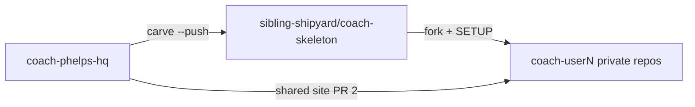
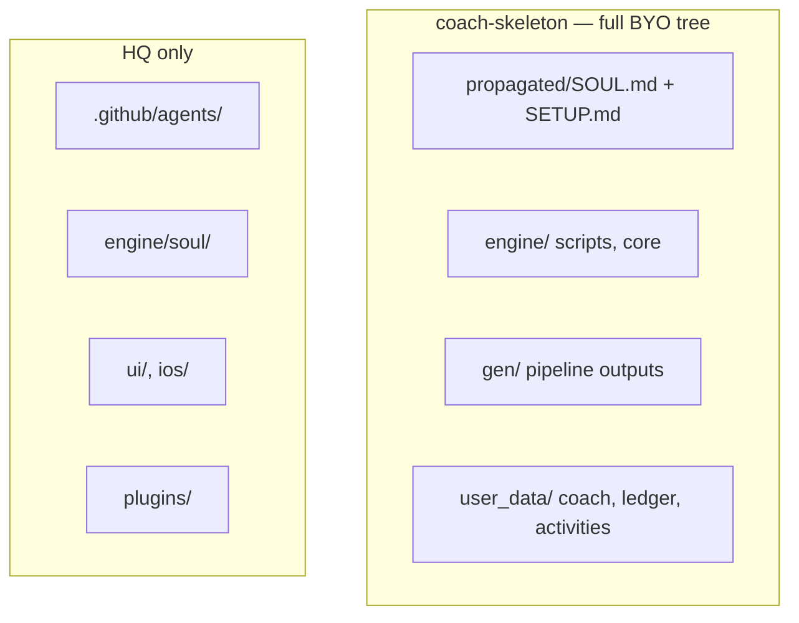
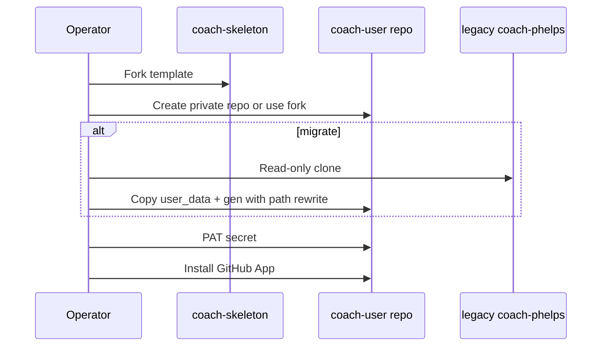
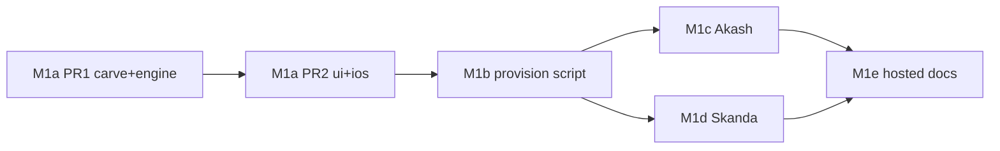

# M1 Plan — Skeleton Carve + Operator Onboarding

> Status: **M1a structure locked** · Layout: [`skeleton-layout.md`](skeleton-layout.md) · Owner: Tech Lead · Authority: [`scaling-plan.md`](scaling-plan.md) §7 M1
>
> **Superseded in part:** Strava ingestion (referenced throughout as "Option A") was removed
> entirely — see [ADR 0010](../kdb/decisions/0010-remove-strava-relocate-activity-tools.md).
> iOS/HealthKit is the only ingestion path now. The specific athlete/secrets rows below are a
> historical record of the M1c/d migration and are left as-is.

## Context

Multi-tenant scaling needs a **full BYO fork template** (`coach-skeleton`) so athletes clone once, follow `SETUP.md`, and start coaching in Claude Code. M0/S0–S3 (layered soul) is done on HQ.

First ~10 users = BYO Claude. The org template ships everything needed to start a fitness journey — coach sessions fill `user_data/`, not repo structure.

**Permanent non-goals for M1:** agents in skeleton, `engine/soul/` layers in skeleton, self-serve onboarding (deferred to **M4 — hard gate before user 3+**, see [`user-3-onboarding-gate.md`](user-3-onboarding-gate.md)), archiving legacy repos, coach-chat engine unification (M2), plugins in base carve.

**IP principle:** HQ owns soul **source** + agents + UI/iOS. Skeleton carries **composed SOUL copy** + carved **engine runtime** + athlete data bands. True IP wall moves to M2/M3 server-side engine.

---

## Current State

| Item | State |
|---|---|
| HQ `engine/` | Scripts, soul layers, core, plugins, templates — see [`engine/README.md`](../engine/README.md) |
| `.github/agents/` | HQ-only (not carved) |
| `scripts/carve-skeleton.mjs` | Full BYO tree — merged #83 |
| `sibling-shipyard/coach-skeleton` | **Fresh** — 50 files carved from `main` @ `2eac3d5` |
| `provision-user.sh` | **M1b in progress** — see [`provision-runbook.md`](provision-runbook.md) |
| User clones | Not provisioned (M1c/M1d) |

---

## Goal State

Two production clones onboarded: **`akash-suresh/coach-akash`** (iOS) and **`skanda-2003/coach-skanda`** (Strava). Legacy personal repos kept as backup. Greenfield athletes fork the same tree.

---

## Assumptions & Locked Decisions

**Locked (2026-07-26, updated structure pass):**

| Topic | Decision |
|---|---|
| Skeleton org | `sibling-shipyard/coach-skeleton` only |
| Tree shape | **Full BYO layout** — see [`skeleton-layout.md`](skeleton-layout.md) |
| BYO model | Clone full repo → `SETUP.md` → coach; no partial clone |
| User repos | **Private on athlete account** |
| Migration | **Full** Layer C + `hist/` + sessions from legacy repos (path rewrite) |
| SOUL in skeleton | **Composed copy in `propagated/`** — SOUL.md + reference docs; no `engine/soul/` layers, no compose script |
| Athlete profile | `user_data/coach/state.md` (boot); `coach_notes.md` archive only |
| Sample templates | **`foundation.json` + `strength_a.json`** in carve |
| Ingestion | iOS/HealthKit only — Strava removed (ADR 0010) |
| Sync mode | No `SYNC_SOURCE` flag |
| Agents | **HQ only** |
| Plugins | **Deferred** — add-on later, not base carve |
| coach-chat | **P1** if broken post-migration — not M1 gate |
| Legacy repos | Kept as backup — not archived in M1 |
| Delivery | **Two PRs:** PR 1 = carve + engine paths; PR 2 = ui/api + iOS |

**Deferred:**

- Plugin provision packs (badminton, visualization)
- Widget snapshot regen policy in user repos
- SOUL auto-propagation to forks

---

## High-Level Design

### Three-repo topology

| Repo | Role |
|---|---|
| `coach-phelps-hq` | UI, iOS, soul source, agents, KDB, carve tooling |
| `coach-skeleton` | Org template — **identical tree** every athlete forks |
| `coach-<user>` | Private athlete repo — same layout, personalized `user_data/` |

### Data lifecycle bands

| Band | Paths | Lifecycle |
|---|---|---|
| **init** | `user_data/coach/*`, `user_data/activities/hist/` | Seeded at fork / migration |
| **post-init** | `user_data/ledger/*`, `user_data/.../sessions/` | Precious |
| **gen** | `gen/*` | Rebuildable |
| **engine** | `engine/*` | Carved runtime — coach must not edit |

**Sessions** — `user_data/activities/workout_plans/sessions/YYYY-MM-DD_<id>.json`. Coach-adjusted workout for a day. Not activity history (`hist/`).

### Athlete memory (not in SOUL)

| File | Role | Boot? |
|---|---|---|
| `user_data/coach/state.md` | Profile, injuries, recent 3 sessions | **Yes** |
| `user_data/coach/coach_notes.md` | Long-form scratchpad | On-demand |
| `user_data/ledger/challenge_v2.json` | Quests — **repo marker** | Via quest_log |
| `user_data/ledger/current_week.json` | Active week plan | When live |

### Ingestion

| Athlete | Ingestion | Who writes `hist/` |
|---|---|---|
| Akash | iOS HealthKit | iOS app commits `hk_*.json` |
| Skanda | Strava Premium | `engine/strava/` pipeline when secrets set |

Post-ingestion: `engine/scripts/regenerate_derived.py` → `build-aggregate.mjs` → dashboard reads `gen/aggregate.json`.

---

## Low-Level Design

### Skeleton carve (PR 1)

Source: [`scripts/carve-skeleton.mjs`](../scripts/carve-skeleton.mjs) · Layout: [`skeleton-layout.md`](skeleton-layout.md)

| Category | Contents |
|---|---|
| Boot | `propagated/SOUL.md`, `propagated/docs/`, `CLAUDE.md`, `SETUP.md`, `README.md` |
| Engine | `engine/scripts/`, `lib/`, `core/` |
| Workflows | `sync.yml`, `validate-data.yml`, `apply-coach-patch.yml` |
| Gen | Placeholders under `gen/` |
| User data | Seeds under `user_data/` + 2 sample templates |
| Pin | `.coach-engine-version` |

**Not carved:** agents, `engine/soul/`, compose script, plugins, UI, iOS.

Refresh: `node scripts/carve-skeleton.mjs --push`

### Consumer updates (PR 2)

| Consumer | Key path changes |
|---|---|
| `ui/api/repo-file.ts` | `gen/aggregate.json` |
| `ui/api/list-my-repos.ts` | `user_data/ledger/challenge_v2.json` |
| `ui/api/coach-chat.ts` | `user_data/coach/*`, sessions path |
| iOS | `hist/`, `gen/widget_snapshots.json`, sessions path |

Full map: [`skeleton-layout.md`](skeleton-layout.md) § Path migration.

### Provision flow (M1b — after PR 1 + PR 2)

| Mode | When | Extra |
|---|---|---|
| `--greenfield` | New athlete | Skeleton as-is |
| `--migrate` | Akash, Skanda | Legacy data + path rewrite |

---

## Milestones

| # | Size | Milestone | Done when |
|---|---|---|---|
| **M1a PR1** | L | Full skeleton carve + HQ engine paths | Skeleton pushed, matches `skeleton-layout.md`, engine CI paths updated |
| **M1a PR2** | M | UI + iOS consumers | Dashboard + iOS read new paths |
| **M1b** | M | `provision-user.sh` + runbook | Dry-run correct for greenfield + both migrations |
| **M1c** | M | Akash clone | Passes validation checklist |
| **M1d** | M | Skanda clone | Passes validation checklist |
| **M1e** | S | Hosted docs | README/SETUP describe shared site flow |

### User 3+ gate (before any friend sign-up)

**Do not invite friends until [`user-3-onboarding-gate.md`](user-3-onboarding-gate.md) exit test passes.** Sign-up → repo → Sync → dashboard → Claude BYO must work with zero operator steps (no PAT, no `provision-user.sh`).

### Validation checklist (M1c / M1d)

**Gate:** CI + dashboard + sync + BYO boot. coach-chat optional (P1).

- [ ] `validate-data.yml` green
- [ ] Log in on shared site → repo resolves to new clone
- [ ] Dashboard loads (`gen/aggregate.json`)
- [ ] BYO Claude boot uses migrated `user_data/coach/state.md`
- [ ] Sync: Strava (Skanda) or iOS push (Akash) regenerates aggregate

---

## Risks & Open Questions

- **B cutover window** — dashboard/iOS broken for legacy path repos until PR 2 merges (acceptable for ~2 users)
- **SOUL copy = IP exposure** until M2/M3 server-side engine
- **Plugins** — track separately; Skanda badminton data may migrate before plugin pack exists
- **Large history migration** — first push may be slow

---

## Appendix

| Concern | Path |
|---|---|
| Canonical layout | `docs/skeleton-layout.md` |
| Carve script | `scripts/carve-skeleton.mjs` |
| Engine boundary | `engine/README.md` |
| Soul data locations | `engine/soul/C_athlete.md`, `engine/soul/B_engine.md` |
| Scaling authority | `docs/scaling-plan.md` |
| Live skeleton | https://github.com/sibling-shipyard/coach-skeleton |
