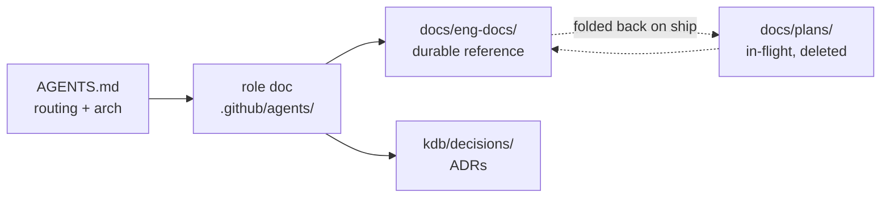

# Agent harness + docs refactor

> Status: Current · Owner: Tech Lead · Verified: 2026-08-14

## Context

Five agents share this repo across Claude Code and Cursor. Role *routing* works, but the
things agents read after routing have drifted: the session hook points at `SOUL.md` (doesn't
exist at HQ), the tracked permission allowlist is empty, `ui/api/` — 30 of the last 60 commits —
has no owner, and `docs/eng-docs/` mixes 17 live reference docs with ~20 dead plans.

`AGENTS.md` stays the source of truth. Nothing here changes it structurally; everything here
makes what it points at true again, and stops the next drift.

## Decision

Three tracks, three PRs. Track A is correctness — everything below is a verified-broken fact,
not a preference. Tracks B and C are convention, and only work if A lands first.

**Sequencing.** #289 is merged (A2 now widens what it landed). #290 (`architecture-atlas.md`
+ `.claude/skills/`) is parked by the athlete and explicitly **out of scope here** — this plan
proceeds around it, and #290 rebases onto the result. #286/#287 rewrite `ui/api/coach-chat.ts`,
which A4 reassigns ownership of but does not touch.

### Track A — harness correctness (PR 1)

| # | Change | Fixes |
|---|---|---|
| A1 | `.claude/hooks/session-start.sh` → pointer at `AGENTS.md`; drop the copied table. Fix `SOUL.md` → `platform/SOUL.md`. HQ default becomes **Tech Lead**; Coach row notes "rare at HQ — runs in athlete repos / hosted chat (ADR 0021)" | Gate points at a missing file and a retired mode |
| A2 | Widen the allowlist landed by #289 (4 entries: `npx tsc --noEmit`, `npm run test`, `git fetch *`, `git merge-base *`) to the stable read-only set from `.claude/settings.local.json` — `git log/status/diff`, `ls`, `grep`, `gh pr/issue list` | A fresh clone still re-prompts on basic reads; the real ~40-entry list is in a globally gitignored local file |
| A3 | `.gitignore`: `.claude/worktrees/` | Untracked worktree dirties every agent's `git status` |
| A4 | UI Expert scope → all of `ui/` incl. `api/`. Reconcile `tech-lead.md:23` (`ui/client/src/` only) with `ui-expert.md:13` (`ui/`) | `ui/api/coach-chat.ts` (1271L) has no role doc |
| A5 | `ui/package.json`: add `"precheck": "node scripts/build-data.mjs"`; add `npm run check` to `.github/workflows/ui-tests.yml`; one line in `ui-expert.md` Gotchas | `npx tsc --noEmit` → 7 errors on clean checkout, so agents stop typechecking |
| A6 | `AGENTS.md` §Monorepo rules: drop the false "sync bot pushes / direct pushes rejected" claim; keep `git pull --rebase origin main` (concurrent worktrees) | Zero bot commits in 300; rules that don't match history erode all rules |
| A7 | `kdb/scripts/validate_kdb.py`: every backticked repo-relative path in `AGENTS.md` + `.github/agents/*.md` must exist | Workflow already triggers on those paths and checks nothing. Catches A1/A4-class drift forever |

### Track B — docs lifecycle (PR 2 deletes/moves, PR 3 polish)

| # | Change |
|---|---|
| B1 | `docs/plans/` = in-flight, **deleted on ship** (git history is the archive; no archive folder). 6 eng-docs plans + 3 root strays (`ASYNC-CLOSE-PLAN.md`, `FOLLOW-UP.md`, `coach-chat-closing-followup.md`) move in |
| B2 | Delete ~20 dead docs — **each one I re-verify against code before removal**, not on the triage table's word |
| B3 | One blockquote line under each keeper's H1: `> Status: Current\|Historical\|Superseded by <path> · Owner: <role> · Verified: <date>`. `Verified:` older than the code it describes = the staleness signal |
| B4 | Delete `docs/CURRENT.md` (already stale — links a file that never existed). `eng-docs/README.md` becomes the **rules** page and lists nothing. Each role doc gains a 3–5 line "Docs you own" block |
| B5 | New docs named `<chat\|ios\|soul\|data\|platform\|ops>-<topic>.md`. Rename existing files **only** where it disambiguates — not a 17-file churn |
| B6 | Backfill 3–5 learnings into `ui-expert.md` from the August coach-chat work (iOS Builder has 16; UI Expert 3, Tech Lead 2, Bob 0) |
| B8 | Untracked `docs/eng-docs/coach-chat-modularization.md` (78L, issue #288) → `docs/plans/`. It's a plan, not reference — the first test of B1 |
| B7 | Doc-upkeep rule in `AGENTS.md`: before opening a PR, update any eng-doc your change invalidates (`grep -rl <path> docs/eng-docs/`) and bump `Verified:`; if a plan shipped, fold the durable part into its eng-doc **then delete the plan** |

### Track C — cross-session learning capture (PR 3)

Rules that live in one agent's head, or in one laptop's Claude memory, are lost to the other
tool and the other machine. The repo is the only store both Claude Code and Cursor read, and
the PR is the only chokepoint both pass through.

| # | Change |
|---|---|
| C1 | **Create** `.github/PULL_REQUEST_TEMPLATE.md` — none exists today. Keep it to ~4 lines (summary / issue ref / test / learning), not a checklist wall. The learning line — "**Learning?** durable rule for your area → role doc `## Learnings` one-liner · tradeoff → ADR in `kdb/decisions/` · neither → N/A". Tech Lead checks it in review |
| C2 | `AGENTS.md` §Recording: state the store rule — repo-durable rules go in the repo (role doc or ADR). Agent-local memory (Claude `~/.claude` memory, Cursor session state) holds **nothing another machine or tool would need** — the athlete works across multiple laptops and both tools |
| C3 | Cap each role doc's `## Learnings` at ~15 lines. On overflow, promote the durable ones into the relevant eng-doc and drop the rest — a learnings list that only grows becomes the thing we deleted `docs/eng-docs/` clutter to avoid |
| C4 | Migrate the repo-durable rules currently stranded in Claude-local memory into `.github/agents/ui-expert.md` — at minimum: `npm run dev:api` caches handler modules (restart to pick up code changes), and Gemini `responseSchema` fields fill roughly in declared order so commitment fields must precede narrative fields. Delete them from local memory once landed. Folds into B6's backfill |

## Done when

1. `validate-kdb` passes with A7 active — proving no role doc cites a path that doesn't exist.
2. `npm run check` from `ui/` exits 0 on a clean clone, and fails CI when TS breaks.
3. A fresh clone runs `git log`, `ls`, `gh pr list` with no permission prompt.
4. `git status` is clean on a fresh boot.
5. `ls docs/eng-docs/` returns only `Current`/`Historical` docs; every in-flight plan is in `docs/plans/`.
6. `grep -r "SOUL.md" AGENTS.md .claude/ .github/agents/` returns only `platform/SOUL.md`.
7. `.github/PULL_REQUEST_TEMPLATE.md` carries the learning line, and the two migrated rules
   (C4) appear in `ui-expert.md` — verifiable by grep, not by recall.

## Deferred

- **P2** — Boot step 4/5 → `gh pr list` + `gh issue list` instead of `docs/eng-docs/TODO.md` (10 days stale, cites relocated scripts). Self-maintaining; TODO.md content untouched here.
- **P2** — Add `docs:`/`chore:` to the `.github/CONVENTIONS.md` prefix table; note cloud-agent `claude/*` branches are exempt.
- **P2** — Emit a `<!-- GENERATED -->` banner from `compose-soul.mjs` into `platform/SOUL.md`.
- **P3** — ADR for "plans are deleted on ship, no archive" if it survives a month.
- **P2 (last step of this effort)** — rebase PR #290 onto the finished result and reconcile it:
  `architecture-atlas.md` vs `platform-architecture.md` (ex `scaling-plan.md`, cited
  "authoritative" by four docs) — one whole-system doc, not two. The atlas is skill-generated,
  so it needs a `Verified:` line and a named regeneration owner. `.claude/skills/` needs a
  convention at the same time.
- **P3** — prettier CI gate, splitting `coach-chat.ts` (issue #288), orphaned `engine/claude/athlete/`.
- **Dropped** — "no `.claude/` skills/commands" was a P3 dismissal until PR #290 added
  `.claude/skills/codebase-atlas/`. That directory now exists and needs a convention, not a veto.
